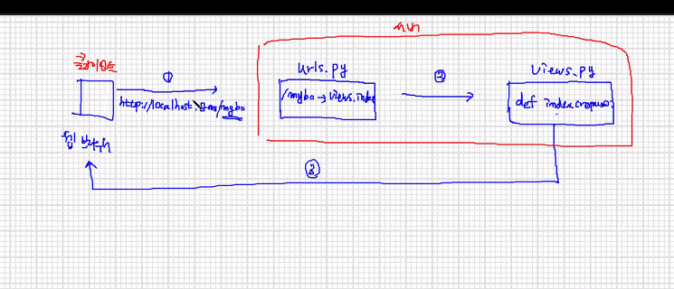

url 매핑에서 호스트, 포트 빼기

끝에 슬래쉬 빼도된다?



개략도 


```
path('mybo/', include('mybo.urls')),
```

마이보로 시작되는 페이지 요청이 있는 경우에는 모두 mybo에 있는 urls.py 파일의 매핑규칙을 참조하여 처리해라

결과적으로 mybo로 시작되는 요청은 모두 mybo/urls 파일이 담당


mybo\urls.py

```
from django.urls import path
from . import views #.은 현재 디렉토리 (mybo 폴더, 패키지)
#mybo 폴너 내에 있는 view 모듈을 가져와라

urlpatterns=[
    path('',views.index),
]
```


You have 18 unapplied migration(s). Your project may not work properly until you apply the migrations for app(s): admin, auth, contenttypes, sessions.
Run 'python manage.py migrate' to apply them.

--> 앱이 필요로 하는 테이블을 생성해줘야 한다 migrate 명령 사용!

테이블? 데이터를 저장하기 위한 데이터 집합의 모음 

데이터(학생 1명)을 저장하기 위한 데이터 집합의 모음 (테이블은 학생이 소속된 반과 같음)

데이터베이스는 테이블, ... 의 모음

데이터베이스관리시스템: 데이터베이스를 관리하는 프로그램

-sqlite3,몽고,mysql,mssql,oracle,...

`python manage.py migrate` 하고 런서버


DB 관리도구 설치(SQL)

sql 잘 몰라도 장고의 ORM으로 데이터 작업을 할 수 있다.

orm 이 우리를 대신하여 sql문 생성 -> 실행 

쿼리문의 단점 : 쿼리문의 일관성이 없음 


7.질문 답변 모델(model)

머신러닝 모델 : 빅데이터 환경에서 데이터들 사이의 규칙(패턴)을 발견하여 함수(수식)을 생성

새롭게 입력된 값에 대한 예측값이나 분류결과를 도출해내기 위한 함수

장고모델 : 데이터 관리 (저장,검색)

ex) 장고 질문/답변 모델: 질문/ 답변 데이터 관리 모델

- 질문 모델 구서 요소 : 질문의 제목, 질문 내용, 질문 작성일

모델은 클래스로 정의

models.py

```
class Question(models.Model):
```

붕어빵 기계 == Question 붕어빵 == 각각의 질문


모델간의 연결은 ForeignKey()를 사용한다.

settings.py 에 INSTALLED_APPS에 등록해놓기


장고는 모델을 이용하여 테이블 생성


* 테이블 실제 생성

`python manage.py makemigrations` 테이블 작업을 위한 파일을 생성

* 데이터 생성/저장/조회

  

  장고쉘 실행

(mysite) c:\project\mysite>python manage.py shell

```
(mysite) c:\project\mysite>python manage.py shell


>>> from mybo.models import Question, Answer
>>> from django.utils import timezone
>>> q=Question(subject="mybo가 뭔가요?", content="mybo를 만들고 있습니다.",create_date=timezone.now())
>>> q.save()
```

q.id 로 번호 볼 수 있음 

```
 q=Question(subject="장고모델이 뭔가요?", content="id가 자동으로 부여되고 있습니다.",create_date=timezone.now())
>>> q.save()
>>> q.id
```

id 1 증가됨


전체 질문 데이터 객체 확인

모델 - question 클래스에 추가

```
def __str__(self):
    return self.subject
```

그리고 모델 내용이 변경되기 때문에 장고 쉘을 재시작해야한다.

`>>> quit()` : 장고 쉘 종료

```
>>> Question.objects.all()
<QuerySet [<Question: mybo가 뭔가요?>, <Question: 장고모델이 뭔가요?>]>

```

참조

```
>>> Question.objects.filter(id=1)
<QuerySet [<Question: mybo가 뭔가요?>]>
>>> Question.objects.get(id=1)
<Question: mybo가 뭔가요?>
```

에러

```
SyntaxError: invalid syntax
>>> Question.objects.filter(id=9)
<QuerySet []>
```

제목에 django가 들어있으면 빼오기 (언더바 두개)

```
>>> Question.objects.filter(subject__contains='장고')
<QuerySet [<Question: 장고모델이 뭔가요?>]>
```

제목바꾸기

```
>>> q=Question.objects.get(id=2)
>>> q
<Question: 장고모델이 뭔가요?>
>>> q.subject="Django Model Question"
>>> q.save()
>>> q
<Question: Django Model Question>
```


delete

```
>>> q=Question.objects.get(id=1)
>>> q.delete()
(1, {'mybo.Question': 1})
```

(방금 삭제한 데이터의 아이디, {데이터,갯수})


```
>>> Question.objects.get(id=2)
<Question: Django Model Question>
>>> q=Question.objects.get(id=2)
>>> from django.utils import timezone
>>> Answer(question=q, content="2번 글에 대한 답변입니다.",create_date=timezone.now())
<Answer: Answer object (None)>
>>> a=Answer(question=q, content="2번 글에 대한 답변입니다.",create_date=timezone.now())
>>> a
<Answer: Answer object (None)>
>>> a.save()
>>> a.id
1
>>> Answer.objects.get(id=1)
<Answer: Answer object (1)>
>>> Answer.objects.get(id=1)
<Answer: Answer object (1)>
>>> a=Answer.objects.get(id=1)

>>> a.content
'2번 글에 대한 답변입니다.'
>>> a.create_date
datetime.datetime(2021, 2, 2, 7, 21, 13, 420210, tzinfo=<UTC>)
>>>
```

답변 집어넣고 question 속성 참고해서

