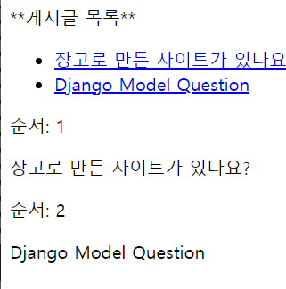

views.py

```
from django.shortcuts import render
from django.http import HttpResponse
from .models import Question

# Create your views here.
def index(request):

    question_list=Question.objects.order_by('-create_date') #-는 내림차순
    context={'question_list':question_list}

    return render(request,'mybo/question_list.html',context)
#render함수는 context에 있는 질문 데이터를 템플릿(mybo/question_list.html)
#에 적용하여 html 코드로 변환해서 출력
```


템플릿 추가후 템플릿태그 

```

    <ul>
    
        <li><a href="/mybo/{{ question.id }}/">{{ question.subject }}</a></li>
    
    </ul>

    <p>질문이 없습니다.</p>

```

템플릿태그는 로 둘러쌓인 문장

```



    <p>조건문1에 해당되는 경우</p>



    <p>조건문2에 해당되는 경우</p>



    <p>조건문1, 2에 모두 해당되지 않는 경우</p>


```


```

    <p>순서: {{ forloop.counter }} </p>
    <p>{{ item }}</p>


```


```
**게시글 목록**

    <ul>
    
        <li><a href="/mybo/{{ question.id }}/">{{ question.subject }}</a></li>
    
    </ul>

    <p>질문이 없습니다.</p>



    <p>순서: {{ forloop.counter }} </p>
    <p>{{ item }}</p>

```



counter0 하면 순서0부터 시작한다.


매칭, 게시글 주소 연결

1. http://localhost:8000/mybo/ ->

   view.index로 이동

2. 게시글 선택 : http://localhost:8000/mybo/4 ->

   conffig/urls.py ->

   mybo/urls.py ->

   <int:question...>매칭

   

   ----

   ```
   from django.shortcuts import render,get_object_or_404
   
   question =get_object_or_404(Question,pk=question_id)
   ```

   에러 404로


별칭주기 url에서 설정

```
urlpatterns=[
    path('',views.index, name='index'),
    #path('',views.index), #mybo/ 주소의 매핑 규칙
    path('<int:question_id>/',views.detail,name='detail'),
]
```

html에서

```
<ul>

    <li>
        <a href="">{{ question.subject }}</a></li>

</ul>
```


