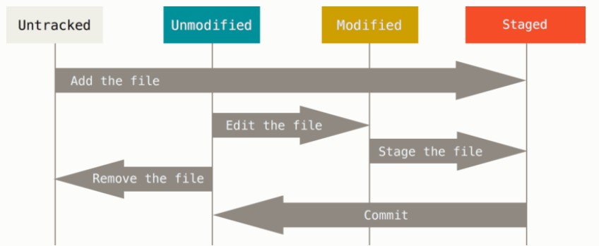
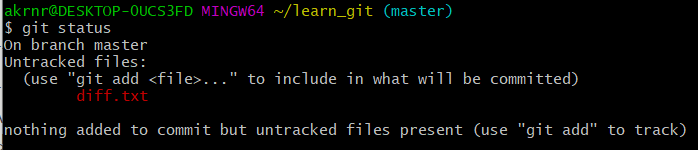
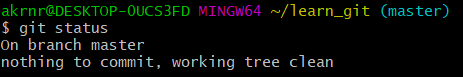

# Github 특강 - Basic

## git 이란?

git은 버전관리 시스템 중 하나이다. 소프트웨어를 개발하는 소스코드를 효과적으로 관리하게 해주는 공개 소프트웨어 이다.

git는 데이터를 스냅샷의 연속처럼 취급한다.  



## git 설치

1. git-scm.com 에서 다운로드
2. 계속 next 후 install


## git 사용법

### 최초 설정

처음 컴퓨터에 git을 설치하면 사용자의 이메일과 이름을 적어준다. 이는 일종의 서명이다. 이는 앞으로 일어나는 커밋에 서명을 하기 위해서 필요하다.

```
$ git config --global user.name "<당신의 이름>"

$ git config --global user.email"<아이디>@<이메일>"
```

잘 설정되었나 확인하려면

```
$ git config user.name

이름 출력

$ git config user.email

이메일 출력
```

### 초기화

초기화는 `git init`을 통해 진행한다.

```
$ git init
```

잘 되었는지 확인하기 위해서

```
$ ls -a
```

.git 확인가능

### Stage하기

staged란 현재 수정한 파일을 아직 스냅샷 촬영 하지 않은 상태

```
$ git add <데이터>
```

으로 모름-> 스테이지 상태로 변경된다.


### Commit 하기

committed란 데이터가 로컬 데이처베이스에 안전하게 저장됐다는 것을 의미한다. 

commit 명령어는 Stage에 올라온 내용을 촬영한다.

```
$ git commit -m "<메세지입력>" 
```

마지막 커밋 이후 파일을 수정하게 되면 Git은 그 파일을 Modified 상태로 변경한다. 그래서 커밋을 하기 위해서는 이 수정된 파일을 

```
$ git add <데이터>
```

을 입력해 Stage로 올릴 수 있다.


### Log 보기

```
$ git log
```

log 명령어로 저장소의 히스토리를 볼 수 있다.

커밋 히스토리를 최근순으로 보여주고 저자이름, 저자 이메일, 커밋한 날짜, 커밋 메시지를 출력한다.


### 상태점검

```
$ git status
```



Untraked files: -> 어떤 파일이 '수정됨'에 있는 상태



nothing to commit -> Tracked 파일은 하나도 수정되지 않았거나 Untracked 파일은 아직 없어서 목록에 나타나지 않은 상태


### 파일 이름 변경하기

```
$ git mv <원래 이름> <변경 할 이름>
```


### 원격 저장소 등록하기

```
$ git remote add origin <URL> #등록하기

$ git remote -V  # 원격 저장소 확인하기
origin <URL>... # origin remote 저장소의 이름

$ git remote rm <remote_repo_name>

$ git remote -v $ 없어진 것 확인
```


### 원격 저장소에 push 하기

```
$ git push origin master # remote 이름이 origin 
```

이름 따로 달꺼면 반드시 origin 아니여도 된다.


## Summary

| 명령어                             | 설명                                                  |
| ---------------------------------- | ----------------------------------------------------- |
| `$ git init`                       | 빈 디렉토리(폴더)를 git 저장소로(repo)로 초기화 한다. |
| `$ git add <filename>`             | <filename>을 Stage에 올린다.                          |
| `$ git commit -m "commit message"` | 커밋할때 메시지를 첨부할 수 있다.                     |


