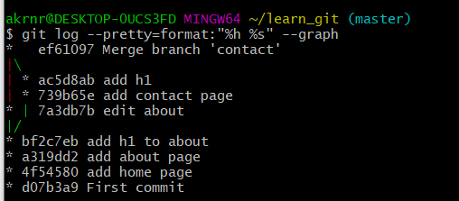

# Git - Intermediate

 ## branch

branch는 독립적으로 개발하는 코드 모델이다. 가지처럼

### 브랜치 생성하기

```
$ git branch <name>
```

이름 좀 길게 적기 

한번에 생성 후 바로 브랜치로 들어가기 

```
$ git branch -c <branchname>
or
$ git checkout -b <branchname>
```


### 브랜치 확인하기 

```
$ git branch
```


head 상태 보여줌


### 브랜치 옮기기 (HEAD 움직이기)

```
$ git switch <옮겨갈 branch>
or
$ git checkout <옮겨갈 branch>
```


### 브랜치 합치기 

```
git merge <name>
```

항상 master에서 다른 브랜치를 병합한다.

merge 후 master 브랜치가 빠르게 이동하면서 원래 브랜치의 내용과 함께 적용된다.  (fast forward)


### 브랜치 삭제하기

```
$ git branch -d <name>
```


### 그래프 그리기

```
git log --pretty=format:"%h %s" --graph
```



로 master에서 상태 볼 수 있다.


### 협업하기

add , commit , push&pull

1. branch 를 각각 만든다.

2. 내용작성 후 commit 

3. `$ git push origin <mybranchname> `

4. github에서 Pull requests > compare & pull request

5. 요청 승인해주기

6. 반드시 master로 바꾼후! pull 함

   

## VS Code 사용하기

### 설정하기

터미널 > bash > 쓰레기통 아이콘

### vs code에서 무시하기

touch .gitignore : git이 모른척 해줬으면 좋겠다. untracked도 안된다. 

프로젝트에서 내가 안바꿨는데 자꾸 modified 뜰때

https://gitignore.io 에서 검색하고 ignore해주기