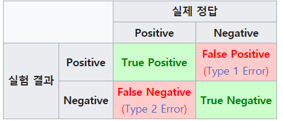
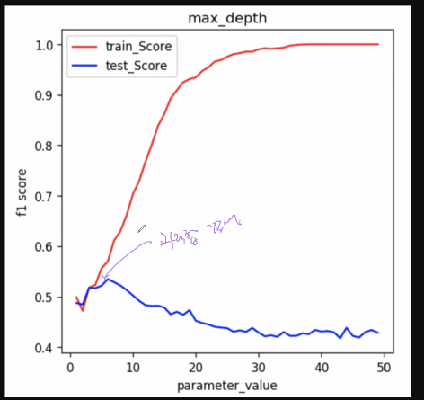

# 분류기 정확도 측정 방법

* 모델 정확도

1) 정확도(Accuracy) : 올바르게 분류된 데이터 수 / 전체 데이터 수 

(True positive + True Negative) / (TP + TN +FP +FN)

EX) 타이타닉 생존이 Positive , 사망이 Negative 라면

T P : 생존으로 맞게 예측

EX ) 성적이 b를 넘으면 (t) 넘지 못하면 (f)

F P : 넘지못한다고 맞게 예측 

침입범을 찾는 시스템 

FP : 침입범인데 아니라고 판단

TN: 침입범 아닌데 아니라고 판단(??)

- True Positive(TP) : 실제 True인 정답을 True라고 예측 (정답)

- False Positive(FP) : 실제 False인 정답을 True라고 예측 (오답)

- False Negative(FN) : 실제 True인 정답을 False라고 예측 (오답)

- True Negative(TN) : 실제 False인 정답을 False라고 예측 (정답)

  

2) 재현율 (recall):

실제로 True인 데이터를 모델이 얼마만큼 True라고 인식할까

3) 정밀도 (Precision):

모델이 True로 예측한 데이터 중 실제로 True인 데이터의 수 

# 트리🎄

https://scikit-learn.org/stable/getting_started.html

depth 커질때 과적합 부분 생김 중요한건 test_score

제일 밑에 자식 없는 노드 : leaf node

자식이 있는 노드 : internal node

## 랜덤포레스트⛺ 파라미터 

n_estimators : 디폴트 100  트리 모델의 개수

bootstrap : True , 중복허용여부

max_features : 최대 컬럼의 개수(트리 모델 생성시 사용하게 될)

max_samples : 트리 모델 생성시 사용하게 될 최대 데이터의 개수 (랜덤)

ex ) 타이타닉 생존 판별기

age , name ... (10개 컬럼) -> survived 예측

sqrt(10) -> 3.xx -> 3(max feagures)

tree1 , tree2 ,... tree100

트레이닝 데이터가 전체 1000개 주어지면

max_samples : 랜덤하게 max_samples로 설정된 값만큼 추출해서 모델작성한다 ( 다 쓰는게 아님! )

ex) max_samples:0.5 , 1000개 중에 500개 선택하여 모델 생성