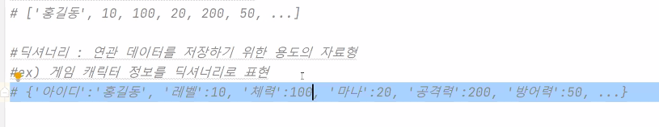

# 튜플/시퀀스/딕셔너리


## 튜플

튜플은 리스트와 거의 동일 

차이점? 

 (1) 튜플은 값(생성, 삭제, 수정) 변경이 안된다. 

 (2) 소괄호() 사용

```
print(t1)
print(type(t1))
# del t1[1] #참조할때는 [](대괄호) 사용 error 발생!!
```

값 변경안되니까 에러


```
print(t1[2]) #인덱싱
print(t1[1:]) #슬라이싱
t2=('a',3,4)
print(t1+t2) #튜플도 더하기 가능
```


```
t4=(7)  #정수취급해버림
print(t4)
print(type(t4)) #int로 나옴
```

튜플이 아니네요??

```
t4=(7,) #요소가 한개인 튜플은 콤마를 찍어준다
t5=5,8 #튜플되지만 되도록 튜플을 나타내는 기호(소괄호)로 묶어서 표현할 것
```


### 튜플 -> 리스트

```
x=tuple(range(1,10))
print(x)
#x[4]=50 에러
#튜플 ->리스트 ->요소값 변경
print(list(x))
```

(1, 2, 3, 4, 5, 6, 7, 8, 9)
[1, 2, 3, 4, 5, 6, 7, 8, 9]

괄호가 바뀐다.


### 문자튜플,리스트

```
s = "hello"
print(list(s))
```

['h', 'e', 'l', 'l', 'o']

리스트에 문자열을 주면 문자 리스트가 만들어 짐

```
print(tuple(s))
```

('h', 'e', 'l', 'l', 'o')

튜플에 문자열을 주면 문자 튜플


## 시퀀스 자료형

리스트, 튜플, 문자열, range 등은 모두 다 값들이 연속적으로 저장되어 있는 시퀀스 자료형

[1,2,3] (1,2,3) "hello" range(3)  전부다 시퀀스에 해당


시퀀스 자료형의 공통기능

데이터 존재 유무 확인

작성방법 : `찾고자하는값 in 시퀀스객체`


a=[0,10,...,90]

```
a = list(range( 0, 100, 10))
#a안에 30이 있나요?
print(30 in a) #True
print(45 in a) #False

#a안에 30이 없습니까?
print(30 not in a) #False -아니요
```


```
print ("5가 있나요?") , 5 in (1,2,3,4,5))
print( 1 in range(5))

# 그외 문자열도 된다 
```

----------------------------

### 객체연결


```
# 시퀀스 객체 연결 (range는 불가)
a=[1,2]
b=[3,4]
print(a+b)

# print(range(0,4)+range(4,6)) 에러
print(list(range(0,4))+list(range(4,6)))
```

range 객체들을 연결할 수 없으므로, range->list로 변경한 다음 연결


문자열 연결 : +

문자열과 숫자 연결 : 숫자(정수,실수) -> 문자(열) 변경 먼저

```
print("hi"+100) #에러발생
print("hi" + str(100))
```


시퀀스객체 * 정수 or 정수 * 시퀀스객체

```
#시퀀스 반복
print([1,2,3] * 5)
print(range(0,5,1)*3) #error range는 * 연산자 사용불가
print(list(range(0,5,1))*3) #객체를 튜플 또는 리스트로 변경한 다음 반복
```


### len

len (시퀀스객체) : 시퀀스 데이터(요소) 개수

```
a=[10,20,30,40]
print(len(a))

b=(1,2,3,4)
print(len(b))

print(len(range(1,10,2)))
```

4

4

5

공백문자도 세버리니까 주의


```
s = "안녕하세요"
print((len(s.encode('utf-8'))))
#utf-8에서는 한글 한 글자가 3byte, 3*5 = 15 바이트
```

15

len함수는 길이를 구함. 파이썬 2.7 버전에서는 실제 바이트 수가 나옴

3.xx 버전은 글자의 수가 나옴


시퀀스 참조

대괄호 [] 기호로 참조


* del 시퀀스객체 [인덱스] : 튜플, range, 문자열도 삭제 안됨


### 슬라이싱

```
a=[10,20,30,40]
print(a[0:3])
print(a[0:0])
print(a[0:1])
```

시작인덱스:끝인덱스 (하나전까지)


```
print(a[:3:2]) # a[0]~a[2] , 2칸씩 건너뛰기
```

a[0], a[2] 참조


```
r=range(20)
print(r[3:8])
print(r[:15:3])
print((list(r[:15:3])))
```

range(3, 8)
range(0, 15, 3)
[0, 3, 6, 9, 12]


문자열도 가능

```
s="hello python"
print(s[:10])
print(s[:10:2])
```

hello pyth
hlopt

+ 슬라이스 함수 사용

  ```
  print(list(range(20)[slice(3,9,2)]))
  ```

[3, 5, 7]

슬라이스 안은 **인덱스**

range 옆의 숫자는 **숫자범위**인셈


```
print(list(range(20)[slice(3,9,2)]))
print(list(range(20)[3:9:2]))
#똑같은결과.
```


```
del a[2:9:2]
print(a)
```

del도 됨


## 딕셔너리 자료형

딕셔너리(사전) : 단어-의미 구조와 유사하게 이름=홍길동, 생일=20200104 등과 같은 형식으로 표현 

딕셔너리? 키(key) = 값(value)의 쌍으로 표현

예) 딕셔너리 = { 키:값, 키:값, ... } 

키는 변하지 않는 값(상수), 값에는 변하는 값을 표현.

상수 : 문자상수(따옴표로 묶어서), 숫자상수(1,2,3,4,...) -일단 숫자쓰지말기

딕셔너리는 시퀀스 객체가 아님. 데이터 참조 방법이 다르다.


```
d={'name':'kim','addr':'seoul', 'age':25}
#{키:값,...} , 키는 작은 따옴표로 묶어서 표현, 
값에서 수치는 그대로, 문자는 작은(큰)따옴표로
```

문자,숫자,자료구조 올수있음

[1,10,15,20,30,70] 데이터들 사이에 연관관계가 없음

* 리스트(튜플) 구조로 연관 관계가 있는 데이터를 표현하기가(이해하기도) 어려움

* 연관 데이터를 저장하기 위한 용도로 딕셔너리 사용함

  

따옴표는 곁 ,홑 맞춰주기

key 중복되면 에러는 안뜨는데 마지막에 저장된 값 하나만 출력된다.

* 키에는 딕셔너리, 리스트 등 자료구조가 올 수 없다.

  `dic ={[10,20]:30}` #ERROR

  

```
a =[] #빈 리스트
print(a)
b=list()
print(b)

a ={} #빈 딕셔너리 생성 dict or {}
print(a)
b=dict()
print(b)
```

[]
[]
{}
{}


```
dic ={'아이디':'홍길동','레벨':10, '체력':100,'마나':20}
c = dict(아이디='홍길동',레벨=10,체력=100,마나=20)
```

같음, 딕셔너리 할때 암거나 써두된다.


```
print(dict(zip(['a','b'],[1,2]))) #zip 객체를 dict로 변환
```

{'a': 1, 'b': 2}

`zip()` : 짝끼리 묶어줌   '키':밸류


```
c = dict(zip(['아이디', '레벨','체력','마나'],[10,100,20,200]))
print(c)
```

{'아이디': 10, '레벨': 100, '체력': 20, '마나': 200}

`dict(zip([키 리스트],[값 리스트]))`


* 튜플 형태로

```
c3 = dict([('아이디','홍길동'),('레벨',10),('체력',100),('마나',20)])
#dict([]) (리스트 내부에 (키,값) 형식의 튜플로 표현
print(c3)
```

`dict([ (튜플1), (튜플2), ... ])`


```
#중괄호로 표현
c4=dict({'아이디':'홍길동','레벨':10, '체력':100,'마나':20 })
print(c4)
```


### 딕셔너리 데이터 추가/삭제


* 추가

 ```
  a = {'nn':'bear'}
  print(a)
  #딕셔너리 a에 데이터 추가
  a['addr']='seoul'
  #딕셔너리 변수명 ['키이름'] = 값
  a[100] = 300
  print(a)
 ```

{'nn': 'bear'}
{'nn': 'bear', 'addr': 'seoul', 100: 300}

이꼴 !  = 


* 삭제

  ```
  del a[100]
  print("삭제후 : ",a)
  ```

[] 인덱스로 생각하면 안됨, 키 이름을 쓸 것.

`del 딕셔너리변수명[키]` ==> 키와 값을 모두 제거


### key/value 만 추출

```
dic={'아이디':'홍길동', '레벨':10, '체력':100, '마나':20, '공격력':200, '방어력':50}
print(dic.keys()) #키만 추출
```

`keys()` 함수사용

dict_keys(['아이디', '레벨', '체력', '마나', '공격력', '방어력'])

리스트 형태로 출력된다.

```
print(dic.values()) #값만 추출
```

```
print(dic.items())
```

dict_items([('아이디', '홍길동'), ('레벨', 10), ('체력', 100), ('마나', 20), ('공격력', 200), ('방어력', 50)])

리스트- 튜플쌍으로`


```
mykey=dic.keys()
print((mykey))
#print(mykey[0]) #에러,dict_keys(리스트객체)라서 

listmykey=list(mykey)
print(listmykey)
```


```
dic={'아이디':'홍길동', '레벨':10, '체력':100, '마나':20, '공격력':200, '방어력':50}
print(dic['마나']) # 추출
```

```
print(dic['마나'])
#print(dic['민첩성']) 없는 키를 참조하려하면 에러발생
```


### 키 찾기

```
print(dic.keys()) #적을때
print( '민첩성' in dic  ) #키가 많을때
```

있으면 True  없으면 False

* not in 도 사용가능


