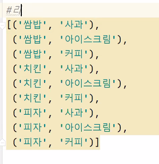

# 라이브러리

수많은 파이썬 함수들이 내장되어 있음

## abs()

절댓값 출력

```
print(abs(-3))
```

3


## all ()

```
#all 함수 : 모두 참 -> True
print(all([1,2,3])) #True
print(all([1,2,3,0])) #False
```


## any()

: 어느 하나라도 참이면, 참  모두 거짓이면 거짓. (all의 반대)

```
print(any([1,2,3,0])) #참이 있으므로 True
print(any([0, ""])) #모두 거짓 False
print(any([])) #모두 거짓 False

```


## char()

: 아스키 코드 => 문자를 출력해주는 함수

```
print(chr(65)) #A
```


## ord()

문자 => 아스키 코드 , char의 반대

```
print(ord('A')) #65
```


## enumerate ()

: 열거형 데이터를 표현하는 함수, for 문과 함께 사용

리스트, 튜플, 문자열처럼 시퀀스를 갖는 데이터를 입력을 받아서

인덱스를 포함하는 enumerate 객체를 만들어준다.

```
for idx, i in enumerate(['aaa','bbb','ccc']):
    print(idx,i)
```

0 aaa
1 bbb
2 ccc


## eval()

문자열로 구성된 수식 입력 -> 문자열을 실행한 결과를 리턴

```
print("10+20") #10+20 ,문자열 고대로 나옴
print(eval("10+20")) #30 , int타입으로 나온다
print(eval("divmod(5,3)")) #(1,2)
```


## filter()

:원하는 데이터를 걸러내는 함수

`filter(함수이름, 1번째 인수에 있는 함수에 입력될 반복 가능한 자료형)`

filter함수의 리턴값이 True인 값들만 묶어서 돌려준다.


예시

```
#필터 안쓸때
res=[]
def pos(n):
    for i in n:
        if i>0:
            res.append(i)
    return res

print(pos([1,3,-5,-7,9])) #[1,3,9]로 출력되길 원하는 상황


#filter 함수 사용

def pos2(a):
    return a>0 #T,F 로 나옴

print(list(filter(pos2,[1,3,-5,-7,9]))) #필터가 T만 묶음. 필터 객체로 나오기 때문에 리스트로 바꿔줄것!

# filter + 람다 함수 사용

print(list(filter(lambda a: a>0,[1,3,-5,-7,9]))) 
#lambda -> T,F로 나올꺼임

```


## hex()

16진수로 변환

```
print(hex(234)) #0xea
```

e*16+a = 14x16+10 = 234


# 컴프리헨션

## 리스트 내포

```
num=[]
for n in range(11):
    num.append(n)
print(num)

#위의 표현을 밑처럼 컴프리헨션 일단 대괄호

print([n for n in range(11)])
print([n*2 for n in range(11)]) #연산도 됨

```

[0, 1, 2, 3, 4, 5, 6, 7, 8, 9, 10]
[0, 1, 2, 3, 4, 5, 6, 7, 8, 9, 10]




#리스트[(메뉴,후식)], ...

```
['쌈밥','치킨','피자']
['사과','아이스크림','커피']
```

```
#이중 for문 리스트 컴프리헨션
print([(x,y) for x in ['쌈밥','치킨','피자'] for y in ['사과','아이스크림','커피']])
```


```
#0~9까지 수 중에서 5보다 작으면서 2로 나누어 떨어지는 수
print([x for x in range(0,10) if x<5 if x%2==0])
```


```
#0~9 , 1~10 , 2~11 ...
print([x+y for x in range(10) for y in range(10)])
```

[0, 1, 2, 3, 4, 5, 6, 7, 8, 9, 1, 2, 3, 4, 5, 6, 7, 8, 9, 10, 2, 3, 4, 5, 6, 7, 8, 9, 10, 11, 3, 4, 5, 6, 7, 8, 9, 10, 11, 12, 4, 5, 6, 7, 8, 9, 10, 11, 12, 13, 5, 6, 7, 8, 9, 10, 11, 12, 13, 14, 6, 7, 8, 9, 10, 11, 12, 13, 14, 15, 7, 8, 9, 10, 11, 12, 13, 14, 15, 16, 8, 9, 10, 11, 12, 13, 14, 15, 16, 17, 9, 10, 11, 12, 13, 14, 15, 16, 17, 18]

## set 내포

셋{} 딕셔너리도{}

위에 코드 뜯어와서, `print({x+y for x in range(10) for y in range(10)})`  # x+y저장이니까 셋. (키 밸류 아니잖어)

{0, 1, 2, 3, 4, 5, 6, 7, 8, 9, 10, 11, 12, 13, 14, 15, 16, 17, 18}

중복 다 사라짐

## 딕셔너리

{키:값, 키:값, ...}

```
print({x+y:"값" for x in range(10) for y in range(10)})
```

type) <class 'dict'>


#점수가 60점 이상이면 pass, 미만이면 fail

```
scores={'철수':50, '영희':70, '순신':100}
print({name:"pass" if score>=60 else "fail" for name,score in scores.items() }) #이렇게 잘 안씀
```

{'철수': 'fail', '영희': 'pass', '순신': 'pass'}


일반적인 구문: `[표현식 for 변수명 in 시퀀스]`


## 문제

```
words=['Computer', 'Coke', 'Bread']
#대문자가 소문자로 바껴서 리스트로 출력됐음 좋겠다!
print([x.lower() for x in words])
```


```
a =[1,-5,4,2,-2,10]
#a에 저장된 값이 0보다 크면 a값을, 작으면 0을 저장
print([i if i>0 else 0 for i in a])
```


```
a =[1,2,3,4,5]
#a값이 1이면 "pass", 2이면 "fail", 나머지는 "no"
print(["pass" if i==1 else "fail" if i==2 else "no" for i in a])
```

elif를 못쓰나봄 `else  '출력'  if 조건` 이렇게 찢어쓴다

조건이 여러개면 컴프리헨션으로 하지말고 찢어쓰는게 나음


# 딕셔너리 응용

```
x={'a':10, 'b':20, 'c':30}
print(x)
x['aa']=40 #추가
print(x)
x.setdefault('d') #키 d가 추가, 값이 None 추가
print(x)

x['a']=100 #변경
print(x)
x.update(b=200) #변경
print(x)
```

{'a': 10, 'b': 20, 'c': 30}
{'a': 10, 'b': 20, 'c': 30, 'aa': 40}
{'a': 10, 'b': 20, 'c': 30, 'aa': 40, 'd': None}
{'a': 100, 'b': 20, 'c': 30, 'aa': 40, 'd': None}
{'a': 100, 'b': 200, 'c': 30, 'aa': 40, 'd': None}


```
x['z']=99
print(x)

x.update(k=50) #k가 없는 상황 -> 추가된다.
print(x)
```

{'a': 100, 'b': 200, 'c': 30, 'aa': 40, 'd': None, 'z': 99}
{'a': 100, 'b': 200, 'c': 30, 'aa': 40, 'd': None, 'z': 99, 'k': 50}

* update의 장점

`x.update(k=50, c=300, s=50)` 처럼 한번에 여러개 추가할 수 있다.


```
x.update(zip(['aa','c'],[999,777])) #k가 없는 상황
```

설명살짝 놓침 대충 zip으로 묶는다는 내용인듯

{'a': 10, 'b': 200, 'c': 777, 'aa': 999, 'd': 30, 'z': 99, 'k': 50}


```
x={'a':10 , 'b':20, 'c':30, 'd':40}
x.pop('a')
print(x)
```

{'b': 20, 'c': 30, 'd': 40}

pop 호출할때 key 줄 것


```
v=x.pop('a')
print(v) #10 , 꺼내서 저장도 됨
```


```
x.pop('z') #error
print(x.pop('z',0)) #0 키가 없으면 0을 리턴
```


```
x={'a':10 , 'b':20, 'c':30, 'd':40}
del x['b']
print(x)
```

{'a': 10, 'c': 30, 'd': 40}


## fromkeys()

리스트(튜플) - >딕셔너리 생성

```
li=['a','b','c']
d=dict.fromkeys(li)
print(d)
```

{'a': None, 'b': None, 'c': None}

```
d2=dict.fromkeys(li,10) #초기화 인수
print(d2)
```

{'a': 10, 'b': 10, 'c': 10}


```
from collections import defaultdict #collections모듈에서 defaultdict 함수 가지고 오기

#print(d2['z']) 키가 없어서 에러

d2=defaultdict(int)
print(d2['z2']) #0 
```


```
#키만 출력
#값만 출력
#키,값 쌍을 출력

print(d3.keys())
print(d3.values())
print(d3.items())
```


```
keys=['a','b','c','d']
print(dict.fromkeys(keys))
for key,value in dict.fromkeys(keys).items(): 
#dict.fromkeys로 쓰지말래 딕셔너리이기 때문에 items해주기

    print(key,value)
```

a None
b None
c None
d None

```
d4={key:value for key,value in dict.fromkeys(keys).items()}
print(d4)
```


## 문제

#newx는 x에 저장된 데이터에서 'b'를 뺀 나머지를 저장!

```
x = {'a': 10, 'b': 20, 'c': 30, 'd': 40}
newx = {k:v for k,v in x.items() if k!='b'}
print(newx)
```

#newx는 x에 저장된 데이터에서 값이 '20'를 뺀 나머지를 저장

```
newx = {k:v for k,v in x.items() if v!=20}
print(newx)
```


## 딕셔너리 속 딕셔너리

딕셔너리 = {키1:{키a:값a, 키b:값b}, 키2:{키c:값c, 키d:값d} }


```
영화 = {'bts':{'머큐리':4.5,'매트릭스':4.0}}
print(영화['bts']['매트릭스']) #4.0
```


```
x={'a':0, 'b':1}
y=x #실제로는 딕셔너리가 1개 만들어짐
print(x is y) #True
```

```
x={'a':0, 'b':1}
y=x #실제로는 딕셔너리가 1개 만들어짐
print(x is y)

x['a']=100
print(y)
y=x.copy() #완전히 다른 2개의 딕셔너리가 만들어진다
print(x is y)
```

True
{'a': 100, 'b': 1}
False


```
x = {'a': {'python': '2.7'}, 'b': {'python': '3.6'}}
y = x.copy()
y['a']['python'] = '2.7.15'
print(y)

#중첩 딕셔너리를 완전히 복사하려면 copy 모듈의 deepcopy사용 
import copy
y= copy.deepcopy(x)
y['a']['python'] = '2.7.15'
print(x)
print(y)
```

{'a': {'python': '2.7.15'}, 'b': {'python': '3.6'}}
{'a': {'python': '2.7.15'}, 'b': {'python': '3.6'}} #복사확인