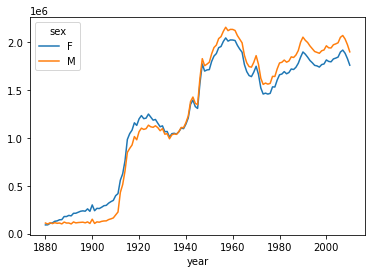
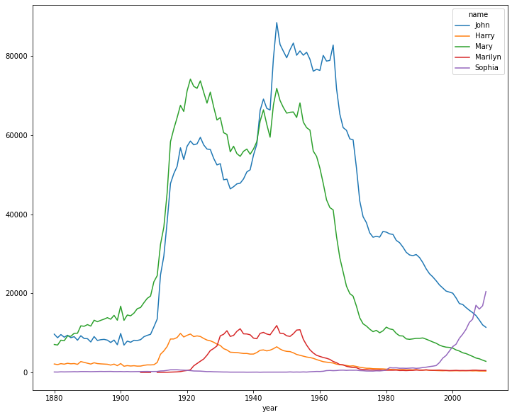
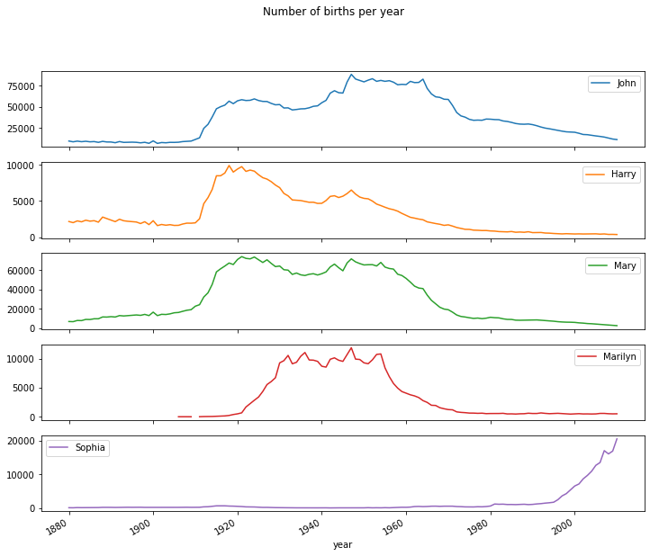
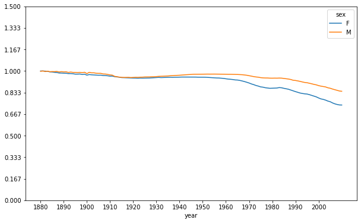
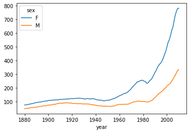
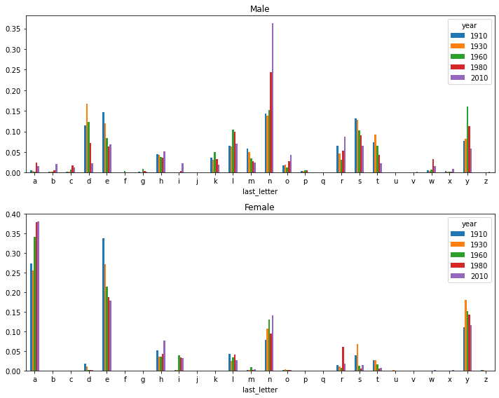
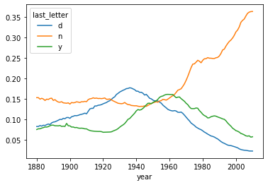

```python
import pandas as pd
import numpy as np
import matplotlib.pyplot as plt
import seaborn as sns

years=range(1880,2011)
pieces=[]

for year in years:
    path="babynames/yob%d.txt" % year
    frame=pd.read_csv(path, header=None, names=['name', 'sex', 'births'])
    frame['year']=year
    pieces.append(frame)
    #print(frame)
    #print(path)
    
len(pieces[0][pieces[0].sex=='F']) #942
len(pieces[130][pieces[130].sex=='F']) #19698

```


    19698


```python
names=pd.concat(pieces, ignore_index=True)
```


```python
total_births=names.pivot_table('births', index='year', columns='sex', aggfunc=sum)
total_births.plot()

```


    <AxesSubplot:xlabel='year'>


    

    


```python
#prop컬럼 (각 이름이 전체(해당연도) 출생수에서 차지하는 비율)
#names

def add_prop(group):
    group['prop']=group.births/group.births.sum()
    return group

names=names.groupby(['year','sex']).apply(add_prop)

```


```python
names.groupby(['year','sex']).prop.sum()
```


    year  sex
    1880  F      1.0
          M      1.0
    1881  F      1.0
          M      1.0
    1882  F      1.0
                ... 
    2008  M      1.0
    2009  F      1.0
          M      1.0
    2010  F      1.0
          M      1.0
    Name: prop, Length: 262, dtype: float64


```python
#각 연도별/ 성별에 따른 선호하는 이름 1000개 추출
def get_top1000(group):
    return group.sort_values(by='births', ascending=False)[:1000]


top1000=names.groupby(['year','sex']).apply(get_top1000)
```


```python
top1000.reset_index(inplace=True, drop=True)
#top1000.set_index(['births']) 로 벌쓰를 인덱스로 삼을 수 있음
```


```python
top1000
```


<div>
<style scoped>
    .dataframe tbody tr th:only-of-type {
        vertical-align: middle;
    }

    .dataframe tbody tr th {
        vertical-align: top;
    }

    .dataframe thead th {
        text-align: right;
    }
</style>
<table border="1" class="dataframe">
  <thead>
    <tr style="text-align: right;">
      <th></th>
      <th>name</th>
      <th>sex</th>
      <th>births</th>
      <th>year</th>
      <th>prop</th>
    </tr>
  </thead>
  <tbody>
    <tr>
      <th>0</th>
      <td>Mary</td>
      <td>F</td>
      <td>7065</td>
      <td>1880</td>
      <td>0.077643</td>
    </tr>
    <tr>
      <th>1</th>
      <td>Anna</td>
      <td>F</td>
      <td>2604</td>
      <td>1880</td>
      <td>0.028618</td>
    </tr>
    <tr>
      <th>2</th>
      <td>Emma</td>
      <td>F</td>
      <td>2003</td>
      <td>1880</td>
      <td>0.022013</td>
    </tr>
    <tr>
      <th>3</th>
      <td>Elizabeth</td>
      <td>F</td>
      <td>1939</td>
      <td>1880</td>
      <td>0.021309</td>
    </tr>
    <tr>
      <th>4</th>
      <td>Minnie</td>
      <td>F</td>
      <td>1746</td>
      <td>1880</td>
      <td>0.019188</td>
    </tr>
    <tr>
      <th>...</th>
      <td>...</td>
      <td>...</td>
      <td>...</td>
      <td>...</td>
      <td>...</td>
    </tr>
    <tr>
      <th>261872</th>
      <td>Camilo</td>
      <td>M</td>
      <td>194</td>
      <td>2010</td>
      <td>0.000102</td>
    </tr>
    <tr>
      <th>261873</th>
      <td>Destin</td>
      <td>M</td>
      <td>194</td>
      <td>2010</td>
      <td>0.000102</td>
    </tr>
    <tr>
      <th>261874</th>
      <td>Jaquan</td>
      <td>M</td>
      <td>194</td>
      <td>2010</td>
      <td>0.000102</td>
    </tr>
    <tr>
      <th>261875</th>
      <td>Jaydan</td>
      <td>M</td>
      <td>194</td>
      <td>2010</td>
      <td>0.000102</td>
    </tr>
    <tr>
      <th>261876</th>
      <td>Maxton</td>
      <td>M</td>
      <td>193</td>
      <td>2010</td>
      <td>0.000102</td>
    </tr>
  </tbody>
</table>
<p>261877 rows × 5 columns</p>
</div>


```python
boys=top1000[top1000.sex=='M']
girls=top1000[top1000.sex=='F']
```


```python
boys
```


<div>
<style scoped>
    .dataframe tbody tr th:only-of-type {
        vertical-align: middle;
    }

    .dataframe tbody tr th {
        vertical-align: top;
    }

    .dataframe thead th {
        text-align: right;
    }
</style>
<table border="1" class="dataframe">
  <thead>
    <tr style="text-align: right;">
      <th></th>
      <th>name</th>
      <th>sex</th>
      <th>births</th>
      <th>year</th>
      <th>prop</th>
    </tr>
  </thead>
  <tbody>
    <tr>
      <th>942</th>
      <td>John</td>
      <td>M</td>
      <td>9655</td>
      <td>1880</td>
      <td>0.087381</td>
    </tr>
    <tr>
      <th>943</th>
      <td>William</td>
      <td>M</td>
      <td>9533</td>
      <td>1880</td>
      <td>0.086277</td>
    </tr>
    <tr>
      <th>944</th>
      <td>James</td>
      <td>M</td>
      <td>5927</td>
      <td>1880</td>
      <td>0.053641</td>
    </tr>
    <tr>
      <th>945</th>
      <td>Charles</td>
      <td>M</td>
      <td>5348</td>
      <td>1880</td>
      <td>0.048401</td>
    </tr>
    <tr>
      <th>946</th>
      <td>George</td>
      <td>M</td>
      <td>5126</td>
      <td>1880</td>
      <td>0.046392</td>
    </tr>
    <tr>
      <th>...</th>
      <td>...</td>
      <td>...</td>
      <td>...</td>
      <td>...</td>
      <td>...</td>
    </tr>
    <tr>
      <th>261872</th>
      <td>Camilo</td>
      <td>M</td>
      <td>194</td>
      <td>2010</td>
      <td>0.000102</td>
    </tr>
    <tr>
      <th>261873</th>
      <td>Destin</td>
      <td>M</td>
      <td>194</td>
      <td>2010</td>
      <td>0.000102</td>
    </tr>
    <tr>
      <th>261874</th>
      <td>Jaquan</td>
      <td>M</td>
      <td>194</td>
      <td>2010</td>
      <td>0.000102</td>
    </tr>
    <tr>
      <th>261875</th>
      <td>Jaydan</td>
      <td>M</td>
      <td>194</td>
      <td>2010</td>
      <td>0.000102</td>
    </tr>
    <tr>
      <th>261876</th>
      <td>Maxton</td>
      <td>M</td>
      <td>193</td>
      <td>2010</td>
      <td>0.000102</td>
    </tr>
  </tbody>
</table>
<p>130997 rows × 5 columns</p>
</div>


```python
total_births=top1000.pivot_table('births', index='year', columns='name', aggfunc=sum)
#연도와 이름에 대한 전체 출생 수
total_births.info()

```

    <class 'pandas.core.frame.DataFrame'>
    Int64Index: 131 entries, 1880 to 2010
    Columns: 6868 entries, Aaden to Zuri
    dtypes: float64(6868)
    memory usage: 6.9 MB
    


```python
subset=total_births[['John','Harry','Mary','Marilyn','Sophia']]
subset
```


<div>
<style scoped>
    .dataframe tbody tr th:only-of-type {
        vertical-align: middle;
    }

    .dataframe tbody tr th {
        vertical-align: top;
    }

    .dataframe thead th {
        text-align: right;
    }
</style>
<table border="1" class="dataframe">
  <thead>
    <tr style="text-align: right;">
      <th>name</th>
      <th>John</th>
      <th>Harry</th>
      <th>Mary</th>
      <th>Marilyn</th>
      <th>Sophia</th>
    </tr>
    <tr>
      <th>year</th>
      <th></th>
      <th></th>
      <th></th>
      <th></th>
      <th></th>
    </tr>
  </thead>
  <tbody>
    <tr>
      <th>1880</th>
      <td>9701.0</td>
      <td>2158.0</td>
      <td>7092.0</td>
      <td>NaN</td>
      <td>138.0</td>
    </tr>
    <tr>
      <th>1881</th>
      <td>8795.0</td>
      <td>2002.0</td>
      <td>6948.0</td>
      <td>NaN</td>
      <td>122.0</td>
    </tr>
    <tr>
      <th>1882</th>
      <td>9597.0</td>
      <td>2246.0</td>
      <td>8179.0</td>
      <td>NaN</td>
      <td>179.0</td>
    </tr>
    <tr>
      <th>1883</th>
      <td>8934.0</td>
      <td>2116.0</td>
      <td>8044.0</td>
      <td>NaN</td>
      <td>159.0</td>
    </tr>
    <tr>
      <th>1884</th>
      <td>9427.0</td>
      <td>2338.0</td>
      <td>9253.0</td>
      <td>NaN</td>
      <td>170.0</td>
    </tr>
    <tr>
      <th>...</th>
      <td>...</td>
      <td>...</td>
      <td>...</td>
      <td>...</td>
      <td>...</td>
    </tr>
    <tr>
      <th>2006</th>
      <td>15140.0</td>
      <td>414.0</td>
      <td>4073.0</td>
      <td>596.0</td>
      <td>13484.0</td>
    </tr>
    <tr>
      <th>2007</th>
      <td>14405.0</td>
      <td>443.0</td>
      <td>3665.0</td>
      <td>597.0</td>
      <td>17002.0</td>
    </tr>
    <tr>
      <th>2008</th>
      <td>13273.0</td>
      <td>379.0</td>
      <td>3478.0</td>
      <td>543.0</td>
      <td>16042.0</td>
    </tr>
    <tr>
      <th>2009</th>
      <td>12048.0</td>
      <td>383.0</td>
      <td>3132.0</td>
      <td>519.0</td>
      <td>16869.0</td>
    </tr>
    <tr>
      <th>2010</th>
      <td>11424.0</td>
      <td>363.0</td>
      <td>2826.0</td>
      <td>531.0</td>
      <td>20477.0</td>
    </tr>
  </tbody>
</table>
<p>131 rows × 5 columns</p>
</div>


```python
subset.plot(figsize=(12,10)) #한꺼번에 하나
```


    <AxesSubplot:xlabel='year'>


    

    


```python
subset.plot(figsize=(12,10),subplots=True, title="Number of births per year") 
#한명씩 시각화  와 짱이다

#subset.pyplot.grid(True)


```


    array([<AxesSubplot:xlabel='year'>, <AxesSubplot:xlabel='year'>,
           <AxesSubplot:xlabel='year'>, <AxesSubplot:xlabel='year'>,
           <AxesSubplot:xlabel='year'>], dtype=object)


    

    


```python
#이름의 다영성 측정
table=top1000.pivot_table('prop', index='year', columns='sex', aggfunc=sum) 
```


```python
table.plot(figsize=(10,6), xticks= range(1880,2010,10), yticks=np.linspace(0,1.5,10))

#상위 prop의 이름이 감소?
```


    <AxesSubplot:xlabel='year'>


    

    


```python
#인기있는 이름으로 정렬 했을때 해당 년도의 전체 출생 수의 50%차지하는 읾 출력

df=boys[boys.year==2010]
df
```


<div>
<style scoped>
    .dataframe tbody tr th:only-of-type {
        vertical-align: middle;
    }

    .dataframe tbody tr th {
        vertical-align: top;
    }

    .dataframe thead th {
        text-align: right;
    }
</style>
<table border="1" class="dataframe">
  <thead>
    <tr style="text-align: right;">
      <th></th>
      <th>name</th>
      <th>sex</th>
      <th>births</th>
      <th>year</th>
      <th>prop</th>
    </tr>
  </thead>
  <tbody>
    <tr>
      <th>260877</th>
      <td>Jacob</td>
      <td>M</td>
      <td>21875</td>
      <td>2010</td>
      <td>0.011523</td>
    </tr>
    <tr>
      <th>260878</th>
      <td>Ethan</td>
      <td>M</td>
      <td>17866</td>
      <td>2010</td>
      <td>0.009411</td>
    </tr>
    <tr>
      <th>260879</th>
      <td>Michael</td>
      <td>M</td>
      <td>17133</td>
      <td>2010</td>
      <td>0.009025</td>
    </tr>
    <tr>
      <th>260880</th>
      <td>Jayden</td>
      <td>M</td>
      <td>17030</td>
      <td>2010</td>
      <td>0.008971</td>
    </tr>
    <tr>
      <th>260881</th>
      <td>William</td>
      <td>M</td>
      <td>16870</td>
      <td>2010</td>
      <td>0.008887</td>
    </tr>
    <tr>
      <th>...</th>
      <td>...</td>
      <td>...</td>
      <td>...</td>
      <td>...</td>
      <td>...</td>
    </tr>
    <tr>
      <th>261872</th>
      <td>Camilo</td>
      <td>M</td>
      <td>194</td>
      <td>2010</td>
      <td>0.000102</td>
    </tr>
    <tr>
      <th>261873</th>
      <td>Destin</td>
      <td>M</td>
      <td>194</td>
      <td>2010</td>
      <td>0.000102</td>
    </tr>
    <tr>
      <th>261874</th>
      <td>Jaquan</td>
      <td>M</td>
      <td>194</td>
      <td>2010</td>
      <td>0.000102</td>
    </tr>
    <tr>
      <th>261875</th>
      <td>Jaydan</td>
      <td>M</td>
      <td>194</td>
      <td>2010</td>
      <td>0.000102</td>
    </tr>
    <tr>
      <th>261876</th>
      <td>Maxton</td>
      <td>M</td>
      <td>193</td>
      <td>2010</td>
      <td>0.000102</td>
    </tr>
  </tbody>
</table>
<p>1000 rows × 5 columns</p>
</div>


```python
prop_cumsum=df.sort_values(by='prop', ascending=False).prop.cumsum()
prop_cumsum[:200] #누적합 

prop_cumsum.values.searchsorted(0.5)
```


    116


```python
df=boys[boys.year == 1900]
df
```


<div>
<style scoped>
    .dataframe tbody tr th:only-of-type {
        vertical-align: middle;
    }

    .dataframe tbody tr th {
        vertical-align: top;
    }

    .dataframe thead th {
        text-align: right;
    }
</style>
<table border="1" class="dataframe">
  <thead>
    <tr style="text-align: right;">
      <th></th>
      <th>name</th>
      <th>sex</th>
      <th>births</th>
      <th>year</th>
      <th>prop</th>
    </tr>
  </thead>
  <tbody>
    <tr>
      <th>40877</th>
      <td>John</td>
      <td>M</td>
      <td>9834</td>
      <td>1900</td>
      <td>0.065319</td>
    </tr>
    <tr>
      <th>40878</th>
      <td>William</td>
      <td>M</td>
      <td>8580</td>
      <td>1900</td>
      <td>0.056990</td>
    </tr>
    <tr>
      <th>40879</th>
      <td>James</td>
      <td>M</td>
      <td>7246</td>
      <td>1900</td>
      <td>0.048129</td>
    </tr>
    <tr>
      <th>40880</th>
      <td>George</td>
      <td>M</td>
      <td>5405</td>
      <td>1900</td>
      <td>0.035901</td>
    </tr>
    <tr>
      <th>40881</th>
      <td>Charles</td>
      <td>M</td>
      <td>4102</td>
      <td>1900</td>
      <td>0.027246</td>
    </tr>
    <tr>
      <th>...</th>
      <td>...</td>
      <td>...</td>
      <td>...</td>
      <td>...</td>
      <td>...</td>
    </tr>
    <tr>
      <th>41872</th>
      <td>Theron</td>
      <td>M</td>
      <td>8</td>
      <td>1900</td>
      <td>0.000053</td>
    </tr>
    <tr>
      <th>41873</th>
      <td>Terrell</td>
      <td>M</td>
      <td>8</td>
      <td>1900</td>
      <td>0.000053</td>
    </tr>
    <tr>
      <th>41874</th>
      <td>Solon</td>
      <td>M</td>
      <td>8</td>
      <td>1900</td>
      <td>0.000053</td>
    </tr>
    <tr>
      <th>41875</th>
      <td>Rayfield</td>
      <td>M</td>
      <td>8</td>
      <td>1900</td>
      <td>0.000053</td>
    </tr>
    <tr>
      <th>41876</th>
      <td>Sinclair</td>
      <td>M</td>
      <td>8</td>
      <td>1900</td>
      <td>0.000053</td>
    </tr>
  </tbody>
</table>
<p>1000 rows × 5 columns</p>
</div>


```python
in1900=df.sort_values(by='prop', ascending=False).prop.cumsum()
#인기 있 없 
in1900.values.searchsorted(0.5) +1 # searchsorted +1 하면 해당 갯수가 나옴
```


    25


```python
in1900.iloc[24]
```


    0.5036332478711958


```python
def get_quantile_count(group, q=0.7):
    temp=group.sort_values(by='prop', ascending=False).prop.cumsum()
    return temp.values.searchsorted(q)+1

diversity=top1000.groupby(['year', 'sex']).apply(get_quantile_count)
diversity=diversity.unstack('sex')
diversity
```


<div>
<style scoped>
    .dataframe tbody tr th:only-of-type {
        vertical-align: middle;
    }

    .dataframe tbody tr th {
        vertical-align: top;
    }

    .dataframe thead th {
        text-align: right;
    }
</style>
<table border="1" class="dataframe">
  <thead>
    <tr style="text-align: right;">
      <th>sex</th>
      <th>F</th>
      <th>M</th>
    </tr>
    <tr>
      <th>year</th>
      <th></th>
      <th></th>
    </tr>
  </thead>
  <tbody>
    <tr>
      <th>1880</th>
      <td>77</td>
      <td>50</td>
    </tr>
    <tr>
      <th>1881</th>
      <td>77</td>
      <td>50</td>
    </tr>
    <tr>
      <th>1882</th>
      <td>78</td>
      <td>53</td>
    </tr>
    <tr>
      <th>1883</th>
      <td>80</td>
      <td>51</td>
    </tr>
    <tr>
      <th>1884</th>
      <td>82</td>
      <td>55</td>
    </tr>
    <tr>
      <th>...</th>
      <td>...</td>
      <td>...</td>
    </tr>
    <tr>
      <th>2006</th>
      <td>689</td>
      <td>279</td>
    </tr>
    <tr>
      <th>2007</th>
      <td>731</td>
      <td>293</td>
    </tr>
    <tr>
      <th>2008</th>
      <td>759</td>
      <td>311</td>
    </tr>
    <tr>
      <th>2009</th>
      <td>780</td>
      <td>328</td>
    </tr>
    <tr>
      <th>2010</th>
      <td>781</td>
      <td>333</td>
    </tr>
  </tbody>
</table>
<p>131 rows × 2 columns</p>
</div>


```python
diversity.plot()
```


    <AxesSubplot:xlabel='year'>


    

    


```python
#시리즈에 저장된 문자열 각각에 대해 마지막 글자 추출
last_letters=names.name.map(lambda x: x[-1])
last_letters.name='last_letter'
```


```python
last_letters
```


    0          y
    1          a
    2          a
    3          h
    4          e
              ..
    1690779    e
    1690780    e
    1690781    s
    1690782    n
    1690783    x
    Name: last_letter, Length: 1690784, dtype: object


```python
table=names.pivot_table('births', index=last_letters, 
                  columns=['sex','year'], aggfunc=sum)
table
```


<div>
<style scoped>
    .dataframe tbody tr th:only-of-type {
        vertical-align: middle;
    }

    .dataframe tbody tr th {
        vertical-align: top;
    }

    .dataframe thead tr th {
        text-align: left;
    }

    .dataframe thead tr:last-of-type th {
        text-align: right;
    }
</style>
<table border="1" class="dataframe">
  <thead>
    <tr>
      <th>sex</th>
      <th colspan="10" halign="left">F</th>
      <th>...</th>
      <th colspan="10" halign="left">M</th>
    </tr>
    <tr>
      <th>year</th>
      <th>1880</th>
      <th>1881</th>
      <th>1882</th>
      <th>1883</th>
      <th>1884</th>
      <th>1885</th>
      <th>1886</th>
      <th>1887</th>
      <th>1888</th>
      <th>1889</th>
      <th>...</th>
      <th>2001</th>
      <th>2002</th>
      <th>2003</th>
      <th>2004</th>
      <th>2005</th>
      <th>2006</th>
      <th>2007</th>
      <th>2008</th>
      <th>2009</th>
      <th>2010</th>
    </tr>
    <tr>
      <th>last_letter</th>
      <th></th>
      <th></th>
      <th></th>
      <th></th>
      <th></th>
      <th></th>
      <th></th>
      <th></th>
      <th></th>
      <th></th>
      <th></th>
      <th></th>
      <th></th>
      <th></th>
      <th></th>
      <th></th>
      <th></th>
      <th></th>
      <th></th>
      <th></th>
      <th></th>
    </tr>
  </thead>
  <tbody>
    <tr>
      <th>a</th>
      <td>31446.0</td>
      <td>31581.0</td>
      <td>36536.0</td>
      <td>38330.0</td>
      <td>43680.0</td>
      <td>45408.0</td>
      <td>49100.0</td>
      <td>48942.0</td>
      <td>59442.0</td>
      <td>58631.0</td>
      <td>...</td>
      <td>39124.0</td>
      <td>38815.0</td>
      <td>37825.0</td>
      <td>38650.0</td>
      <td>36838.0</td>
      <td>36156.0</td>
      <td>34654.0</td>
      <td>32901.0</td>
      <td>31430.0</td>
      <td>28438.0</td>
    </tr>
    <tr>
      <th>b</th>
      <td>NaN</td>
      <td>NaN</td>
      <td>NaN</td>
      <td>NaN</td>
      <td>NaN</td>
      <td>NaN</td>
      <td>NaN</td>
      <td>NaN</td>
      <td>NaN</td>
      <td>NaN</td>
      <td>...</td>
      <td>50950.0</td>
      <td>49284.0</td>
      <td>48065.0</td>
      <td>45914.0</td>
      <td>43144.0</td>
      <td>42600.0</td>
      <td>42123.0</td>
      <td>39945.0</td>
      <td>38862.0</td>
      <td>38859.0</td>
    </tr>
    <tr>
      <th>c</th>
      <td>NaN</td>
      <td>NaN</td>
      <td>5.0</td>
      <td>5.0</td>
      <td>NaN</td>
      <td>NaN</td>
      <td>NaN</td>
      <td>NaN</td>
      <td>NaN</td>
      <td>NaN</td>
      <td>...</td>
      <td>27113.0</td>
      <td>27238.0</td>
      <td>27697.0</td>
      <td>26778.0</td>
      <td>26078.0</td>
      <td>26635.0</td>
      <td>26864.0</td>
      <td>25318.0</td>
      <td>24048.0</td>
      <td>23125.0</td>
    </tr>
    <tr>
      <th>d</th>
      <td>609.0</td>
      <td>607.0</td>
      <td>734.0</td>
      <td>810.0</td>
      <td>916.0</td>
      <td>862.0</td>
      <td>1007.0</td>
      <td>1027.0</td>
      <td>1298.0</td>
      <td>1374.0</td>
      <td>...</td>
      <td>60838.0</td>
      <td>55829.0</td>
      <td>53391.0</td>
      <td>51754.0</td>
      <td>50670.0</td>
      <td>51410.0</td>
      <td>50595.0</td>
      <td>47910.0</td>
      <td>46172.0</td>
      <td>44398.0</td>
    </tr>
    <tr>
      <th>e</th>
      <td>33378.0</td>
      <td>34080.0</td>
      <td>40399.0</td>
      <td>41914.0</td>
      <td>48089.0</td>
      <td>49616.0</td>
      <td>53884.0</td>
      <td>54353.0</td>
      <td>66750.0</td>
      <td>66663.0</td>
      <td>...</td>
      <td>145395.0</td>
      <td>144651.0</td>
      <td>144769.0</td>
      <td>142098.0</td>
      <td>141123.0</td>
      <td>142999.0</td>
      <td>143698.0</td>
      <td>140966.0</td>
      <td>135496.0</td>
      <td>129012.0</td>
    </tr>
    <tr>
      <th>f</th>
      <td>NaN</td>
      <td>NaN</td>
      <td>NaN</td>
      <td>NaN</td>
      <td>NaN</td>
      <td>NaN</td>
      <td>NaN</td>
      <td>NaN</td>
      <td>NaN</td>
      <td>NaN</td>
      <td>...</td>
      <td>1758.0</td>
      <td>1817.0</td>
      <td>1819.0</td>
      <td>1904.0</td>
      <td>1985.0</td>
      <td>1968.0</td>
      <td>2090.0</td>
      <td>2195.0</td>
      <td>2212.0</td>
      <td>2255.0</td>
    </tr>
    <tr>
      <th>g</th>
      <td>7.0</td>
      <td>5.0</td>
      <td>12.0</td>
      <td>8.0</td>
      <td>24.0</td>
      <td>11.0</td>
      <td>18.0</td>
      <td>25.0</td>
      <td>44.0</td>
      <td>28.0</td>
      <td>...</td>
      <td>2151.0</td>
      <td>2084.0</td>
      <td>2009.0</td>
      <td>1837.0</td>
      <td>1882.0</td>
      <td>1929.0</td>
      <td>2040.0</td>
      <td>2059.0</td>
      <td>2396.0</td>
      <td>2666.0</td>
    </tr>
    <tr>
      <th>h</th>
      <td>4863.0</td>
      <td>4784.0</td>
      <td>5567.0</td>
      <td>5701.0</td>
      <td>6602.0</td>
      <td>6624.0</td>
      <td>7146.0</td>
      <td>7141.0</td>
      <td>8630.0</td>
      <td>8826.0</td>
      <td>...</td>
      <td>85959.0</td>
      <td>88085.0</td>
      <td>88226.0</td>
      <td>89620.0</td>
      <td>92497.0</td>
      <td>98477.0</td>
      <td>99414.0</td>
      <td>100250.0</td>
      <td>99979.0</td>
      <td>98090.0</td>
    </tr>
    <tr>
      <th>i</th>
      <td>61.0</td>
      <td>78.0</td>
      <td>81.0</td>
      <td>76.0</td>
      <td>84.0</td>
      <td>92.0</td>
      <td>85.0</td>
      <td>105.0</td>
      <td>141.0</td>
      <td>134.0</td>
      <td>...</td>
      <td>20980.0</td>
      <td>23610.0</td>
      <td>26011.0</td>
      <td>28500.0</td>
      <td>31317.0</td>
      <td>33558.0</td>
      <td>35231.0</td>
      <td>38151.0</td>
      <td>40912.0</td>
      <td>42956.0</td>
    </tr>
    <tr>
      <th>j</th>
      <td>NaN</td>
      <td>NaN</td>
      <td>NaN</td>
      <td>NaN</td>
      <td>NaN</td>
      <td>NaN</td>
      <td>NaN</td>
      <td>NaN</td>
      <td>NaN</td>
      <td>NaN</td>
      <td>...</td>
      <td>1069.0</td>
      <td>1088.0</td>
      <td>1203.0</td>
      <td>1094.0</td>
      <td>1291.0</td>
      <td>1241.0</td>
      <td>1254.0</td>
      <td>1381.0</td>
      <td>1416.0</td>
      <td>1459.0</td>
    </tr>
    <tr>
      <th>k</th>
      <td>13.0</td>
      <td>15.0</td>
      <td>11.0</td>
      <td>17.0</td>
      <td>21.0</td>
      <td>18.0</td>
      <td>27.0</td>
      <td>19.0</td>
      <td>21.0</td>
      <td>22.0</td>
      <td>...</td>
      <td>42477.0</td>
      <td>42043.0</td>
      <td>42296.0</td>
      <td>41400.0</td>
      <td>42151.0</td>
      <td>42537.0</td>
      <td>42136.0</td>
      <td>39563.0</td>
      <td>37507.0</td>
      <td>35198.0</td>
    </tr>
    <tr>
      <th>l</th>
      <td>2541.0</td>
      <td>2911.0</td>
      <td>3527.0</td>
      <td>3848.0</td>
      <td>4808.0</td>
      <td>5144.0</td>
      <td>5721.0</td>
      <td>6175.0</td>
      <td>7900.0</td>
      <td>8395.0</td>
      <td>...</td>
      <td>153648.0</td>
      <td>153493.0</td>
      <td>153862.0</td>
      <td>152800.0</td>
      <td>155312.0</td>
      <td>156234.0</td>
      <td>155203.0</td>
      <td>150791.0</td>
      <td>143751.0</td>
      <td>133583.0</td>
    </tr>
    <tr>
      <th>m</th>
      <td>58.0</td>
      <td>57.0</td>
      <td>81.0</td>
      <td>86.0</td>
      <td>79.0</td>
      <td>75.0</td>
      <td>103.0</td>
      <td>90.0</td>
      <td>123.0</td>
      <td>137.0</td>
      <td>...</td>
      <td>41967.0</td>
      <td>42663.0</td>
      <td>42790.0</td>
      <td>43054.0</td>
      <td>41600.0</td>
      <td>42503.0</td>
      <td>43860.0</td>
      <td>44316.0</td>
      <td>46278.0</td>
      <td>46808.0</td>
    </tr>
    <tr>
      <th>n</th>
      <td>3008.0</td>
      <td>2959.0</td>
      <td>3576.0</td>
      <td>3837.0</td>
      <td>4507.0</td>
      <td>4735.0</td>
      <td>5242.0</td>
      <td>5512.0</td>
      <td>6833.0</td>
      <td>7103.0</td>
      <td>...</td>
      <td>616099.0</td>
      <td>630322.0</td>
      <td>663419.0</td>
      <td>676011.0</td>
      <td>686326.0</td>
      <td>720998.0</td>
      <td>741355.0</td>
      <td>733869.0</td>
      <td>715388.0</td>
      <td>688677.0</td>
    </tr>
    <tr>
      <th>o</th>
      <td>30.0</td>
      <td>49.0</td>
      <td>35.0</td>
      <td>47.0</td>
      <td>74.0</td>
      <td>84.0</td>
      <td>93.0</td>
      <td>97.0</td>
      <td>134.0</td>
      <td>142.0</td>
      <td>...</td>
      <td>82146.0</td>
      <td>83180.0</td>
      <td>85423.0</td>
      <td>88822.0</td>
      <td>92001.0</td>
      <td>96350.0</td>
      <td>96895.0</td>
      <td>91485.0</td>
      <td>86423.0</td>
      <td>81025.0</td>
    </tr>
    <tr>
      <th>p</th>
      <td>NaN</td>
      <td>NaN</td>
      <td>NaN</td>
      <td>NaN</td>
      <td>NaN</td>
      <td>NaN</td>
      <td>NaN</td>
      <td>NaN</td>
      <td>NaN</td>
      <td>NaN</td>
      <td>...</td>
      <td>3419.0</td>
      <td>3157.0</td>
      <td>2982.0</td>
      <td>2841.0</td>
      <td>2768.0</td>
      <td>2721.0</td>
      <td>2739.0</td>
      <td>2637.0</td>
      <td>2595.0</td>
      <td>2409.0</td>
    </tr>
    <tr>
      <th>q</th>
      <td>NaN</td>
      <td>NaN</td>
      <td>NaN</td>
      <td>NaN</td>
      <td>NaN</td>
      <td>NaN</td>
      <td>NaN</td>
      <td>NaN</td>
      <td>NaN</td>
      <td>NaN</td>
      <td>...</td>
      <td>602.0</td>
      <td>618.0</td>
      <td>585.0</td>
      <td>523.0</td>
      <td>446.0</td>
      <td>430.0</td>
      <td>431.0</td>
      <td>339.0</td>
      <td>377.0</td>
      <td>342.0</td>
    </tr>
    <tr>
      <th>r</th>
      <td>481.0</td>
      <td>417.0</td>
      <td>590.0</td>
      <td>640.0</td>
      <td>718.0</td>
      <td>799.0</td>
      <td>917.0</td>
      <td>910.0</td>
      <td>1207.0</td>
      <td>1214.0</td>
      <td>...</td>
      <td>165377.0</td>
      <td>164821.0</td>
      <td>169878.0</td>
      <td>169452.0</td>
      <td>172069.0</td>
      <td>176490.0</td>
      <td>177207.0</td>
      <td>174632.0</td>
      <td>173200.0</td>
      <td>166064.0</td>
    </tr>
    <tr>
      <th>s</th>
      <td>1391.0</td>
      <td>1316.0</td>
      <td>1637.0</td>
      <td>1794.0</td>
      <td>2039.0</td>
      <td>2127.0</td>
      <td>2524.0</td>
      <td>2803.0</td>
      <td>3582.0</td>
      <td>3569.0</td>
      <td>...</td>
      <td>143791.0</td>
      <td>139595.0</td>
      <td>138632.0</td>
      <td>139642.0</td>
      <td>139913.0</td>
      <td>143232.0</td>
      <td>142155.0</td>
      <td>137056.0</td>
      <td>129861.0</td>
      <td>123670.0</td>
    </tr>
    <tr>
      <th>t</th>
      <td>2152.0</td>
      <td>2165.0</td>
      <td>2399.0</td>
      <td>2554.0</td>
      <td>2825.0</td>
      <td>2889.0</td>
      <td>3017.0</td>
      <td>3140.0</td>
      <td>3816.0</td>
      <td>3784.0</td>
      <td>...</td>
      <td>47688.0</td>
      <td>44991.0</td>
      <td>43765.0</td>
      <td>43870.0</td>
      <td>43369.0</td>
      <td>43553.0</td>
      <td>43437.0</td>
      <td>43846.0</td>
      <td>43674.0</td>
      <td>43398.0</td>
    </tr>
    <tr>
      <th>u</th>
      <td>380.0</td>
      <td>427.0</td>
      <td>410.0</td>
      <td>444.0</td>
      <td>490.0</td>
      <td>495.0</td>
      <td>511.0</td>
      <td>476.0</td>
      <td>541.0</td>
      <td>469.0</td>
      <td>...</td>
      <td>1833.0</td>
      <td>1819.0</td>
      <td>2052.0</td>
      <td>2138.0</td>
      <td>2129.0</td>
      <td>2201.0</td>
      <td>2311.0</td>
      <td>2405.0</td>
      <td>2417.0</td>
      <td>2318.0</td>
    </tr>
    <tr>
      <th>v</th>
      <td>NaN</td>
      <td>NaN</td>
      <td>NaN</td>
      <td>NaN</td>
      <td>NaN</td>
      <td>NaN</td>
      <td>NaN</td>
      <td>NaN</td>
      <td>NaN</td>
      <td>NaN</td>
      <td>...</td>
      <td>1209.0</td>
      <td>1332.0</td>
      <td>1652.0</td>
      <td>1823.0</td>
      <td>1794.0</td>
      <td>2010.0</td>
      <td>2295.0</td>
      <td>2418.0</td>
      <td>2589.0</td>
      <td>2723.0</td>
    </tr>
    <tr>
      <th>w</th>
      <td>NaN</td>
      <td>5.0</td>
      <td>NaN</td>
      <td>NaN</td>
      <td>NaN</td>
      <td>NaN</td>
      <td>5.0</td>
      <td>NaN</td>
      <td>NaN</td>
      <td>NaN</td>
      <td>...</td>
      <td>52265.0</td>
      <td>50103.0</td>
      <td>49079.0</td>
      <td>47556.0</td>
      <td>45464.0</td>
      <td>43217.0</td>
      <td>40251.0</td>
      <td>36937.0</td>
      <td>33181.0</td>
      <td>30656.0</td>
    </tr>
    <tr>
      <th>x</th>
      <td>NaN</td>
      <td>NaN</td>
      <td>NaN</td>
      <td>7.0</td>
      <td>NaN</td>
      <td>NaN</td>
      <td>NaN</td>
      <td>NaN</td>
      <td>NaN</td>
      <td>NaN</td>
      <td>...</td>
      <td>10691.0</td>
      <td>11009.0</td>
      <td>11718.0</td>
      <td>12399.0</td>
      <td>13025.0</td>
      <td>13992.0</td>
      <td>14306.0</td>
      <td>14834.0</td>
      <td>16640.0</td>
      <td>16352.0</td>
    </tr>
    <tr>
      <th>y</th>
      <td>10469.0</td>
      <td>10404.0</td>
      <td>12145.0</td>
      <td>12063.0</td>
      <td>13917.0</td>
      <td>13927.0</td>
      <td>14936.0</td>
      <td>14980.0</td>
      <td>17931.0</td>
      <td>17601.0</td>
      <td>...</td>
      <td>139109.0</td>
      <td>134557.0</td>
      <td>130569.0</td>
      <td>128367.0</td>
      <td>125190.0</td>
      <td>123707.0</td>
      <td>123397.0</td>
      <td>122633.0</td>
      <td>112922.0</td>
      <td>110425.0</td>
    </tr>
    <tr>
      <th>z</th>
      <td>106.0</td>
      <td>95.0</td>
      <td>106.0</td>
      <td>141.0</td>
      <td>148.0</td>
      <td>150.0</td>
      <td>202.0</td>
      <td>188.0</td>
      <td>238.0</td>
      <td>277.0</td>
      <td>...</td>
      <td>2840.0</td>
      <td>2737.0</td>
      <td>2722.0</td>
      <td>2710.0</td>
      <td>2903.0</td>
      <td>3086.0</td>
      <td>3301.0</td>
      <td>3473.0</td>
      <td>3633.0</td>
      <td>3476.0</td>
    </tr>
  </tbody>
</table>
<p>26 rows × 262 columns</p>
</div>


```python
subtable=table.reindex(columns=[1910, 1930, 1960, 1980, 2010], level='year')
subtable
```


<div>
<style scoped>
    .dataframe tbody tr th:only-of-type {
        vertical-align: middle;
    }

    .dataframe tbody tr th {
        vertical-align: top;
    }

    .dataframe thead tr th {
        text-align: left;
    }

    .dataframe thead tr:last-of-type th {
        text-align: right;
    }
</style>
<table border="1" class="dataframe">
  <thead>
    <tr>
      <th>sex</th>
      <th colspan="5" halign="left">F</th>
      <th colspan="5" halign="left">M</th>
    </tr>
    <tr>
      <th>year</th>
      <th>1910</th>
      <th>1930</th>
      <th>1960</th>
      <th>1980</th>
      <th>2010</th>
      <th>1910</th>
      <th>1930</th>
      <th>1960</th>
      <th>1980</th>
      <th>2010</th>
    </tr>
    <tr>
      <th>last_letter</th>
      <th></th>
      <th></th>
      <th></th>
      <th></th>
      <th></th>
      <th></th>
      <th></th>
      <th></th>
      <th></th>
      <th></th>
    </tr>
  </thead>
  <tbody>
    <tr>
      <th>a</th>
      <td>108376.0</td>
      <td>288291.0</td>
      <td>691247.0</td>
      <td>627621.0</td>
      <td>670605.0</td>
      <td>977.0</td>
      <td>3566.0</td>
      <td>5204.0</td>
      <td>42396.0</td>
      <td>28438.0</td>
    </tr>
    <tr>
      <th>b</th>
      <td>NaN</td>
      <td>20.0</td>
      <td>694.0</td>
      <td>79.0</td>
      <td>450.0</td>
      <td>411.0</td>
      <td>3019.0</td>
      <td>3912.0</td>
      <td>10139.0</td>
      <td>38859.0</td>
    </tr>
    <tr>
      <th>c</th>
      <td>5.0</td>
      <td>14.0</td>
      <td>49.0</td>
      <td>404.0</td>
      <td>946.0</td>
      <td>482.0</td>
      <td>1784.0</td>
      <td>15476.0</td>
      <td>30383.0</td>
      <td>23125.0</td>
    </tr>
    <tr>
      <th>d</th>
      <td>6750.0</td>
      <td>12124.0</td>
      <td>3729.0</td>
      <td>2022.0</td>
      <td>2607.0</td>
      <td>22111.0</td>
      <td>183033.0</td>
      <td>262112.0</td>
      <td>129375.0</td>
      <td>44398.0</td>
    </tr>
    <tr>
      <th>e</th>
      <td>133569.0</td>
      <td>305386.0</td>
      <td>435013.0</td>
      <td>310447.0</td>
      <td>313833.0</td>
      <td>28655.0</td>
      <td>131778.0</td>
      <td>178823.0</td>
      <td>112343.0</td>
      <td>129012.0</td>
    </tr>
    <tr>
      <th>f</th>
      <td>NaN</td>
      <td>NaN</td>
      <td>20.0</td>
      <td>14.0</td>
      <td>97.0</td>
      <td>152.0</td>
      <td>461.0</td>
      <td>9224.0</td>
      <td>1640.0</td>
      <td>2255.0</td>
    </tr>
    <tr>
      <th>g</th>
      <td>57.0</td>
      <td>89.0</td>
      <td>318.0</td>
      <td>576.0</td>
      <td>657.0</td>
      <td>437.0</td>
      <td>1390.0</td>
      <td>20235.0</td>
      <td>6547.0</td>
      <td>2666.0</td>
    </tr>
    <tr>
      <th>h</th>
      <td>20427.0</td>
      <td>39447.0</td>
      <td>73247.0</td>
      <td>71251.0</td>
      <td>133424.0</td>
      <td>8848.0</td>
      <td>47202.0</td>
      <td>80841.0</td>
      <td>64141.0</td>
      <td>98090.0</td>
    </tr>
    <tr>
      <th>i</th>
      <td>605.0</td>
      <td>2209.0</td>
      <td>80812.0</td>
      <td>57507.0</td>
      <td>55820.0</td>
      <td>164.0</td>
      <td>694.0</td>
      <td>1286.0</td>
      <td>5527.0</td>
      <td>42956.0</td>
    </tr>
    <tr>
      <th>j</th>
      <td>NaN</td>
      <td>NaN</td>
      <td>NaN</td>
      <td>9.0</td>
      <td>159.0</td>
      <td>NaN</td>
      <td>NaN</td>
      <td>NaN</td>
      <td>263.0</td>
      <td>1459.0</td>
    </tr>
    <tr>
      <th>k</th>
      <td>48.0</td>
      <td>235.0</td>
      <td>315.0</td>
      <td>878.0</td>
      <td>626.0</td>
      <td>7104.0</td>
      <td>33817.0</td>
      <td>105315.0</td>
      <td>58632.0</td>
      <td>35198.0</td>
    </tr>
    <tr>
      <th>l</th>
      <td>17121.0</td>
      <td>27898.0</td>
      <td>68482.0</td>
      <td>68555.0</td>
      <td>46360.0</td>
      <td>12626.0</td>
      <td>69544.0</td>
      <td>223716.0</td>
      <td>177099.0</td>
      <td>133583.0</td>
    </tr>
    <tr>
      <th>m</th>
      <td>476.0</td>
      <td>1552.0</td>
      <td>17417.0</td>
      <td>2327.0</td>
      <td>4552.0</td>
      <td>11272.0</td>
      <td>53911.0</td>
      <td>72139.0</td>
      <td>50039.0</td>
      <td>46808.0</td>
    </tr>
    <tr>
      <th>n</th>
      <td>31412.0</td>
      <td>120981.0</td>
      <td>264258.0</td>
      <td>157599.0</td>
      <td>246631.0</td>
      <td>27851.0</td>
      <td>152510.0</td>
      <td>325266.0</td>
      <td>434883.0</td>
      <td>688677.0</td>
    </tr>
    <tr>
      <th>o</th>
      <td>658.0</td>
      <td>4148.0</td>
      <td>4932.0</td>
      <td>3081.0</td>
      <td>2187.0</td>
      <td>3314.0</td>
      <td>20409.0</td>
      <td>27358.0</td>
      <td>49935.0</td>
      <td>81025.0</td>
    </tr>
    <tr>
      <th>p</th>
      <td>7.0</td>
      <td>28.0</td>
      <td>47.0</td>
      <td>74.0</td>
      <td>35.0</td>
      <td>616.0</td>
      <td>3905.0</td>
      <td>12102.0</td>
      <td>8574.0</td>
      <td>2409.0</td>
    </tr>
    <tr>
      <th>q</th>
      <td>NaN</td>
      <td>NaN</td>
      <td>NaN</td>
      <td>NaN</td>
      <td>53.0</td>
      <td>NaN</td>
      <td>NaN</td>
      <td>NaN</td>
      <td>80.0</td>
      <td>342.0</td>
    </tr>
    <tr>
      <th>r</th>
      <td>5308.0</td>
      <td>11449.0</td>
      <td>13677.0</td>
      <td>99299.0</td>
      <td>31707.0</td>
      <td>12522.0</td>
      <td>51318.0</td>
      <td>66183.0</td>
      <td>94361.0</td>
      <td>166064.0</td>
    </tr>
    <tr>
      <th>s</th>
      <td>15477.0</td>
      <td>76178.0</td>
      <td>25810.0</td>
      <td>9075.0</td>
      <td>23451.0</td>
      <td>25404.0</td>
      <td>140540.0</td>
      <td>219080.0</td>
      <td>161230.0</td>
      <td>123670.0</td>
    </tr>
    <tr>
      <th>t</th>
      <td>10877.0</td>
      <td>29445.0</td>
      <td>30738.0</td>
      <td>9183.0</td>
      <td>13773.0</td>
      <td>14153.0</td>
      <td>100613.0</td>
      <td>140015.0</td>
      <td>77849.0</td>
      <td>43398.0</td>
    </tr>
    <tr>
      <th>u</th>
      <td>271.0</td>
      <td>893.0</td>
      <td>1161.0</td>
      <td>319.0</td>
      <td>734.0</td>
      <td>24.0</td>
      <td>215.0</td>
      <td>122.0</td>
      <td>1600.0</td>
      <td>2318.0</td>
    </tr>
    <tr>
      <th>v</th>
      <td>NaN</td>
      <td>NaN</td>
      <td>122.0</td>
      <td>12.0</td>
      <td>205.0</td>
      <td>22.0</td>
      <td>51.0</td>
      <td>78.0</td>
      <td>242.0</td>
      <td>2723.0</td>
    </tr>
    <tr>
      <th>w</th>
      <td>8.0</td>
      <td>57.0</td>
      <td>63.0</td>
      <td>438.0</td>
      <td>2080.0</td>
      <td>1229.0</td>
      <td>4264.0</td>
      <td>16444.0</td>
      <td>59904.0</td>
      <td>30656.0</td>
    </tr>
    <tr>
      <th>x</th>
      <td>6.0</td>
      <td>33.0</td>
      <td>74.0</td>
      <td>155.0</td>
      <td>1279.0</td>
      <td>770.0</td>
      <td>3090.0</td>
      <td>3947.0</td>
      <td>3133.0</td>
      <td>16352.0</td>
    </tr>
    <tr>
      <th>y</th>
      <td>43991.0</td>
      <td>203613.0</td>
      <td>308504.0</td>
      <td>237326.0</td>
      <td>205501.0</td>
      <td>15021.0</td>
      <td>89286.0</td>
      <td>343318.0</td>
      <td>201085.0</td>
      <td>110425.0</td>
    </tr>
    <tr>
      <th>z</th>
      <td>967.0</td>
      <td>1431.0</td>
      <td>1333.0</td>
      <td>1008.0</td>
      <td>1238.0</td>
      <td>33.0</td>
      <td>263.0</td>
      <td>392.0</td>
      <td>988.0</td>
      <td>3476.0</td>
    </tr>
  </tbody>
</table>
</div>


```python
#전체 출생자 수에서 성별로 나누어 마지막 글자가 차지하는 비율?
```


```python
subtable.sum()

subtable / subtable.sum()
#F, 1910 이며, last_letter가 e = 0.336941(33%)

letter_prop=subtable / subtable.sum()

```


```python
#마지막 글자의 비율을 연도별, 성별로 나누어 출력
fig, axes=plt.subplots(2,1, figsize=(10,8))

letter_prop['M'].plot(kind='bar', ax=axes[0], rot=0, title="Male")
letter_prop['F'].plot(kind='bar', ax=axes[1], rot=0, title="Female")
plt.tight_layout()
```


    

    


```python
letter_prop=table/table.sum()
dny_ts=letter_prop.loc[['d', 'n','y'], 'M'].T
dny_ts
```


<div>
<style scoped>
    .dataframe tbody tr th:only-of-type {
        vertical-align: middle;
    }

    .dataframe tbody tr th {
        vertical-align: top;
    }

    .dataframe thead th {
        text-align: right;
    }
</style>
<table border="1" class="dataframe">
  <thead>
    <tr style="text-align: right;">
      <th>last_letter</th>
      <th>d</th>
      <th>n</th>
      <th>y</th>
    </tr>
    <tr>
      <th>year</th>
      <th></th>
      <th></th>
      <th></th>
    </tr>
  </thead>
  <tbody>
    <tr>
      <th>1880</th>
      <td>0.083055</td>
      <td>0.153213</td>
      <td>0.075760</td>
    </tr>
    <tr>
      <th>1881</th>
      <td>0.083247</td>
      <td>0.153214</td>
      <td>0.077451</td>
    </tr>
    <tr>
      <th>1882</th>
      <td>0.085340</td>
      <td>0.149560</td>
      <td>0.077537</td>
    </tr>
    <tr>
      <th>1883</th>
      <td>0.084066</td>
      <td>0.151646</td>
      <td>0.079144</td>
    </tr>
    <tr>
      <th>1884</th>
      <td>0.086120</td>
      <td>0.149915</td>
      <td>0.080405</td>
    </tr>
    <tr>
      <th>...</th>
      <td>...</td>
      <td>...</td>
      <td>...</td>
    </tr>
    <tr>
      <th>2006</th>
      <td>0.025075</td>
      <td>0.351666</td>
      <td>0.060338</td>
    </tr>
    <tr>
      <th>2007</th>
      <td>0.024451</td>
      <td>0.358274</td>
      <td>0.059634</td>
    </tr>
    <tr>
      <th>2008</th>
      <td>0.023574</td>
      <td>0.361101</td>
      <td>0.060342</td>
    </tr>
    <tr>
      <th>2009</th>
      <td>0.023398</td>
      <td>0.362523</td>
      <td>0.057223</td>
    </tr>
    <tr>
      <th>2010</th>
      <td>0.023387</td>
      <td>0.362771</td>
      <td>0.058168</td>
    </tr>
  </tbody>
</table>
<p>131 rows × 3 columns</p>
</div>


```python
dny_ts.plot()
```


    <AxesSubplot:xlabel='year'>


    

    


```python

```
