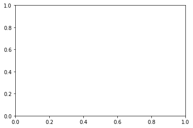

```python
import pandas as pd
df=pd.read_csv("gapminder.tsv", sep="\t")
```


```python
df2=df[['country']]
```


```python
df3=df[['country','continent']]
```


```python
df.groupby(['year','continent'])[['lifeExp','gdpPercap']].mean()
#
```


<div>
<style scoped>
    .dataframe tbody tr th:only-of-type {
        vertical-align: middle;
    }

    .dataframe tbody tr th {
        vertical-align: top;
    }

    .dataframe thead th {
        text-align: right;
    }
</style>
<table border="1" class="dataframe">
  <thead>
    <tr style="text-align: right;">
      <th></th>
      <th></th>
      <th>lifeExp</th>
      <th>gdpPercap</th>
    </tr>
    <tr>
      <th>year</th>
      <th>continent</th>
      <th></th>
      <th></th>
    </tr>
  </thead>
  <tbody>
    <tr>
      <th rowspan="5" valign="top">1952</th>
      <th>Africa</th>
      <td>39.135500</td>
      <td>1252.572466</td>
    </tr>
    <tr>
      <th>Americas</th>
      <td>53.279840</td>
      <td>4079.062552</td>
    </tr>
    <tr>
      <th>Asia</th>
      <td>46.314394</td>
      <td>5195.484004</td>
    </tr>
    <tr>
      <th>Europe</th>
      <td>64.408500</td>
      <td>5661.057435</td>
    </tr>
    <tr>
      <th>Oceania</th>
      <td>69.255000</td>
      <td>10298.085650</td>
    </tr>
    <tr>
      <th rowspan="5" valign="top">1957</th>
      <th>Africa</th>
      <td>41.266346</td>
      <td>1385.236062</td>
    </tr>
    <tr>
      <th>Americas</th>
      <td>55.960280</td>
      <td>4616.043733</td>
    </tr>
    <tr>
      <th>Asia</th>
      <td>49.318544</td>
      <td>5787.732940</td>
    </tr>
    <tr>
      <th>Europe</th>
      <td>66.703067</td>
      <td>6963.012816</td>
    </tr>
    <tr>
      <th>Oceania</th>
      <td>70.295000</td>
      <td>11598.522455</td>
    </tr>
    <tr>
      <th rowspan="5" valign="top">1962</th>
      <th>Africa</th>
      <td>43.319442</td>
      <td>1598.078825</td>
    </tr>
    <tr>
      <th>Americas</th>
      <td>58.398760</td>
      <td>4901.541870</td>
    </tr>
    <tr>
      <th>Asia</th>
      <td>51.563223</td>
      <td>5729.369625</td>
    </tr>
    <tr>
      <th>Europe</th>
      <td>68.539233</td>
      <td>8365.486814</td>
    </tr>
    <tr>
      <th>Oceania</th>
      <td>71.085000</td>
      <td>12696.452430</td>
    </tr>
    <tr>
      <th rowspan="5" valign="top">1967</th>
      <th>Africa</th>
      <td>45.334538</td>
      <td>2050.363801</td>
    </tr>
    <tr>
      <th>Americas</th>
      <td>60.410920</td>
      <td>5668.253496</td>
    </tr>
    <tr>
      <th>Asia</th>
      <td>54.663640</td>
      <td>5971.173374</td>
    </tr>
    <tr>
      <th>Europe</th>
      <td>69.737600</td>
      <td>10143.823757</td>
    </tr>
    <tr>
      <th>Oceania</th>
      <td>71.310000</td>
      <td>14495.021790</td>
    </tr>
    <tr>
      <th rowspan="5" valign="top">1972</th>
      <th>Africa</th>
      <td>47.450942</td>
      <td>2339.615674</td>
    </tr>
    <tr>
      <th>Americas</th>
      <td>62.394920</td>
      <td>6491.334139</td>
    </tr>
    <tr>
      <th>Asia</th>
      <td>57.319269</td>
      <td>8187.468699</td>
    </tr>
    <tr>
      <th>Europe</th>
      <td>70.775033</td>
      <td>12479.575246</td>
    </tr>
    <tr>
      <th>Oceania</th>
      <td>71.910000</td>
      <td>16417.333380</td>
    </tr>
    <tr>
      <th rowspan="5" valign="top">1977</th>
      <th>Africa</th>
      <td>49.580423</td>
      <td>2585.938508</td>
    </tr>
    <tr>
      <th>Americas</th>
      <td>64.391560</td>
      <td>7352.007126</td>
    </tr>
    <tr>
      <th>Asia</th>
      <td>59.610556</td>
      <td>7791.314020</td>
    </tr>
    <tr>
      <th>Europe</th>
      <td>71.937767</td>
      <td>14283.979110</td>
    </tr>
    <tr>
      <th>Oceania</th>
      <td>72.855000</td>
      <td>17283.957605</td>
    </tr>
    <tr>
      <th rowspan="5" valign="top">1982</th>
      <th>Africa</th>
      <td>51.592865</td>
      <td>2481.592960</td>
    </tr>
    <tr>
      <th>Americas</th>
      <td>66.228840</td>
      <td>7506.737088</td>
    </tr>
    <tr>
      <th>Asia</th>
      <td>62.617939</td>
      <td>7434.135157</td>
    </tr>
    <tr>
      <th>Europe</th>
      <td>72.806400</td>
      <td>15617.896551</td>
    </tr>
    <tr>
      <th>Oceania</th>
      <td>74.290000</td>
      <td>18554.709840</td>
    </tr>
    <tr>
      <th rowspan="5" valign="top">1987</th>
      <th>Africa</th>
      <td>53.344788</td>
      <td>2282.668991</td>
    </tr>
    <tr>
      <th>Americas</th>
      <td>68.090720</td>
      <td>7793.400261</td>
    </tr>
    <tr>
      <th>Asia</th>
      <td>64.851182</td>
      <td>7608.226508</td>
    </tr>
    <tr>
      <th>Europe</th>
      <td>73.642167</td>
      <td>17214.310727</td>
    </tr>
    <tr>
      <th>Oceania</th>
      <td>75.320000</td>
      <td>20448.040160</td>
    </tr>
    <tr>
      <th rowspan="5" valign="top">1992</th>
      <th>Africa</th>
      <td>53.629577</td>
      <td>2281.810333</td>
    </tr>
    <tr>
      <th>Americas</th>
      <td>69.568360</td>
      <td>8044.934406</td>
    </tr>
    <tr>
      <th>Asia</th>
      <td>66.537212</td>
      <td>8639.690248</td>
    </tr>
    <tr>
      <th>Europe</th>
      <td>74.440100</td>
      <td>17061.568084</td>
    </tr>
    <tr>
      <th>Oceania</th>
      <td>76.945000</td>
      <td>20894.045885</td>
    </tr>
    <tr>
      <th rowspan="5" valign="top">1997</th>
      <th>Africa</th>
      <td>53.598269</td>
      <td>2378.759555</td>
    </tr>
    <tr>
      <th>Americas</th>
      <td>71.150480</td>
      <td>8889.300863</td>
    </tr>
    <tr>
      <th>Asia</th>
      <td>68.020515</td>
      <td>9834.093295</td>
    </tr>
    <tr>
      <th>Europe</th>
      <td>75.505167</td>
      <td>19076.781802</td>
    </tr>
    <tr>
      <th>Oceania</th>
      <td>78.190000</td>
      <td>24024.175170</td>
    </tr>
    <tr>
      <th rowspan="5" valign="top">2002</th>
      <th>Africa</th>
      <td>53.325231</td>
      <td>2599.385159</td>
    </tr>
    <tr>
      <th>Americas</th>
      <td>72.422040</td>
      <td>9287.677107</td>
    </tr>
    <tr>
      <th>Asia</th>
      <td>69.233879</td>
      <td>10174.090397</td>
    </tr>
    <tr>
      <th>Europe</th>
      <td>76.700600</td>
      <td>21711.732422</td>
    </tr>
    <tr>
      <th>Oceania</th>
      <td>79.740000</td>
      <td>26938.778040</td>
    </tr>
    <tr>
      <th rowspan="5" valign="top">2007</th>
      <th>Africa</th>
      <td>54.806038</td>
      <td>3089.032605</td>
    </tr>
    <tr>
      <th>Americas</th>
      <td>73.608120</td>
      <td>11003.031625</td>
    </tr>
    <tr>
      <th>Asia</th>
      <td>70.728485</td>
      <td>12473.026870</td>
    </tr>
    <tr>
      <th>Europe</th>
      <td>77.648600</td>
      <td>25054.481636</td>
    </tr>
    <tr>
      <th>Oceania</th>
      <td>80.719500</td>
      <td>29810.188275</td>
    </tr>
  </tbody>
</table>
</div>


```python
df.groupby(['continent'])['country'].nunique()
# 대륙 그룹 에서 국가출력 
# nunique(): 중복제외 국가 개수 출력
# 그냥 unizue는 국가명 출력
```


    continent
    Africa      52
    Americas    25
    Asia        33
    Europe      30
    Oceania      2
    Name: country, dtype: int64


 # 시각화


```python
import matplotlib.pyplot as plt
```


```python
df.groupby("year")['lifeExp'].mean().plot()
```


    <AxesSubplot:xlabel='year'>


    

    


```python
pd.Series(['kim','park'])
pd.Series(['kim','park'], index=['n1','n2'])
```


    n1     kim
    n2    park
    dtype: object


```python
scientists = pd.DataFrame(
    data={'Occupation': ['Chemist', 'Statistician'], 
          'Born': ['1920-07-25', '1876-06-13'], 
          'Died': ['1958-04-16', '1937-10-16'],
          'Age': [37, 61]},
    index=['Rosaline Franklin', 'William Gosset'],
    columns=['Occupation', 'Born', 'Died', 'Age'])

```


```python
scientists.keys()
scientists.values
scientists.index
```


    Index(['Rosaline Franklin', 'William Gosset'], dtype='object')


```python
scientists.keys()[0]

```


    'Occupation'


```python
sci=pd.read_csv("scientists.csv")
sci
```


<div>
<style scoped>
    .dataframe tbody tr th:only-of-type {
        vertical-align: middle;
    }

    .dataframe tbody tr th {
        vertical-align: top;
    }

    .dataframe thead th {
        text-align: right;
    }
</style>
<table border="1" class="dataframe">
  <thead>
    <tr style="text-align: right;">
      <th></th>
      <th>Name</th>
      <th>Born</th>
      <th>Died</th>
      <th>Age</th>
      <th>Occupation</th>
    </tr>
  </thead>
  <tbody>
    <tr>
      <th>0</th>
      <td>Rosaline Franklin</td>
      <td>1920-07-25</td>
      <td>1958-04-16</td>
      <td>37</td>
      <td>Chemist</td>
    </tr>
    <tr>
      <th>1</th>
      <td>William Gosset</td>
      <td>1876-06-13</td>
      <td>1937-10-16</td>
      <td>61</td>
      <td>Statistician</td>
    </tr>
    <tr>
      <th>2</th>
      <td>Florence Nightingale</td>
      <td>1820-05-12</td>
      <td>1910-08-13</td>
      <td>90</td>
      <td>Nurse</td>
    </tr>
    <tr>
      <th>3</th>
      <td>Marie Curie</td>
      <td>1867-11-07</td>
      <td>1934-07-04</td>
      <td>66</td>
      <td>Chemist</td>
    </tr>
    <tr>
      <th>4</th>
      <td>Rachel Carson</td>
      <td>1907-05-27</td>
      <td>1964-04-14</td>
      <td>56</td>
      <td>Biologist</td>
    </tr>
    <tr>
      <th>5</th>
      <td>John Snow</td>
      <td>1813-03-15</td>
      <td>1858-06-16</td>
      <td>45</td>
      <td>Physician</td>
    </tr>
    <tr>
      <th>6</th>
      <td>Alan Turing</td>
      <td>1912-06-23</td>
      <td>1954-06-07</td>
      <td>41</td>
      <td>Computer Scientist</td>
    </tr>
    <tr>
      <th>7</th>
      <td>Johann Gauss</td>
      <td>1777-04-30</td>
      <td>1855-02-23</td>
      <td>77</td>
      <td>Mathematician</td>
    </tr>
  </tbody>
</table>
</div>


```python
v=[True,True,True,True,True,True,False,True]
sci.loc[:'Age']
ages=sci['Age']

sci['Age'][v]
```


    0    37
    1    61
    2    90
    3    66
    4    56
    5    45
    7    77
    Name: Age, dtype: int64


```python
age+ages # 벡터간 연산

ages+10#벡터와 스칼라간 연산
```


    ---------------------------------------------------------------------------

    NameError                                 Traceback (most recent call last)

    <ipython-input-41-0328e0fcfd79> in <module>
    ----> 1 age+ages # 벡터간 연산
          2 
          3 ages+10
    

    NameError: name 'age' is not defined


```python
pd.Series([10,20])
ages+pd.Series([10,20])
```


    0    47.0
    1    81.0
    2     NaN
    3     NaN
    4     NaN
    5     NaN
    6     NaN
    7     NaN
    dtype: float64


```python
ages.sort_index() #인덱스 기준 오름차순

ages.sort_index(ascending=False) #내림
```


    7    77
    6    41
    5    45
    4    56
    3    66
    2    90
    1    61
    0    37
    Name: Age, dtype: int64


```python
sci['Born']
```


    0    1920-07-25
    1    1876-06-13
    2    1820-05-12
    3    1867-11-07
    4    1907-05-27
    5    1813-03-15
    6    1912-06-23
    7    1777-04-30
    Name: Born, dtype: object


```python
sci['Born']-1 #문자라 당연히 에러
```


    ---------------------------------------------------------------------------

    TypeError                                 Traceback (most recent call last)

    ~\anaconda3\lib\site-packages\pandas\core\ops\array_ops.py in na_arithmetic_op(left, right, op, is_cmp)
        142     try:
    --> 143         result = expressions.evaluate(op, left, right)
        144     except TypeError:
    

    ~\anaconda3\lib\site-packages\pandas\core\computation\expressions.py in evaluate(op, a, b, use_numexpr)
        232         if use_numexpr:
    --> 233             return _evaluate(op, op_str, a, b)  # type: ignore
        234     return _evaluate_standard(op, op_str, a, b)
    

    ~\anaconda3\lib\site-packages\pandas\core\computation\expressions.py in _evaluate_numexpr(op, op_str, a, b)
        118     if result is None:
    --> 119         result = _evaluate_standard(op, op_str, a, b)
        120 
    

    ~\anaconda3\lib\site-packages\pandas\core\computation\expressions.py in _evaluate_standard(op, op_str, a, b)
         67     with np.errstate(all="ignore"):
    ---> 68         return op(a, b)
         69 
    

    TypeError: unsupported operand type(s) for -: 'str' and 'int'

    
    During handling of the above exception, another exception occurred:
    

    TypeError                                 Traceback (most recent call last)

    <ipython-input-48-6f4ca3f6a88b> in <module>
    ----> 1 sci['Born']-1 #문자라 당연히 에러
    

    ~\anaconda3\lib\site-packages\pandas\core\ops\common.py in new_method(self, other)
         63         other = item_from_zerodim(other)
         64 
    ---> 65         return method(self, other)
         66 
         67     return new_method
    

    ~\anaconda3\lib\site-packages\pandas\core\ops\__init__.py in wrapper(left, right)
        341         lvalues = extract_array(left, extract_numpy=True)
        342         rvalues = extract_array(right, extract_numpy=True)
    --> 343         result = arithmetic_op(lvalues, rvalues, op)
        344 
        345         return left._construct_result(result, name=res_name)
    

    ~\anaconda3\lib\site-packages\pandas\core\ops\array_ops.py in arithmetic_op(left, right, op)
        188     else:
        189         with np.errstate(all="ignore"):
    --> 190             res_values = na_arithmetic_op(lvalues, rvalues, op)
        191 
        192     return res_values
    

    ~\anaconda3\lib\site-packages\pandas\core\ops\array_ops.py in na_arithmetic_op(left, right, op, is_cmp)
        148             #  will handle complex numbers incorrectly, see GH#32047
        149             raise
    --> 150         result = masked_arith_op(left, right, op)
        151 
        152     if is_cmp and (is_scalar(result) or result is NotImplemented):
    

    ~\anaconda3\lib\site-packages\pandas\core\ops\array_ops.py in masked_arith_op(x, y, op)
        110         if mask.any():
        111             with np.errstate(all="ignore"):
    --> 112                 result[mask] = op(xrav[mask], y)
        113 
        114     result, _ = maybe_upcast_putmask(result, ~mask, np.nan)
    

    TypeError: unsupported operand type(s) for -: 'str' and 'int'


```python
born=pd.to_datetime(sci['Born'],format="%Y-%m-%d")
born
```


    0   1920-07-25
    1   1876-06-13
    2   1820-05-12
    3   1867-11-07
    4   1907-05-27
    5   1813-03-15
    6   1912-06-23
    7   1777-04-30
    Name: Born, dtype: datetime64[ns]


```python
died=pd.to_datetime(sci['Died'],format="%Y-%m-%d")

died
```


    0   1958-04-16
    1   1937-10-16
    2   1910-08-13
    3   1934-07-04
    4   1964-04-14
    5   1858-06-16
    6   1954-06-07
    7   1855-02-23
    Name: Died, dtype: datetime64[ns]


```python
died-born

ageDays=died-born
```


```python
ageDays
```


    0   13779 days
    1   22404 days
    2   32964 days
    3   24345 days
    4   20777 days
    5   16529 days
    6   15324 days
    7   28422 days
    dtype: timedelta64[ns]


```python
sci['ageDays']=ageDays
```


```python
sci
```


<div>
<style scoped>
    .dataframe tbody tr th:only-of-type {
        vertical-align: middle;
    }

    .dataframe tbody tr th {
        vertical-align: top;
    }

    .dataframe thead th {
        text-align: right;
    }
</style>
<table border="1" class="dataframe">
  <thead>
    <tr style="text-align: right;">
      <th></th>
      <th>Name</th>
      <th>Born</th>
      <th>Died</th>
      <th>Age</th>
      <th>Occupation</th>
      <th>ageDays</th>
    </tr>
  </thead>
  <tbody>
    <tr>
      <th>0</th>
      <td>Rosaline Franklin</td>
      <td>1920-07-25</td>
      <td>1958-04-16</td>
      <td>37</td>
      <td>Chemist</td>
      <td>13779 days</td>
    </tr>
    <tr>
      <th>1</th>
      <td>William Gosset</td>
      <td>1876-06-13</td>
      <td>1937-10-16</td>
      <td>61</td>
      <td>Statistician</td>
      <td>22404 days</td>
    </tr>
    <tr>
      <th>2</th>
      <td>Florence Nightingale</td>
      <td>1820-05-12</td>
      <td>1910-08-13</td>
      <td>90</td>
      <td>Nurse</td>
      <td>32964 days</td>
    </tr>
    <tr>
      <th>3</th>
      <td>Marie Curie</td>
      <td>1867-11-07</td>
      <td>1934-07-04</td>
      <td>66</td>
      <td>Chemist</td>
      <td>24345 days</td>
    </tr>
    <tr>
      <th>4</th>
      <td>Rachel Carson</td>
      <td>1907-05-27</td>
      <td>1964-04-14</td>
      <td>56</td>
      <td>Biologist</td>
      <td>20777 days</td>
    </tr>
    <tr>
      <th>5</th>
      <td>John Snow</td>
      <td>1813-03-15</td>
      <td>1858-06-16</td>
      <td>45</td>
      <td>Physician</td>
      <td>16529 days</td>
    </tr>
    <tr>
      <th>6</th>
      <td>Alan Turing</td>
      <td>1912-06-23</td>
      <td>1954-06-07</td>
      <td>41</td>
      <td>Computer Scientist</td>
      <td>15324 days</td>
    </tr>
    <tr>
      <th>7</th>
      <td>Johann Gauss</td>
      <td>1777-04-30</td>
      <td>1855-02-23</td>
      <td>77</td>
      <td>Mathematician</td>
      <td>28422 days</td>
    </tr>
  </tbody>
</table>
</div>


```python
#피클 저장(객체 저장)
myname=sci['Name']
```


```python
myname
```


    0       Rosaline Franklin
    1          William Gosset
    2    Florence Nightingale
    3             Marie Curie
    4           Rachel Carson
    5               John Snow
    6             Alan Turing
    7            Johann Gauss
    Name: Name, dtype: object


```python
myname.to_pickle("nameSeries.pickle")
```


```python
sci.to_csv("scicsv.csv") #저장 
```


```python
sci.to_csv("scicsv.tsv", sep="\t") #tsv로 저장 
```


```python
df1 = pd.read_csv('concat_1.csv') 
df2 = pd.read_csv('concat_2.csv') 
df3 = pd.read_csv('concat_3.csv')

```


```python
df.concat([df1,nrs])
```


    ---------------------------------------------------------------------------

    AttributeError                            Traceback (most recent call last)

    <ipython-input-70-a34a4d3b2b35> in <module>
    ----> 1 df.concat([df1,nrd])
    

    ~\anaconda3\lib\site-packages\pandas\core\generic.py in __getattr__(self, name)
       5137             if self._info_axis._can_hold_identifiers_and_holds_name(name):
       5138                 return self[name]
    -> 5139             return object.__getattribute__(self, name)
       5140 
       5141     def __setattr__(self, name: str, value) -> None:
    

    AttributeError: 'DataFrame' object has no attribute 'concat'


```python
nrd = pd.DataFrame([['n1', 'n2', 'n3', 'n4']], columns=['A', 'B', 'C', 'D'])

```


```python
pd.concat([df1,nrd])
```


<div>
<style scoped>
    .dataframe tbody tr th:only-of-type {
        vertical-align: middle;
    }

    .dataframe tbody tr th {
        vertical-align: top;
    }

    .dataframe thead th {
        text-align: right;
    }
</style>
<table border="1" class="dataframe">
  <thead>
    <tr style="text-align: right;">
      <th></th>
      <th>A</th>
      <th>B</th>
      <th>C</th>
      <th>D</th>
    </tr>
  </thead>
  <tbody>
    <tr>
      <th>0</th>
      <td>a0</td>
      <td>b0</td>
      <td>c0</td>
      <td>d0</td>
    </tr>
    <tr>
      <th>1</th>
      <td>a1</td>
      <td>b1</td>
      <td>c1</td>
      <td>d1</td>
    </tr>
    <tr>
      <th>2</th>
      <td>a2</td>
      <td>b2</td>
      <td>c2</td>
      <td>d2</td>
    </tr>
    <tr>
      <th>3</th>
      <td>a3</td>
      <td>b3</td>
      <td>c3</td>
      <td>d3</td>
    </tr>
    <tr>
      <th>0</th>
      <td>n1</td>
      <td>n2</td>
      <td>n3</td>
      <td>n4</td>
    </tr>
  </tbody>
</table>
</div>


```python
df1.append(nrd)
```


<div>
<style scoped>
    .dataframe tbody tr th:only-of-type {
        vertical-align: middle;
    }

    .dataframe tbody tr th {
        vertical-align: top;
    }

    .dataframe thead th {
        text-align: right;
    }
</style>
<table border="1" class="dataframe">
  <thead>
    <tr style="text-align: right;">
      <th></th>
      <th>A</th>
      <th>B</th>
      <th>C</th>
      <th>D</th>
    </tr>
  </thead>
  <tbody>
    <tr>
      <th>0</th>
      <td>a0</td>
      <td>b0</td>
      <td>c0</td>
      <td>d0</td>
    </tr>
    <tr>
      <th>1</th>
      <td>a1</td>
      <td>b1</td>
      <td>c1</td>
      <td>d1</td>
    </tr>
    <tr>
      <th>2</th>
      <td>a2</td>
      <td>b2</td>
      <td>c2</td>
      <td>d2</td>
    </tr>
    <tr>
      <th>3</th>
      <td>a3</td>
      <td>b3</td>
      <td>c3</td>
      <td>d3</td>
    </tr>
    <tr>
      <th>0</th>
      <td>n1</td>
      <td>n2</td>
      <td>n3</td>
      <td>n4</td>
    </tr>
  </tbody>
</table>
</div>


```python
data_dict = {'A': 'n1', 'B': 'n2', 'C': 'n3', 'D': 'n4'}

```


```python
df1.append(data_dict, ignore_index=True)
```


<div>
<style scoped>
    .dataframe tbody tr th:only-of-type {
        vertical-align: middle;
    }

    .dataframe tbody tr th {
        vertical-align: top;
    }

    .dataframe thead th {
        text-align: right;
    }
</style>
<table border="1" class="dataframe">
  <thead>
    <tr style="text-align: right;">
      <th></th>
      <th>A</th>
      <th>B</th>
      <th>C</th>
      <th>D</th>
    </tr>
  </thead>
  <tbody>
    <tr>
      <th>0</th>
      <td>a0</td>
      <td>b0</td>
      <td>c0</td>
      <td>d0</td>
    </tr>
    <tr>
      <th>1</th>
      <td>a1</td>
      <td>b1</td>
      <td>c1</td>
      <td>d1</td>
    </tr>
    <tr>
      <th>2</th>
      <td>a2</td>
      <td>b2</td>
      <td>c2</td>
      <td>d2</td>
    </tr>
    <tr>
      <th>3</th>
      <td>a3</td>
      <td>b3</td>
      <td>c3</td>
      <td>d3</td>
    </tr>
    <tr>
      <th>4</th>
      <td>n1</td>
      <td>n2</td>
      <td>n3</td>
      <td>n4</td>
    </tr>
  </tbody>
</table>
</div>


```python
rci=pd.concat([df1,df2,df3], ignore_index=True) #default axis=0
rci
```


<div>
<style scoped>
    .dataframe tbody tr th:only-of-type {
        vertical-align: middle;
    }

    .dataframe tbody tr th {
        vertical-align: top;
    }

    .dataframe thead th {
        text-align: right;
    }
</style>
<table border="1" class="dataframe">
  <thead>
    <tr style="text-align: right;">
      <th></th>
      <th>A</th>
      <th>B</th>
      <th>C</th>
      <th>D</th>
    </tr>
  </thead>
  <tbody>
    <tr>
      <th>0</th>
      <td>a0</td>
      <td>b0</td>
      <td>c0</td>
      <td>d0</td>
    </tr>
    <tr>
      <th>1</th>
      <td>a1</td>
      <td>b1</td>
      <td>c1</td>
      <td>d1</td>
    </tr>
    <tr>
      <th>2</th>
      <td>a2</td>
      <td>b2</td>
      <td>c2</td>
      <td>d2</td>
    </tr>
    <tr>
      <th>3</th>
      <td>a3</td>
      <td>b3</td>
      <td>c3</td>
      <td>d3</td>
    </tr>
    <tr>
      <th>4</th>
      <td>a4</td>
      <td>b4</td>
      <td>c4</td>
      <td>d4</td>
    </tr>
    <tr>
      <th>5</th>
      <td>a5</td>
      <td>b5</td>
      <td>c5</td>
      <td>d5</td>
    </tr>
    <tr>
      <th>6</th>
      <td>a6</td>
      <td>b6</td>
      <td>c6</td>
      <td>d6</td>
    </tr>
    <tr>
      <th>7</th>
      <td>a7</td>
      <td>b7</td>
      <td>c7</td>
      <td>d7</td>
    </tr>
    <tr>
      <th>8</th>
      <td>a8</td>
      <td>b8</td>
      <td>c8</td>
      <td>d8</td>
    </tr>
    <tr>
      <th>9</th>
      <td>a9</td>
      <td>b9</td>
      <td>c9</td>
      <td>d9</td>
    </tr>
    <tr>
      <th>10</th>
      <td>a10</td>
      <td>b10</td>
      <td>c10</td>
      <td>d10</td>
    </tr>
    <tr>
      <th>11</th>
      <td>a11</td>
      <td>b11</td>
      <td>c11</td>
      <td>d11</td>
    </tr>
  </tbody>
</table>
</div>


```python
cc=pd.concat([df1,df2,df3], axis=1)
cc['A']
```


<div>
<style scoped>
    .dataframe tbody tr th:only-of-type {
        vertical-align: middle;
    }

    .dataframe tbody tr th {
        vertical-align: top;
    }

    .dataframe thead th {
        text-align: right;
    }
</style>
<table border="1" class="dataframe">
  <thead>
    <tr style="text-align: right;">
      <th></th>
      <th>A</th>
      <th>A</th>
      <th>A</th>
    </tr>
  </thead>
  <tbody>
    <tr>
      <th>0</th>
      <td>a0</td>
      <td>a4</td>
      <td>a8</td>
    </tr>
    <tr>
      <th>1</th>
      <td>a1</td>
      <td>a5</td>
      <td>a9</td>
    </tr>
    <tr>
      <th>2</th>
      <td>a2</td>
      <td>a6</td>
      <td>a10</td>
    </tr>
    <tr>
      <th>3</th>
      <td>a3</td>
      <td>a7</td>
      <td>a11</td>
    </tr>
  </tbody>
</table>
</div>


```python
pd.concat([df1,df2,df3], axis=1, ignore_index=True)
```


<div>
<style scoped>
    .dataframe tbody tr th:only-of-type {
        vertical-align: middle;
    }

    .dataframe tbody tr th {
        vertical-align: top;
    }

    .dataframe thead th {
        text-align: right;
    }
</style>
<table border="1" class="dataframe">
  <thead>
    <tr style="text-align: right;">
      <th></th>
      <th>0</th>
      <th>1</th>
      <th>2</th>
      <th>3</th>
      <th>4</th>
      <th>5</th>
      <th>6</th>
      <th>7</th>
      <th>8</th>
      <th>9</th>
      <th>10</th>
      <th>11</th>
    </tr>
  </thead>
  <tbody>
    <tr>
      <th>0</th>
      <td>a0</td>
      <td>b0</td>
      <td>c0</td>
      <td>d0</td>
      <td>a4</td>
      <td>b4</td>
      <td>c4</td>
      <td>d4</td>
      <td>a8</td>
      <td>b8</td>
      <td>c8</td>
      <td>d8</td>
    </tr>
    <tr>
      <th>1</th>
      <td>a1</td>
      <td>b1</td>
      <td>c1</td>
      <td>d1</td>
      <td>a5</td>
      <td>b5</td>
      <td>c5</td>
      <td>d5</td>
      <td>a9</td>
      <td>b9</td>
      <td>c9</td>
      <td>d9</td>
    </tr>
    <tr>
      <th>2</th>
      <td>a2</td>
      <td>b2</td>
      <td>c2</td>
      <td>d2</td>
      <td>a6</td>
      <td>b6</td>
      <td>c6</td>
      <td>d6</td>
      <td>a10</td>
      <td>b10</td>
      <td>c10</td>
      <td>d10</td>
    </tr>
    <tr>
      <th>3</th>
      <td>a3</td>
      <td>b3</td>
      <td>c3</td>
      <td>d3</td>
      <td>a7</td>
      <td>b7</td>
      <td>c7</td>
      <td>d7</td>
      <td>a11</td>
      <td>b11</td>
      <td>c11</td>
      <td>d11</td>
    </tr>
  </tbody>
</table>
</div>


```python
df=pd.DataFrame({'lab:['A','B','C'],'val':[10,30,20]})
                 
```


      File "<ipython-input-83-bf60b1446a12>", line 1
        df=pd.DataFrame({'lab:['A','B','C'],'val':[10,30,20]})
                                ^
    SyntaxError: invalid syntax
    


```python
df1.columns = ['A', 'B', 'C', 'D'] 
df2.columns = ['E', 'F', 'G', 'H'] 
df3.columns = ['A', 'C', 'F', 'H']

```


```python
df3
```


<div>
<style scoped>
    .dataframe tbody tr th:only-of-type {
        vertical-align: middle;
    }

    .dataframe tbody tr th {
        vertical-align: top;
    }

    .dataframe thead th {
        text-align: right;
    }
</style>
<table border="1" class="dataframe">
  <thead>
    <tr style="text-align: right;">
      <th></th>
      <th>A</th>
      <th>C</th>
      <th>F</th>
      <th>H</th>
    </tr>
  </thead>
  <tbody>
    <tr>
      <th>0</th>
      <td>a8</td>
      <td>b8</td>
      <td>c8</td>
      <td>d8</td>
    </tr>
    <tr>
      <th>1</th>
      <td>a9</td>
      <td>b9</td>
      <td>c9</td>
      <td>d9</td>
    </tr>
    <tr>
      <th>2</th>
      <td>a10</td>
      <td>b10</td>
      <td>c10</td>
      <td>d10</td>
    </tr>
    <tr>
      <th>3</th>
      <td>a11</td>
      <td>b11</td>
      <td>c11</td>
      <td>d11</td>
    </tr>
  </tbody>
</table>
</div>


```python
pd.concat([df1,df2,df3]) 
#결합과정에서 무수한 NaN
```


<div>
<style scoped>
    .dataframe tbody tr th:only-of-type {
        vertical-align: middle;
    }

    .dataframe tbody tr th {
        vertical-align: top;
    }

    .dataframe thead th {
        text-align: right;
    }
</style>
<table border="1" class="dataframe">
  <thead>
    <tr style="text-align: right;">
      <th></th>
      <th>A</th>
      <th>B</th>
      <th>C</th>
      <th>D</th>
      <th>E</th>
      <th>F</th>
      <th>G</th>
      <th>H</th>
    </tr>
  </thead>
  <tbody>
    <tr>
      <th>0</th>
      <td>a0</td>
      <td>b0</td>
      <td>c0</td>
      <td>d0</td>
      <td>NaN</td>
      <td>NaN</td>
      <td>NaN</td>
      <td>NaN</td>
    </tr>
    <tr>
      <th>1</th>
      <td>a1</td>
      <td>b1</td>
      <td>c1</td>
      <td>d1</td>
      <td>NaN</td>
      <td>NaN</td>
      <td>NaN</td>
      <td>NaN</td>
    </tr>
    <tr>
      <th>2</th>
      <td>a2</td>
      <td>b2</td>
      <td>c2</td>
      <td>d2</td>
      <td>NaN</td>
      <td>NaN</td>
      <td>NaN</td>
      <td>NaN</td>
    </tr>
    <tr>
      <th>3</th>
      <td>a3</td>
      <td>b3</td>
      <td>c3</td>
      <td>d3</td>
      <td>NaN</td>
      <td>NaN</td>
      <td>NaN</td>
      <td>NaN</td>
    </tr>
    <tr>
      <th>0</th>
      <td>NaN</td>
      <td>NaN</td>
      <td>NaN</td>
      <td>NaN</td>
      <td>a4</td>
      <td>b4</td>
      <td>c4</td>
      <td>d4</td>
    </tr>
    <tr>
      <th>1</th>
      <td>NaN</td>
      <td>NaN</td>
      <td>NaN</td>
      <td>NaN</td>
      <td>a5</td>
      <td>b5</td>
      <td>c5</td>
      <td>d5</td>
    </tr>
    <tr>
      <th>2</th>
      <td>NaN</td>
      <td>NaN</td>
      <td>NaN</td>
      <td>NaN</td>
      <td>a6</td>
      <td>b6</td>
      <td>c6</td>
      <td>d6</td>
    </tr>
    <tr>
      <th>3</th>
      <td>NaN</td>
      <td>NaN</td>
      <td>NaN</td>
      <td>NaN</td>
      <td>a7</td>
      <td>b7</td>
      <td>c7</td>
      <td>d7</td>
    </tr>
    <tr>
      <th>0</th>
      <td>a8</td>
      <td>NaN</td>
      <td>b8</td>
      <td>NaN</td>
      <td>NaN</td>
      <td>c8</td>
      <td>NaN</td>
      <td>d8</td>
    </tr>
    <tr>
      <th>1</th>
      <td>a9</td>
      <td>NaN</td>
      <td>b9</td>
      <td>NaN</td>
      <td>NaN</td>
      <td>c9</td>
      <td>NaN</td>
      <td>d9</td>
    </tr>
    <tr>
      <th>2</th>
      <td>a10</td>
      <td>NaN</td>
      <td>b10</td>
      <td>NaN</td>
      <td>NaN</td>
      <td>c10</td>
      <td>NaN</td>
      <td>d10</td>
    </tr>
    <tr>
      <th>3</th>
      <td>a11</td>
      <td>NaN</td>
      <td>b11</td>
      <td>NaN</td>
      <td>NaN</td>
      <td>c11</td>
      <td>NaN</td>
      <td>d11</td>
    </tr>
  </tbody>
</table>
</div>


```python
pd.concat([df1,df2,df3], join='inner') 
```


<div>
<style scoped>
    .dataframe tbody tr th:only-of-type {
        vertical-align: middle;
    }

    .dataframe tbody tr th {
        vertical-align: top;
    }

    .dataframe thead th {
        text-align: right;
    }
</style>
<table border="1" class="dataframe">
  <thead>
    <tr style="text-align: right;">
      <th></th>
    </tr>
  </thead>
  <tbody>
    <tr>
      <th>0</th>
    </tr>
    <tr>
      <th>1</th>
    </tr>
    <tr>
      <th>2</th>
    </tr>
    <tr>
      <th>3</th>
    </tr>
    <tr>
      <th>0</th>
    </tr>
    <tr>
      <th>1</th>
    </tr>
    <tr>
      <th>2</th>
    </tr>
    <tr>
      <th>3</th>
    </tr>
    <tr>
      <th>0</th>
    </tr>
    <tr>
      <th>1</th>
    </tr>
    <tr>
      <th>2</th>
    </tr>
    <tr>
      <th>3</th>
    </tr>
  </tbody>
</table>
</div>


```python
pd.concat([df1,df3], join ='outer')
```


<div>
<style scoped>
    .dataframe tbody tr th:only-of-type {
        vertical-align: middle;
    }

    .dataframe tbody tr th {
        vertical-align: top;
    }

    .dataframe thead th {
        text-align: right;
    }
</style>
<table border="1" class="dataframe">
  <thead>
    <tr style="text-align: right;">
      <th></th>
      <th>A</th>
      <th>B</th>
      <th>C</th>
      <th>D</th>
      <th>F</th>
      <th>H</th>
    </tr>
  </thead>
  <tbody>
    <tr>
      <th>0</th>
      <td>a0</td>
      <td>b0</td>
      <td>c0</td>
      <td>d0</td>
      <td>NaN</td>
      <td>NaN</td>
    </tr>
    <tr>
      <th>1</th>
      <td>a1</td>
      <td>b1</td>
      <td>c1</td>
      <td>d1</td>
      <td>NaN</td>
      <td>NaN</td>
    </tr>
    <tr>
      <th>2</th>
      <td>a2</td>
      <td>b2</td>
      <td>c2</td>
      <td>d2</td>
      <td>NaN</td>
      <td>NaN</td>
    </tr>
    <tr>
      <th>3</th>
      <td>a3</td>
      <td>b3</td>
      <td>c3</td>
      <td>d3</td>
      <td>NaN</td>
      <td>NaN</td>
    </tr>
    <tr>
      <th>0</th>
      <td>a8</td>
      <td>NaN</td>
      <td>b8</td>
      <td>NaN</td>
      <td>c8</td>
      <td>d8</td>
    </tr>
    <tr>
      <th>1</th>
      <td>a9</td>
      <td>NaN</td>
      <td>b9</td>
      <td>NaN</td>
      <td>c9</td>
      <td>d9</td>
    </tr>
    <tr>
      <th>2</th>
      <td>a10</td>
      <td>NaN</td>
      <td>b10</td>
      <td>NaN</td>
      <td>c10</td>
      <td>d10</td>
    </tr>
    <tr>
      <th>3</th>
      <td>a11</td>
      <td>NaN</td>
      <td>b11</td>
      <td>NaN</td>
      <td>c11</td>
      <td>d11</td>
    </tr>
  </tbody>
</table>
</div>


```python
pd.concat([df1,df3], join='inner', ignore_index=True)
```


<div>
<style scoped>
    .dataframe tbody tr th:only-of-type {
        vertical-align: middle;
    }

    .dataframe tbody tr th {
        vertical-align: top;
    }

    .dataframe thead th {
        text-align: right;
    }
</style>
<table border="1" class="dataframe">
  <thead>
    <tr style="text-align: right;">
      <th></th>
      <th>A</th>
      <th>C</th>
    </tr>
  </thead>
  <tbody>
    <tr>
      <th>0</th>
      <td>a0</td>
      <td>c0</td>
    </tr>
    <tr>
      <th>1</th>
      <td>a1</td>
      <td>c1</td>
    </tr>
    <tr>
      <th>2</th>
      <td>a2</td>
      <td>c2</td>
    </tr>
    <tr>
      <th>3</th>
      <td>a3</td>
      <td>c3</td>
    </tr>
    <tr>
      <th>4</th>
      <td>a8</td>
      <td>b8</td>
    </tr>
    <tr>
      <th>5</th>
      <td>a9</td>
      <td>b9</td>
    </tr>
    <tr>
      <th>6</th>
      <td>a10</td>
      <td>b10</td>
    </tr>
    <tr>
      <th>7</th>
      <td>a11</td>
      <td>b11</td>
    </tr>
  </tbody>
</table>
</div>


```python
df1.index = [0, 1, 2, 3] 
df2.index = [4, 5, 6, 7] 
df3.index = [0, 2, 5, 7]

```


```python
df1
df2
```


<div>
<style scoped>
    .dataframe tbody tr th:only-of-type {
        vertical-align: middle;
    }

    .dataframe tbody tr th {
        vertical-align: top;
    }

    .dataframe thead th {
        text-align: right;
    }
</style>
<table border="1" class="dataframe">
  <thead>
    <tr style="text-align: right;">
      <th></th>
      <th>E</th>
      <th>F</th>
      <th>G</th>
      <th>H</th>
    </tr>
  </thead>
  <tbody>
    <tr>
      <th>4</th>
      <td>a4</td>
      <td>b4</td>
      <td>c4</td>
      <td>d4</td>
    </tr>
    <tr>
      <th>5</th>
      <td>a5</td>
      <td>b5</td>
      <td>c5</td>
      <td>d5</td>
    </tr>
    <tr>
      <th>6</th>
      <td>a6</td>
      <td>b6</td>
      <td>c6</td>
      <td>d6</td>
    </tr>
    <tr>
      <th>7</th>
      <td>a7</td>
      <td>b7</td>
      <td>c7</td>
      <td>d7</td>
    </tr>
  </tbody>
</table>
</div>


```python
pd.concat([df1,df2,df3], axis=1)
```


<div>
<style scoped>
    .dataframe tbody tr th:only-of-type {
        vertical-align: middle;
    }

    .dataframe tbody tr th {
        vertical-align: top;
    }

    .dataframe thead th {
        text-align: right;
    }
</style>
<table border="1" class="dataframe">
  <thead>
    <tr style="text-align: right;">
      <th></th>
      <th>A</th>
      <th>B</th>
      <th>C</th>
      <th>D</th>
      <th>E</th>
      <th>F</th>
      <th>G</th>
      <th>H</th>
      <th>A</th>
      <th>C</th>
      <th>F</th>
      <th>H</th>
    </tr>
  </thead>
  <tbody>
    <tr>
      <th>0</th>
      <td>a0</td>
      <td>b0</td>
      <td>c0</td>
      <td>d0</td>
      <td>NaN</td>
      <td>NaN</td>
      <td>NaN</td>
      <td>NaN</td>
      <td>a8</td>
      <td>b8</td>
      <td>c8</td>
      <td>d8</td>
    </tr>
    <tr>
      <th>1</th>
      <td>a1</td>
      <td>b1</td>
      <td>c1</td>
      <td>d1</td>
      <td>NaN</td>
      <td>NaN</td>
      <td>NaN</td>
      <td>NaN</td>
      <td>NaN</td>
      <td>NaN</td>
      <td>NaN</td>
      <td>NaN</td>
    </tr>
    <tr>
      <th>2</th>
      <td>a2</td>
      <td>b2</td>
      <td>c2</td>
      <td>d2</td>
      <td>NaN</td>
      <td>NaN</td>
      <td>NaN</td>
      <td>NaN</td>
      <td>a9</td>
      <td>b9</td>
      <td>c9</td>
      <td>d9</td>
    </tr>
    <tr>
      <th>3</th>
      <td>a3</td>
      <td>b3</td>
      <td>c3</td>
      <td>d3</td>
      <td>NaN</td>
      <td>NaN</td>
      <td>NaN</td>
      <td>NaN</td>
      <td>NaN</td>
      <td>NaN</td>
      <td>NaN</td>
      <td>NaN</td>
    </tr>
    <tr>
      <th>4</th>
      <td>NaN</td>
      <td>NaN</td>
      <td>NaN</td>
      <td>NaN</td>
      <td>a4</td>
      <td>b4</td>
      <td>c4</td>
      <td>d4</td>
      <td>NaN</td>
      <td>NaN</td>
      <td>NaN</td>
      <td>NaN</td>
    </tr>
    <tr>
      <th>5</th>
      <td>NaN</td>
      <td>NaN</td>
      <td>NaN</td>
      <td>NaN</td>
      <td>a5</td>
      <td>b5</td>
      <td>c5</td>
      <td>d5</td>
      <td>a10</td>
      <td>b10</td>
      <td>c10</td>
      <td>d10</td>
    </tr>
    <tr>
      <th>6</th>
      <td>NaN</td>
      <td>NaN</td>
      <td>NaN</td>
      <td>NaN</td>
      <td>a6</td>
      <td>b6</td>
      <td>c6</td>
      <td>d6</td>
      <td>NaN</td>
      <td>NaN</td>
      <td>NaN</td>
      <td>NaN</td>
    </tr>
    <tr>
      <th>7</th>
      <td>NaN</td>
      <td>NaN</td>
      <td>NaN</td>
      <td>NaN</td>
      <td>a7</td>
      <td>b7</td>
      <td>c7</td>
      <td>d7</td>
      <td>a11</td>
      <td>b11</td>
      <td>c11</td>
      <td>d11</td>
    </tr>
  </tbody>
</table>
</div>


```python
pd.concat([df1,df2,df3],axis=1, join='outer')
```


<div>
<style scoped>
    .dataframe tbody tr th:only-of-type {
        vertical-align: middle;
    }

    .dataframe tbody tr th {
        vertical-align: top;
    }

    .dataframe thead th {
        text-align: right;
    }
</style>
<table border="1" class="dataframe">
  <thead>
    <tr style="text-align: right;">
      <th></th>
      <th>A</th>
      <th>B</th>
      <th>C</th>
      <th>D</th>
      <th>E</th>
      <th>F</th>
      <th>G</th>
      <th>H</th>
      <th>A</th>
      <th>C</th>
      <th>F</th>
      <th>H</th>
    </tr>
  </thead>
  <tbody>
    <tr>
      <th>0</th>
      <td>a0</td>
      <td>b0</td>
      <td>c0</td>
      <td>d0</td>
      <td>NaN</td>
      <td>NaN</td>
      <td>NaN</td>
      <td>NaN</td>
      <td>a8</td>
      <td>b8</td>
      <td>c8</td>
      <td>d8</td>
    </tr>
    <tr>
      <th>1</th>
      <td>a1</td>
      <td>b1</td>
      <td>c1</td>
      <td>d1</td>
      <td>NaN</td>
      <td>NaN</td>
      <td>NaN</td>
      <td>NaN</td>
      <td>NaN</td>
      <td>NaN</td>
      <td>NaN</td>
      <td>NaN</td>
    </tr>
    <tr>
      <th>2</th>
      <td>a2</td>
      <td>b2</td>
      <td>c2</td>
      <td>d2</td>
      <td>NaN</td>
      <td>NaN</td>
      <td>NaN</td>
      <td>NaN</td>
      <td>a9</td>
      <td>b9</td>
      <td>c9</td>
      <td>d9</td>
    </tr>
    <tr>
      <th>3</th>
      <td>a3</td>
      <td>b3</td>
      <td>c3</td>
      <td>d3</td>
      <td>NaN</td>
      <td>NaN</td>
      <td>NaN</td>
      <td>NaN</td>
      <td>NaN</td>
      <td>NaN</td>
      <td>NaN</td>
      <td>NaN</td>
    </tr>
    <tr>
      <th>4</th>
      <td>NaN</td>
      <td>NaN</td>
      <td>NaN</td>
      <td>NaN</td>
      <td>a4</td>
      <td>b4</td>
      <td>c4</td>
      <td>d4</td>
      <td>NaN</td>
      <td>NaN</td>
      <td>NaN</td>
      <td>NaN</td>
    </tr>
    <tr>
      <th>5</th>
      <td>NaN</td>
      <td>NaN</td>
      <td>NaN</td>
      <td>NaN</td>
      <td>a5</td>
      <td>b5</td>
      <td>c5</td>
      <td>d5</td>
      <td>a10</td>
      <td>b10</td>
      <td>c10</td>
      <td>d10</td>
    </tr>
    <tr>
      <th>6</th>
      <td>NaN</td>
      <td>NaN</td>
      <td>NaN</td>
      <td>NaN</td>
      <td>a6</td>
      <td>b6</td>
      <td>c6</td>
      <td>d6</td>
      <td>NaN</td>
      <td>NaN</td>
      <td>NaN</td>
      <td>NaN</td>
    </tr>
    <tr>
      <th>7</th>
      <td>NaN</td>
      <td>NaN</td>
      <td>NaN</td>
      <td>NaN</td>
      <td>a7</td>
      <td>b7</td>
      <td>c7</td>
      <td>d7</td>
      <td>a11</td>
      <td>b11</td>
      <td>c11</td>
      <td>d11</td>
    </tr>
  </tbody>
</table>
</div>


```python
pd.concat([df1,df3],axis=1, join='inner')
```


<div>
<style scoped>
    .dataframe tbody tr th:only-of-type {
        vertical-align: middle;
    }

    .dataframe tbody tr th {
        vertical-align: top;
    }

    .dataframe thead th {
        text-align: right;
    }
</style>
<table border="1" class="dataframe">
  <thead>
    <tr style="text-align: right;">
      <th></th>
      <th>A</th>
      <th>B</th>
      <th>C</th>
      <th>D</th>
      <th>A</th>
      <th>C</th>
      <th>F</th>
      <th>H</th>
    </tr>
  </thead>
  <tbody>
    <tr>
      <th>0</th>
      <td>a0</td>
      <td>b0</td>
      <td>c0</td>
      <td>d0</td>
      <td>a8</td>
      <td>b8</td>
      <td>c8</td>
      <td>d8</td>
    </tr>
    <tr>
      <th>2</th>
      <td>a2</td>
      <td>b2</td>
      <td>c2</td>
      <td>d2</td>
      <td>a9</td>
      <td>b9</td>
      <td>c9</td>
      <td>d9</td>
    </tr>
  </tbody>
</table>
</div>


```python
person = pd.read_csv('survey_person.csv') 
site = pd.read_csv('survey_site.csv') 
survey = pd.read_csv('survey_survey.csv') 
visited = pd.read_csv('survey_visited.csv')
```


```python
vs=visited.loc[[0,2,6],]
vs
```


<div>
<style scoped>
    .dataframe tbody tr th:only-of-type {
        vertical-align: middle;
    }

    .dataframe tbody tr th {
        vertical-align: top;
    }

    .dataframe thead th {
        text-align: right;
    }
</style>
<table border="1" class="dataframe">
  <thead>
    <tr style="text-align: right;">
      <th></th>
      <th>ident</th>
      <th>site</th>
      <th>dated</th>
    </tr>
  </thead>
  <tbody>
    <tr>
      <th>0</th>
      <td>619</td>
      <td>DR-1</td>
      <td>1927-02-08</td>
    </tr>
    <tr>
      <th>2</th>
      <td>734</td>
      <td>DR-3</td>
      <td>1939-01-07</td>
    </tr>
    <tr>
      <th>6</th>
      <td>837</td>
      <td>MSK-4</td>
      <td>1932-01-14</td>
    </tr>
  </tbody>
</table>
</div>


```python
site
```


<div>
<style scoped>
    .dataframe tbody tr th:only-of-type {
        vertical-align: middle;
    }

    .dataframe tbody tr th {
        vertical-align: top;
    }

    .dataframe thead th {
        text-align: right;
    }
</style>
<table border="1" class="dataframe">
  <thead>
    <tr style="text-align: right;">
      <th></th>
      <th>name</th>
      <th>lat</th>
      <th>long</th>
    </tr>
  </thead>
  <tbody>
    <tr>
      <th>0</th>
      <td>DR-1</td>
      <td>-49.85</td>
      <td>-128.57</td>
    </tr>
    <tr>
      <th>1</th>
      <td>DR-3</td>
      <td>-47.15</td>
      <td>-126.72</td>
    </tr>
    <tr>
      <th>2</th>
      <td>MSK-4</td>
      <td>-48.87</td>
      <td>-123.40</td>
    </tr>
  </tbody>
</table>
</div>


```python
sv=site.merge(visited, left_on='name', right_on='site')
sv
```


<div>
<style scoped>
    .dataframe tbody tr th:only-of-type {
        vertical-align: middle;
    }

    .dataframe tbody tr th {
        vertical-align: top;
    }

    .dataframe thead th {
        text-align: right;
    }
</style>
<table border="1" class="dataframe">
  <thead>
    <tr style="text-align: right;">
      <th></th>
      <th>name</th>
      <th>lat</th>
      <th>long</th>
      <th>ident</th>
      <th>site</th>
      <th>dated</th>
    </tr>
  </thead>
  <tbody>
    <tr>
      <th>0</th>
      <td>DR-1</td>
      <td>-49.85</td>
      <td>-128.57</td>
      <td>619</td>
      <td>DR-1</td>
      <td>1927-02-08</td>
    </tr>
    <tr>
      <th>1</th>
      <td>DR-1</td>
      <td>-49.85</td>
      <td>-128.57</td>
      <td>622</td>
      <td>DR-1</td>
      <td>1927-02-10</td>
    </tr>
    <tr>
      <th>2</th>
      <td>DR-1</td>
      <td>-49.85</td>
      <td>-128.57</td>
      <td>844</td>
      <td>DR-1</td>
      <td>1932-03-22</td>
    </tr>
    <tr>
      <th>3</th>
      <td>DR-3</td>
      <td>-47.15</td>
      <td>-126.72</td>
      <td>734</td>
      <td>DR-3</td>
      <td>1939-01-07</td>
    </tr>
    <tr>
      <th>4</th>
      <td>DR-3</td>
      <td>-47.15</td>
      <td>-126.72</td>
      <td>735</td>
      <td>DR-3</td>
      <td>1930-01-12</td>
    </tr>
    <tr>
      <th>5</th>
      <td>DR-3</td>
      <td>-47.15</td>
      <td>-126.72</td>
      <td>751</td>
      <td>DR-3</td>
      <td>1930-02-26</td>
    </tr>
    <tr>
      <th>6</th>
      <td>DR-3</td>
      <td>-47.15</td>
      <td>-126.72</td>
      <td>752</td>
      <td>DR-3</td>
      <td>NaN</td>
    </tr>
    <tr>
      <th>7</th>
      <td>MSK-4</td>
      <td>-48.87</td>
      <td>-123.40</td>
      <td>837</td>
      <td>MSK-4</td>
      <td>1932-01-14</td>
    </tr>
  </tbody>
</table>
</div>


```python
person
```


<div>
<style scoped>
    .dataframe tbody tr th:only-of-type {
        vertical-align: middle;
    }

    .dataframe tbody tr th {
        vertical-align: top;
    }

    .dataframe thead th {
        text-align: right;
    }
</style>
<table border="1" class="dataframe">
  <thead>
    <tr style="text-align: right;">
      <th></th>
      <th>ident</th>
      <th>personal</th>
      <th>family</th>
    </tr>
  </thead>
  <tbody>
    <tr>
      <th>0</th>
      <td>dyer</td>
      <td>William</td>
      <td>Dyer</td>
    </tr>
    <tr>
      <th>1</th>
      <td>pb</td>
      <td>Frank</td>
      <td>Pabodie</td>
    </tr>
    <tr>
      <th>2</th>
      <td>lake</td>
      <td>Anderson</td>
      <td>Lake</td>
    </tr>
    <tr>
      <th>3</th>
      <td>roe</td>
      <td>Valentina</td>
      <td>Roerich</td>
    </tr>
    <tr>
      <th>4</th>
      <td>danforth</td>
      <td>Frank</td>
      <td>Danforth</td>
    </tr>
  </tbody>
</table>
</div>


```python
survey
```


<div>
<style scoped>
    .dataframe tbody tr th:only-of-type {
        vertical-align: middle;
    }

    .dataframe tbody tr th {
        vertical-align: top;
    }

    .dataframe thead th {
        text-align: right;
    }
</style>
<table border="1" class="dataframe">
  <thead>
    <tr style="text-align: right;">
      <th></th>
      <th>taken</th>
      <th>person</th>
      <th>quant</th>
      <th>reading</th>
    </tr>
  </thead>
  <tbody>
    <tr>
      <th>0</th>
      <td>619</td>
      <td>dyer</td>
      <td>rad</td>
      <td>9.82</td>
    </tr>
    <tr>
      <th>1</th>
      <td>619</td>
      <td>dyer</td>
      <td>sal</td>
      <td>0.13</td>
    </tr>
    <tr>
      <th>2</th>
      <td>622</td>
      <td>dyer</td>
      <td>rad</td>
      <td>7.80</td>
    </tr>
    <tr>
      <th>3</th>
      <td>622</td>
      <td>dyer</td>
      <td>sal</td>
      <td>0.09</td>
    </tr>
    <tr>
      <th>4</th>
      <td>734</td>
      <td>pb</td>
      <td>rad</td>
      <td>8.41</td>
    </tr>
    <tr>
      <th>5</th>
      <td>734</td>
      <td>lake</td>
      <td>sal</td>
      <td>0.05</td>
    </tr>
    <tr>
      <th>6</th>
      <td>734</td>
      <td>pb</td>
      <td>temp</td>
      <td>-21.50</td>
    </tr>
    <tr>
      <th>7</th>
      <td>735</td>
      <td>pb</td>
      <td>rad</td>
      <td>7.22</td>
    </tr>
    <tr>
      <th>8</th>
      <td>735</td>
      <td>NaN</td>
      <td>sal</td>
      <td>0.06</td>
    </tr>
    <tr>
      <th>9</th>
      <td>735</td>
      <td>NaN</td>
      <td>temp</td>
      <td>-26.00</td>
    </tr>
    <tr>
      <th>10</th>
      <td>751</td>
      <td>pb</td>
      <td>rad</td>
      <td>4.35</td>
    </tr>
    <tr>
      <th>11</th>
      <td>751</td>
      <td>pb</td>
      <td>temp</td>
      <td>-18.50</td>
    </tr>
    <tr>
      <th>12</th>
      <td>751</td>
      <td>lake</td>
      <td>sal</td>
      <td>0.10</td>
    </tr>
    <tr>
      <th>13</th>
      <td>752</td>
      <td>lake</td>
      <td>rad</td>
      <td>2.19</td>
    </tr>
    <tr>
      <th>14</th>
      <td>752</td>
      <td>lake</td>
      <td>sal</td>
      <td>0.09</td>
    </tr>
    <tr>
      <th>15</th>
      <td>752</td>
      <td>lake</td>
      <td>temp</td>
      <td>-16.00</td>
    </tr>
    <tr>
      <th>16</th>
      <td>752</td>
      <td>roe</td>
      <td>sal</td>
      <td>41.60</td>
    </tr>
    <tr>
      <th>17</th>
      <td>837</td>
      <td>lake</td>
      <td>rad</td>
      <td>1.46</td>
    </tr>
    <tr>
      <th>18</th>
      <td>837</td>
      <td>lake</td>
      <td>sal</td>
      <td>0.21</td>
    </tr>
    <tr>
      <th>19</th>
      <td>837</td>
      <td>roe</td>
      <td>sal</td>
      <td>22.50</td>
    </tr>
    <tr>
      <th>20</th>
      <td>844</td>
      <td>roe</td>
      <td>rad</td>
      <td>11.25</td>
    </tr>
  </tbody>
</table>
</div>


ps=erson.merge(survey, left_on=['ident'...], right_on['person'])


```python
import seaborn as sns
anscombe=sns.load_dataset("anscombe")
ds1=anscombe[anscombe['dataset']=='l']
ds1
```


<div>
<style scoped>
    .dataframe tbody tr th:only-of-type {
        vertical-align: middle;
    }

    .dataframe tbody tr th {
        vertical-align: top;
    }

    .dataframe thead th {
        text-align: right;
    }
</style>
<table border="1" class="dataframe">
  <thead>
    <tr style="text-align: right;">
      <th></th>
      <th>dataset</th>
      <th>x</th>
      <th>y</th>
    </tr>
  </thead>
  <tbody>
  </tbody>
</table>
</div>


```python
plt.plot(ds1['x'], ds1['y'])
```


    [<matplotlib.lines.Line2D at 0x1e39db9cc70>]


    

    


```python
ds2=anscombe[anscombe['dataset']=='ll']
plt.plot(ds2['x'], ds2['y'], 'o')
```


    [<matplotlib.lines.Line2D at 0x1e39dbf0e20>]


    

    


```python
ds3=anscombe[anscombe['dataset']=='lll']
```


```python
ds4=anscombe[anscombe['dataset']=='lV']
```


```python
fig=plt.figure() #도화지 준비

```


    <Figure size 432x288 with 0 Axes>


```python
axes1=fig.add_subplot(2,2,1) #좌측 상단
axes2=fig.add_subplot(2,2,2) #우측 상단
axes3=fig.add_subplot(2,2,3) #좌측 하단
axes4=fig.add_subplot(2,2,4) #우측 하단

#axis:축, axes= 전체 축

```

    <ipython-input-141-aa3e99c4d52a>:1: MatplotlibDeprecationWarning: Adding an axes using the same arguments as a previous axes currently reuses the earlier instance.  In a future version, a new instance will always be created and returned.  Meanwhile, this warning can be suppressed, and the future behavior ensured, by passing a unique label to each axes instance.
      axes1=fig.add_subplot(2,2,1) #좌측 상단
    


```python
axes1.plot(ds1['x'], ds1['y'])
axes1.plot(ds1['x'], ds1['y'])
axes2.plot(ds2['x'], ds2['y'])
axes2.plot(ds2['x'], ds2['y'])

```


    [<matplotlib.lines.Line2D at 0x1e39dd195b0>]


```python
tips=sns.load_dataset("tips")
```


```python
tips.head()
```


<div>
<style scoped>
    .dataframe tbody tr th:only-of-type {
        vertical-align: middle;
    }

    .dataframe tbody tr th {
        vertical-align: top;
    }

    .dataframe thead th {
        text-align: right;
    }
</style>
<table border="1" class="dataframe">
  <thead>
    <tr style="text-align: right;">
      <th></th>
      <th>total_bill</th>
      <th>tip</th>
      <th>sex</th>
      <th>smoker</th>
      <th>day</th>
      <th>time</th>
      <th>size</th>
    </tr>
  </thead>
  <tbody>
    <tr>
      <th>0</th>
      <td>16.99</td>
      <td>1.01</td>
      <td>Female</td>
      <td>No</td>
      <td>Sun</td>
      <td>Dinner</td>
      <td>2</td>
    </tr>
    <tr>
      <th>1</th>
      <td>10.34</td>
      <td>1.66</td>
      <td>Male</td>
      <td>No</td>
      <td>Sun</td>
      <td>Dinner</td>
      <td>3</td>
    </tr>
    <tr>
      <th>2</th>
      <td>21.01</td>
      <td>3.50</td>
      <td>Male</td>
      <td>No</td>
      <td>Sun</td>
      <td>Dinner</td>
      <td>3</td>
    </tr>
    <tr>
      <th>3</th>
      <td>23.68</td>
      <td>3.31</td>
      <td>Male</td>
      <td>No</td>
      <td>Sun</td>
      <td>Dinner</td>
      <td>2</td>
    </tr>
    <tr>
      <th>4</th>
      <td>24.59</td>
      <td>3.61</td>
      <td>Female</td>
      <td>No</td>
      <td>Sun</td>
      <td>Dinner</td>
      <td>4</td>
    </tr>
  </tbody>
</table>
</div>


plotly, folium : interactive 시각화 도구


```python
fig=plt.figure()
axes1=fig.add_subplot(1,1,1) # fig 도화지 1자을 나누지 않고 전체 화면에 그래프 출력
#axis축 (딘수), axes축 (복수)
```


    <AxesSubplot:>


    

    


```python
axes1.hist(tips['total_bill'],bins=10) #10개 구간
fig
```


    

    


```python
sp=plt.figure()
sp
```


    <Figure size 432x288 with 0 Axes>


    <Figure size 432x288 with 0 Axes>


```python
axes1=sp.add_subplot(1,1,1)
axes1.scatter(tips['total_bill'], tips['tip'])#산점도 그래프
axes1.set_title('total bill vs tip')
axes1.set_xlabel('total bill')
axes1.set_ylabel('tip')

sp

```

    <ipython-input-155-6aadc844e232>:1: MatplotlibDeprecationWarning: Adding an axes using the same arguments as a previous axes currently reuses the earlier instance.  In a future version, a new instance will always be created and returned.  Meanwhile, this warning can be suppressed, and the future behavior ensured, by passing a unique label to each axes instance.
      axes1=sp.add_subplot(1,1,1)
    


    

    


```python
boxp=plt.figure()

axes1=boxp.add_subplot(1,1,1)
axes1.boxplot([tips[tips['sex']=='Female']['tip'],
              tips[tips['sex']=='Male']['tip']])

axes1.scatter(tips['total_bill'], tips['tip'])#산점도 그래프
axes1.set_title('total bill vs tip')
axes1.set_xlabel('total bill')
axes1.set_ylabel('tip')

sp
```


    

    


    

    


```python
def cs(a):
    if a=="Female":
        return 0
    else:
        return 1
    
```


```python
#cs함수에 sex열 전달

tips['sc']=tips['sex'].apply(cs)
```


```python
tips['sc']
```


    0      0
    1      1
    2      1
    3      1
    4      0
          ..
    239    1
    240    0
    241    1
    242    1
    243    0
    Name: sc, Length: 244, dtype: category
    Categories (2, int64): [1, 0]


```python
boxp=plt.figure()

axes1=sp.add_subplot(1,1,1)

axes1.scatter(
    x=tips['total_bill'],
    y=tips['tip'],
    s=tips['size']*10,
    c=tips['sc'],
    alpha=0.9
)

axes1.set_title('scatter')
axes1.set_xlabel('total_bill')
axes1.set_ylabel('tip')
sp
```

    <ipython-input-181-cad5450e2b44>:3: MatplotlibDeprecationWarning: Adding an axes using the same arguments as a previous axes currently reuses the earlier instance.  In a future version, a new instance will always be created and returned.  Meanwhile, this warning can be suppressed, and the future behavior ensured, by passing a unique label to each axes instance.
      axes1=sp.add_subplot(1,1,1)
    


    

    


    <Figure size 432x288 with 0 Axes>


```python

```
