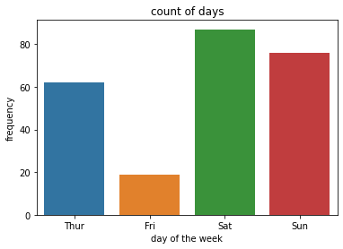
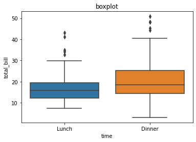
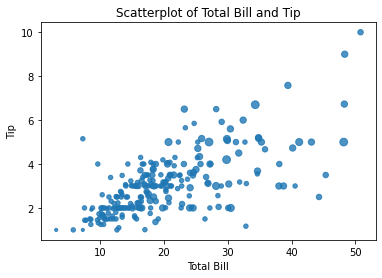
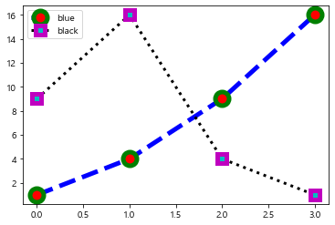
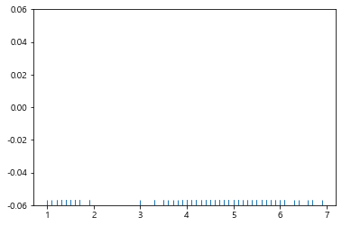

```python
import pandas as pd
import numpy as np
import matplotlib.pyplot as plt

import seaborn as sns
tips=sns.load_dataset("tips")
```


```python
ax=plt.subplot()
ax.histplot
```


    ---------------------------------------------------------------------------
    
    AttributeError                            Traceback (most recent call last)
    
    <ipython-input-4-65e62845f92f> in <module>
          1 ax=plt.subplot()
    ----> 2 ax.histplot


    AttributeError: 'AxesSubplot' object has no attribute 'histplot'


    


kde=True 확률밀도그래프
hist= True 히스토그램


```python
ax=plt.subplot()
ax=sns.countplot(tips['day'])

ax.set_title("count of days")
ax.set_xlabel("day of the week")
ax.set_ylabel("frequency")
```

    C:\Users\akrnr\anaconda3\lib\site-packages\seaborn\_decorators.py:36: FutureWarning: Pass the following variable as a keyword arg: x. From version 0.12, the only valid positional argument will be `data`, and passing other arguments without an explicit keyword will result in an error or misinterpretation.
      warnings.warn(


    Text(0, 0.5, 'frequency')


​    

​    


```python
#ax=plt.subplot() joinplot함수 내에서 자체적으로 plot객체 생성
ax=sns.jointplot(x='total_bill',y='tip', data=tips)

```


​    

​    


```python
ax=sns.jointplot(x='total_bill',y='tip', data=tips, kind='hex')
#도형종류 변경
```


​    

​    


```python
#밀집도 그래프
ax=plt.subplots()
sns.kdeplot(data=tips['total_bill'], data2=tips['tip'])
```

    C:\Users\akrnr\anaconda3\lib\site-packages\seaborn\distributions.py:1641: FutureWarning: Use `x` and `y` rather than `data` `and `data2`
      warnings.warn(msg, FutureWarning)


    <AxesSubplot:xlabel='total_bill', ylabel='tip'>


​    

​    


```python
#밀집도 그래프
ax=plt.subplots()
sns.kdeplot(data=tips['total_bill'], data2=tips['tip'], shade=True)
```

    C:\Users\akrnr\anaconda3\lib\site-packages\seaborn\distributions.py:1641: FutureWarning: Use `x` and `y` rather than `data` `and `data2`
      warnings.warn(msg, FutureWarning)


    <AxesSubplot:xlabel='total_bill', ylabel='tip'>


​    

​    


```python
ax=plt.subplot()
ax=sns.boxplot(x='time', y='total_bill', data=tips)

ax.set_title("boxplot")
ax.set_xlabel("time")
ax.set_ylabel("total_bill")
```


    Text(0, 0.5, 'total_bill')


​    

​    


```python
ax=plt.subplot()
ax=sns.violinplot(x='time', y='total_bill', data=tips)

ax.set_title("violinplot")
ax.set_xlabel("time")
ax.set_ylabel("total_bill")
```


    Text(0, 0.5, 'total_bill')


​    

​    


```python
sns.pairplot(tips)
```


    <seaborn.axisgrid.PairGrid at 0x1de6cf50eb0>


​    

​    


```python
pairGrid=sns.PairGrid(tips)
pairGrid=pairGrid.map_upper(sns.regplot)

pairGrid=pairGrid.map_lower(sns.kdeplot)

pairGrid=pairGrid.map_diag(sns.distplot, rug=True)

```


​    

​    


```python
sns.lmplot(x='total_bill', y='tip', data=tips)
#sns.lmplot(x='total_bill', y='tip', data=tips, fit_reg=False) #선 빼버리기 
```


    <seaborn.axisgrid.FacetGrid at 0x1de6faf5b80>


​    

​    


```python
sns.lmplot(x='total_bill', y='tip', data=tips, fit_reg=False, hue='time')
```


    <seaborn.axisgrid.FacetGrid at 0x1de6fafb8b0>


​    

​    


```python
sns.pairplot(tips, hue='sex')
```


    <seaborn.axisgrid.PairGrid at 0x1de6fcdde20>


​    

​    


```python
#sns.lmplot(x='total_bill', y='tip', data=tips, fit_reg=False, hue='sex',
 #          scatter_kws={'s':5})
#tips.size에 따라 점의 크기도 바꿔서 

ax = plt.subplots() 
ax = sns.regplot(x='total_bill', y='tip', data=tips, fit_reg=False, 
                 scatter_kws={'s':tips['size']*10}) 
ax.set_title('Scatterplot of Total Bill and Tip') 
ax.set_xlabel('Total Bill') 
ax.set_ylabel('Tip')

```


    Text(0, 0.5, 'Tip')


​    

​    


```python
import matplotlib
from matplotlib import font_manager, rc
import platform
if platform.system()=="Windows":
    font_name=font_manager.FontProperties(fname="c:/Windows/Fonts/malgun.ttf").get_name()
    rc('font', family=font_name)
matplotlib.rcParams['axes.unicode_minus']=False

import warnings
warnings.filterwarnings("ignore")

plt.title('한글 제목')
plt.plot([10, 20, 30, 40], [1, 4, 9, 16])
plt.xlabel("엑스축 라벨")
plt.ylabel("와이축 라벨")
plt.show()

```


​    

​    


```python

plt.title("'rs--' 스타일의 plot ")
plt.plot([10, 20, 30, 40], [1, 4, 9, 16], 'rs--')
plt.show()

```


​    

​    


```python
plt.plot([10, 20, 30, 40], [1, 4, 9, 16], c="b",
         lw=5, ls="--", marker="o", ms=15, mec="g", mew=5, mfc="b")
plt.title("스타일 적용 예")
plt.xlim(0,50)
plt.ylim(-10,30)
plt.show()

```


​    

​    


```python
import numpy as np
```


```python
x=np.linspace(-np.pi, np.pi, 256)
x=np.cos(x) #코싸인
y=np.linspace(-1, 1, 256)
```


```python
plt.plot(x,y)
plt.xticks([-np.pi , -np.pi/2,0,np.pi/2 ,np.pi ])
plt.yticks([-1,0,1])
plt.show()
#??
```


​    

​    


```python
plt.xticks([-np.pi, -np.pi / 2, 0, np.pi / 2, np.pi],
           [r'$-\pi$', r'$-\pi/2$', r'$0$', r'$+\pi/2$', r'$+\pi$'])
plt.yticks([-1, 0, 1], ["Low", "Zero", "High"])

```


    ([<matplotlib.axis.YTick at 0x1de72ca7880>,
      <matplotlib.axis.YTick at 0x1de72ca7e50>,
      <matplotlib.axis.YTick at 0x1de72ca7ee0>],
     [Text(0, -1, 'Low'), Text(0, 0, 'Zero'), Text(0, 1, 'High')])


​    

​    


```python
t=np.arange(0,5,0.2)
t
```


    array([0. , 0.2, 0.4, 0.6, 0.8, 1. , 1.2, 1.4, 1.6, 1.8, 2. , 2.2, 2.4,
           2.6, 2.8, 3. , 3.2, 3.4, 3.6, 3.8, 4. , 4.2, 4.4, 4.6, 4.8])


```python
plt.plot(t,t,'r--', t,0.5*t**2,'bs:', t,0.2*t**3,'g^-')
#여러개의 선을 한번에
```


    [<matplotlib.lines.Line2D at 0x1de72dddd90>,
     <matplotlib.lines.Line2D at 0x1de72dddc40>,
     <matplotlib.lines.Line2D at 0x1de72ddddc0>]


​    

​    


```python
plt.plot([1, 4, 9, 16],
         c="b", lw=5, ls="--", marker="o", ms=15, mec="g", mew=5, mfc="r", label="blue")

plt.plot([9, 16, 4, 1],
         c="k", lw=3, ls=":", marker="s", ms=10, mec="m", mew=5, mfc="c",label="black")
plt.legend(loc=2)
```


    <matplotlib.legend.Legend at 0x1de72ece670>


​    

​    


```python
X = np.linspace(-np.pi, np.pi, 256)
C, S = np.cos(X), np.sin(X)
plt.title("legend를 표시한 플롯")
plt.plot(X, C, ls="--", label="cosine")
plt.plot(X, S, ls=":", label="sine")
plt.legend(loc=10) #0 ~ 10 범위 디폴트가 0 : 가장 좋은 위치 알아서 
plt.show()

```


​    

​    


```python
np.random.seed(0)
f1 = plt.figure(figsize=(10, 2))
plt.title("figure size : (10, 2)")
plt.plot(np.random.randn(100))
plt.show()

```


​    

​    


```python
f1 = plt.figure(1)
plt.title("현재의 Figure 객체")
plt.plot([1, 2, 3, 4], 'ro:')
f2=plt.gcf()
print(f2, id(f2))
```

    Figure(432x288) 2054923636640


    


```python
x1 = np.linspace(0.0, 5.0)
x2 = np.linspace(0.0, 2.0)
y1 = np.cos(2 * np.pi * x1) * np.exp(-x1)
y2 = np.cos(2 * np.pi * x2)

ax1 = plt.subplot(2,2, 1) #숫자바꾸면서 위치 변경
plt.plot(x1, y1, 'yo-')
plt.title('A tale of 2 subplots')
plt.ylabel('Damped oscillation')

ax2 = plt.subplot(2, 2, 2)
plt.plot(x2, y2, 'r.-')
plt.xlabel('time (s)')
plt.ylabel('Undamped')

```


    Text(0, 0.5, 'Undamped')


​    

​    


```python
np.random.seed(0)

plt.subplot(221)
plt.plot(np.random.rand(5))
plt.title("axes 1")

plt.subplot(222)
plt.plot(np.random.rand(5))
plt.title("axes 2")

plt.subplot(223)
plt.plot(np.random.rand(5))
plt.title("axes 3")

plt.subplot(224)
plt.plot(np.random.rand(5))
plt.title("axes 4")

#간격 넓히기
plt.tight_layout()
```


​    

​    


```python
fig, axes = plt.subplots(2, 2) 

np.random.seed(0)
axes[0, 0].plot(np.random.rand(5))
axes[0, 0].set_title("axes 1")
axes[0, 1].plot(np.random.rand(5))
axes[0, 1].set_title("axes 2")
axes[1, 0].plot(np.random.rand(5))
axes[1, 0].set_title("axes 3")
axes[1, 1].plot(np.random.rand(5))
axes[1, 1].set_title("axes 4")

plt.tight_layout()
plt.show()

```


​    

​    


```python
fig, ax0 = plt.subplots()
ax1 = ax0.twinx()
ax0.set_title("2개의 y축 한 figure에서 사용하기")
ax0.plot([10, 5, 2, 9, 7], 'r-', label="y0")
ax0.set_ylabel("y0")
ax0.grid(False)
ax1.plot([100, 200, 220, 180, 120], 'g:', label="y1")
ax1.set_ylabel("y1")
ax1.grid(False)
ax0.set_xlabel("공유되는 x축")
plt.show()

```


​    

​    


```python
import matplotlib as mpl
import matplotlib.pylab as plt

y = [2, 3, 1]
x = np.arange(len(y))
xlabel = ['가', '나', '다']
plt.title("Bar Chart")
plt.bar(x, y)
plt.xticks(x, xlabel)
plt.yticks(sorted(y)) #plt.yticks([1,2,3]) 정수로 예쁘게
plt.xlabel("가나다")
plt.ylabel("빈도 수")
plt.show()

```


​    

​    


```python
x = np.linspace(0.1, 2 * np.pi, 10)
plt.title("Stem Plot")
plt.stem(x, np.cos(x), '-.')
plt.show()

```


​    

​    


```python
labels = ['개구리', '돼지', '개', '통나무']
sizes = [15, 30, 45, 10]
colors = ['yellowgreen', 'gold', 'lightskyblue', 'lightcoral']
explode = (0, 0.1, 0, 0)
plt.title("Pie Chart")
plt.pie(sizes, explode=explode, labels=labels, colors=colors,
        autopct='%1.1f%%', shadow=True, startangle=90)
plt.axis('equal')
plt.show()

```


​    

​    


```python
from IPython.display import YouTubeVideo
```


```python
YouTubeVideo('YryPL0GnfTc', width=800, height=450)
```


<iframe
    width="800"
    height="450"
    src="https://www.youtube.com/embed/YryPL0GnfTc"
    frameborder="0"
    allowfullscreen
></iframe>


```python
YouTubeVideo('ncfgAQ1542k', width=800, height=450)

```


<iframe
    width="800"
    height="450"
    src="https://www.youtube.com/embed/ncfgAQ1542k"
    frameborder="0"
    allowfullscreen
></iframe>


```python
N = 30
np.random.seed(0)
x = np.random.rand(N)
y1 = np.random.rand(N)
y2 = np.random.rand(N)
y3 = np.pi * (15 * np.random.rand(N))**2
plt.title("Bubble Chart")
plt.scatter(x, y1, c=y2, s=y3)
plt.show()

```


​    

​    


```python
# t-sne, pca 차원 축소 고->저
```


```python
from sklearn.datasets import load_digits
```


```python
digits = load_digits()
```


```python
digits.keys()
```


    dict_keys(['data', 'target', 'frame', 'feature_names', 'target_names', 'images', 'DESCR'])


```python
digits.images
digits.images.shape #1797장 이미지, 8*8크기
x=digits.images[0]
x
```


    array([[ 0.,  0.,  5., 13.,  9.,  1.,  0.,  0.],
           [ 0.,  0., 13., 15., 10., 15.,  5.,  0.],
           [ 0.,  3., 15.,  2.,  0., 11.,  8.,  0.],
           [ 0.,  4., 12.,  0.,  0.,  8.,  8.,  0.],
           [ 0.,  5.,  8.,  0.,  0.,  9.,  8.,  0.],
           [ 0.,  4., 11.,  0.,  1., 12.,  7.,  0.],
           [ 0.,  2., 14.,  5., 10., 12.,  0.,  0.],
           [ 0.,  0.,  6., 13., 10.,  0.,  0.,  0.]])


```python
plt.title("mnist digits; 0")
plt.imshow(x, interpolation='nearest', cmap=plt.cm.bone_r)
plt.xticks([])
plt.yticks([])
plt.grid(False)
plt.subplots_adjust(left=0.35, right=0.65, bottom=0.35, top=0.65)
plt.show()

```


​    

​    


```python
plt.title("mnist digits; 0")
plt.imshow(x, interpolation='nearest', cmap=plt.cm.Accent_r)
plt.xticks([])
plt.yticks([])
plt.grid(False)
plt.subplots_adjust(left=0.35, right=0.65, bottom=0.35, top=0.65) #여백
plt.show()

#https://matplotlib.org/stable/tutorials/colors/colormaps.html
```


​    

​    


```python
import numpy as np
import matplotlib.pyplot as plt

x=np.linspace(-3,3,100)
y1=np.sin(x)
y2=np.cos(x)
y3=1/(1+np.exp(-x))
y4=np.exp(x)

fig, ax = plt.subplots(2, 2)

ax[0, 0].plot(x, y1)
ax[0, 1].plot(x, y2)
ax[1, 0].plot(x, y3)
ax[1, 1].plot(x,y4)

ax[0, 0].set_title("Sine function")
ax[0, 1].set_title("Cosine function")
ax[1, 0].set_title("Sigmoid function")
ax[1, 1].set_title("Exponential function")

fig.tight_layout()
plt.subplots_adjust(wspace=0.2, hspace=0.5,left=0.125,
                    bottom=0.1, 
                    right=0.9, 
                    top=0.9,
)
```


​    

​    


```python
digits.images
digits.images.shape #1797장 이미지, 8*8크기
x=digits.images[8]


methods = [
    None, 'none', 'nearest', 'bilinear', 'bicubic', 'spline16',
    'spline36', 'hanning', 'hamming', 'hermite', 'kaiser', 'quadric',
    'catrom', 'gaussian', 'bessel', 'mitchell', 'sinc', 'lanczos'
]
fig, axes = plt.subplots(3, 6, figsize=(12, 6),
                         subplot_kw={'xticks': [], 'yticks': []})
for ax, interp_method in zip(axes.flat, methods):
    ax.imshow(x, cmap=plt.cm.bone_r, interpolation=interp_method)
    ax.set_title(interp_method)
plt.show()

```


​    

​    


```python
iris = sns.load_dataset("iris")    # 붓꽃 데이터
titanic = sns.load_dataset("titanic")    # 타이타닉호 데이터
tips = sns.load_dataset("tips")    # 팁 데이터
flights = sns.load_dataset("flights")    # 여객운송 데이터

```


```python
x=iris.petal_length.values
```


```python
sns.rugplot(x)
```


    <AxesSubplot:>


​    

​    


```python
sns.kdeplot(x)
plt.title("Iris 데이터 중, 꽃잎의 길이에 대한 Kernel Density Plot")
plt.show()

```


​    

​    


```python
sns.distplot(x, kde=True, rug=True)
plt.title("Iris 데이터 중, 꽃잎의 길이에 대한 Dist Plot")
plt.show()

```


​    

​    


```python
sns.countplot(x="day", data=tips)
plt.title("요일별 팁을 준 횟수")
plt.show()

```


​    

​    


```python
sns.pairplot(iris)

```


    <seaborn.axisgrid.PairGrid at 0x1de759a5cd0>


​    

​    


```python
sns.pairplot(iris, hue='species', markers=['o','s','d'])
```


    <seaborn.axisgrid.PairGrid at 0x1de71841490>


​    

​    


```python

```
