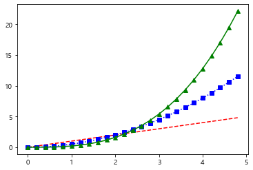

```python
import pandas as pd
import numpy as np
import matplotlib.pyplot as plt
import seaborn as sns
iris = sns.load_dataset("iris")    # 붓꽃 데이터
titanic = sns.load_dataset("titanic")    # 타이타닉호 데이터
tips = sns.load_dataset("tips")    # 팁 데이터
flights = sns.load_dataset("flights")    # 여객운송 데이터

```


```python
x=iris.petal_length.values
sns.rugplot(x)
```


    <AxesSubplot:>


​    

​    


```python
sns.kdplot(x)
```


    ---------------------------------------------------------------------------
    
    AttributeError                            Traceback (most recent call last)
    
    <ipython-input-9-330f9b62cbe6> in <module>
    ----> 1 sns.kdplot(x)


    AttributeError: module 'seaborn' has no attribute 'kdplot'


```python
sns.distplot(x, rug=True)
```

    <AxesSubplot:ylabel='Density'>


​    

​    


```python
#countplot은 데이터 프레임에 대해서 사용 가능
sns.countplot(x='class' , data=titanic) #class별로 승객의 분포 확인
```


    <AxesSubplot:xlabel='class', ylabel='count'>


    


```python
titanic
```


<div>
<style scoped>
    .dataframe tbody tr th:only-of-type {
        vertical-align: middle;
    }

    .dataframe tbody tr th {
        vertical-align: top;
    }
    
    .dataframe thead th {
        text-align: right;
    }
</style>
<table border="1" class="dataframe">
  <thead>
    <tr style="text-align: right;">
      <th></th>
      <th>survived</th>
      <th>pclass</th>
      <th>sex</th>
      <th>age</th>
      <th>sibsp</th>
      <th>parch</th>
      <th>fare</th>
      <th>embarked</th>
      <th>class</th>
      <th>who</th>
      <th>adult_male</th>
      <th>deck</th>
      <th>embark_town</th>
      <th>alive</th>
      <th>alone</th>
    </tr>
  </thead>
  <tbody>
    <tr>
      <th>0</th>
      <td>0</td>
      <td>3</td>
      <td>male</td>
      <td>22.0</td>
      <td>1</td>
      <td>0</td>
      <td>7.2500</td>
      <td>S</td>
      <td>Third</td>
      <td>man</td>
      <td>True</td>
      <td>NaN</td>
      <td>Southampton</td>
      <td>no</td>
      <td>False</td>
    </tr>
    <tr>
      <th>1</th>
      <td>1</td>
      <td>1</td>
      <td>female</td>
      <td>38.0</td>
      <td>1</td>
      <td>0</td>
      <td>71.2833</td>
      <td>C</td>
      <td>First</td>
      <td>woman</td>
      <td>False</td>
      <td>C</td>
      <td>Cherbourg</td>
      <td>yes</td>
      <td>False</td>
    </tr>
    <tr>
      <th>2</th>
      <td>1</td>
      <td>3</td>
      <td>female</td>
      <td>26.0</td>
      <td>0</td>
      <td>0</td>
      <td>7.9250</td>
      <td>S</td>
      <td>Third</td>
      <td>woman</td>
      <td>False</td>
      <td>NaN</td>
      <td>Southampton</td>
      <td>yes</td>
      <td>True</td>
    </tr>
    <tr>
      <th>3</th>
      <td>1</td>
      <td>1</td>
      <td>female</td>
      <td>35.0</td>
      <td>1</td>
      <td>0</td>
      <td>53.1000</td>
      <td>S</td>
      <td>First</td>
      <td>woman</td>
      <td>False</td>
      <td>C</td>
      <td>Southampton</td>
      <td>yes</td>
      <td>False</td>
    </tr>
    <tr>
      <th>4</th>
      <td>0</td>
      <td>3</td>
      <td>male</td>
      <td>35.0</td>
      <td>0</td>
      <td>0</td>
      <td>8.0500</td>
      <td>S</td>
      <td>Third</td>
      <td>man</td>
      <td>True</td>
      <td>NaN</td>
      <td>Southampton</td>
      <td>no</td>
      <td>True</td>
    </tr>
    <tr>
      <th>...</th>
      <td>...</td>
      <td>...</td>
      <td>...</td>
      <td>...</td>
      <td>...</td>
      <td>...</td>
      <td>...</td>
      <td>...</td>
      <td>...</td>
      <td>...</td>
      <td>...</td>
      <td>...</td>
      <td>...</td>
      <td>...</td>
      <td>...</td>
    </tr>
    <tr>
      <th>886</th>
      <td>0</td>
      <td>2</td>
      <td>male</td>
      <td>27.0</td>
      <td>0</td>
      <td>0</td>
      <td>13.0000</td>
      <td>S</td>
      <td>Second</td>
      <td>man</td>
      <td>True</td>
      <td>NaN</td>
      <td>Southampton</td>
      <td>no</td>
      <td>True</td>
    </tr>
    <tr>
      <th>887</th>
      <td>1</td>
      <td>1</td>
      <td>female</td>
      <td>19.0</td>
      <td>0</td>
      <td>0</td>
      <td>30.0000</td>
      <td>S</td>
      <td>First</td>
      <td>woman</td>
      <td>False</td>
      <td>B</td>
      <td>Southampton</td>
      <td>yes</td>
      <td>True</td>
    </tr>
    <tr>
      <th>888</th>
      <td>0</td>
      <td>3</td>
      <td>female</td>
      <td>NaN</td>
      <td>1</td>
      <td>2</td>
      <td>23.4500</td>
      <td>S</td>
      <td>Third</td>
      <td>woman</td>
      <td>False</td>
      <td>NaN</td>
      <td>Southampton</td>
      <td>no</td>
      <td>False</td>
    </tr>
    <tr>
      <th>889</th>
      <td>1</td>
      <td>1</td>
      <td>male</td>
      <td>26.0</td>
      <td>0</td>
      <td>0</td>
      <td>30.0000</td>
      <td>C</td>
      <td>First</td>
      <td>man</td>
      <td>True</td>
      <td>C</td>
      <td>Cherbourg</td>
      <td>yes</td>
      <td>True</td>
    </tr>
    <tr>
      <th>890</th>
      <td>0</td>
      <td>3</td>
      <td>male</td>
      <td>32.0</td>
      <td>0</td>
      <td>0</td>
      <td>7.7500</td>
      <td>Q</td>
      <td>Third</td>
      <td>man</td>
      <td>True</td>
      <td>NaN</td>
      <td>Queenstown</td>
      <td>no</td>
      <td>True</td>
    </tr>
  </tbody>
</table>
<p>891 rows × 15 columns</p>
</div>


```python
tips
sns.countplot(x='day', data=tips)
```


    <AxesSubplot:xlabel='day', ylabel='count'>


​    

​    


```python
#2차원 연속 실수 scatter
#스캐터+히스토그렘 -> 조인트 플롯
```


```python
sns.jointplot(x="sepal_length", y="sepal_width", data=iris)
```


    <seaborn.axisgrid.JointGrid at 0x2cf3a9a75b0>


​    

​    


```python
sns.jointplot(x="sepal_length", y="sepal_width", data=iris, kind="kde")
```


    <seaborn.axisgrid.JointGrid at 0x2cf3a44d3a0>


​    

​    


```python
#데이터 2차원 + 카테고리형 -> heatmap

```


```python
titanic
```


<div>
<style scoped>
    .dataframe tbody tr th:only-of-type {
        vertical-align: middle;
    }

    .dataframe tbody tr th {
        vertical-align: top;
    }
    
    .dataframe thead th {
        text-align: right;
    }
</style>
<table border="1" class="dataframe">
  <thead>
    <tr style="text-align: right;">
      <th></th>
      <th>survived</th>
      <th>pclass</th>
      <th>sex</th>
      <th>age</th>
      <th>sibsp</th>
      <th>parch</th>
      <th>fare</th>
      <th>embarked</th>
      <th>class</th>
      <th>who</th>
      <th>adult_male</th>
      <th>deck</th>
      <th>embark_town</th>
      <th>alive</th>
      <th>alone</th>
    </tr>
  </thead>
  <tbody>
    <tr>
      <th>0</th>
      <td>0</td>
      <td>3</td>
      <td>male</td>
      <td>22.0</td>
      <td>1</td>
      <td>0</td>
      <td>7.2500</td>
      <td>S</td>
      <td>Third</td>
      <td>man</td>
      <td>True</td>
      <td>NaN</td>
      <td>Southampton</td>
      <td>no</td>
      <td>False</td>
    </tr>
    <tr>
      <th>1</th>
      <td>1</td>
      <td>1</td>
      <td>female</td>
      <td>38.0</td>
      <td>1</td>
      <td>0</td>
      <td>71.2833</td>
      <td>C</td>
      <td>First</td>
      <td>woman</td>
      <td>False</td>
      <td>C</td>
      <td>Cherbourg</td>
      <td>yes</td>
      <td>False</td>
    </tr>
    <tr>
      <th>2</th>
      <td>1</td>
      <td>3</td>
      <td>female</td>
      <td>26.0</td>
      <td>0</td>
      <td>0</td>
      <td>7.9250</td>
      <td>S</td>
      <td>Third</td>
      <td>woman</td>
      <td>False</td>
      <td>NaN</td>
      <td>Southampton</td>
      <td>yes</td>
      <td>True</td>
    </tr>
    <tr>
      <th>3</th>
      <td>1</td>
      <td>1</td>
      <td>female</td>
      <td>35.0</td>
      <td>1</td>
      <td>0</td>
      <td>53.1000</td>
      <td>S</td>
      <td>First</td>
      <td>woman</td>
      <td>False</td>
      <td>C</td>
      <td>Southampton</td>
      <td>yes</td>
      <td>False</td>
    </tr>
    <tr>
      <th>4</th>
      <td>0</td>
      <td>3</td>
      <td>male</td>
      <td>35.0</td>
      <td>0</td>
      <td>0</td>
      <td>8.0500</td>
      <td>S</td>
      <td>Third</td>
      <td>man</td>
      <td>True</td>
      <td>NaN</td>
      <td>Southampton</td>
      <td>no</td>
      <td>True</td>
    </tr>
    <tr>
      <th>...</th>
      <td>...</td>
      <td>...</td>
      <td>...</td>
      <td>...</td>
      <td>...</td>
      <td>...</td>
      <td>...</td>
      <td>...</td>
      <td>...</td>
      <td>...</td>
      <td>...</td>
      <td>...</td>
      <td>...</td>
      <td>...</td>
      <td>...</td>
    </tr>
    <tr>
      <th>886</th>
      <td>0</td>
      <td>2</td>
      <td>male</td>
      <td>27.0</td>
      <td>0</td>
      <td>0</td>
      <td>13.0000</td>
      <td>S</td>
      <td>Second</td>
      <td>man</td>
      <td>True</td>
      <td>NaN</td>
      <td>Southampton</td>
      <td>no</td>
      <td>True</td>
    </tr>
    <tr>
      <th>887</th>
      <td>1</td>
      <td>1</td>
      <td>female</td>
      <td>19.0</td>
      <td>0</td>
      <td>0</td>
      <td>30.0000</td>
      <td>S</td>
      <td>First</td>
      <td>woman</td>
      <td>False</td>
      <td>B</td>
      <td>Southampton</td>
      <td>yes</td>
      <td>True</td>
    </tr>
    <tr>
      <th>888</th>
      <td>0</td>
      <td>3</td>
      <td>female</td>
      <td>NaN</td>
      <td>1</td>
      <td>2</td>
      <td>23.4500</td>
      <td>S</td>
      <td>Third</td>
      <td>woman</td>
      <td>False</td>
      <td>NaN</td>
      <td>Southampton</td>
      <td>no</td>
      <td>False</td>
    </tr>
    <tr>
      <th>889</th>
      <td>1</td>
      <td>1</td>
      <td>male</td>
      <td>26.0</td>
      <td>0</td>
      <td>0</td>
      <td>30.0000</td>
      <td>C</td>
      <td>First</td>
      <td>man</td>
      <td>True</td>
      <td>C</td>
      <td>Cherbourg</td>
      <td>yes</td>
      <td>True</td>
    </tr>
    <tr>
      <th>890</th>
      <td>0</td>
      <td>3</td>
      <td>male</td>
      <td>32.0</td>
      <td>0</td>
      <td>0</td>
      <td>7.7500</td>
      <td>Q</td>
      <td>Third</td>
      <td>man</td>
      <td>True</td>
      <td>NaN</td>
      <td>Queenstown</td>
      <td>no</td>
      <td>True</td>
    </tr>
  </tbody>
</table>
<p>891 rows × 15 columns</p>
</div>


```python
titanic['sex'].groupby([titanic['sex'],titanic['class']]).count()

```


    sex     class 
    female  First      94
            Second     76
            Third     144
    male    First     122
            Second    108
            Third     347
    Name: sex, dtype: int64


```python
ts=titanic.pivot_table(index='class', columns='sex',aggfunc='size') #default : mean함수
```


```python
ts
```


<div>
<style scoped>
    .dataframe tbody tr th:only-of-type {
        vertical-align: middle;
    }

    .dataframe tbody tr th {
        vertical-align: top;
    }
    
    .dataframe thead th {
        text-align: right;
    }
</style>
<table border="1" class="dataframe">
  <thead>
    <tr style="text-align: right;">
      <th>sex</th>
      <th>female</th>
      <th>male</th>
    </tr>
    <tr>
      <th>class</th>
      <th></th>
      <th></th>
    </tr>
  </thead>
  <tbody>
    <tr>
      <th>First</th>
      <td>94</td>
      <td>122</td>
    </tr>
    <tr>
      <th>Second</th>
      <td>76</td>
      <td>108</td>
    </tr>
    <tr>
      <th>Third</th>
      <td>144</td>
      <td>347</td>
    </tr>
  </tbody>
</table>
</div>


```python
sns.heatmap(ts, annot=True, fmt='d' , cmap="YlGnBu")
#http://seaborn.pydata.org/generated/seaborn.heatmap.html
plt.title("my heatmap")
```


    Text(0.5, 1.0, 'my heatmap')


​    

​    


```python
# 2차원 , 실수 , 카테고리가 섞여있는 데이터
sns.barplot(x="day" , y="total_bill" , data=tips)
#평균 : 막대의 높이 , 가운데 선: 편차 (error bar)

```


    <AxesSubplot:xlabel='day', ylabel='total_bill'>


​    

​    


```python
sns.boxplot(x="day", y="total_bill", data=tips)
#outliers: 이상치, 극단치, 예외치 
iqr = q3(3사분위 수)-q1(1사분위수)
maximum= q3+iqr*1.5 #극단치
min = q1-iqr*1.5

```


      File "<ipython-input-64-484cece8128e>", line 3
        iqr = q3(3사분위 수)-q1(1사분위수)
                  ^
    SyntaxError: invalid syntax


```python
#분포를 보고싶으면 바이올린
sns.violinplot(x="day", y="total_bill", data=tips)

```


    <AxesSubplot:xlabel='day', ylabel='total_bill'>


​    

​    


```python
sns.stripplot(x="day", y="total_bill", data=tips)
sns.stripplot(x="day", y="total_bill", data=tips, jitter=True) #겹친 데이터를 겹치지 않도록 설정

```


    <AxesSubplot:xlabel='day', ylabel='total_bill'>


​    

​    


```python
sns.swarmplot(x="day", y="total_bill", data=tips)
#아예 안겹치게
```


    <AxesSubplot:xlabel='day', ylabel='total_bill'>


​    

​    


 # hue 옵션


```python
sns.barplot(x="day", y="total_bill", data=tips, hue="sex") 
#요일별 성별에 따른 totail bill 평균
```


    <AxesSubplot:xlabel='day', ylabel='total_bill'>


​    

​    


```python
sns.barplot(x="day", y="total_bill", data=tips, hue="time") 

```


    <AxesSubplot:xlabel='day', ylabel='total_bill'>


​    

​    


```python
sns.boxplot(x="day", y="total_bill", data=tips, hue="sex") 

```


    <AxesSubplot:xlabel='day', ylabel='total_bill'>


​    

​    


```python
sns.violinplot(x="day", y="total_bill", data=tips, hue="sex") 

```


    <AxesSubplot:xlabel='day', ylabel='total_bill'>


​    

​    


```python
sns.stripplot(x="day", y="total_bill", data=tips, hue="sex") 
plt.legend(loc=2)
```


    <matplotlib.legend.Legend at 0x2cf3c6e3580>


​    

​    


```python
flights
```


<div>
<style scoped>
    .dataframe tbody tr th:only-of-type {
        vertical-align: middle;
    }

    .dataframe tbody tr th {
        vertical-align: top;
    }
    
    .dataframe thead th {
        text-align: right;
    }
</style>
<table border="1" class="dataframe">
  <thead>
    <tr style="text-align: right;">
      <th></th>
      <th>year</th>
      <th>month</th>
      <th>passengers</th>
    </tr>
  </thead>
  <tbody>
    <tr>
      <th>0</th>
      <td>1949</td>
      <td>Jan</td>
      <td>112</td>
    </tr>
    <tr>
      <th>1</th>
      <td>1949</td>
      <td>Feb</td>
      <td>118</td>
    </tr>
    <tr>
      <th>2</th>
      <td>1949</td>
      <td>Mar</td>
      <td>132</td>
    </tr>
    <tr>
      <th>3</th>
      <td>1949</td>
      <td>Apr</td>
      <td>129</td>
    </tr>
    <tr>
      <th>4</th>
      <td>1949</td>
      <td>May</td>
      <td>121</td>
    </tr>
    <tr>
      <th>...</th>
      <td>...</td>
      <td>...</td>
      <td>...</td>
    </tr>
    <tr>
      <th>139</th>
      <td>1960</td>
      <td>Aug</td>
      <td>606</td>
    </tr>
    <tr>
      <th>140</th>
      <td>1960</td>
      <td>Sep</td>
      <td>508</td>
    </tr>
    <tr>
      <th>141</th>
      <td>1960</td>
      <td>Oct</td>
      <td>461</td>
    </tr>
    <tr>
      <th>142</th>
      <td>1960</td>
      <td>Nov</td>
      <td>390</td>
    </tr>
    <tr>
      <th>143</th>
      <td>1960</td>
      <td>Dec</td>
      <td>432</td>
    </tr>
  </tbody>
</table>
<p>144 rows × 3 columns</p>
</div>


```python
sns.heatmap(flights) 
```


    ---------------------------------------------------------------------------
    
    ValueError                                Traceback (most recent call last)
    
    <ipython-input-84-a48f00013bf8> in <module>
    ----> 1 sns.heatmap(flights)


    ~\anaconda3\lib\site-packages\seaborn\_decorators.py in inner_f(*args, **kwargs)
         44             )
         45         kwargs.update({k: arg for k, arg in zip(sig.parameters, args)})
    ---> 46         return f(**kwargs)
         47     return inner_f
         48 


    ~\anaconda3\lib\site-packages\seaborn\matrix.py in heatmap(data, vmin, vmax, cmap, center, robust, annot, fmt, annot_kws, linewidths, linecolor, cbar, cbar_kws, cbar_ax, square, xticklabels, yticklabels, mask, ax, **kwargs)
        543     """
        544     # Initialize the plotter object
    --> 545     plotter = _HeatMapper(data, vmin, vmax, cmap, center, robust, annot, fmt,
        546                           annot_kws, cbar, cbar_kws, xticklabels,
        547                           yticklabels, mask)


    ~\anaconda3\lib\site-packages\seaborn\matrix.py in __init__(self, data, vmin, vmax, cmap, center, robust, annot, fmt, annot_kws, cbar, cbar_kws, xticklabels, yticklabels, mask)
        163 
        164         # Determine good default values for the colormapping
    --> 165         self._determine_cmap_params(plot_data, vmin, vmax,
        166                                     cmap, center, robust)
        167 


    ~\anaconda3\lib\site-packages\seaborn\matrix.py in _determine_cmap_params(self, plot_data, vmin, vmax, cmap, center, robust)
        197 
        198         # plot_data is a np.ma.array instance
    --> 199         calc_data = plot_data.astype(float).filled(np.nan)
        200         if vmin is None:
        201             if robust:


    ValueError: could not convert string to float: 'Jan'


```python
#heatmap하기 전 전처리
fp=flights.pivot("month", "year","passengers")
fp

sns.heatmap(fp, annot=True, fmt='d', linewidths=1)
```


    <AxesSubplot:xlabel='year', ylabel='month'>


​    

​    


```python
#시각화시 막대그래프 그리는 방ㅂㅂ seaborn, matplotlib, pandans, ggplot2
```


```python
import random
```


```python
np.random.seed(331)
```


```python
groupList=['A','B','C','D']
nSize=20
```


```python
group=[random.choice(groupList) for i in range(nSize)]
group
```


    ['C',
     'A',
     'A',
     'C',
     'D',
     'D',
     'D',
     'A',
     'C',
     'A',
     'B',
     'C',
     'C',
     'B',
     'D',
     'C',
     'C',
     'B',
     'C',
     'D']


```python
xval=np.random.poisson(lam=10, size=nSize)
#포아송 분포로부터 무작위 표본 추출
#일정 시간에서 무작위로 발생하는 사건의 평균 회수가 람다작위로 발생하는 사건의 평균 회수가 람다
#10인 포아송 분포로부터 난수 20개 추출
```


```python
# binomial 이항분포 
# 이항분포에서 무작위 표본 추출
# 이항분포실험을 반복적으로 시행 -> 두가지 경우(성공/실패)
#성공확률 p은 베르누이 시행을 n번 반복했을때 성공하는횟수를 x, 
#확률변수 x는 모수n과 p의 이항분포를 따른다

label=np.random.binomial(n=1,p=0.5, size=nSize)
label

#확률 분포 : 이산형, 연속형 확률분포
#이산형 확률 분포 : 이항분포, 포아송분포, 초기하 분포
#연속 확률 분포 : 정규분포, t분포, f분포 , 카이제곱,...


```


    array([1, 1, 0, 0, 1, 0, 0, 1, 1, 0, 0, 0, 0, 0, 0, 1, 0, 1, 0, 1])


```python
label=list(map(str,label))
label
```


    ['1',
     '1',
     '0',
     '0',
     '1',
     '0',
     '0',
     '1',
     '1',
     '0',
     '0',
     '0',
     '0',
     '0',
     '0',
     '1',
     '0',
     '1',
     '0',
     '1']


```python
df=pd.DataFrame({"xval":xval,"group":group,"label":label})
df
```


<div>
<style scoped>
    .dataframe tbody tr th:only-of-type {
        vertical-align: middle;
    }

    .dataframe tbody tr th {
        vertical-align: top;
    }
    
    .dataframe thead th {
        text-align: right;
    }
</style>
<table border="1" class="dataframe">
  <thead>
    <tr style="text-align: right;">
      <th></th>
      <th>xval</th>
      <th>group</th>
      <th>label</th>
    </tr>
  </thead>
  <tbody>
    <tr>
      <th>0</th>
      <td>17</td>
      <td>C</td>
      <td>1</td>
    </tr>
    <tr>
      <th>1</th>
      <td>12</td>
      <td>A</td>
      <td>1</td>
    </tr>
    <tr>
      <th>2</th>
      <td>10</td>
      <td>A</td>
      <td>0</td>
    </tr>
    <tr>
      <th>3</th>
      <td>8</td>
      <td>C</td>
      <td>0</td>
    </tr>
    <tr>
      <th>4</th>
      <td>5</td>
      <td>D</td>
      <td>1</td>
    </tr>
    <tr>
      <th>5</th>
      <td>10</td>
      <td>D</td>
      <td>0</td>
    </tr>
    <tr>
      <th>6</th>
      <td>6</td>
      <td>D</td>
      <td>0</td>
    </tr>
    <tr>
      <th>7</th>
      <td>8</td>
      <td>A</td>
      <td>1</td>
    </tr>
    <tr>
      <th>8</th>
      <td>19</td>
      <td>C</td>
      <td>1</td>
    </tr>
    <tr>
      <th>9</th>
      <td>10</td>
      <td>A</td>
      <td>0</td>
    </tr>
    <tr>
      <th>10</th>
      <td>15</td>
      <td>B</td>
      <td>0</td>
    </tr>
    <tr>
      <th>11</th>
      <td>10</td>
      <td>C</td>
      <td>0</td>
    </tr>
    <tr>
      <th>12</th>
      <td>5</td>
      <td>C</td>
      <td>0</td>
    </tr>
    <tr>
      <th>13</th>
      <td>10</td>
      <td>B</td>
      <td>0</td>
    </tr>
    <tr>
      <th>14</th>
      <td>10</td>
      <td>D</td>
      <td>0</td>
    </tr>
    <tr>
      <th>15</th>
      <td>9</td>
      <td>C</td>
      <td>1</td>
    </tr>
    <tr>
      <th>16</th>
      <td>10</td>
      <td>C</td>
      <td>0</td>
    </tr>
    <tr>
      <th>17</th>
      <td>10</td>
      <td>B</td>
      <td>1</td>
    </tr>
    <tr>
      <th>18</th>
      <td>10</td>
      <td>C</td>
      <td>0</td>
    </tr>
    <tr>
      <th>19</th>
      <td>9</td>
      <td>D</td>
      <td>1</td>
    </tr>
  </tbody>
</table>
</div>


```python
df_group=df.groupby('group')[['xval']].sum()
df_group_label=df.groupby(['group','label'])[['xval']].sum()

```


```python
#pd.DataFrame.plot.bar()

df_group.plot.bar() #rot=0 으로 각도 조절 가능 , y="xval" 
#df_group.plot.barh(x="group" , y="xval", rot=0) #수평그래프

df_group_label=df_group_label.reset_index()
```


​    

​    


```python
df_pivot=df_group_label.pivot(index='group', columns="label", values='xval')
df_pivot
```


<div>
<style scoped>
    .dataframe tbody tr th:only-of-type {
        vertical-align: middle;
    }

    .dataframe tbody tr th {
        vertical-align: top;
    }
    
    .dataframe thead th {
        text-align: right;
    }
</style>
<table border="1" class="dataframe">
  <thead>
    <tr style="text-align: right;">
      <th>label</th>
      <th>0</th>
      <th>1</th>
    </tr>
    <tr>
      <th>group</th>
      <th></th>
      <th></th>
    </tr>
  </thead>
  <tbody>
    <tr>
      <th>A</th>
      <td>20</td>
      <td>20</td>
    </tr>
    <tr>
      <th>B</th>
      <td>25</td>
      <td>10</td>
    </tr>
    <tr>
      <th>C</th>
      <td>43</td>
      <td>45</td>
    </tr>
    <tr>
      <th>D</th>
      <td>26</td>
      <td>14</td>
    </tr>
  </tbody>
</table>
</div>


```python
df_pivot.plot.bar(rot=0) #두개씩 출력
```


    <AxesSubplot:xlabel='group'>


​    

​    


```python
df[df['label']==0]
df_group0= df[df['label']=='0'].groupby(['group'])['xval'].sum()
df_group1 = df[df['label']=='1'].groupby(['group'])['xval'].sum()
#x축 : group
#y축 : xval 합계
#막대바 label(0,1)
label=df.group.unique()
label=sorted(label)
index=np.arange(len(label))

p1=plt.bar(index, df_group0)
p2=plt.bar(index, df_group1, bottom=df_group0)
plt.xticks(index,label)
plt.legend((p1[0],p2[0]), ('0','1'), fontsize=10, loc=1)
```


    <matplotlib.legend.Legend at 0x2cf40deee20>


​    

​    


```python
p1[0]
```


    <matplotlib.patches.Rectangle at 0x2cf40f7c250>


```python
p2[0]
```


    <matplotlib.patches.Rectangle at 0x2cf40f7cd90>


```python

p1=plt.bar(index, df_group0, width=0.4)
p2=plt.bar(index+0.5, df_group1,width=0.4) #bot 뺌
plt.xticks(index,label)
plt.legend((p1[0],p2[0]), ('0','1'), fontsize=10, loc=1)
```


    <matplotlib.legend.Legend at 0x2cf40f0eca0>


​    

​    


```python
# seaborn을 이용한 바 그래프 출력
```


```python
df_group=df.groupby(['group'])['xval'].sum().reset_index()
df_group
```


<div>
<style scoped>
    .dataframe tbody tr th:only-of-type {
        vertical-align: middle;
    }

    .dataframe tbody tr th {
        vertical-align: top;
    }
    
    .dataframe thead th {
        text-align: right;
    }
</style>
<table border="1" class="dataframe">
  <thead>
    <tr style="text-align: right;">
      <th></th>
      <th>group</th>
      <th>xval</th>
    </tr>
  </thead>
  <tbody>
    <tr>
      <th>0</th>
      <td>A</td>
      <td>40</td>
    </tr>
    <tr>
      <th>1</th>
      <td>B</td>
      <td>35</td>
    </tr>
    <tr>
      <th>2</th>
      <td>C</td>
      <td>88</td>
    </tr>
    <tr>
      <th>3</th>
      <td>D</td>
      <td>40</td>
    </tr>
  </tbody>
</table>
</div>


```python
sns.barplot(x='group', y='xval', data=df_group)
```


    <AxesSubplot:xlabel='group', ylabel='xval'>


​    

​    


```python
df_group_label=df.groupby(['group','label'])['xval'].sum().reset_index()
df_group_label
```


<div>
<style scoped>
    .dataframe tbody tr th:only-of-type {
        vertical-align: middle;
    }

    .dataframe tbody tr th {
        vertical-align: top;
    }
    
    .dataframe thead th {
        text-align: right;
    }
</style>
<table border="1" class="dataframe">
  <thead>
    <tr style="text-align: right;">
      <th></th>
      <th>group</th>
      <th>label</th>
      <th>xval</th>
    </tr>
  </thead>
  <tbody>
    <tr>
      <th>0</th>
      <td>A</td>
      <td>0</td>
      <td>20</td>
    </tr>
    <tr>
      <th>1</th>
      <td>A</td>
      <td>1</td>
      <td>20</td>
    </tr>
    <tr>
      <th>2</th>
      <td>B</td>
      <td>0</td>
      <td>25</td>
    </tr>
    <tr>
      <th>3</th>
      <td>B</td>
      <td>1</td>
      <td>10</td>
    </tr>
    <tr>
      <th>4</th>
      <td>C</td>
      <td>0</td>
      <td>43</td>
    </tr>
    <tr>
      <th>5</th>
      <td>C</td>
      <td>1</td>
      <td>45</td>
    </tr>
    <tr>
      <th>6</th>
      <td>D</td>
      <td>0</td>
      <td>26</td>
    </tr>
    <tr>
      <th>7</th>
      <td>D</td>
      <td>1</td>
      <td>14</td>
    </tr>
  </tbody>
</table>
</div>


```python
sns.barplot(x='group', y='xval', data=df_group)
```


    <AxesSubplot:xlabel='group', ylabel='xval'>


​    

​    


```python
df_group0= df[df['label']=='0'].groupby(['group'])['xval'].sum().reset_index
df_group1 = df[df['label']=='1'].groupby(['group'])['xval'].sum().reset_index
```


```python
df_group0
```


    <bound method Series.reset_index of group
    A    20
    B    25
    C    43
    D    26
    Name: xval, dtype: int32>


```python
sns.barplot(x='group', y='xval', data=df_group, color="red")
sns.barplot(x='group', y='xval', data=df_group0, color="blue") #덧씌운것

```


    ---------------------------------------------------------------------------
    
    AttributeError                            Traceback (most recent call last)
    
    <ipython-input-252-893fe0e76861> in <module>
          1 sns.barplot(x='group', y='xval', data=df_group, color="red")
    ----> 2 sns.barplot(x='group', y='xval', data=df_group0, color="blue") #덧씌운것


    ~\anaconda3\lib\site-packages\seaborn\_decorators.py in inner_f(*args, **kwargs)
         44             )
         45         kwargs.update({k: arg for k, arg in zip(sig.parameters, args)})
    ---> 46         return f(**kwargs)
         47     return inner_f
         48 


    ~\anaconda3\lib\site-packages\seaborn\categorical.py in barplot(x, y, hue, data, order, hue_order, estimator, ci, n_boot, units, seed, orient, color, palette, saturation, errcolor, errwidth, capsize, dodge, ax, **kwargs)
       3167 ):
       3168 
    -> 3169     plotter = _BarPlotter(x, y, hue, data, order, hue_order,
       3170                           estimator, ci, n_boot, units, seed,
       3171                           orient, color, palette, saturation,


    ~\anaconda3\lib\site-packages\seaborn\categorical.py in __init__(self, x, y, hue, data, order, hue_order, estimator, ci, n_boot, units, seed, orient, color, palette, saturation, errcolor, errwidth, capsize, dodge)
       1582                  errwidth, capsize, dodge):
       1583         """Initialize the plotter."""
    -> 1584         self.establish_variables(x, y, hue, data, orient,
       1585                                  order, hue_order, units)
       1586         self.establish_colors(color, palette, saturation)


    ~\anaconda3\lib\site-packages\seaborn\categorical.py in establish_variables(self, x, y, hue, data, orient, order, hue_order, units)
        142             # See if we need to get variables from `data`
        143             if data is not None:
    --> 144                 x = data.get(x, x)
        145                 y = data.get(y, y)
        146                 hue = data.get(hue, hue)


    AttributeError: 'function' object has no attribute 'get'


    


```python
#R에서 사용되는 ggplot2를 사용하기
```


```python
pip install plotnine
```

    Collecting plotnine
      Downloading plotnine-0.8.0-py3-none-any.whl (4.7 MB)
    Collecting descartes>=1.1.0
    Note: you may need to restart the kernel to use updated packages.
      Downloading descartes-1.1.0-py3-none-any.whl (5.8 kB)
    Collecting mizani>=0.7.3
      Downloading mizani-0.7.3-py3-none-any.whl (63 kB)
    Requirement already satisfied: scipy>=1.5.0 in c:\users\akrnr\anaconda3\lib\site-packages (from plotnine) (1.5.2)
    Requirement already satisfied: matplotlib>=3.1.1 in c:\users\akrnr\anaconda3\lib\site-packages (from plotnine) (3.3.2)
    Requirement already satisfied: numpy>=1.19.0 in c:\users\akrnr\anaconda3\lib\site-packages (from plotnine) (1.19.2)
    Collecting statsmodels>=0.12.1
      Downloading statsmodels-0.12.2-cp38-none-win_amd64.whl (9.4 MB)
    Requirement already satisfied: patsy>=0.5.1 in c:\users\akrnr\anaconda3\lib\site-packages (from plotnine) (0.5.1)
    Requirement already satisfied: pandas>=1.1.0 in c:\users\akrnr\anaconda3\lib\site-packages (from plotnine) (1.1.3)
    Collecting palettable
      Downloading palettable-3.3.0-py2.py3-none-any.whl (111 kB)
    Requirement already satisfied: pillow>=6.2.0 in c:\users\akrnr\anaconda3\lib\site-packages (from matplotlib>=3.1.1->plotnine) (8.0.1)
    Requirement already satisfied: pyparsing!=2.0.4,!=2.1.2,!=2.1.6,>=2.0.3 in c:\users\akrnr\anaconda3\lib\site-packages (from matplotlib>=3.1.1->plotnine) (2.4.7)
    Requirement already satisfied: python-dateutil>=2.1 in c:\users\akrnr\anaconda3\lib\site-packages (from matplotlib>=3.1.1->plotnine) (2.8.1)
    Requirement already satisfied: kiwisolver>=1.0.1 in c:\users\akrnr\anaconda3\lib\site-packages (from matplotlib>=3.1.1->plotnine) (1.3.0)
    Requirement already satisfied: cycler>=0.10 in c:\users\akrnr\anaconda3\lib\site-packages (from matplotlib>=3.1.1->plotnine) (0.10.0)
    Requirement already satisfied: certifi>=2020.06.20 in c:\users\akrnr\anaconda3\lib\site-packages (from matplotlib>=3.1.1->plotnine) (2020.6.20)
    Requirement already satisfied: six in c:\users\akrnr\anaconda3\lib\site-packages (from patsy>=0.5.1->plotnine) (1.15.0)
    Requirement already satisfied: pytz>=2017.2 in c:\users\akrnr\anaconda3\lib\site-packages (from pandas>=1.1.0->plotnine) (2020.1)
    Installing collected packages: descartes, palettable, mizani, statsmodels, plotnine
      Attempting uninstall: statsmodels
        Found existing installation: statsmodels 0.12.0
        Uninstalling statsmodels-0.12.0:
          Successfully uninstalled statsmodels-0.12.0
    Successfully installed descartes-1.1.0 mizani-0.7.3 palettable-3.3.0 plotnine-0.8.0 statsmodels-0.12.2


```python
import plotnine as p9
```


```python
p9.ggplot(data=df, mapping=p9.aes(x='group', y='xval'))+p9.geom_bar(stat='identity')
```


​    

​    


    <ggplot: (193075867158)>


```python
p9.ggplot(data=df, mapping=p9.aes(x='group', y='xval', fill='label'))+p9.geom_bar(stat='identity')
```


​    

​    


    <ggplot: (193075940581)>


```python
p9.ggplot(data=df, mapping=p9.aes(x='group', y='xval', fill='label'))+p9.geom_bar(stat='identity')+p9.coord_flip()
```


​    

​    


    <ggplot: (193075933715)>


```python
p9.ggplot(data=df, mapping=p9.aes(x='group', y='xval', fill='label'))+p9.geom_bar(stat='identity', position='dodge')
```


​    

​    


    <ggplot: (193076008334)>


```python
np.random.seed(0)
df1 = pd.DataFrame(np.random.randn(100, 3),
                   index=pd.date_range('1/1/2018', periods=100),
                   columns=['A', 'B', 'C']).cumsum()
df1.tail()

```


<div>
<style scoped>
    .dataframe tbody tr th:only-of-type {
        vertical-align: middle;
    }

    .dataframe tbody tr th {
        vertical-align: top;
    }
    
    .dataframe thead th {
        text-align: right;
    }
</style>
<table border="1" class="dataframe">
  <thead>
    <tr style="text-align: right;">
      <th></th>
      <th>A</th>
      <th>B</th>
      <th>C</th>
    </tr>
  </thead>
  <tbody>
    <tr>
      <th>2018-04-06</th>
      <td>9.396256</td>
      <td>6.282026</td>
      <td>-11.198087</td>
    </tr>
    <tr>
      <th>2018-04-07</th>
      <td>10.086074</td>
      <td>7.583872</td>
      <td>-11.826175</td>
    </tr>
    <tr>
      <th>2018-04-08</th>
      <td>9.605047</td>
      <td>9.887789</td>
      <td>-12.886190</td>
    </tr>
    <tr>
      <th>2018-04-09</th>
      <td>9.469097</td>
      <td>11.024680</td>
      <td>-12.788465</td>
    </tr>
    <tr>
      <th>2018-04-10</th>
      <td>10.052051</td>
      <td>10.625231</td>
      <td>-12.418409</td>
    </tr>
  </tbody>
</table>
</div>


```python
import matplotlib
from matplotlib import font_manager, rc
import platform
if platform.system()=="Windows":
    font_name=font_manager.FontProperties(fname="c:/Windows/Fonts/malgun.ttf").get_name()
    rc('font', family=font_name)
matplotlib.rcParams['axes.unicode_minus']=False

import warnings
warnings.filterwarnings("ignore")

```


```python
df1.plot()
plt.xlabel("시간")
plt.ylabel("data")
plt.show()
```


​    

​    


```python
iris
```


<div>
<style scoped>
    .dataframe tbody tr th:only-of-type {
        vertical-align: middle;
    }

    .dataframe tbody tr th {
        vertical-align: top;
    }
    
    .dataframe thead th {
        text-align: right;
    }
</style>
<table border="1" class="dataframe">
  <thead>
    <tr style="text-align: right;">
      <th></th>
      <th>sepal_length</th>
      <th>sepal_width</th>
      <th>petal_length</th>
      <th>petal_width</th>
      <th>species</th>
    </tr>
  </thead>
  <tbody>
    <tr>
      <th>0</th>
      <td>5.1</td>
      <td>3.5</td>
      <td>1.4</td>
      <td>0.2</td>
      <td>setosa</td>
    </tr>
    <tr>
      <th>1</th>
      <td>4.9</td>
      <td>3.0</td>
      <td>1.4</td>
      <td>0.2</td>
      <td>setosa</td>
    </tr>
    <tr>
      <th>2</th>
      <td>4.7</td>
      <td>3.2</td>
      <td>1.3</td>
      <td>0.2</td>
      <td>setosa</td>
    </tr>
    <tr>
      <th>3</th>
      <td>4.6</td>
      <td>3.1</td>
      <td>1.5</td>
      <td>0.2</td>
      <td>setosa</td>
    </tr>
    <tr>
      <th>4</th>
      <td>5.0</td>
      <td>3.6</td>
      <td>1.4</td>
      <td>0.2</td>
      <td>setosa</td>
    </tr>
    <tr>
      <th>...</th>
      <td>...</td>
      <td>...</td>
      <td>...</td>
      <td>...</td>
      <td>...</td>
    </tr>
    <tr>
      <th>145</th>
      <td>6.7</td>
      <td>3.0</td>
      <td>5.2</td>
      <td>2.3</td>
      <td>virginica</td>
    </tr>
    <tr>
      <th>146</th>
      <td>6.3</td>
      <td>2.5</td>
      <td>5.0</td>
      <td>1.9</td>
      <td>virginica</td>
    </tr>
    <tr>
      <th>147</th>
      <td>6.5</td>
      <td>3.0</td>
      <td>5.2</td>
      <td>2.0</td>
      <td>virginica</td>
    </tr>
    <tr>
      <th>148</th>
      <td>6.2</td>
      <td>3.4</td>
      <td>5.4</td>
      <td>2.3</td>
      <td>virginica</td>
    </tr>
    <tr>
      <th>149</th>
      <td>5.9</td>
      <td>3.0</td>
      <td>5.1</td>
      <td>1.8</td>
      <td>virginica</td>
    </tr>
  </tbody>
</table>
<p>150 rows × 5 columns</p>
</div>


```python
iris.sepal_length[:20].plot()
```


    <AxesSubplot:>


​    

​    


```python
iris.sepal_length[:20].plot(kind='bar', rot=0)
```


    <AxesSubplot:>


​    

​    


```python
iris[:5].plot(kind='bar', rot=0)
iris[:5].plot.bar(rot=0) #똑 같 다 
plt.ylim(0,7)
```


    (0.0, 7.0)


​    

​    


    


```python
#종별 각 feature 평균을 시각화
#x축 3가지 종, y축 종별로 각 특징에 대한 길이를 막대바 (4개)로 출력
#행 인덱스 = 종, 열인덱스 = 각 특징이름, 데이터 = 평균
iris
```


<div>
<style scoped>
    .dataframe tbody tr th:only-of-type {
        vertical-align: middle;
    }

    .dataframe tbody tr th {
        vertical-align: top;
    }
    
    .dataframe thead th {
        text-align: right;
    }
</style>
<table border="1" class="dataframe">
  <thead>
    <tr style="text-align: right;">
      <th></th>
      <th>sepal_length</th>
      <th>sepal_width</th>
      <th>petal_length</th>
      <th>petal_width</th>
      <th>species</th>
    </tr>
  </thead>
  <tbody>
    <tr>
      <th>0</th>
      <td>5.1</td>
      <td>3.5</td>
      <td>1.4</td>
      <td>0.2</td>
      <td>setosa</td>
    </tr>
    <tr>
      <th>1</th>
      <td>4.9</td>
      <td>3.0</td>
      <td>1.4</td>
      <td>0.2</td>
      <td>setosa</td>
    </tr>
    <tr>
      <th>2</th>
      <td>4.7</td>
      <td>3.2</td>
      <td>1.3</td>
      <td>0.2</td>
      <td>setosa</td>
    </tr>
    <tr>
      <th>3</th>
      <td>4.6</td>
      <td>3.1</td>
      <td>1.5</td>
      <td>0.2</td>
      <td>setosa</td>
    </tr>
    <tr>
      <th>4</th>
      <td>5.0</td>
      <td>3.6</td>
      <td>1.4</td>
      <td>0.2</td>
      <td>setosa</td>
    </tr>
    <tr>
      <th>...</th>
      <td>...</td>
      <td>...</td>
      <td>...</td>
      <td>...</td>
      <td>...</td>
    </tr>
    <tr>
      <th>145</th>
      <td>6.7</td>
      <td>3.0</td>
      <td>5.2</td>
      <td>2.3</td>
      <td>virginica</td>
    </tr>
    <tr>
      <th>146</th>
      <td>6.3</td>
      <td>2.5</td>
      <td>5.0</td>
      <td>1.9</td>
      <td>virginica</td>
    </tr>
    <tr>
      <th>147</th>
      <td>6.5</td>
      <td>3.0</td>
      <td>5.2</td>
      <td>2.0</td>
      <td>virginica</td>
    </tr>
    <tr>
      <th>148</th>
      <td>6.2</td>
      <td>3.4</td>
      <td>5.4</td>
      <td>2.3</td>
      <td>virginica</td>
    </tr>
    <tr>
      <th>149</th>
      <td>5.9</td>
      <td>3.0</td>
      <td>5.1</td>
      <td>1.8</td>
      <td>virginica</td>
    </tr>
  </tbody>
</table>
<p>150 rows × 5 columns</p>
</div>


```python
df2=iris.groupby(iris.species).mean()

```


    ---------------------------------------------------------------------------
    
    AttributeError                            Traceback (most recent call last)
    
    <ipython-input-283-af2f4f76a6fb> in <module>
          1 df2=iris.groupby(iris.species).mean()
    ----> 2 df2.column_name


    ~\anaconda3\lib\site-packages\pandas\core\generic.py in __getattr__(self, name)
       5137             if self._info_axis._can_hold_identifiers_and_holds_name(name):
       5138                 return self[name]
    -> 5139             return object.__getattribute__(self, name)
       5140 
       5141     def __setattr__(self, name: str, value) -> None:


    AttributeError: 'DataFrame' object has no attribute 'column_name'


```python
df2.plot.bar()
```


    <AxesSubplot:xlabel='species'>


​    

​    


```python
df2.T.plot.bar(rot=0)
```


    <AxesSubplot:>


​    

​    


```python
titanic
```


<div>
<style scoped>
    .dataframe tbody tr th:only-of-type {
        vertical-align: middle;
    }

    .dataframe tbody tr th {
        vertical-align: top;
    }
    
    .dataframe thead th {
        text-align: right;
    }
</style>
<table border="1" class="dataframe">
  <thead>
    <tr style="text-align: right;">
      <th></th>
      <th>survived</th>
      <th>pclass</th>
      <th>sex</th>
      <th>age</th>
      <th>sibsp</th>
      <th>parch</th>
      <th>fare</th>
      <th>embarked</th>
      <th>class</th>
      <th>who</th>
      <th>adult_male</th>
      <th>deck</th>
      <th>embark_town</th>
      <th>alive</th>
      <th>alone</th>
    </tr>
  </thead>
  <tbody>
    <tr>
      <th>0</th>
      <td>0</td>
      <td>3</td>
      <td>male</td>
      <td>22.0</td>
      <td>1</td>
      <td>0</td>
      <td>7.2500</td>
      <td>S</td>
      <td>Third</td>
      <td>man</td>
      <td>True</td>
      <td>NaN</td>
      <td>Southampton</td>
      <td>no</td>
      <td>False</td>
    </tr>
    <tr>
      <th>1</th>
      <td>1</td>
      <td>1</td>
      <td>female</td>
      <td>38.0</td>
      <td>1</td>
      <td>0</td>
      <td>71.2833</td>
      <td>C</td>
      <td>First</td>
      <td>woman</td>
      <td>False</td>
      <td>C</td>
      <td>Cherbourg</td>
      <td>yes</td>
      <td>False</td>
    </tr>
    <tr>
      <th>2</th>
      <td>1</td>
      <td>3</td>
      <td>female</td>
      <td>26.0</td>
      <td>0</td>
      <td>0</td>
      <td>7.9250</td>
      <td>S</td>
      <td>Third</td>
      <td>woman</td>
      <td>False</td>
      <td>NaN</td>
      <td>Southampton</td>
      <td>yes</td>
      <td>True</td>
    </tr>
    <tr>
      <th>3</th>
      <td>1</td>
      <td>1</td>
      <td>female</td>
      <td>35.0</td>
      <td>1</td>
      <td>0</td>
      <td>53.1000</td>
      <td>S</td>
      <td>First</td>
      <td>woman</td>
      <td>False</td>
      <td>C</td>
      <td>Southampton</td>
      <td>yes</td>
      <td>False</td>
    </tr>
    <tr>
      <th>4</th>
      <td>0</td>
      <td>3</td>
      <td>male</td>
      <td>35.0</td>
      <td>0</td>
      <td>0</td>
      <td>8.0500</td>
      <td>S</td>
      <td>Third</td>
      <td>man</td>
      <td>True</td>
      <td>NaN</td>
      <td>Southampton</td>
      <td>no</td>
      <td>True</td>
    </tr>
    <tr>
      <th>...</th>
      <td>...</td>
      <td>...</td>
      <td>...</td>
      <td>...</td>
      <td>...</td>
      <td>...</td>
      <td>...</td>
      <td>...</td>
      <td>...</td>
      <td>...</td>
      <td>...</td>
      <td>...</td>
      <td>...</td>
      <td>...</td>
      <td>...</td>
    </tr>
    <tr>
      <th>886</th>
      <td>0</td>
      <td>2</td>
      <td>male</td>
      <td>27.0</td>
      <td>0</td>
      <td>0</td>
      <td>13.0000</td>
      <td>S</td>
      <td>Second</td>
      <td>man</td>
      <td>True</td>
      <td>NaN</td>
      <td>Southampton</td>
      <td>no</td>
      <td>True</td>
    </tr>
    <tr>
      <th>887</th>
      <td>1</td>
      <td>1</td>
      <td>female</td>
      <td>19.0</td>
      <td>0</td>
      <td>0</td>
      <td>30.0000</td>
      <td>S</td>
      <td>First</td>
      <td>woman</td>
      <td>False</td>
      <td>B</td>
      <td>Southampton</td>
      <td>yes</td>
      <td>True</td>
    </tr>
    <tr>
      <th>888</th>
      <td>0</td>
      <td>3</td>
      <td>female</td>
      <td>NaN</td>
      <td>1</td>
      <td>2</td>
      <td>23.4500</td>
      <td>S</td>
      <td>Third</td>
      <td>woman</td>
      <td>False</td>
      <td>NaN</td>
      <td>Southampton</td>
      <td>no</td>
      <td>False</td>
    </tr>
    <tr>
      <th>889</th>
      <td>1</td>
      <td>1</td>
      <td>male</td>
      <td>26.0</td>
      <td>0</td>
      <td>0</td>
      <td>30.0000</td>
      <td>C</td>
      <td>First</td>
      <td>man</td>
      <td>True</td>
      <td>C</td>
      <td>Cherbourg</td>
      <td>yes</td>
      <td>True</td>
    </tr>
    <tr>
      <th>890</th>
      <td>0</td>
      <td>3</td>
      <td>male</td>
      <td>32.0</td>
      <td>0</td>
      <td>0</td>
      <td>7.7500</td>
      <td>Q</td>
      <td>Third</td>
      <td>man</td>
      <td>True</td>
      <td>NaN</td>
      <td>Queenstown</td>
      <td>no</td>
      <td>True</td>
    </tr>
  </tbody>
</table>
<p>891 rows × 15 columns</p>
</div>


```python
df3=titanic.pclass.value_counts()
```


```python
df3.plot.pie(autopct="%.2f%%")
```


    <AxesSubplot:ylabel='pclass'>


​    

​    


```python
iris.plot.hist()
```


    <AxesSubplot:ylabel='Frequency'>


​    

​    


```python
iris.plot.kde()
```


    <AxesSubplot:ylabel='Density'>


​    

​    


```python
iris.plot.box(by='species')
plt.tight_layout(pad=3 , h_pad=1)
```


​    

​    


```python
iris.boxplot(by='species')
plt.tight_layout(pad=3, w_pad=4) #pad 여백  h / w 굳이 안줘도 된다.
plt.show()
```


​    

​    


# 이름 분석
미국에서 태어난 아이 이름 분석 (1880 ~2010)


```python
years=range(1880,2011)
pieces=[]

for year in years:
    path="babynames/yob%d.txt" % year
    frame=pd.read_csv(path, header=None, names=['name', 'sex', 'births'])
    frame['year']=year
    pieces.append(frame)
    #print(frame)
    #print(path)
    
len(pieces[0][pieces[0].sex=='F']) #942
len(pieces[130][pieces[130].sex=='F']) #19698
```


    19698


```python
len(pieces)
```


    131


```python
names=pd.concat(pieces, ignore_index=True)
names
```


<div>
<style scoped>
    .dataframe tbody tr th:only-of-type {
        vertical-align: middle;
    }

    .dataframe tbody tr th {
        vertical-align: top;
    }
    
    .dataframe thead th {
        text-align: right;
    }
</style>
<table border="1" class="dataframe">
  <thead>
    <tr style="text-align: right;">
      <th></th>
      <th>name</th>
      <th>sex</th>
      <th>births</th>
      <th>year</th>
    </tr>
  </thead>
  <tbody>
    <tr>
      <th>0</th>
      <td>Mary</td>
      <td>F</td>
      <td>7065</td>
      <td>1880</td>
    </tr>
    <tr>
      <th>1</th>
      <td>Anna</td>
      <td>F</td>
      <td>2604</td>
      <td>1880</td>
    </tr>
    <tr>
      <th>2</th>
      <td>Emma</td>
      <td>F</td>
      <td>2003</td>
      <td>1880</td>
    </tr>
    <tr>
      <th>3</th>
      <td>Elizabeth</td>
      <td>F</td>
      <td>1939</td>
      <td>1880</td>
    </tr>
    <tr>
      <th>4</th>
      <td>Minnie</td>
      <td>F</td>
      <td>1746</td>
      <td>1880</td>
    </tr>
    <tr>
      <th>...</th>
      <td>...</td>
      <td>...</td>
      <td>...</td>
      <td>...</td>
    </tr>
    <tr>
      <th>1690779</th>
      <td>Zymaire</td>
      <td>M</td>
      <td>5</td>
      <td>2010</td>
    </tr>
    <tr>
      <th>1690780</th>
      <td>Zyonne</td>
      <td>M</td>
      <td>5</td>
      <td>2010</td>
    </tr>
    <tr>
      <th>1690781</th>
      <td>Zyquarius</td>
      <td>M</td>
      <td>5</td>
      <td>2010</td>
    </tr>
    <tr>
      <th>1690782</th>
      <td>Zyran</td>
      <td>M</td>
      <td>5</td>
      <td>2010</td>
    </tr>
    <tr>
      <th>1690783</th>
      <td>Zzyzx</td>
      <td>M</td>
      <td>5</td>
      <td>2010</td>
    </tr>
  </tbody>
</table>
<p>1690784 rows × 4 columns</p>
</div>


```python
#1.
#연도 및 성별로 그룹화 -> 태어난 아이의 수 -> 시각화
#선그래프(남/여)
#x축 year, y축  태어난 아이의 수 합계


yearsex = names.pivot_table('births', index='year', columns='sex', aggfunc=sum)
yearsex.plot()
plt.grid()
plt.title('연도별 태어난 아이 수')
```


    Text(0.5, 1.0, '연도별 태어난 아이 수')


​    

​    


```python
#2.
# names에 prop열 추가
# prop열은 연도별 각각의 이름에 해당되는 아이의 수 /  연도에 태어난 전체 아이의 수
# ex) 1880년 전체 아이의 수 100명, john이름 아이의 수 5명
# prop=5/100= 0.05
ysGrouped = names.groupby(['year', 'sex'])
ysGrouped

def add_prop(group):
    births = group.births
    group['prop'] = births / births.sum()
    return group

names = ysGrouped.apply(add_prop)
names.head()


#names.prop = 
```


<div>
<style scoped>
    .dataframe tbody tr th:only-of-type {
        vertical-align: middle;
    }

    .dataframe tbody tr th {
        vertical-align: top;
    }
    
    .dataframe thead th {
        text-align: right;
    }
</style>
<table border="1" class="dataframe">
  <thead>
    <tr style="text-align: right;">
      <th></th>
      <th>name</th>
      <th>sex</th>
      <th>births</th>
      <th>year</th>
      <th>prop</th>
    </tr>
  </thead>
  <tbody>
    <tr>
      <th>0</th>
      <td>Mary</td>
      <td>F</td>
      <td>7065</td>
      <td>1880</td>
      <td>0.077643</td>
    </tr>
    <tr>
      <th>1</th>
      <td>Anna</td>
      <td>F</td>
      <td>2604</td>
      <td>1880</td>
      <td>0.028618</td>
    </tr>
    <tr>
      <th>2</th>
      <td>Emma</td>
      <td>F</td>
      <td>2003</td>
      <td>1880</td>
      <td>0.022013</td>
    </tr>
    <tr>
      <th>3</th>
      <td>Elizabeth</td>
      <td>F</td>
      <td>1939</td>
      <td>1880</td>
      <td>0.021309</td>
    </tr>
    <tr>
      <th>4</th>
      <td>Minnie</td>
      <td>F</td>
      <td>1746</td>
      <td>1880</td>
      <td>0.019188</td>
    </tr>
  </tbody>
</table>
</div>


```python
#3.
# names에서 연도별, 성별 가장 많은 이름을 1000개씩 추출
# 1880년 여자 메리, 애나,....마린
# 1880년 남자 존, 마이클,....

top1000=ysGrouped.apply(lambda x:x.sort_values(by='births' , ascending=False)[:1000])
top1000
#top1000.reset_index()

```


<div>
<style scoped>
    .dataframe tbody tr th:only-of-type {
        vertical-align: middle;
    }

    .dataframe tbody tr th {
        vertical-align: top;
    }
    
    .dataframe thead th {
        text-align: right;
    }
</style>
<table border="1" class="dataframe">
  <thead>
    <tr style="text-align: right;">
      <th></th>
      <th></th>
      <th></th>
      <th>name</th>
      <th>sex</th>
      <th>births</th>
      <th>year</th>
    </tr>
    <tr>
      <th>year</th>
      <th>sex</th>
      <th></th>
      <th></th>
      <th></th>
      <th></th>
      <th></th>
    </tr>
  </thead>
  <tbody>
    <tr>
      <th rowspan="5" valign="top">1880</th>
      <th rowspan="5" valign="top">F</th>
      <th>0</th>
      <td>Mary</td>
      <td>F</td>
      <td>7065</td>
      <td>1880</td>
    </tr>
    <tr>
      <th>1</th>
      <td>Anna</td>
      <td>F</td>
      <td>2604</td>
      <td>1880</td>
    </tr>
    <tr>
      <th>2</th>
      <td>Emma</td>
      <td>F</td>
      <td>2003</td>
      <td>1880</td>
    </tr>
    <tr>
      <th>3</th>
      <td>Elizabeth</td>
      <td>F</td>
      <td>1939</td>
      <td>1880</td>
    </tr>
    <tr>
      <th>4</th>
      <td>Minnie</td>
      <td>F</td>
      <td>1746</td>
      <td>1880</td>
    </tr>
    <tr>
      <th>...</th>
      <th>...</th>
      <th>...</th>
      <td>...</td>
      <td>...</td>
      <td>...</td>
      <td>...</td>
    </tr>
    <tr>
      <th rowspan="5" valign="top">2010</th>
      <th rowspan="5" valign="top">M</th>
      <th>1677639</th>
      <td>Camilo</td>
      <td>M</td>
      <td>194</td>
      <td>2010</td>
    </tr>
    <tr>
      <th>1677640</th>
      <td>Destin</td>
      <td>M</td>
      <td>194</td>
      <td>2010</td>
    </tr>
    <tr>
      <th>1677641</th>
      <td>Jaquan</td>
      <td>M</td>
      <td>194</td>
      <td>2010</td>
    </tr>
    <tr>
      <th>1677642</th>
      <td>Jaydan</td>
      <td>M</td>
      <td>194</td>
      <td>2010</td>
    </tr>
    <tr>
      <th>1677645</th>
      <td>Maxton</td>
      <td>M</td>
      <td>193</td>
      <td>2010</td>
    </tr>
  </tbody>
</table>
<p>261877 rows × 4 columns</p>
</div>


```python
#4
#John, Mary, Harry 이름의 유행 변화 ???
# John, Mary, Harry에 대해 시각화(선 그래프)
# x축 year, y축 태어난아이의수

total = names.pivot_table("births" , index="year", columns="name", aggfunc='sum')
subset=total[['John', 'Harry', 'Mary']]
subset.plot(subplots=True ,grid=True, title='이름의 유행변화')

```


    array([<AxesSubplot:xlabel='year'>, <AxesSubplot:xlabel='year'>,
           <AxesSubplot:xlabel='year'>], dtype=object)


​    

​    


```python

```


```python

```
