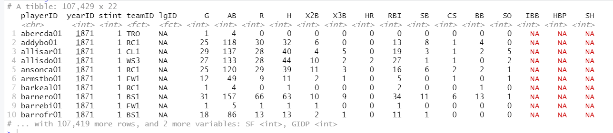

# dplyr

데이터 전처리 (s-a-c) 패키지 : dplyr

데이터 분할 ( s ) - > 분할 자료에 대해 함수를 적용 (A) -> 결과를 취합(C)

arrange(정렬) , filter (행추출), select (열추출) , mutate(열추가), summarise(요약)

## filter

```
#airquality[airquality$Month==6,]
#subset(airquality,subset = (Month==6))

filter(airquality, Month==6) #위를 간단하게 표현
```

```
air<-filter(airquality, Month==6,Temp>90) #(,는 and)
head(air)
```

6월 , temp>90인 airquality 행 추출


## slice, arrange

```

#slice() : 단순히 특정 위치의 행데이터 추출
slice(airquality,6:10)

#arrange() : 데이터프레임을 정렬 (지정한 열을 기준으로..)
arrange(airquality,desc(Temp))

arrange(airquality,desc(Temp),Month,Day) #동점일때 정렬기준
```


## select 

열이름 변경 select 말고 rename 추천

select+distinct (= unique)

```
> distinct(select(airquality,Month))
  Month
1     5
2     6
3     7
4     8
5     9
> unique(airquality$Month)
[1] 5 6 7 8 9
```


## mutate 

: 새로운 열(파생변수) 추가

airquality$Temp
#화씨 -> 섭씨 (화-32)/1.8

```
> head(mutate(airquality, temp.c=(Temp-32)/1.8))
  Ozone Solar.R Wind Temp Month Day   temp.c
1    41     190  7.4   67     5   1 19.44444
2    36     118  8.0   72     5   2 22.22222
3    12     149 12.6   74     5   3 23.33333
4    18     313 11.5   62     5   4 16.66667
5    NA      NA 14.3   56     5   5 13.33333
6    28      NA 14.9   66     5   6 18.88889
```


식 바로 대입 mutate 함수는 생성한 새로운 열을 동일한 함수 내에서 사용 가능

```
head(mutate(airquality, Temp.c=(Temp-32)/1.8
, Diff=Temp.c-mean(Temp.c)))
```


```
> transform(airquality, Temp.c=(Temp-32)/1.8,Diff=Temp.c-mean(Temp.c))
Error in eval(substitute(list(...)), `_data`, parent.frame()) : 
  객체 'Temp.c'를 찾을 수 없습니다
```

=> 동일한 함수 내에서 사용 가능하지 않기 떄문에!


## summarise

: 요약통계

```
summarise(airquality,
          Min=min(Temp, na.rm=TRUE),
          Median=median(Temp, na.rm=TRUE),
          Mean=mean(Temp, na.rm=TRUE),
          Sd=sd(Temp, na.rm=TRUE),
          Max=max(Temp, na.rm=TRUE),
          N=n(),
          Distict.Month=n_distinct(Month),
          First.Month=first(Month),
          Last.Month=last(Month),
        )
        
  Min Median     Mean      Sd Max   N
1  56     79 77.88235 9.46527  97 153
```


## sample

```
#sample_n표본 추출(개수)
#sample_frac:표본 추출(비율)
#옵션: replace=T (복원추출)

sample_n(airquality,5)
sample_frac(airquality,0.1)
```


## group_by 함수

: 그룹별로 분할

```
air.group<-group_by(airquality, Month) #월별로 그룹화
air.group
```


```
# A tibble: 153 x 6
# Groups:   Month [5]
   Ozone Solar.R  Wind  Temp Month   Day
   ...
```

5개로 그룹화 됨 그룹 단위 함수 적용 

```
summarise(air.group, Mean_Temp=mean(Temp, na.rm=TRUE)
          )
          
summarise(group_by(airquality,Month), 
          Mean_Temp=mean(Temp, na.rm=TRUE)
)
```

그룹단위로 mean 연산


# `%>%` 파이프 연산자 

: `%>% ` 한 함수로부터 연산 결과가 다음 함수의 인수로 전달되록 하는 연산자

컨트롤 쉬프트 m

```
> iris %>% head

Sepal.Length Sepal.Width Petal.Length Petal.Width Species
1          5.1         3.5          1.4         0.2  setosa
2          4.9         3.0          1.4         0.2  setosa
3          4.7         3.2          1.3         0.2  setosa
4          4.6         3.1          1.5         0.2  setosa
5          5.0         3.6          1.4         0.2  setosa
6          5.4         3.9          1.7         0.4  setosa

> 1:10 %>% mean
[1] 5.5
```

중간중간에 임시로 저장하지 않아도 되서 편리하다


```
a1<-select(airquality, Ozone, Temp,Month)
head(a1)

a1.group<-group_by(a1,Month)
a1.group

a2<-group_by(a1,Month)
a3<-summarise(a2,
          Mean.Ozone=mean(Ozone, na.rm=T),
          Mean.Temp=mean(Temp, na.rm=T)
          )
#a2의 자료를 오존열에 대한 평균값을 구하고 평균값을 Mean.Ozone에 저장 후(밑에것도) 요약한다
a4<-filter(a3, Mean.Ozone>40 | Mean.Temp>80)
```


* 위 a4까지 과정 `%>%`로 줄여쓰기 

```
(중간해석)
airquality %>% 
  select(Ozone, Temp, Month) %>% #세개 추출한 다음
  group_by(Month) # month열을 기준으로 그룹화해라
```

```
airquality %>% 
  select(Ozone, Temp, Month) %>% #세개 추출한 다음
  group_by(Month) %>%
  summarise(Mean.Ozone=mean(Ozone, na.rm=T),
            Mean.Temp=mean(Temp, na.rm=T)) %>%
  filter(Mean.Ozone>40 | Mean.Temp>80) #a4

```


tibble

```
air_df<-as.data.frame(air) #tibble -> data frame
air_df

#data frame -> tibble
tbl_df(air_df)
```


```
install.packages("Lahman")
library(Lahman)
str(Batting)
tail(Batting)

Batting.tbl.df<-tbl_df(Batting)
Batting.tbl.df
```

티블은 줄이 안바뀌고 화면에 들어오도록 구성해줌




## melt , dcast

melt : 와이드형 -> 롱형 변환

dcast :와이드형<-롱형 변환


```
install.packages("reshape2")
library(reshape2)

> smiths #reshape2의 데이터
     subject time age weight height
1 John Smith    1  33     90   1.87
2 Mary Smith    1  NA     NA   1.54

#melt 와이드 => 롱 포맷으루

smiths.long<-melt(data=smiths)
> smiths.long
     subject variable value
1 John Smith     time  1.00
2 Mary Smith     time  1.00
3 John Smith      age 33.00
4 Mary Smith      age    NA
5 John Smith   weight 90.00
6 Mary Smith   weight    NA
7 John Smith   height  1.87
8 Mary Smith   height  1.54
```


dcast : 롱 -> 와이드
변수 배치는 formula로 지정
x~y : x에는 식별자 변수, y에는 측정 변수, 변수 여러개 일때 +로 연결

```
> smiths.wide<-dcast(smiths.long, formula=subject ~ variable)
> smiths.wide

     subject time age weight height
1 John Smith    1  33     90   1.87
2 Mary Smith    1  NA     NA   1.54
```


```
airquality #와이드드형 자료 
#롱형으로 변환

aq.long<-melt(airquality)
aq.long
```


```
#Month 와 Day를 묶어서 식별자로 사용용
aq.long<-melt(airquality, id.vars=c("Month", "Day"))
head(aq.long)
```

```
#aq.long -> 와이드형 변환 
#변수 배치는 formula로 지정
#x~y : x는 식별자 변수 y에는 측정변수 여러개 +로 연결

dcast (aq.long, formula = Month+Day ~ variable)
```


# 예제

```

exam<-read.csv("csv_exam.csv")
exam

#exam에서 class가 1인 자료들만 추출 (%>% 사용)
exam %>% 
  filter(class==1)

exam %>% 
  filter(!class==1)


exam %>% 
  filter(math>50 , class==1)

exam %>% 
  filter(math>=90 | english >=90)

exam %>% 
  filter(class==1|class==2|class==3)
#아니면 %in% 이용
exam %>% 
  filter(class %in% c(1,2,3))

class1<-exam %>% filter(class==1)
  class2<-exam %>% filter(class==2)
  
#id열과 math열 추출, 앞부분 6개만 (10개면 head(10))
  exam %>% 
  select(id, math) %>% 
  head
  
# math 기준 오름차순
  
exam %>% 
  arrange(math)
  
#수학,영어,과학 모두 더해 total 변수 추가
exam %>% 
  mutate(total=sum(math,english,science))

exam %>% 
mutate(total=sum(math,english,science),
	mn=total/3) %>% 
	head
	
exam %>% 
  mutate(test=ifelse(science<=60, "pass", "fail")) %>% 
  head
 
#점수 더해서 total, 오름차순 정렬
exam %>% 
mutate(total=math+english+science) %>% 
arrange(total) %>% 
head

#반별 수학 평균
> exam %>% 
+   group_by(class) %>% 
+   summarise(Math_Mean=mean(math))

# A tibble: 5 x 2
  class Math_Mean
* <int>     <dbl>
1     1      46.2
2     2      61.2
3     3      45  
4     4      56.8
5     5      78 

mpg %>% 
  group_by(manufacturer) %>% 
  filter(class=="suv") %>% 
  mutate(tot=(cty+hwy)/2) %>%  #mean이 안되네?
  summarise(mean_tot=mean(tot))   #그룹별 통합 연비의 평균

```


left_join() : 열데이터 합치기

bind_rows(): 행 데이터 합치기

```
# 중간고사 데이터 생성
test1 <- data.frame(id = c(1, 2, 3, 4, 5),
                    midterm = c(60, 80, 70, 90, 85))
# 기말고사 데이터 생성
test2 <- data.frame(id = c(1, 2, 3, 4, 5),
                    final = c(70, 83, 65, 95, 80))

left_join(test1,test2, by="id")

  id midterm final
1  1      60    70
2  2      80    83
3  3      70    65
4  4      90    95
5  5      85    80
```

id 기준으로 포개진다


