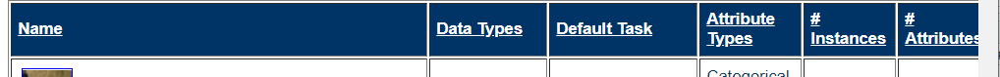

# graphics 패키지 

: 고수준 그래픽 함수, 저수준 그래픽 함수


1) 고수준 : 완전한 하나의 그래프

plot() , boxplot, hist(), crve(), ...

2) 저수준 : 독자적으로 그래픽 생성 불가

완성된 그래프에 요소를 첨가하는 역할

points(), lines(), abline(), text(), polygon() , ...


```
plot(faithful)
library(dplyr)
# 분출시간 3이상 빨갛게 표시

#eruptions.long<- 
#  faithful %>% filter(eruptions>3)
eruptions.long<- 
  faithful[faithful$eruptions>3,]

points(eruptions.long, col="red",pch=19)

```


창닫기 :`dev.off()`


# 선형회귀모델 

`lm` 변수들간의 선형성을 바탕으로 회귀해서 값을 예측 

연속형에 해당하는 값을 예측할때

```
lm(waiting~eruptions,data=faithful)

Coefficients:
(Intercept)    eruptions  
      33.47        10.73  
```

분출시간에 따라 대기시간의 변화가 어떠한지

y 절편 : 33.47 기울기 : 10.73   (y=10.73x+33.47)

x에 eruptions가 대입되면서 waiting을 예측


## fitted

: 회귀모델에서 예측값 추출

```
plot(faithful)
points(eruptions.long, col="red",pch=19)

#head(faithful)
#print(10.73*3.6 +33.47) #72.098 값비교
#head(fitted(faithful.lm)) #72.10111

#회귀선
lines(x=faithful$eruptions, y=fitted(faithful.lm),col="blue")

```


abline : y= ax+ b 에서 a b

```
abline(v=3, col="purple")
abline(h=mean(faithful$waiting), col="green")
```


# 박스

```
#벡터이므로 산점도 그래프로 출력됨
plot(cars$speed, cars$dist)
plot(cars)
```


첫번째 인수가 팩터 -> 박스 플랏 

```
str(ToothGrowth)
plot(ToothGrowth$supp, ToothGrowth$len)
```


아웃라이어 : 이상치


```
str(iris)
plot(iris[,1:4]) #시각화 변수가 많으면 산점도 행렬로 표현
```


```
UCBAdmissions
str(UCBAdmissions)
plot(UCBAdmissions)
#모자이크 조각의 크기로 교차표의 상대적 빈도 확인
```


# plot 저장

```
windows()
plot(faithful)
savePlot("imgplot.pdf", type="pdf")

windows()
plot(faithful)
savePlot("imgplot.png", type="png")
```


# KNN 알고리즘

최근접 알고리즘 


세모일까 네모일까 ? k=  홀수로 주기 

근처 거리를 구함 -> 가장 가까운 거리인 걸 따라감

사용 사례 

- 컴퓨터비전
- 추천시스템(영화, 음악)
- 질병분류, 유전자 데이터 패턴 인식

장점

쉽다, 훈련이 빠르다, 데이터 분포에 대한 가정을 하지 않는다

단점

k값 어떻게? , 분류 작업이 느리다 , 직관적이지 않다 (데이터를 이해하기 어렵다)




Default Task : 추천 or 분류 or  예측 유형

Attribute : 변수의 타입

Instances : 관측치의 개수 


# 암 분류기

```
#머신러닝 - Knn 알고리즘을 이용한 암 분류기 제작
wbcd<-read.csv("wisc_bc_data.csv")
str(wbcd)

wbcd<-wbcd[-1]
str(wbcd)
table(wbcd$diagnosis)

wbcd$diagnosis<-factor(wbcd$diagnosis, levels=c("B","M"),
       labels=c("Benign", "Malignant"))
str(wbcd)

round(prop.table(table(wbcd$diagnosis))*100,1)

summary(wbcd[c("radius_mean","area_mean","smoothness_mean")])

normalize <- function(x){
  return ( (x-min(x)) / (max(x)-min(x)) )
}

normalize(c(10, 20, 30, 40, 50))

str(wbcd)

wbcd_n<-as.data.frame(lapply(wbcd[2:31], normalize))

wbcd

#연습문제 8:2의 비율로 트레인/테스트 데이터셋 생성
#sample함수도 적용해보세요

wbcd_train<-wbcd_n[1:469,]
wbcd_test<-wbcd_n[470:569,]

wbcd_train_labels<-wbcd[1:469,1]
wbcd_test_labels<-wbcd[470:569,1]

#모델 생성

library(class)

wbcd_test_pred<-knn(train=wbcd_train, test=wbcd_test,
    cl=wbcd_train_labels, k=21)

wbcd_test_pred #예측결과
wbcd_test_labels #정답

#cross table
library(gmodels)
CrossTable(x=wbcd_test_labels, y=wbcd_test_pred)

#표준화
wbcd_z<-as.data.frame(scale(wbcd[-1]))
summary(wbcd_z$area_mean)

wbcd_train<-wbcd_z[1:469,]
wbcd_test<-wbcd_z[470:569,]

wbcd_test_pred<-knn(train=wbcd_train, test=wbcd_test,
                    cl=wbcd_train_labels, k=21)
CrossTable(x=wbcd_test_labels, y=wbcd_test_pred)

#퀴즈2
#k값에 대해 변화를 주면서
#가장 테스트 정확도가 높았을때 k값?(1~25)
#코드와 정확도를 함께 카피하여 카페에 제출

wbcd_test_labels
wbcd_test_pred

sum(wbcd_test_labels==wbcd_test_pred)/length(wbcd_test_pred)

```


crosstable 해석법

[#](https://blog.naver.com/PostListByTagName.nhn?blogId=nyaminyam&encodedTagName=) 일반횟수
[#](https://blog.naver.com/PostListByTagName.nhn?blogId=nyaminyam&encodedTagName=) 카이 제곱 ( 기대치 비율 )
[#](https://blog.naver.com/PostListByTagName.nhn?blogId=nyaminyam&encodedTagName=) 행을 기준으로 비율 값 ( 가로로 읽는다. )
[#](https://blog.naver.com/PostListByTagName.nhn?blogId=nyaminyam&encodedTagName=) 컬럼을 기준으로 비율 값 ( 세로로 읽는다. )
[#](https://blog.naver.com/PostListByTagName.nhn?blogId=nyaminyam&encodedTagName=) 전체를 기준으로 비율 값


