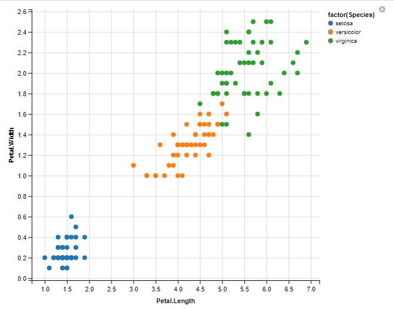
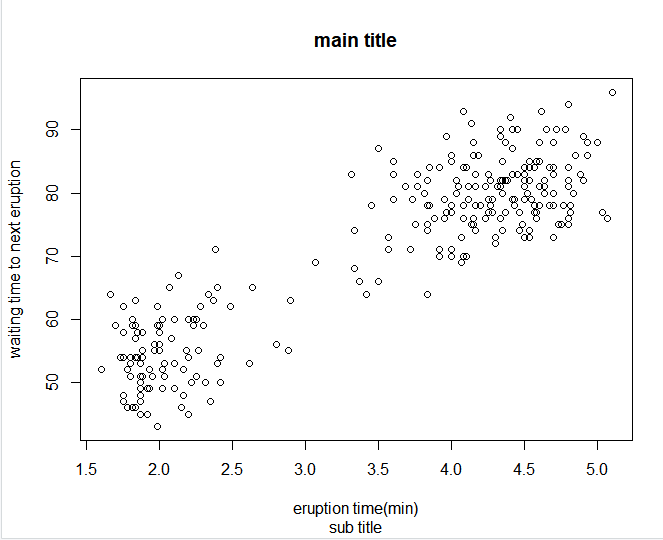
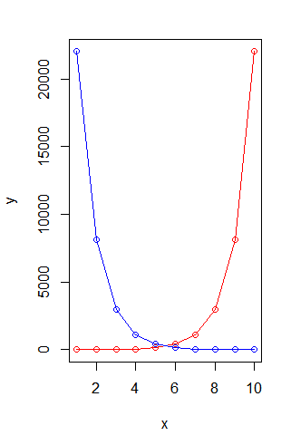
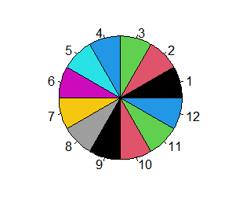
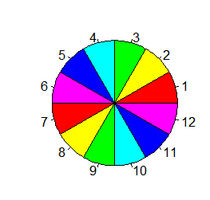
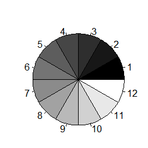
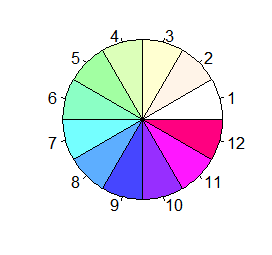
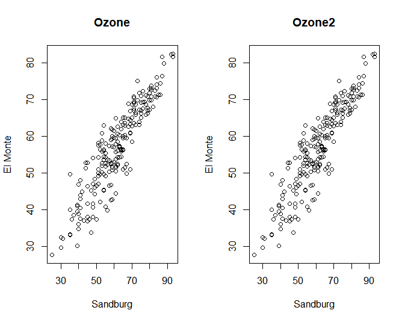
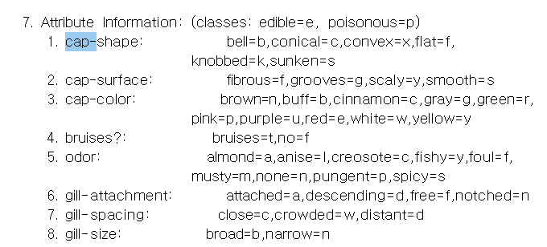
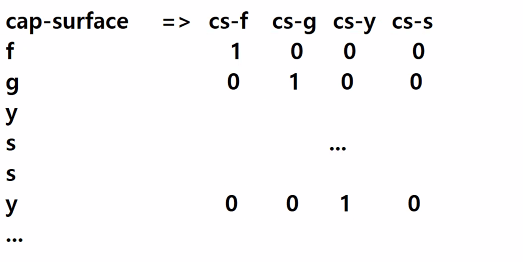

# 🚢titanic review

## switch 함수

```
x<-c(5,6,7,8)
switch (1,mean(x), sum(x), var(x))
```

1 -> mean , 2-> sum, 3-> var


* 불러오기

```
train <-read.csv("train.csv")
test<-read.csv("test.csv")

#Name,Ticket,Cabin 컬럼 제거
train<-train[, -c(4,9,11)]
names(test)
test<-test[, -c(3,8,10)]
```


* 0,1,... 로 바꿔주기 

```
#성별 0,1 전환
train$Sex<-sapply(train$Sex, switch, 'male'=0, 'female'=1)
test$Sex<-sapply(test$Sex, switch, 'male'=0, 'female'=1)

#승선 항구 C =0, Q=1, S=2로 변환
train$Embarked<-sapply(train$Embarked, switch, 'C'=0, 'Q'=1,'S'=2)
test$Embarked<-sapply(test$Embarked, switch, 'C'=0, 'Q'=1,'S'=2)

```


* na 없애기

```
#나이와 운임열의 NA 제거
train_age<-na.omit(train$Age)
train_age
train_age_avg<-mean(train_age) #na 제외한 나이의 평균
train$Age[is.na(train$Age)]<-train_age_avg

test_age<-na.omit(test$Age)
test_age
test_age_avg<-mean(test_age)
test$Age[is.na(test$Age)]<-test_age_avg

test_fare<-na.omit(test$Fare)
test_fare_avg<-mean(test_fare)
test$Fare[is.na(test$Fare)]<-test_fare_avg
```


* 나이 (18세라는 기준은 시각화를 해보고 결정하는 값이여야 함)

```
#나이가 18세 이상이면 0, 아니면 1로 치환
train$Age<-ifelse(train$Age<18,1,0)
test$Age<-ifelse(test$Age<18,1,0)
```


* 정규화

```
#정규화 ( 운임, 등실 )
normalize<-function(x){
  num<-x-min(x)
  denom<-max(x)-min(x)
  return (num/denom)
}
train$Pclass<-normalize(train$Pclass) 
test$Pclass<- normalize(test$Pclass)

test_length<-length(test$Fare)
fare<-normalize(c(train$Fare,test$Fare)) #합쳐서 노말라이징 하는 법 

train$Fare<-fare[1:(length(fare)-test_length)] #train데이터 추출
test$Fare<-fare[(length(fare)-test_length+1):length(fare)] #


```


# 🌼iris 시각화

```
install.packages("ggvis")
library(ggvis)
library(dplyr)

iris
iris %>% 
  ggvis(~Petal.Length, ~Petal.Width, fill=~factor(Species)) %>% 
  layer_points()
```

종별로 색상 구분 



```
mmn<-function(x){
  num<-x-min(x)
  denom<-max(x)-min(x)
  return(num/denom)
}

iris_n <- as.data.frame(lapply(iris[1:4], mmn))
summary(iris_n)

#67%:33%
table(iris$Species)
set.seed(1234)
sample(2, nrow(iris),replace=T, prob=c(0.67, 0.33))
#150개 1 아니면 2로 복원추출 비율은 prob
```

1 아니면 2로 복원추출 비율은 1이 67퍼센트


```
sample(x, size, replace = FALSE, prob = NULL) #샘플 설명
```


#  plot 부가 설명 달기


```
plot(faithful,
     main="main title",
     sub="sub title",
     xlab="eruption time(min)",
     ylab="waiting time to next eruption")
```




첨자 추가되고 숫자 돌아감

```
plot(faithful, las=0) # 기본 값 변화 없음
plot(faithful, las=1) 
plot(faithful, las=2)
plot(faithful, las=3)
```


외곽선의 모양

```
plot(faithful, bty='o')
plot(faithful, bty='n')
plot(faithful, bty='l')
plot(faithful, bty=']')
```

세모세모

```
plot(faithful, pch=24 , col="green2", bg="blue")
```

선바꾸기

```
plot(LakeHuron, lty="solid")
plot(LakeHuron, lty="dashed")
plot(LakeHuron, lty="dotted")
plot(LakeHuron, lty="twodash")
```

type="n" nothing, 그래프 틀만 생성

사용자 정의 형식의 그래프 생성 하고자 할때

lienes 단독으로 존재할 수 없다

```
x<-1:10
y1<-exp(1:10)
y2<-exp(10:1)
plot(x,y1,type="n",ylab="y")
lines(x,y1,type="o",col="red")
lines(x,y2,type="o",col="blue")
```



격자 grid()

```
plot(faithful, type="n")
grid()
points(faithful, pch=19, col="blue")
```

# 🎨색깔

```
colors() : col 속성 값

head(colors(),10)
grep("purple",colors(),value=T)

palette("default")#기본 색상 파레트

palette(rainbow(6))
palette()

```



기본 / 레인보우(6)

```
pie(rep(1,12), col=gray(level=seq(0,1,length=12)))
pie(rep(1,12), col=rainbow(12,alpha =seq(0,1,length=12)))
#alpha 는 투명도, 0이면 완전 투명, 1이면 불투명
```




```
pie(rep(1,12), col=heat.colors(12))
pie(rep(1,12), col=terrain.colors(12))
pie(rep(1,12), col=cm.colors(12))
```

그라데이션 효과


```
install.packages("mlbench")
library(mlbench)
data("Ozone")
plot(Ozone$V8, Ozone$V9)
plot(Ozone$V8, Ozone$V9, xlab = "Sandburg", ylab="El Monte", main="Ozone", pch="+")


plot(Ozone$V8, Ozone$V9, xlab = "Sandburg", ylab="El Monte", main="Ozone", cex=1) #기본크기
plot(Ozone$V8, Ozone$V9, xlab = "Sandburg", ylab="El Monte", main="Ozone", cex=0.1)
plot(Ozone$V8, Ozone$V9, xlab = "Sandburg", ylab="El Monte", main="Ozone", cex=2)
```

cex 로 크기 조절 가능

```
plot(Ozone$V8, Ozone$V9, xlab = "Sandburg", ylab="El Monte", main="Ozone", cex=1, col="red") #색
```

lim

```
plot(Ozone$V8, Ozone$V9, xlab = "Sandburg", ylab="El Monte", main="Ozone", cex=1, col="red", xlim=c(0,150), ylim=c(0,100))
```


# tapply 응용

```
tapply(1:10, rep(1,10),sum)
#1은 1번 그룹, 2는 1번 그룹, ... 10은 1번 그룹
#모든 수가 1번 그룹에 소속 된다!

# 홀 , 짝 끼리 합
tapply(1:10,ifelse(x%%2==1,"홀","짝"),sum)
# 선생님 tapply(1:10,1:10%%2==1,sum)
```

tapply(데이터, 그룹 , 함수)

```
#iris에서 종별 sepal.l 의 평균
tapply(iris$Sepal.Length, iris$Species ,mean)

#각각의 speed마다 평균 dist를 계산
tapply(cars$dist,cars$speed,mean)

plot(tapply(cars$dist,cars$speed,mean), type="o", xlab="speed",ylab='dist', cex=0.7)
```

mean() 아님 주의!


## par 창 나누기 

```
opar<-par(mfrow=c(1,2))

plot(Ozone$V8, Ozone$V9, xlab = "Sandburg", ylab="El Monte", main="Ozone")
plot(Ozone$V8, Ozone$V9, xlab = "Sandburg", ylab="El Monte", main="Ozone2")

# par(opar) 로 재활용 가능
```



```
p11<-par(mfrow=c(1,1)) #한줄에 한칸
plot(Ozone$V8, Ozone$V9, xlab = "Sandburg", ylab="El Monte", main="Ozone")

p12<-par(mfrow=c(1,2)) #한줄에 두칸
plot(Ozone$V8, Ozone$V9, xlab = "Sandburg", ylab="El Monte", main="Ozone")
plot(Ozone$V8, Ozone$V9, xlab = "Sandburg", ylab="El Monte", main="Ozone")

p12<-par(mfcol=c(2,1)) #2줄 1개씩
plot(Ozone$V8, Ozone$V9, xlab = "Sandburg", ylab="El Monte", main="Ozone")
plot(Ozone$V8, Ozone$V9, xlab = "Sandburg", ylab="El Monte", main="Ozone")

```

c(2,2) 면 총 4개 


# 🍄mushroom



cap- surface의 4가지 종류라고 1,2,3.. 이렇게 하면 망함

f

g

y

s 별로 features 나눠줘야한다 => 원핫인코딩



해주고 유클리디안 거리

결측값이 너무 많아서 대체도 해줘야됨 -> knn 으로


