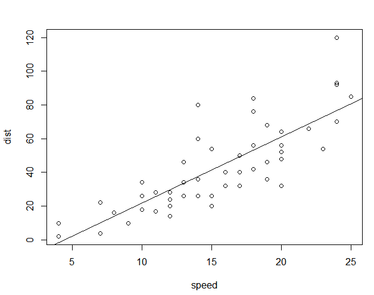
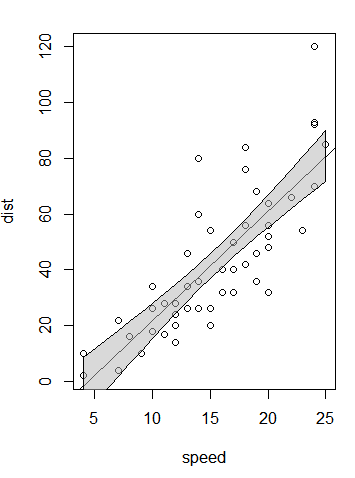
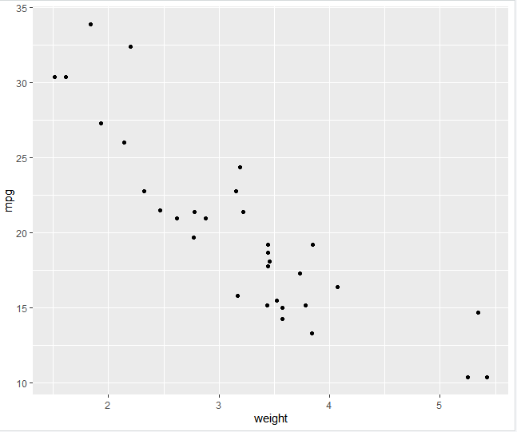
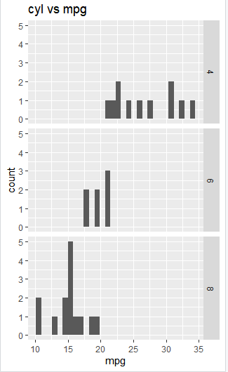
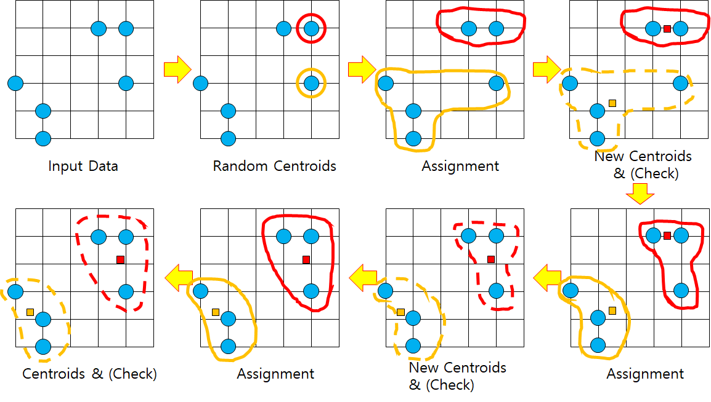
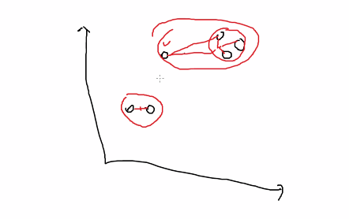

```
m<-lm(dist~speed,cars) #종속변수(y) ~ 독립변수(x)
m
abline(m)
```



회귀선

신뢰구간 표시

```
p<-predict(m, interval ="confidence")

> p
         fit        lwr       upr
1  -1.849460 -12.329543  8.630624
2  -1.849460 -12.329543  8.630624
3   9.947766   1.678977 18.216556
4   9.947766   1.678977 18.216556
```

fit이 회귀모델로 적합된 값

lwr : 신뢰구간의 하한

upr : 신뢰구간의 상한

```
x<-c(cars$speed, tail(cars$speed,1), rev(cars$speed), cars$speed[1])
#tail(cars$speed)
y<-c(p[,"lwr"], tail(p[,"upr"],1), rev(p[,"upr"]), p[,"lwr"][1])
polygon(x,y,col=rgb(.7, .7, .7 ,.5))
```



다각형에 필요한 4개의 점 


```
text(cars$speed, cars$dist, pos=4, cex=.5)
```

pos는 text 위치


범례

```
plot(iris$Sepal.Width, iris$Sepal.Length, cex=.5, pch=20, xlab="width", ylab="length")

points(iris$Sepal.Width, iris$Petal.Length, cex=.5, pch="+", col="#ff0000")

legend("topright",legend=c("Sepal","Petal"),pch=c(20,43)
,cex=.8, col=c("black","red"),bg="gray")
```


박스플랏

```
boxstats<-boxplot(iris$Sepal.Width)
boxstats

boxplot(iris$Sepal.Width, horizontal = T) #눕히기, 안쓰면 세로
```


히스토그램으로 분포 살펴보기

```
hist(iris$Sepal.Length)
#hist(x, breaks="Sturges) Sturges=log2(n)+1
log2(150)

x<-hist(iris$Sepal.Length, freq=F)
x #면적의 합이 1
```


밀도 그림 함수 바 - 선

```
plot(density(iris$Sepal.Width))

plot(density(iris$Sepal.Width))

hist(iris$Sepal.Width, freq=F)
lines(density(iris$Sepal.Width))
```


```
barplot(tapply(iris$Sepal.Width, iris$Species, mean))
```

```
pie(table(cut(iris$Sepal.Width, breaks=10)), cex=.7)
```


# ggplot2


```
library(ggplot2)

ggplot(data=mtcars, aes(x=wt, y=mpg))+
  geom_point()+
  labs(titile="mytitle",
       x="weight", y="mpg")
```




배경 + 점 +축 제목

data frame 이여야 함 


```
mtcars$gear<-factor(mtcars$gear, levels=c(3,4,5),
                    labels=c("3 gears","4 gears","5 gears"))

mtcars$cyl<-factor(mtcars$cyl, levels=c(4,6,8),
                    labels=c("4 cylinders","6 cylinders","8 cylinders"))

ggplot(data=mtcars, aes(x=mpg))+
  geom_histogram()+
  facet_grid(cyl~ .)+
  labs(title="cyl vs mpg")
# 모든 실린더 종류별루 mpg 
```




facet 집단간 분할 비교

`facet_grid(Type ~.)` : 타입 하위에 애들 집단 비교


```
mtcars$gear<-factor(mtcars$gear, levels=c(3,4,5),
                    labels=c("3 gears","4 gears","5 gears"))

mtcars$cyl<-factor(mtcars$cyl, levels=c(4,6,8),
                    labels=c("4 cylinders","6 cylinders","8 cylinders"))

ggplot(data=mtcars, aes(x=cyl, y=mpg))+
  geom_boxplot()+
  labs(x="cyl",y="mpg")

ggplot(data=mtcars, aes(x=mpg, fill=cyl))+
  geom_density()+
  labs(x="mpg")
```


# k means



(1) 데이터 6개 , 몇개의 그룹으로 나눌까? k 

(2) k=2 인 상태에서, 임의로 2개의 데이터를 찾아냅니다. centroids : 그룹(클러스터)의 중심점을 의미한다.

(3) 할당 : 유클리디안 거리를 구해서 assign,  센트로이드 중심으로 가까운 애들끼리 할당됨 

(4) 그룹내 평균점을 계산한다. 

(5) 그룹내 평균점으로 새로 그룹 분류함

(6) 새로운 그룹에서 평균점을 설정

(7) 거리 다시 다 구해서 그룹  update

(8) update가 없을때까지 반복해서 끝

* 처음 k로 랜덤하기 정하기 때문에 ~

k 에 대한 사전지식이 있으면 결정하기 좋은데 그냥 시각화해서 그룹의 개수 결정함

k = sqrt(n/2) , n:데이터 건수 ex) 데이터 100건이면 sqrt(100/2) -> 7

k값을 변화 시킴에 따라 나누어진 그룹에 대한 평가를 진행한다.


* 그룹내 동질성



체크 표시 된애가 애매함 동질성 떨어짐 (elbow 그래프 그려서 확인)

엘보우 그래프에서 꺾어지는 지점을 k로 하면 좋다!

# 📱snsdata

```
teens<-read.csv("snsdata.csv")
str(teens)

table(teens$gender)
table(teens$gender, useNA="ifany") #na 무시
summary(teens$age) #na 많음 , 나이도 이상치 있음
```

## 이상치 빼기

13세 이상 20세 미만을 정상범위로 하고 나머지를 NA로 묶기

```
teens$age<-ifelse(teens$age>=13 & teens$age<20,teens$age,NA )
summary(teens$age)

> summary(teens$age)
   Min. 1st Qu.  Median    Mean 3rd Qu.    Max.    NA's 
  13.03   16.30   17.27   17.25   18.22   20.00    5523 
```

성별

```
#성별 NA 처리 
teens$female<-ifelse(teens$gender=="F" & !is.na(teens$gender),1,0)  #여성인지 여부
```


* 퀴즈 : 졸업 연도별 나이평균 출력

```
#방법1
class(tapply(teens$age, teens$gradyear, mean,na.rm=T)) #array
teens %>% group_by(gradyear) 
  %>%  summarise(mean(age, na.rm=T))

aggregate(data=teens, age ~gradyear, mean, na.rm=T)
```

aggregate: 그룹별로 각각 함수를 적용 
`aggregate(벡터, 리스트(집단 변수), fun)`

```
#방법2
ave_age<-ave(teens$age, teens$gradyear, FUN=function(x) mean(x,na.rm=T))
#na가 있어서 function 으로 뒤에 붙음!!
teens$age<-ifelse(is.na(teens$age), ave_age, teens$age) #대체해서 넣어주기
```

na 없으면 그냥 FUN=mean

* 클러스트링

```
#kmeans 클러스터링
interests<-teens[5:40]
interests_z<-as.data.frame(lapply(interests,scale))
interests_z
set.seed(2345)
teen_clusters<-kmeans(interests_z,5) #5개 그룹으로 군집화

teen_clusters
```

 ** 결과

```
K-means clustering with 5 clusters of sizes 1038, 601, 4066, 2696, 21599
```

=> 21599 제일 많은거 : 그냥 저냥 그런 그룹 (?) 

2696 : 스포츠를 강하게 좋아하거나 마약을 강하게 좋아하는 특성을 띄는 그룹

5:40 -> 36개 -> 36차원 공간으로 centroids 구함 총 5개 나온다

```
Cluster means:
    basketball    football      soccer   softball  volleyball
1  0.362160730  0.37985213  0.13734997  0.1272107  0.09247518
2 -0.094426312  0.06691768 -0.09956009 -0.0379725 -0.07286202
3  0.003980104  0.09524062  0.05342109 -0.0496864 -0.01459648
4  1.372334818  1.19570343  0.55621097  1.1304527  1.07177211
5 -0.186822093 -0.18729427 -0.08331351 -0.1368072 -0.13344819
```

그룹당 중심점 좌표. 컬럼단위로 표준화 함 평균은 0 표준편차 1


```
Clustering vector:
   [1] 5 3 5 5 1 5 3 5 5 3 5 5 5 5 5 5 5 5 5 3 3 5 5 5 5 5 5 1
  [29] 5 5 5 4 5 5 5 5 4 5 5 1 5 5 5 5 5 5 3 5 5 4 3 2 3 5 3 5
```

첫번째 학생 : 5번그룹 , 두번째 학생 : 3번 그룹, ...

```
teen_clusters$size #각 클러스터에 할당된 데이터 개수
teen_clusters$centers # 각 클러스터의 중심점 행렬
teen_clusters$cluster #각 데이터별 할당된 클러스터 번호
```


teen_clusters에서,

```
Within cluster sum of squares by cluster:
[1] 184943.37  36141.05 298540.06 161486.31 265012.38
 (between_SS / total_SS =  12.4 %)
```


```
teen_clusters$withinss 
[1] 184943.37  36141.05 298540.06 161486.31 265012.38

teen_clusters$tot.withinss #위에 값 더한것
```

withinss : 각 클러스터 내의 데이터간 거리의 제곱 합 동질성과 관련됨.  값이 작을수록 클러스터링이 잘 된 것


```
teen_clusters$betweenss #클러스트 간 중심의 거리 제곱합
#값이 클 수록 클러스터링이 잘 된것
```


진짜 결과

```
teens$cluster <- teen_clusters$cluster
teens

#클러스터 나이의 평균
aggregate(data=teens,age ~cluster, mean)

#클러스터 성비
aggregate(data=teens, female ~cluster, mean)

#클러스터 친구수
aggregate(data=teens, friends ~cluster, mean)
```


+문제 풀다

# 결측치 찾기

## complete.cases()

: 각 행에 적용되며 NA값이 하나라도 존재하는 행을 찾는데 편리하다

## is.na()

: 한 컬럼에 대해 NA 여부 조사


