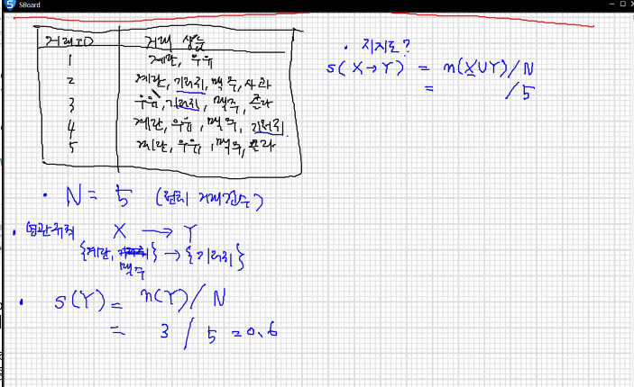
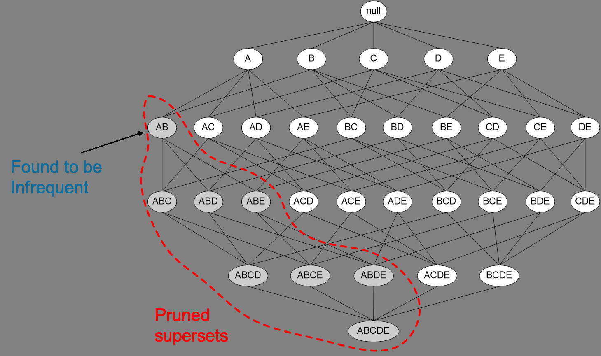
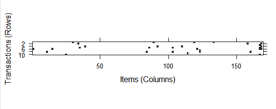
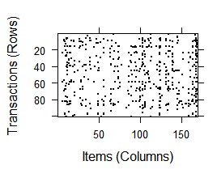
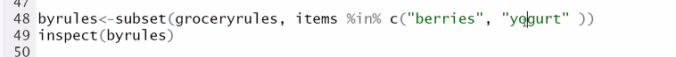

x -> y : x구매한사람이 y도 구매

N : 전체 거래 건수

m(X) : x거래건수


지지도 (support) : x와 y를 모두 포함하는 거래횟수/ 전체 거래 수

= n(X∪Y) / N

S(X->Y) : X구매자가 Y도 구매하는 규칙에 대한 지지도


신뢰도 (confidence) : 항목집합 X를 포함하고 있는 거래 중에서 항목집합 Y도 포함하는 거래비율   n(X∪Y)/n(X)

C(X->Y)


향상도(lift) :  C(X-> Y)/ S(Y)  신뢰도/지지도

 항목집합 Y의 확률 대비 항목집합 X가 주어졌을때 항목집합 Y의 거래비율



x={계란, 맥주} y= {기저귀} 일떄

s(x->y) = 2/5 = 0.8 , c(x->Y) = 2/3 ,

 lift(x->y) = c(x->y)/s(y) =2/3 / 3/5=1.11

  s(y)= n(y)/N = 3/5 = 0.6

1이 됐다는 말은 규칙이 


IS 척도 = 루트(향상도*지지도)

교차지지도 = 최대지지도에 대한 최소지지도의 비율

최대/최소 지지도의 차이가 클수록 교차 지지도 작아짐 => 항목집합 X에서 생성되는 연관규칙은 의미없는 규칙일 가능성이 높다


# apriori 

I = {i1,i2, ... ,ik} 일떄
$$
부분집합갯수:  2^k -1 =>  3^k-2^{k+1}+1
$$

$$
X = \{A,B,C,D,E\} 일때,
2^5 -1 =31 개
$$


항목집합의 개수를 줄여서 연관규칙을 구하는 알고리즘

=> 빈발 항목집합에 대해서만 연관규칙을 찾아내자!

최소 지지도 이상에 해당하는 항목집합 = 빈발 항목집합 

**한 항목집합 빈발 -> 부분집합도 모두 빈발 항목집합이다**


# groceries

```df<-read.csv("groceries.csv",header=F)
df
str(df)
head(df,10)

install.packages("arules")
library(arules)
groceries<-read.transactions("groceries.csv", sep=",")
summary(groceries)
```

열이 다 달라서 조작

density of 0.02609146  

most frequent items: 거래 빈도수

```
class(groceries) #희소 행렬
inspect(groceries[1:10]) #트랜잭션 단위로 구매아이템 확인

itemFrequency(groceries[,]) #지지도 
itemFrequencyPlot(groceries)

itemFrequencyPlot(groceries, support=0.1) #최소 0.1 이상
itemFrequencyPlot(groceries, topN=25) #탑 25개

```


```
image(groceries[1:10])
image(sample(groceries,100))
```

어느쪽 거래가 많았는지 



100개 랜덤출력 행렬다이어그램 형식으로 출력

```
image(sample(groceries,100))
```



```groceryrules<-apriori(groceries, list(support=0.006, confidence=0.25, minlen=2))
groceryrules #463 개 룰
apriori(groceries) #0개 룰

summary(groceryrules)

#size 2 ={x} -> {y}
#size 3= {x,y} -> {z}..{x} ->{y,z}
```


```
> inspect(groceryrules[1:3])
    lhs                rhs               support     confidence coverage   lift     count
[1] {potted plants} => {whole milk}      0.006914082 0.4000000  0.01728521 1.565460 68   
[2] {pasta}         => {whole milk}      0.006100661 0.4054054  0.01504830 1.586614 60   
[3] {herbs}         => {root vegetables} 0.007015760 0.4312500  0.01626843 3.956477 69   
```

허브를 사느 사람이 vegetables를 산다 lift 젤 높음

```
inspect(sort(groceryrules, by="lift")) #lift를 기준으로로 정렬
```

berry를 기준으로

```
berryrules<-subset(groceryrules, items %in% "berries")
berryrules
inspect(berryrules)

    lhs          rhs                  support     confidence coverage  lift     count
[1] {berries} => {whipped/sour cream} 0.009049314 0.2721713  0.0332486 3.796886  89  
[2] {berries} => {yogurt}             0.010574479 0.3180428  0.0332486 2.279848 104  
[3] {berries} => {other vegetables}   0.010269446 0.3088685  0.0332486 1.596280 101  
[4] {berries} => {whole milk}         0.011794611 0.3547401  0.0332486 1.388328 116  
```



둘중에 하나만 있어도 출력되게


`%pin%` 부분 매칭 

`%ain%` 완전 매칭

```
allbyrules<-subset(groceryrules, items %ain% c("berries","yogurt"))
allbyrules
> inspect(allbyrules)
    lhs          rhs      support    confidence coverage 
[1] {berries} => {yogurt} 0.01057448 0.3180428  0.0332486
    lift     count
[1] 2.279848 104
```

두개다 모두 포함된 것

```
write(groceryrules, "groceryrules.csv", sep=",",quote=F,row.names=F)
#규칙 => 데이터프레임 변환 AS 함수
groceryrulseDF<-as(groceryrules, "data.frame")
groceryrulseDF
```


세부검색

```
inspect(subset(groceryrules, items %ain% "berries" & confidence>0.3))
```


