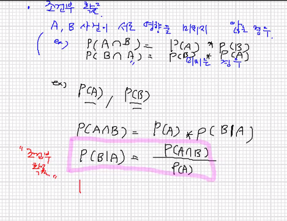
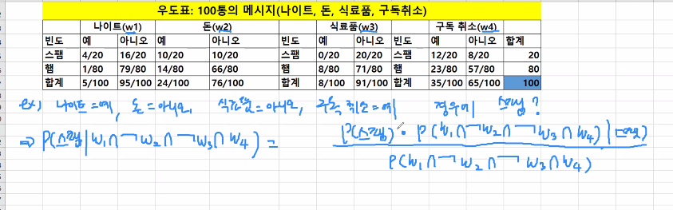
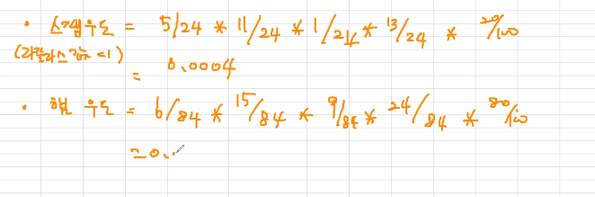

베이지안 확률의 이론은 사건에 대한 우도(likelihood)를 복수시행에서 즉시 이용할 수 있는 증거를 바탕으로 추정해야하는 아이디어에서 출발


사건 : 앞면, 당첨, 스팸

시행 : 동전던지기, 복권구매, 메일수신


사건확률? = 사건이 발생한 시행 횟수 / 전체 시행 횟수

p(비) = p(스팸)/p(햄) =0.2/(1-0.2) 

이전까지 메세지가 스팸일 확률 20% -> 지금 받은 메시지가 스팸일 확률 20%

근데 이제 다 BERT 씀 베이지안 필터안씀 



나이트 , 구독취소 예 돈,식료품 아니요 인 경우 스팸??

p(스팸|w1 ∩ not w2 ∩ not w3∩ w4) 





햄 -> 0.001

총 P 스팸 확률은 0.8


# 실습

```
smsraw<-read.csv("sms_spam_ansi.txt")
smsraw
str(smsraw)
smsraw$type <- factor(smsraw$type)
str(smsraw)

install.packages("tm")
library(tm)
library(stringr)
```


## string 분리

```
#공란처리 및 \t 처리
mytext<-c("software environment","software  environment","software\tenvironment")
mytext

> str_split(mytext, " ")
[[1]]
[1] "software"    "environment"

[[2]]
[1] "software"    ""            "environment"

[[3]]
[1] "software\tenvironment"
```


```
> sapply(str_split(mytext," "),length) #단어 길이
[1] 2 3 1
```

내가 원한게 2 2 2 인데 `str_split`로 분리가 안되서 이렇게 나뉨

```
> sapply(str_split(mytext," "),str_length) #글자수
[[1]]
[1]  8 11

[[2]]
[1]  8  0 11

[[3]]
[1] 20
```

\t 도 하나로 읽어서 20인 모습

### str_replace_all

```
#"[[:space:]]" : 탭, 엔터 등 공백 모두 포함
mytext.nowhitespace<-str_replace_all(mytext, "[[:space:]]{1,}"," ") #한글자 이상의 공백 선택

> mytext.nowhitespace
[1] "software environment" "software environment"
[3] "software environment"
```


```
> str_split(mytext.nowhitespace, " ") #단어수
[[1]]
[1] "software"    "environment"

[[2]]
[1] "software"    "environment"

[[3]]
[1] "software"    "environment"

> sapply(str_split(mytext.nowhitespace," "),str_length) #글자수수
     [,1] [,2] [,3]
[1,]    8    8    8
[2,]   11   11   11
```

길이가 기가막히게 나뉨

* str_extract_all

```
mytext<-"The 45th President of the United States, Donald Trump, states that he knows how to play trump with the former president"

> str_extract_all(mytext, boundary("word"))
[[1]]
 [1] "The"       "45th"      "President" "of"       
 [5] "the"       "United"    "States"    "Donald"   
 [9] "Trump"     "states"    "that"      "he"       
[13] "knows"     "how"       "to"        "play"     
[17] "trump"     "with"      "the"       "former"   
[21] "president"

myword<-unlist(str_extract_all(mytext, boundary("word")))
table(myword)

myword
     45th    Donald    former        he       how     knows 
        1         1         1         1         1         1 
       of      play president President    states    States 
        1         1         1         1         1         1 
     that       the       The        to     trump     Trump 
        1         2         1         1         1         1 
   United      with 
        1         1 
```

대소문자 통일하면 trump🃏 와 Trump👱‍♂️ , states💭 와 States가 같은 단어가 되버려서 문제가 발생한다. 


```
myword<-str_replace(myword, "Trump", "Trump_unique_")
myword<-str_replace(myword, "States", "States_unique_")
> table(tolower(myword))

          45th         donald         former             he 
             1              1              1              1 
           how          knows             of           play 
             1              1              1              1 
     president         states states_unique_           that 
             2              1              1              1 
           the             to          trump  trump_unique_ 
             3              1              1              1 
        united           with 
             1              1 
```

따로 따로 


2번 예제.  숫자+공백제거

```
mytext <- c("He is one of statisticians agreeing that R is the No. 1 statistical software.","He is one of statisticians agreeing that R is the No. one statistical software.")

str_split(mytext," ")
```

```
str_replace_all(mytext, "[[:digit:]]{1,}[[:space:]]{1,}","") #숫자가 한자리이상인것 -> 삭제
[1] "He is one of statisticians agreeing that R is the No. statistical software."    
[2] "He is one of statisticians agreeing that R is the No. one statistical software."
```

```
str_split(str_replace_all(mytext, "[[:digit:]]{1,}[[:space:]]{1,}","")," ") #숫자가 한자리이상 + 공백 삭제 위에꺼에 split 덧대줌

> mytext2
[[1]]
 [1] "He"            "is"            "one"          
 [4] "of"            "statisticians" "agreeing"     
 [7] "that"          "R"             "is"           
[10] "the"           "No."           "statistical"  
[13] "software."    

[[2]]
 [1] "He"            "is"            "one"          
 [4] "of"            "statisticians" "agreeing"     
 [7] "that"          "R"             "is"           
[10] "the"           "No."           "one"          
[13] "statistical"   "software."

str_c(mytext2[[1]],collapse=" ") #매끄럽게 하나로 이어준다
str_c(mytext2[[2]],collapse=" ")
```


의미가 모호해지는 경우

```
mytext3<-str_split(str_replace_all(mytext, "[[:digit:]]{1,}[[:space:]]{1,}","_number_")," ")
str_c(mytext3[[1]],collapse=" ") #의미가 모호해짐
str_c(mytext3[[2]],collapse=" ")
```


* 점, 공백문자 분리

```
#점, 공백문자 분리
mytext <- "Kim et al. (2014) argued that the state of default-setting is critical for people to protect their own personal privacy on the Internet."

str_split(mytext," ")
[[1]]
 [1] "Kim"             "et"              "al."            
 [4] "(2014)"          "argued"          "that"           
 [7] "the"             "state"           "of"             
[10] "default-setting" "is"              "critical"       
[13] "for"             "people"          "to"             
[16] "protect"         "their"           "own"            
[19] "personal"        "privacy"         "on"             
[22] "the"             "Internet."    


str_split(mytext,"\\. ") #특문 앞 \\
[[1]]
[1] "Kim et al"                                                                                                                    
[2] "(2014) argued that the state of default-setting is critical for people to protect their own personal privacy on the Internet."

mytext2<-str_replace_all(mytext,"-"," ")
mytext2

[1] "Kim et al. (2014) argued that the state of default setting is critical for people to protect their own personal privacy on the Internet."
```


# 🚫불용어 (stopwords)

: a, an, the ... 빈번하게 사용하지만 의미는 찾기 어려운 단어

```
mytext<-c("She is an actor", "She is the actor")
mystopwords<-"(\\ba )|(\\ban )|(\\bthe )"  #나만의 불용어 사전
str_remove_all(mytext,mystopwords)
[1] "She is actor" "She is actor"

stopwords("en") #기본적으로 저장되어있는 불용어들
stopwords("SMART") # 불용어들 더 많음

```


어근 동일화 작업

```
various_be<-"(\\b(a|A)m )|(\\b(a|A)re )(\\b(i|I)s )(\\b(W|w)as )(\\b(W|w)ere )"

mystemmer.func<-function(myt){
  mytext<-str_replace_all(myt,various_be,"be ")
  print(mytext)
  } #정규표현식 해당되는거 다 be 로 바꿈

mytext <- c("I am a boy. You are a boy. The person might be a boy. Is Jane a boy?")

> mystemmer.func(mytext)
[1] "I be a boy. You are a boy. The person might be a boy. Is Jane a boy?"
```


```
mytext <- "The United States comprises fifty states. In the United States, each state has its own laws. However, federal law overrides state law in the United States."
mytext<-unlist(str_extract_all(mytext, boundary("word")))

length(table(mytext)) #19개 (덩어리)
sum(table(mytext)) #빈도수의 합


mytext.2gram<-str_replace_all(mytext, "\\bunited States","United_States")
mytext.2gram

myword2<-unlist(str_extract_all(mytext.2gram, boundary("word")))
length(table(myword2)) 
sum(table(myword2)) 
```


```
#말뭉치 :VCorpus
my.text.location<-"ymbaek_papers"
VCorpus(DirSource(my.text.location))
mypaper<-VCorpus(DirSource(my.text.location))
mypaper #Content:  documents: 33
summary(mypaper)

mypaper[[2]] #메타데이터 7개 ,글자수 990개
mypaper[[2]]$content #내용
mypaper[[2]]$meta #메타정보

meta(mypaper[[2]],tag='author')<-"Y.M.Baek"
mypaper[[2]]$meta
meta(mypaper[[2]])
```


한번에 패턴에 맞는 단어 뽑아내기

```
class(mypaper)

myfunc<-function(x){ #단어+특수문자+단어 패턴에 해당되는 단어를 추출
  str_extract_all(x$content,"[[:alnum:]]{1,}[[:punct:]]{1}?[[:alnum:]]{1,}")
}

lapply(mypaper,myfunc)

결과 몇개만 추출
$p2019d.txt
$p2019d.txt[[1]]
[1] "study’s"               "one-sided"             
[3] "politico-psychological" "gender-equal"          


$p2019e.txt
$p2019e.txt[[1]]
[1] "people’s"    "MERS-related"
```


```
myfunc<-function(x){ #대문자로시작
  str_extract_all(x$content,"[[:upper:]]{1}[[:alpha:]]{1,}")
}
mypuncts<-lapply(mypaper,myfunc)
table(unlist(mypuncts))


myfunc<-function(x){ #숫자로시작
  str_extract_all(x$content,"[0-9]+")
}
mypuncts<-lapply(mypaper,myfunc)
table(unlist(mypuncts))
```

# tm_map

: 문서에 함수를 적용하여 변환한다.

x 파라미터는 코퍼스 또는 단어-문서 행렬일 것

FUN 은 사용자 지정함수 or {tm}패키지의 함수

```
#tm_map 함수
#mypaper가 PCorpus, FUN은 transformation 형식 content_transformer

str(smsraw)
smsCorpus<-VCorpus(VectorSource(smsraw$text)) #벡터단위 텍스트

smsCorpus[[1]]$content #촌스러워양
inspect(smsCorpus[1:5])
inspect(smsCorpus[1])

as.character(inspect(smsCorpus[[1]]))
#or
lapply(smsCorpus[1:2], as.character)
```


```
smsCorpusClean<-tm_map(smsCorpus,content_transformer(tolower))
smsCorpusClean[[1]]$content
as.character(smsCorpusClean[[1]])
as.character(smsCorpus[[1]])

# tm_map함수 코퍼스에 대해 전처리(변환작업) 수행하는 함수
res<-tm_map(smsCorpus,removeNumbers ) #숫자 모두 제거
res[[4]]$content

res<-tm_map(smsCorpus,content_transformer(removeNumbers)) #숫자 모두 제거
res[[4]]$content

res<-tm_map(smsCorpus, tolower)#에러, 반드시 content_transformer로 묶어 줘야 한다.
res[[1]]$content #에러

```

removeNumbers, removePunctuation, removeWords, stemDocument, and stripWhitespace. 이 함수들을 단독사용 하거나 content_transformert()안에 작성하여 사용한다

위 5개 함수를 제외한 나머지 함수 (사용자 정의 함수 포함)는 반드시 content_transformer로 변환해서

--> 업데이트로 계속 바뀌고 있어서 


## tm활용 제거

```
#소문자 변환
smsCorpusClean<-tm_map(smsCorpus,content_transformer(tolower))
smsCorpusClean[[1]]$content

#특수문자도 제거
smsCorpusClean<-tm_map(smsCorpusClean,removePunctuation)
smsCorpusClean[[4]]$content

#stopwords 제거
stopwords()
smsCorpusClean<-tm_map(smsCorpusClean,removeWords, stopwords())
smsCorpusClean[[4]]$content

```


```
> removePunctuation("hello...RP")
[1] "helloRP"
```

or

```
remPunct<-function(x){
  gsub("[[:punct:]]+"," ",x)
}
> remPunct("hello...RP")
[1] "hello RP"
```


# word stemming

```
install.packages("SnowballC")
library(SnowballC)

wordStem(c("run","runs","running"))
[1] "run" "run" "run"
> wordStem(c("learn","learns","learning","learned"))
[1] "learn" "learn" "learn" "learn"
```


