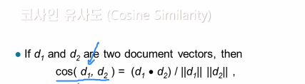
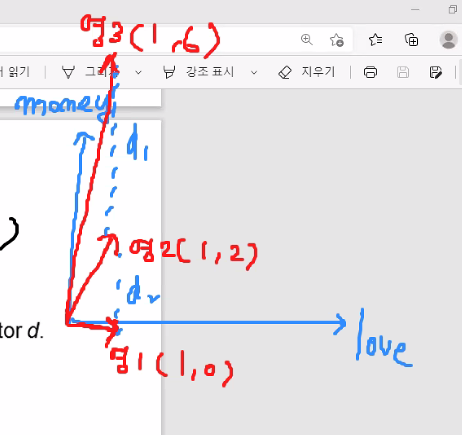
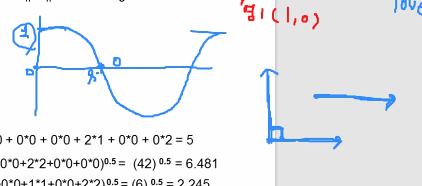
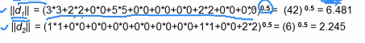
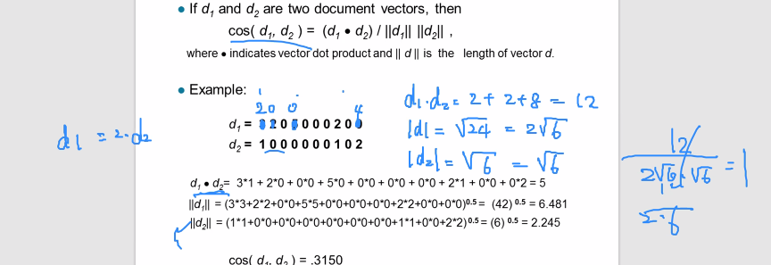
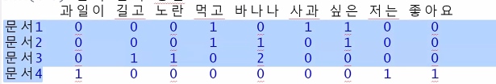
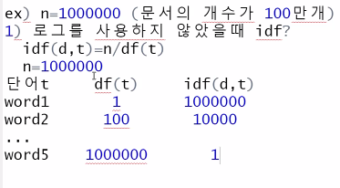

# 복습 tm_map


```
smsraw<-read.csv("sms_spam_ansi.txt")
smsraw
str(smsraw)
smsraw$type <- factor(smsraw$type)
str(smsraw)

#install.packages("tm")
library(tm)
library(stringr)

table(smsraw$type)
smsCorpus<-VCorpus(VectorSource(smsraw$text))
inspect(smsCorpus[1:3])

smsCorpus[[1]]
as.character(smsCorpus[[1]])
#[1] "Hope you are having a good week. Just checking in"

#여러개 보고싶을떄
lapply(smsCorpus[1:5],as.character)

smsCorpusClean<-tm_map(smsCorpus, content_transformer(tolower))

as.character(smsCorpus[[5]])
as.character(smsCorpus.Clean[[5]])
#[1] "okmail: dear dave this is your final notice to collect your 4* tenerife holiday or #5000 cash award! call 09061743806 from landline. tcs sae box326 cw25wx 150ppm"

#숫자 제거
smsCorpusClean<-tm_map(smsCorpus, removeNumbers)
as.character(smsCorpus.Clean[[5]])

#불용어 제거
smsCorpusClean<-tm_map(smsCorpusClean,removeWords,stopwords())
as.character(smsCorpusClean[[5]])

#구두점 제거

smsCorpusClean<-tm_map(smsCorpusClean,removePunctuation)
as.character(smsCorpusClean[[5]])
#[1] "okmail Dear Dave    final notice  collect   Tenerife Holiday   CASH #award Call   landline TCs SAE Box CWWX ppm"

removePunctuation("hi...hello! Kim.")
#[1] "hihello Kim"

replacePunctuation<-function(x){gsub("[[:punct:]]+"," ",x)}
replacePunctuation("hi...hello! Kim.")
#[1] "hi hello  Kim "

```


# word stemming


```
library(SnowballC)
wordStem(c("learns","learning"))

?stemDocument()

as.character(smsCorpusClean[[4]])

smsCorpusClean<-tm_map(smsCorpusClean,stemDocument)
as.character(smsCorpusClean[[4]])

#공백 여러개 인것 (불필요한 공백)제거
smsCorpusClean<-tm_map(smsCorpusClean,stripWhitespace)
as.character(smsCorpusClean[[4]])

```


```
lapply(smsCorpus[1:3], as.character)
# $`1`
# [1] "Hope you are having a good week. Just checking in"
# 
# $`2`
# [1] "K..give back my thanks."
# 
# $`3`
#[1] "Am also doing in cbe only. But have to pay."

lapply(smsCorpusClean[1:3], as.character)
# $`1`
# [1] "Hope good week Just check"
# 
# $`2`
# [1] "Kgive back thank"
# 
# $`3`
# [1] "Am also cbe But pay"
```


# Dtm

: 행:문서, 열:단어가 오는 행렬

```
smsDtm<-DocumentTermMatrix(smsCorpusClean)
smsDtm

<<DocumentTermMatrix (documents: 5559, terms: 6557)>>
Non-/sparse entries: 42136/36408227
Sparsity           : 100%
Maximal term length: 40
Weighting          : term frequency (tf)
```

5559줄이 문서로 들어감, 중복을 제외한 단어가 6557개

Sparsity 희소행렬이 비어있는 정도..? 

Maximal term length: 40 가장 긴 문자수를 갖는 단어의 문자 수

term frequency (tf) --> TF-IDF 알고리즘 : 문서간 유사도를 측정하는 알고리즘 /

단어의 등장횟수로서 weighting을 줬다. (빈도수) 


# 코사인 유사도



음수 x , 





벡터 특성당 money라는 단어가 많이나오면 거리가 증가해서 벡터간 유사도 조사할때 유클리디안은 맞지 않음 그래서 나온가 각도로 조사하는 코사인 유사도

각도가 좁을수록 유사도가 높다.  



90도가 되면 0이니까 (관련 거의 없)

0도면 완전 유사

표준화 하면 안됨!! 횟수가 중요해서

내적이 클수록 0이 아닌 값이 많으니까 공통 단어가 많다는 뜻

길이(norm) : 


예시




# tfidf 알고리즘


tf(d,t) : 특정 문서 d 내에서 t 단어가 발생한 횟수

ex) tf(d1,사과)=1

df(t) : 특정 단어 d가 등장한 문서의 수

ex) df(과일이)=1 , df(바나나)=2

idf(d,t) : df(t)에 반비례하는 수


$$
idf(d,t) = log(n/(1+df(t)))
$$
n : 총 문서의 개수





tf - idf = tf*idf

ifidf는 모든 문서에서 자주 등장하는 단어는 중요도가 낮다고 판단

특정 문서에만 자주 등장하는 단어는 중요도가 높다고


idf에서 자연로그 사용 (ln) idf(d,t) = log(n/df(t)+1)

'과일이' 의 idf? ln(4/(1 +1) ) = ln(2) =0.69

' 먹고' 또는 '바나나'의 idf? ln(4/(2+1)) = ln(4/3) =0.28


결론적으로 tfidf값을 통해서 알 수 있는것.

1) 특정 단어를 가장 중요하게 다루는 문서를 알 수 있음

2) 각 문서들마다 중요한 단어를 알 수 있음

=> 특정 문서가 아니라 모든 문서에서 많이 나오는 단어는 중요도가 떨어지겠다! , 문서의 개수가 작을 수록 전체값이 커지니까 


# ham & spam분류기 

```
#랜덤하게 분할
smsDtmTrain <- smsDtm[1:4169,]
smsDtmTest<-smsDtm[4170:5559,]

smsDtmTrain <- smsDtm[1:4169,] #왜 두번??
smsDtmTest<-smsDtm[41705559,]

smsTrainLabels <- smsraw[1:4169,]$type
smsTestLabels<-smsraw[4170:5559,]$type


prop.table(table(smsTrainLabels))
prop.table(table(smsTestLabels))

install.packages("wordcloud")
library(wordcloud)
wordcloud(smsCorpus.Clean, min.freq=100, random.order=F)

spam<-subset(smsraw, type=="spam")
ham<-subset(smsraw, type=="ham")

wordcloud(spam$text, max.words = 40, colors=brewer.pal(5,"YlGn")) 
wordcloud(ham$text, max.words = 40, colors=brewer.pal(7,"RdYlGn"))


```

max.words 출력 갯수

파레트 색깔 colors=brewer.pal()


```

smsDtmTrain #0이 아닌 값이 많아서 공간 
smsDtmFreqTrain<-removeSparseTerms(smsDtmTrain,0.999)
smsDtmFreqTrain
# <<DocumentTermMatrix (documents: 4169, terms: 1102)>>
#   Non-/sparse entries: 24817/4569421
# Sparsity           : 99%
# Maximal term length: 19
# Weighting          : term frequency (tf)
# 
```

1102개로 줄어듦 Sparse -> 희소 , 등장하지 않은 단어들의 개수

`removeSparseTerms ` : sparse term을 제거해주는 함수 (0많은 애덜)

원치않은 데이터가 삭제될수도 있음 

0. 999 는 90%로 만든다?  6557 -> 1102개 


## findFreqTerms

```
findFreqTerms(smsDtmTrain,5,10) #최소 5번 이상 최대 10번 이하 등장한 단어 추출

smsFreqWords<-findFreqTerms(smsDtmTrain,5)
str(smsFreqWords)
# chr [1:1137] "￡wk" "abiola" "abl" "abt" "accept" "access" "account" "across" "act" ...

```

이렇게 sparseterms를 낮출 수 있다


```
smsDtmFreqTrain<-smsDtmTrain[,smsFreqWords]
smsDtmFreqTest<-smsDtmTest[,smsFreqWords]


smsDtmFreqTrain #4169*1137
smsDtmFreqTest  #1390*1137

smsDtmFreqTrain
smsDtmFreqTest

convertCounts<-function(x){
  x<-ifelse(x>0, "Yes" ,"No")
}

smsTrain<-apply(smsDtmFreqTrain, MARGIN = 2, convertCounts)
smsTrain
smsTest<-apply(smsDtmFreqTest, MARGIN = 2, convertCounts)
smsTest


install.packages("e1071")
library(e1071)

#모델 생성
smsClassifier<-naiveBayes(smsTrain,smsTrainLabels)

#테스트데이터 -> 모델 -> 예측(분류) 결과
smsTestPred <- predict(smsClassifier, smsTest)

smsTestPred #예측
smsTestLabels #결과

library(gmodels)
CrossTable(smsTestPred, smsTestLabels)


# | smsTestLabels 
# smsTestPred |       ham |      spam | Row Total | 
#   -------------|-----------|-----------|-----------|
#   ham |      1201 |        30 |      1231 | 
#   |    16.317 |   107.620 |           | 
#   |     0.976 |     0.024 |     0.886 | 
#   |     0.995 |     0.164 |           | 
#   |     0.864 |     0.022 |           | 
#   -------------|-----------|-----------|-----------|
#   spam |         6 |       153 |       159 | 
#   |   126.328 |   833.210 |           | 
#   |     0.038 |     0.962 |     0.114 | 
#   |     0.005 |     0.836 |           | 
#   |     0.004 |     0.110 |           | 
#   -------------|-----------|-----------|-----------|
#   Column Total |      1207 |       183 |      1390 | 
#   |     0.868 |     0.132 |           | 
#   -------------|-----------|-----------|-----------|
```


