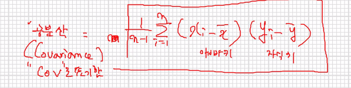

```
mydata<-read.csv("examscore.csv")
x<-6:10
sum(x)/length(x)
mean(x)

mean(mydata$midterm) #41.6667

hist(mydata$midterm,
     xlab="중간고사 성적",
     ylab="빈도",
     main="중간고사 성적분포")
abline(v=mean(mydata$midterm),col="red")
abline(v=median(mydata$midterm),col="blue")
```


임의 데이터 추가 후

```
mydata$midterm[20]<-100
mydata$midterm[22]<-100
hist(mydata$midterm,
     xlab="중간고사 성적",
     ylab="빈도",
     main="중간고사 성적분포")
abline(v=mean(mydata$midterm),col="red")
abline(v=median(mydata$midterm),col="blue")
```


```
> quantile(mydata$midterm)
    0%    25%    50%    75%   100% 
 24.00  35.25  44.50  51.75 100.00 
 
> quantile(mydata$midterm)[2]
  25% 
35.25 
```


```
#분산, 표준편차
set.seed(1234)
x<-sample(1:10, 6)
x

xBar<-mean(x)

#표본분산
sum((x-xBar)^2)/(length(x)-1)
var(x)

sqrt(sum((x-xBar)^2)/(length(x)-1))
sd(x)

#최빈수 : 데이터 셋에서 가장 빈도가 높은 수

x<-c(1,3,9,7,1,2,2,5,3,3,3)
result<-table(x)
result

x
1 2 3 5 7 9 
2 2 4 1 1 1  

> sort(-result)
x
 3  1  2  5  7  9 
-4 -2 -2 -1 -1 -1 

> names(sort(-result)[1])
[1] "3"
```


# 공분산



```
mydata<-read.csv("examscore.csv")

myCorr<-cor(mydata$midterm, mydata$final)
myCorr
n<-length(mydata$midterm)
xBar<-mean(mydata$midterm)
yBar<-mean(mydata$final)
sx<-sd(mydata$midterm)
sy<-sd(mydata$final)

zx<-(mydata$midterm-xBar)/sx
zy<-(mydata$midterm-yBar)/sy

rxy<- sum(zx*zy)/(n-1)

rxy #[1] 0.7550143
myCorr #[1] 0.6770075

```


시각화

```
plot(mydata$midterm, mydata$final, xlab="중간",ylab="기말",
     main="시험점수")
title(sub=paste("상관계수:",round(myCorr,4)),adj=1, col.sub="red")

abline(v=xBar)
abline(h=yBar)
```


```

#표준점수 분포
dev.off()
plot(zx, zy,
     xlab = "중간",
     ylab="기말",
     main="시험점수")
title(sub=paste("상관계수 : ",round(myCorr,4)), 
      adj=1, col.sub="red")
abline(v=0)
abline(h=0)
```


```

> zx*zy #양수는 1,3사분면, 음수는 2,4사분면에 위치함
 [1]  0.055356131  0.049164984  0.224095213  0.079635135 -0.207706885  0.830827538 -0.368312500  0.048072429  1.237136681
[10] -0.094566723 -0.347432556  0.301302447  1.331096429  0.429010012  0.168374897  0.307979174 -0.139240092  0.619600198
[19]  0.274595542  2.085202312  3.577389937  3.697449615  2.083259992 -0.201394343  0.205400379  0.003641851 -0.137540561
[28]  0.599691414  2.360890410  0.560238032


sign(zx*zy) #양수는 1, 음수는 -1로 나옴

 [1]  1  1  1  1 -1  1 -1  1  1 -1 -1  1  1  1  1  1 -1  1  1  1  1  1  1 -1  1  1 -1  1  1  1

```

알록달록


```
dev.off()
plot(zx, zy,
     xlab = "중간",
     ylab="기말",
     main="시험점수",
     col=c("blue","red")[as.factor(sign(zx*zy))])
title(sub=paste("상관계수 : ",round(myCorr,4)), 
      adj=1, col.sub="red")
abline(v=0)
abline(h=0)

abs(zx*zy)

```


```
dev.off()
plot(zx, zy,
     cex=abs(zx*zy),
     xlab = "중간",
     ylab="기말",
     main="시험점수",
     col=c("blue","red")[as.factor(sign(zx*zy))])
title(sub=paste("상관계수 : ",round(myCorr,4)), 
      adj=1, col.sub="red")
abline(v=0)
abline(h=0)
```


# 회귀분석

```
install.packages("datarium") #marketing 검색
library(datarium)
data("marketing")
marketing

dev.off()
plot(mydata$midterm, mydata$final,
     xlab = "중간",
     ylab="기말",
     main="시험점수")
     
abline(5,1) #직선, y절편(교차점):5, 기울기:1
abline(-15,1.5, col="red")
```


* 회귀 직선을 그리는 방법

  주어진 y데이터를 x데이터로 예측했을 경우, 예측값과 실제값 사이에서 차이의 제곱들의 합이 가장 작은 직선을 선택하면 됨.

잔차(residual) :예측값과 실제값 사이의 차이
잔차 제곱의 합 : residual sum of squre (rss)
rss가 가장 작은 직선

중간고사(x) -> 모델 -> 기말고사 점수 예측(yhat)
잔차=실제값(y)-예측값(yhat)
잔차1+...+잔차30= 잔차의합 => 잔차의합을 최소로 하는 y절편과, 기울기를 찾는 것


```

#rss를 구하는 사용자 정의 함수
rss <- function(data,lineInfo){
x<-data[,1]
y<-data[,2]
intercept<-lineInfo[1] #y절편
slope<-lineInfo[2]#기울기
yhat<-intercept+slope*x
result<-sum((y-yhat)^2)
result #잔차 제곱의 합 
}
```


```
rss(mydata[,3:4],c(5,1)) #6421
rss(mydata[,3:4], c(-15, 1.5)) # [1] 8393.25
```

목표 : 잔차제곱의 합을 최소로 하는 y절편과 기울기 찾기 -> `optim`


# optim

: y절편과 기울기를 변경해가면서 최적의 값을 찾아내는 함수

```
result<-optim(par=c(1,1), fn=rss, data=mydata[,3:4])

result$par # 찾은 최적의 직선 확인 y절편, 기울기
#[1] 13.8833436  0.8967623  최적의 회귀직선 : yhat = 13.88+0.89x
result$value #최적의 rss값 5712
```


```
dev.off()
plot(mydata$midterm, mydata$final,
     xlab = "중간",
     ylab="기말",
     main="시험점수")
abline(5,1) #y절편:5, 기울기:1
abline(-10,1.5, col="red")
abline(result$par,col="blue")

# result$par[1]
       # result$par[2]
#최적의 회귀식 : yhat=13.88+0.89x
```


# 회귀모델 작성 `lm`

```
lm(final ~ midterm, mydata) 
lm(formula, data, ...) : formula : 반응변수 ~ 설명변수 형태 , data: 변수가 포함된 프레임
```

```
#3. 통계학자들이 찾아낸 회귀모델 수식
#기울기= 상관계수*표준편차(y)/표준편차(x)
x<-mydata$midterm
y<-mydata$final
b<-cor(x,y)*sd(y) / sd(x) #기울기
b #[1] 0.8966817


#절편 = y평균 - 기울기*x평균
a<-mean(y)-b*mean(x)
a [1] 13.8866

```


```
mydata<-read.csv("examscore.csv")

# ex)
# s1 - 중:57, 기말:69
# s2 - 중:57, 기말:64
# s3 - 중:57, 기말?
# 
# yhat = 기울기 * x(중간) + 절편 + 노이즈
# 노이즈?기말고자 점수들에 잡음이 섞여있다고 가정

result<-lm(final ~ midterm, mydata)
attributes(result)

result$coefficients#기울기, 절편

(Intercept)     midterm 
 13.8866022   0.8966817 
```

```
dev.off()
plot(mydata$midterm, mydata$final,
     xlab = "중간",
     ylab="기말",
     main="시험점수")
abline(result$coefficients)

summary(result)

```


```
#입력한 코드
result$call

#직선 정보
result$coefficients

#중간고사점수 -> 회귀모델 => 예측 결과를 확인
result$fitted.values

#잔차(예측값과 실제값사이의 차이)
result$residuals
summary(result$residuals)

#잔차=실제값(y, final)-예측값(yhat,result$fitted.values)
mydata$final-result$fitted.values #result$residuals와 같음

plot(result)
```

`fitted()` 함수 또는 `predict()` 함수를 통해 예측 값을 구할 수 있다.


성별고려

```
dev.off()
head(mydata)

plot(mydata$midterm, mydata$final,
     col=c("red","blue")[as.factor(mydata$gender)],
     pch=c(16,17)[as.factor(mydata$gender)],
     xlab = "중간",
     ylab="기말",
     main="시험점수")
legend(20,80,
       legend = c("여자","남자"),
       col=c("red","blue"),
       pch=c(16,17))
```


```
dataFemale<-mydata[mydata$gender=="F",]
dataMale<-mydata[mydata$gender=="M",]

#회귀모델 : lm(변수 ~독립, 데이터)
model1<-lm(final~midterm, dataFemale)
model2<-lm(final~midterm, dataMale)

model1$coefficients  #여학생
#절편:27, 기울기:0.6
model2$coefficients #남학생
#절편:9.6, 기울기:0.94

plot(mydata$midterm, mydata$final,
     col=c("red","blue")[as.factor(mydata$gender)],
     pch=c(16,17)[as.factor(mydata$gender)],
     xlab = "중간",
     ylab="기말",
     main="시험점수")
legend(20,80,
       legend = c("여자","남자"),
       col=c("red","blue"),
       pch=c(16,17))
abline(model1$coefficients, col="red")
abline(model2$coefficients, col="blue")
```


# 예측

`predict 함수`

```
#중간고사 50점인 여학생의 기말고사 점수를 예측
#1
predict(model1, data.frame(midterm=50))
#61.47625 

#2
param<-as.numeric(model1$coefficients)
> print(param[1]+50*param[2])
[1] 61.47625
```


* 다중 회귀 분석 (성별, 중간고사 -> 기말 예측 회귀 모델)

```
model3<-lm(final ~ midterm+gender, mydata)
model3

Coefficients:
(Intercept)      midterm      genderM  
    18.9774       0.8808      -6.6563  

```


기말고사=`intercept+중간기울기*중간점수+성별기울기*성별+노이즈`

c(0,1)[as.factor(mydata$gender)] 과정을 거쳐서,
F -> 0, M -> 1로 수치 변환

* 여학생, 중간고사 40점, 기말고사?
  기말고사=`intercept+중간기울기*중간점수+성별기울기*성별+노이즈`
  기말고사=18.9774+0.8808*40

```

par<-as.numeric(model3$coefficients)
par
yhat<-par[1]+par[2]*40+par[3]*0
yhat
#54점 예상

predict(model3, data.frame(midterm=40, gender="F"))#54.20989
```


```
#남학생?
yhat<-par[1]+par[2]*40+par[3]*1
yhat
predict(model3, data.frame(midterm=40, gender="M"))
#47.55363 

```


# 


