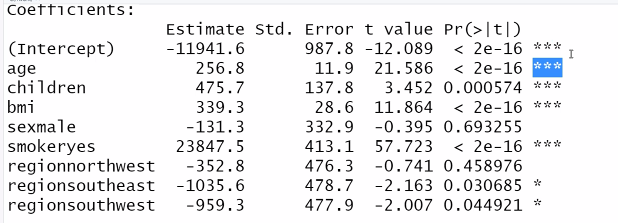

# 보험금 문제


* 독립변수와 종속변수간의 관계

```
insurance<-read.csv("insurance.csv")
insurance
str(insurance)
#rm(insuarance)
table(insurance$region)

#독립변수와 종속변수간의 관계
#종속을 expenses로

> cor(insurance[c("age","bmi","children","expenses")])
               age        bmi   children   expenses
age      1.0000000 0.10934101 0.04246900 0.29900819
bmi      0.1093410 1.00000000 0.01264471 0.19857626
children 0.0424690 0.01264471 1.00000000 0.06799823
expenses 0.2990082 0.19857626 0.06799823 1.00000000
```

bmi 수치가 높을수록 (몸무게 증가), 나이가 많을수록 비용이 올라간다


## 산포도 행렬

```
#산포도 행렬
pairs(insurance[c("age","bmi","children","expenses")])
```


만나는 부분간의 컬럼의 관계

ex) age와 expenses의 관계 보고 싶으면 4행 1열 그래프인데 나이가 x축 expense가 y축 -> 나이가 커질수록 증가하는 경향성을 확인할 수 있음


더 상세한 산포도

```
library(psych)
pairs.panels(insurance[c("age","bmi","children","expenses")])
```


데이터 분포 모습을 더 구체적으로 

중간중간 원 -> 상관관계를 타원형으로 강도를 시각화 한것

원보다 타원형이 상관관계가 크다는 뜻 (어느방향으로)

타원의 빨간 중심점 x,y 평균값 

bmi 와 children 은 0.11 로 상관관계 매우 낮다


## 다중선형회귀모델

```
model<-lm(expenses ~ age+children+bmi+sex+smoker+region,data=insurance)
```

sex, smoker,region 문자는 자체적으로 더미코딩함, 팩터 타입 변수는 더미화를 수행 

sex : (male, female) -> sexmale, sexfemale 이름 생성

male은 sexmale값을 1로 설정, sexfemale은 0으로 설정


```
summary(model)

Residuals:
     Min       1Q   Median       3Q      Max 
-11302.7  -2850.9   -979.6   1383.9  29981.7 
```

실제값 - 예측값 = 29981.7(max) 예측을 3만불 낮게 했다

Pr : p값은 추적된 계수가 실제0일 확률 추정치

pr이 0.05보다 낮냐 (유의성)  , 0.05보다 큰 애들이 많으면 예측이 어렵다는 뜻

옆에 별이 많을수록 유의한 변수들임 

공백은 모델만들때 제외 해야하는 변수




Multople R-squared(다중 r 제곱 값, 결정계수) : 1에 가까울수록 모델이 데이터를 완벽하게 설명한다.

모델이 전체적으로 종속변수 얼마나 잘 설명하는지 측정한 값 


0.7509 우리의 모델이 종속변수 변화량의 75%를 설명하고 있다. (75면 매우 높은 편 ) 0.5이상 정도


비선형


