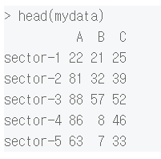
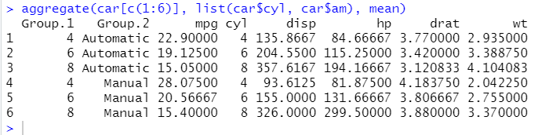
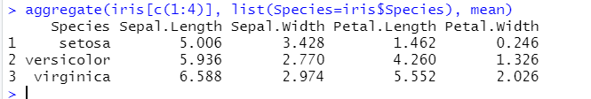

# rename

- poptotal(전체 인구)을 total 로, popasian(아시아 인구)을 asian 으로 변수명을 수정

```
library(reshape)
library(dplyr)
midwest <- rename(midwest, total=poptotal)
midwest<-rename(midwest, asian=popasian)
```


# prop table

: 비율 퍼센트 구하기

연습용 셋

```
> mydata <- matrix(sample(100,15),ncol = 3)
> colnames(mydata) <- LETTERS[seq(1,3)]
> rownames(mydata) <- sprintf('sector-%d',seq(5))
```




```
> prop.table(mydata)
                  A          B          C
sector-1 0.03333333 0.03181818 0.03787879
sector-2 0.12272727 0.04848485 0.05909091
sector-3 0.13333333 0.08636364 0.07878788
sector-4 0.13030303 0.01212121 0.06969697
sector-5 0.09545455 0.01060606 0.05000000
```

전체 합이 1이 되는 비율 테이블


* `prop.table(x, margin=1) : rowSums() = 1`

: 행 합이 1이 되는 비율 테이블

```
> prop.table(mydata,1)
                 A          B         C
sector-1 0.3235294 0.30882353 0.3676471
sector-2 0.5328947 0.21052632 0.2565789
sector-3 0.4467005 0.28934010 0.2639594
sector-4 0.6142857 0.05714286 0.3285714
sector-5 0.6116505 0.06796117 0.3203883
```

인수 2 주면 colSums =1


# transform 함수

:변수(피쳐)를 변환 굳이 한번에 쓰고 싶을때 사용

```
#파생변수 추가
iris.copy <- iris
transform(iris.copy,
          Species=as.character(Species),
          SepalRatio=Sepal.Length/Sepal.Width)
```

iris.copy의 Species를 char형으로 바꾸고

Ratio 열 추가


# apply family 

: apply(), lapply(), sapply()

데이터에 특정 함수를 적용하는 함수

apply() : 적용하고자 하는 데이터가 행렬 or 배열일때 사용가능 

```
x<-1:20
dim(x)<-c(4,5)

apply(x,1, max) #x 행단위 최댓값 찾기
```

1 : row , 2 : col 결과가 vector, matrix로 나온다


```
x<-1:24
dim(x)<-c(4,3,2)

> x
, , 1

     [,1] [,2] [,3]
[1,]    1    5    9
[2,]    2    6   10
[3,]    3    7   11
[4,]    4    8   12

, , 2

     [,1] [,2] [,3]
[1,]   13   17   21
[2,]   14   18   22
[3,]   15   19   23
[4,]   16   20   24

> apply(x,1,paste, collapse=",")
[1] "1,5,9,13,17,21"  "2,6,10,14,18,22" "3,7,11,15,19,23"
[4] "4,8,12,16,20,24"

> apply(x,2,paste, collapse=",") #1:행2:열,3:3번째 차원
[1] "1,2,3,4,13,14,15,16"    "5,6,7,8,17,18,19,20"   
[3] "9,10,11,12,21,22,23,24"

```


```
> class(apply(x,c(1,2),paste,collapse=","))
[1] "matrix" "array" 

> apply(x,c(1,2),paste,collapse=",")
     [,1]   [,2]   [,3]   
[1,] "1,13" "5,17" "9,21" 
[2,] "2,14" "6,18" "10,22"
[3,] "3,15" "7,19" "11,23"
[4,] "4,16" "8,20" "12,24"
```

행과열이 교차하는 원소에 함수가 적용 ->4*3 행렬이 나옴

```
> str(Titanic)
 'table' num [1:4, 1:2, 1:2, 1:2] 0 0 35 0 0 0 17 0 118 154 ...
 - attr(*, "dimnames")=List of 4
  ..$ Class   : chr [1:4] "1st" "2nd" "3rd" "Crew"
  ..$ Sex     : chr [1:2] "Male" "Female"
  ..$ Age     : chr [1:2] "Child" "Adult"
  ..$ Survived: chr [1:2] "No" "Yes"
```


```
> apply(Titanic,1,sum)#등급별 탑승 인원 파악
 1st  2nd  3rd Crew 
 325  285  706  885  
```

```
> apply(Titanic,c(1,4),sum)  #class별 생존자 

      Survived
Class   No Yes
  1st  122 203
  2nd  167 118
  3rd  528 178
  Crew 673 212
```


## lapply, sapply

l 이 list의 약자

데이터가 리스트 or 벡터일떄 사용 

인수가 2개  (데이터, 함수)

lapply 결과 항상 리스트 형식으로 반환

sapply 결과 *벡터 또는 행렬*로 단순화 해서 변환 

sapply) 벡터는 길이가 1, 행렬은 2이상 이면서 모두 같은 경우 

길이가 2이상이면서 다른 경우에는 리스트로 나옴


```
exams<-list(s1=c(80,70,60,50,100),
     s2=c(80,70,60,50),
     s3=c(30,70,60,50,100,90),
     s4=c(80,60,60,50,100))

> lapply(exams,length)
$s1
[1] 5

$s2
[1] 4

$s3
[1] 6

$s4
[1] 5
```

출력결과가 리스트로 나옴 길이는 모두 1

```
> sapply(exams,length) #길이가 모두 1로 동일하기 때문에 벡터터
s1 s2 s3 s4 
 5  4  6  5 
```


```
> s4=c(80,60,60,50,100)
> range(s4) #최대 최소값을 갖는 벡터
[1]  50 100
```


```
str(iris)
> lapply(iris,class)
$Sepal.Length
[1] "numeric"

$Sepal.Width
[1] "numeric"

$Petal.Length
[1] "numeric"

$Petal.Width
[1] "numeric"

$Species
[1] "factor"
```


```
#sapply(iris,mean) #안됨 
sapply(iris, function(x) ifelse (is.numeric(x), mean(x) ,NA) )
```


## mapply

: 적용하고자 하는 함수가 벡터 연산을 지원하지 않을때 유용하게 사용

```
> mapply(rep,1:4,4:1)

[[1]]
[1] 1 1 1 1

[[2]]
[1] 2 2 2

[[3]]
[1] 3 3

[[4]]
[1] 4
```

1이4번 2가 3번 ...


# 집단 요약

벡터를 집단별로 분할 `split, unstack` 사용

## split

```
#mpg를 변속기 종류에 따라 분할해보자

data(mtcars)
car <- mtcars
car<-within(car,
            am<-factor(am,levels=c(0,1),labels=c("Automatic","Manual"))
) #라벨링

g<-split(car$mpg, car$am)

mean(g[[1]])
mean(g[["Manual"]])
sapply(g,mean)
```

mean 3가지 방법

## unstack

```
#split과 유사한 unstack 함수
data.frame(car$mpg,car$am)
unstack(data.frame(car$mpg,car$am))
```


unstack함수는 그룹별로 분할된 데이터의 **길이가 동일하면 데이터프레임**,

동일하지 않으면 리스트로 출력

```
g1<-unstack(data.frame(car$mpg,car$am)) #리스트
#summary(g1) 안됨

g2<-unstack(data.frame(iris$Sepal.Length, iris$Species))
summary(g2) #summary는 df에 대해 통계를 구하기 떄문에
```


그룹 분할 작업 -> 그룹별 연산 작업을 동시에 진행

tapply(), aggregate(), by() 함수를 사용

# tapply()

(데이터 벡터, 그룹팩터, 그룹별 연산 함수): 3개 인수

- 종별 데이터의 갯수 출력

```
tapply(iris$Sepal.Length,iris$Species,length)
```

```
 setosa versicolor  virginica 
        50         50         50 
```


* 실린더 개수별 am 유형별 조합에 따른 mpg 평균

```
with(car,tapply(mpg,list(cyl,am), mean))

  Automatic   Manual
4    22.900 28.07500
6    19.125 20.56667
8    15.050 15.40000
```

car에 있는 mpg 벡터에 대한 cyl,am 열을 기준으로 그룹화를 한 다음 각각의 그룹별로 mean을 취한 결과를 보여달라!


# aggregate(집계함수)

: 그룹별로 각각 함수를 적용 

`aggregate(벡터, 리스트(집단 변수), fun)`


```
> with(car, aggregate(mpg,list(cyl,am) , mean))
  Group.1   Group.2        x
1       4 Automatic 22.90000
2       6 Automatic 19.12500
3       8 Automatic 15.05000
4       4    Manual 28.07500
5       6    Manual 20.56667
6       8    Manual 15.40000
```

출력의 형태가 tapply 와 조금 다르긴 함

이름을 직접 지정 가능 이름=변수

```
> with(car, aggregate(mpg,list(Cylinder=cyl,Transmission=am) , mean))
  Cylinder Transmission        x
1        4    Automatic 22.90000
2        6    Automatic 19.12500
3        8    Automatic 15.05000
4        4       Manual 28.07500
5        6       Manual 20.56667
6        8       Manual 15.40000
```


* car[c(1:6)] 변수의 평균, 실린더 개수와 변속기 유형의 조합에 따라...

```
aggregate(car[c(1:6)], list(car$cyl, car$am), mean)
```




* 아이리스 꽃 종류별 변수별 4개

```
aggregate(iris[c(1:4)], list(Species=iris$Species), mean)

```




# by함수

: 데이터프레임을 그룹별 데이터로 처리

```
> by(iris, iris$Species, function(x) mean(x$Sepal.Length))
iris$Species: setosa
[1] 5.006
----------------------------------------------- 
iris$Species: versicolor
[1] 5.936
----------------------------------------------- 
iris$Species: virginica
[1] 6.588
```


범주별 관측값 개수

* tabulate

```
> tabulate(car$gear)
[1]  0  0 15 12  5

> table(car$gear)
 3  4  5 
15 12  5 
```

table은 3 4 5 인덱스가 뜬다 

이름 붙여보기

```
gc<-tabulate(car$gear)
names(gc)<-1:length(tabulate(car$gear)) #1부터 5까지지
> gc
 1  2  3  4  5 
 0  0 15 12  5 
```

table을 더 많이씀

```
> table(car$am, car$gear)
           
             3  4  5
  Automatic 15  4  0
  Manual     0  8  5
```


# xtabs 함수

 : table과 동일, 포뮬러 사용

```

> xtabs(~am, data=car)
am
Automatic    Manual 
       19        13 
       
> xtabs(~am+gear, data=car)
           gear
am           3  4  5
  Automatic 15  4  0
  Manual     0  8  5
  
#포뮬러? 데이터 처리시 어떤 열을 사용할 것인지 나타낸 수식

> aggregate(mpg~cyl+am, car,mean)
  cyl        am      mpg
1   4 Automatic 22.90000
2   6 Automatic 19.12500
3   8 Automatic 15.05000
4   4    Manual 28.07500
5   6    Manual 20.56667
6   8    Manual 15.40000

#포뮬러 : mpg~cly+am
```


* cyl와 am 유형별 mpg열의 평균을 구하시오.

```
> with(car,aggregate(mpg, list(cyl=cyl, am=am), mean))

  cyl        am        x
1   4 Automatic 22.90000
2   6 Automatic 19.12500
3   8 Automatic 15.05000
4   4    Manual 28.07500
5   6    Manual 20.56667
6   8    Manual 15.40000
```


# dplyr

 : 분할( S ) - 적용( A ) - 결합( C ) 작업을 수월하게 할 수 있도록 도움을 주는 라이브러리

## filter

```
filter(airquality, Month==6)
airquality[airquality$Month==6,]
subset(airquality, subset=(Month==6))

air<-filter(airquality, Month==6, Temp>90) 
air
```

조건을 만족하는 행을 추출 

filter의`,`는 and 연산 `&`와 같음


