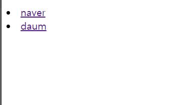
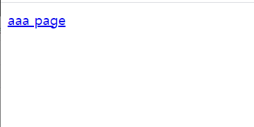
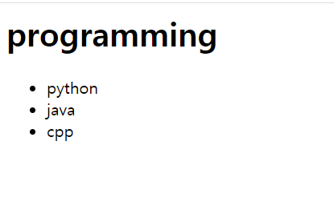

# sub 함수

대한민국, 코리아, 한국  --> 대한민국

```
re.sub("패턴","바꿀문자열","문자열",비꿀횟수) #인수 3-4개 들어감
```

```
print(re.sub("apple|orange","fruit","apple tree banana orange"))
```

fruit tree banana fruit


```
print(re.sub("[0-9]+","num"," 1 2 apple 3 banana 4 7 9 30 tree"))
```


```
print(re.sub("[0-9]+","num"," 1 2 apple 3 banana 4 7 9 30 tree",1))
```

,1 or count=1 한번만 바뀜.

 num 2 apple 3 banana 4 7 9 30 tree


```
print(re.sub("apple|orange","fruit","apple tree banana orange"))

#위 문장을 compile로 찢어쓰기

pat = re.compile("apple|orange")
print(pat.sub("fruit","apple tree banana orange"))
```


# 웹사이트 

```
import urllib.request
url="https://www.multicampus.com/img/saas/main/logo/CUS0001/pc_main.png"

urllib.request.urlretrieve(url,"test.png")

```

사진파일이 생긴다


```
url="https://www.multicampus.com/img/saas/main/logo/CUS0001/pc_main.png"
mem = urllib.request.urlopen(url).read() #이미지 파일 경로 읽어옴
with open("test2.png","wb") as f: #이미지는  binary형식으로
    f.write(mem)
    print("저장되었습니다")
```


웹에서 사용하는 언어

-서버와 클라이언트 간에 데이터를 주고 받을때 사용하는 언어 (HTML)

클라이언트(페이지 요청, 웹브라우저에 www.naver.com )-> 웹서버

HTML : HyperText Markup Language

XML : Extensible Markup Language


jsp , asp, php등 : 동적 페이지

구조화된 문서(xml) : 정적 페이지

비구조화된 문서(html) : 정적 페이지


오늘의 날씨는 맑습니다. 기온은 섭씨 영하 2도 입니다.

클라이언트 (나) 날씨클릭 -> 웹서버(날씨 페이지 생성) -> 생성된 페이지를 html문서로 만들어서 제공 -> 웹브라우저 해석 -> 결과를 화면에 출력 

클릭한 시점마다 새롭게 날씨페이지가 만들어져야함 (온도변화) --> 동적 페이지


비구조화된 문서 : 웹페이지 내용에 대해 기계가 해석하지 못하는 문서

ex) BTS가 서울 강남구에서 공연을 했습니다.


구조화된 문서 : 웹페이지 내용에 대해 기계가 해석 가능한 문서 -> 의미를 기반으로 검색 검색 폭 넓음, 검색 결과에 대한 정확도 높음 

ex) 

<가수>

​	<그룹명>bts</그룹명>

​	<도시이름>서울</도시명> 

</가수>


```
import urllib.parse as parse
import urllib.request as request
addr ="http://www.weather.go.kr/weather/forecast/mid-term-rss3.jsp"
values={'stdId':'109'}

print(parse.urlencode(values))
```

```
http://www.weather.go.kr/weather/forecast/mid-term-rss3.jsp?stdId=184
```

#뒤에 ? 후 std~ 요청 jsp 동적이니까 특정지역(id)에 해당하는 날씨를 요청함  


```
params=parse.urlencode(values)
url=addr+"?"+params
print(url)

data = request.urlopen(url).read()
data=data.decode('utf-8')
print(data)
```


태그 순서

```
<a>
<b>

</b>
</a>
```

짝맞게끔

## 웹스크래핑

BeautifulSoup 패키지

```
#  import requests
from bs4 import BeautifulSoup
```

bs4에서 BeautifulSoup 클래스 가져오기

설치 파일>settings>project:pythonBasic>interpreter > +후 beautifulsoup4 > install package


html 파일 하나 만들고

```
<html><body>
<h1>scraping</h1>
<p>web</p>
<p>programming</p>
</body></html>
```


```
soup = BeautifulSoup(html,"html.parser") #분석하고자 하는 문서, 원하는 부분
```

대문자로 시작하면 클래스 

`클래스(html,"~")` -> html 초기값(속성)으로 객체 만들기 

#붕어빵봉투 = 붕어빵기계(크림,10센치)


```
soup = BeautifulSoup(html,"html.parser") #분석하고자 하는 문서, 원하는 부분
print(soup.html.body.h1) #soup.상위태그부터 쭉~
```

#<h1>스크래핑</h1>


```
print(soup.html.body.h1.string)#태그빠지고 안에 있는 문자열만 출력해줌
```

스크래핑


두번째 <p> 내용 참조하고 싶을때 (sibling관계)

```
p1=soup.html.body.p #웹페이지분석
print(p1.next_sibling) #미완성, 웹페이지 옆에 줄바꿈 문자를 가져옴 그냥 공백처럼 보인다
```


```
p2=p1.next_sibling
print(p2.next_sibling)
```

#<p>원하는 부분 추출</p>


* 한줄 표현

  ```
  p2=p1.next_sibling.next_sibling.string
  print(p2)
  ```

원하는 부분 추출


### id를 이용한 접근

```
html2="""
<html><body>
<h1 id='title'>스크래핑</h1>
<p id='body'>웹 페이지 분석 </p>
<p>원하는 부분 추출</p>
</body></html>
"""

soup = BeautifulSoup(html2, "html.parser")
#print(soup.html.body.h1.string)

#별도 id를 이용해 접근하기
print(soup.find(id='title').string)
```

스크래핑

- find() 사용

------------

```
#home.html

<html><body>
<li><a href="http://www.naver.com">naver</a></li>
<li><a href="http://www.daum.net">daum</a></li>
</ul>
</body></html>
```




```
#<태그명 속성명=속성값 속성명=속성값...>

soup = BeautifulSoup(html3,"html.parser")
print(soup) #문자열 -> html.parser 로 분석할 수 있는 객체로 변환
print(html3) #문자열을 저장하고 있는 변수 

print(soup.find_all("a")) #리스트로 , a태그로 묶인 내용 나옴 soup이라 객체로 나옴 그냥 html3이랑 당연히 다름 
```


### 속성값 attrs[]

```
links=soup.find_all("a")
#print(links[0])

for i in links :
    #주소만 뽑아내고 싶을때
    href = i.attrs['href'] #속성이름
    print(href)
```

http://www.naver.com
http://www.daum.net


```
links=soup.find_all("a")

for i in links :
    #주소만 뽑아내고 싶을때
    href = i.attrs['href']
    na = i.string
    print(na, "-->",href)
```

naver --> http://www.naver.com
daum --> http://www.daum.net


#### attrs 딕셔너리 활용

```
<p><a href="aaa.html">aaa page</a></p>
```



```
html4="""
<p><a href="aaa.html">aaa page</a></p>
"""

soup = BeautifulSoup(html4,"html.parser")
print(soup.p.a.string)
print(soup.a.string) #p부터 안해도 가능
```

p태그 안에 a가 여러개면 써줘야되는데?? a 한개라 안써도 됨


```
print(soup.a.attrs) 
```

{'href': 'aaa.html'}

**딕셔너리**로 나오네 

a태그안에 속성과 값이 여러쌍일때 쓰면 유용

```
html4="""
<p><a href="aaa.html" name="kkk">aaa page</a></p>
"""

```

2쌍

{'href': 'aaa.html', 'name': 'kkk'} 이렇게!


#### 키찾기

```
mydict=soup.a.attrs #딕셔너리
print('href' in mydict)
```

True


해당하는 키의 


## 날씨정보

```
#웹 스크래핑

import urllib.request as req
url = "http://www.weather.go.kr/weather/forecast/mid-term-rss3.jsp"

res=req.urlopen(url)
#print(res) res는 페이지 내용이 담겨있는 포장지
soup = BeautifulSoup(res,"html.parser")

print(soup) #타입은 BeautifulSoup

```


### title 찾기

```
print("문서제목:", soup.title.string) #처음꺼
print(soup.find("title").string) #처음꺼

print(soup.find_all("title")) #전부 다 찾음 , 리스트
```

find_all()은  [참조인덱싱].string 

리스트니까 len, ... 가능


### select

```
<html><body>
<div id="lang">
    <h1>programming</h1>
    <ul class="items">
        <li>python</li>
        <li>java</li>
        <li>cpp</li>
    </ul>
</div>
</body></html>
```



ul : un ordered? 순서없는 목록 만들때


```
html4 = """
<html><body>
<div id="lang">
    <h1>프로그래밍언어</h1>
    <ul class="items">
        <li>python</li>
        <li>java</li>
        <li>cpp</li>
    </ul>
</div>
</body></html>
"""

soup = BeautifulSoup(html4, "html.parser")
#print(soup.select("div")) #div태그 한개밖에 없으니까 div부터 시작해도됨 리스트형

print(soup.select("div#lang")) #div태그 한개밖에 없으니까 div부터 시작해도됨 리스트형
#lang이라는 아이디를 갖는 div태그만 선택된다


print(soup.select("div#lang> h1")[0].string) #h1으로 묶인애만 출력됨, 여러개 추출 리스트로 나온다
```

`select("div#lang")` lang이라는 아이디를 갖는 div태그만 선택된다

#프로그래밍언어


```
print(soup.select_one("div#lang> h1 "))#문자열로 나온다
```

#<h1>프로그래밍언어</h1> 

```
print(soup.select("div#lang > ul"))
```

[<ul class="items">
<li>python</li>
<li>java</li>
<li>cpp</li>
</ul>]


태그에 클래스 명 

```
print(soup.select("div#lang > ul.items"))
```

`.` 은 클래스를 의미


```
print(soup.select("div#lang > ul.items> li"))
```

[<li>python</li>, <li>java</li>, <li>cpp</li>]

```
print(soup.select_one("div#lang > ul.items> li")) #하나만
```

<li>python</li>


```
mylist=soup.select("div#lang > ul.items> li")

for i in mylist:
    print(i.string)
```

예쁘게

python
java
cpp


--------------

```
sdict = sorted(d1.items(), key=lambda x :x[1] ,reverse=True) #여기서 key는 sorted 함수에 내장된 문법(어떤걸 기준으로 정렬할래?) 딕셔너리의 key가 아님 x[1]은 밸류 선택한 것 
print(sdict[0:100])
```