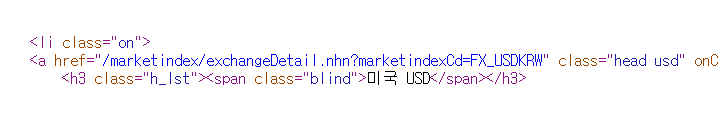

# 데이터 참조 방법


## id를 이용


```
fp = open("lang.html","r",encoding="utf-8") #한글열때, 참고사항
```

#lang.html

<ul id="language">
    <li id="ja">java</li>
    <li id="cp">cpp</li>
    <li id="py">python</li>
    <li id="sp">spark</li>
    <li id="js">javascript</li>
</ul>


* selcet_one 과 select

```
from bs4 import BeautifulSoup
fp = open("lang.html","r")
soup = BeautifulSoup(fp,"html.parser") #read 안해도 되네
print(soup)
print("="*50)
print(soup.select_one("ul > li ")) #li 하나만
print("-"*50)
print(soup.select("ul > li ")) #모든 li태그 나옴
```

* id이용

  ```
  #여기서 python 출력하고 싶으면? 3번째 li
  
  print(soup.select_one("ul > li#py ")) # '#'이 아이디 의미
  ```

`#` : 선택자 (selector)

```
print(soup.select_one("#py ")) # 아이디 py인거 유일이라 이렇게 써도됨
```

또다른 방법

```
print(soup.select("ul#language > li#py"))
```

또

```
print(soup.select_one("#language #py"))
```

꺽쇠말고 공백도 됨 


또 대괄호로 아이디

```
print(soup.select_one("li[id='py']"))
```


또

```
print(soup.select_one("li:nth-of-type(3)"))
```

괄호안에 위치줘서 가능


또

```
print(soup.select("li")[2]) #결과 리스트니까 [] 가능
print(soup.find_all("li")[2]) 
```

+ 한글 깨질때

  ```
  res = req.urlopen(url).read().decode('euc-kr')
  ```

## url 환율 뜯어오기

```
import urllib.request as req #as 뒤에 편한거 씀
url = "https://finance.naver.com/marketindex/?tabSel=exchange#tab_section"
res = req.urlopen(url)
print(res)

soup = BeautifulSoup(res,"html.parser")
```


안좋은방법 (수동)

```
print(soup.select("a.head.usd >div > span.value")[0].string+"원") #span이 Class라 점
```



사이트에서 f12 후 복사해온 태그 copy selector

```
print(soup.select_one("#exchangeList > li.on > a.head.usd > div > span.value").string)
```


## 위키 

```
url = "https://ko.wikisource.org/wiki/%EC%A0%80%EC%9E%90:%EC%9C%A4%EB%8F%99%EC%A3%BC"
res = req.urlopen(url)
soup = BeautifulSoup(res,"html.parser")
print(soup.select_one("#mw-content-text > div.mw-parser-output > ul:nth-child(6) > li > b > a").string)
```

#하늘과 바람과 별과 시


```
mylist = soup.select("#mw-content-text > div.mw-parser-output > ul:nth-child(6) > li > ul >li")
#print(mylist)
for li in mylist:
    print(li.string)
```

#> ul > li 추가

서시
자화상
소년
눈 오는 지도
돌아와 보는 밤
병원
새로운 길
간판 없는 거리
태초의 아침
또 태초의 아침
새벽이 올 때까지
무서운 시간
십자가
바람이 불어
슬픈 족속
눈감고 간다
또 다른 고향
길
별 헤는 밤


## 과일과 야채 html

```
fp = open("fruits-vegetables.html", encoding="utf-8")
soup = BeautifulSoup(fp,"html.parser")
#print(soup.select("div > ul"))

print(soup.select("div > ul#fr-list"))
print(soup.select("#fr-list"))

print(soup.select("li"))
```


```
print(soup.select("li.black")) #클래스 아이디 따옴

print(soup.select("li.black")[1]) #아보카도
print(soup.select("li.black")[1].string)#아보카도
```

다양하게

```
print(soup.select("#ve-list"))
print(soup.select("#ve-list>li")[3].string) #아보카도
print(soup.select("#ve-list>li:nth-of-type(4)")[0].string) #아보카도
print(soup.select("#ve-list>li[data-lo='us']")[1]) #아보카도


```

nth-of-type 셀때 초기화 됨. 쓸때 앞에 상위 태그? 써주기!


딕셔너리형

```
dic={"data-lo":"us"}
print(soup.findAll("li",dic))
```


find함수 == select_one , findAll==select


```
dic={"data-lo":"us" , "class":"black"} #아보카도 특정
print(soup.find("li",dic))

print(soup.find(id="ve-list").find("li", dic))
```


# Selenium 

:웹 브라우저를 제어하는 프로그램


터미널에 입력

>pip install selenium

크롬드라이버를 다운로드 받아 설치

C:\scrap 에 크롬드라이버.exe 복사


```
from selenium import webdriver

driver=webdriver.Chrome("c:/scrap/chromedriver.exe")
```


```
url="https://www.naver.com"
driver.get(url) #url 열어줌
```


```
html = driver.page_source

soup = BeautifulSoup(html, "html.parser")

songs = soup.select("tr")[1:] #tr 일일이 언제다 찾음
print(len(songs))
print(songs[0])
```


f12로 해서 

```
#멜론 실시간 인기차트 수집
# url="https://www.melon.com/chart/index.htm"
# driver.get(url)
# html = driver.page_source
# soup = BeautifulSoup(html, "html.parser")
#
# songs = soup.select("tr")[1:]
#
# song=songs[2]
#
# # print(song)
#
# title = song.select("a")
# print(title)

# for song in songs:
#     print(song.select("div.ellipsis.rank01 > span > a")[0].string)
#     print(song.select("div.ellipsis.rank02 > span > a")[1].string) 
#     print("=" * 50)
```

## 검색하기?

```
#강아지
#https://search.naver.com/search.naver?where=image&sm=tab_jum&query=%EA%B0%95%EC%95%84%EC%A7%80
#고양이
#https://search.naver.com/search.naver?where=image&sm=tab_jum&query=%EA%B3%A0%EC%96%91%EC%9D%B4
baseUrl="https://search.naver.com/search.naver?where=image&sm=tab_jum&query="
word = input("검색어를 입력하세요:")
from urllib.request import urlopen
from urllib.parse import quote_plus
num=int(input("개수입력: "))
url = baseUrl+quote_plus(word) #한글 유니코드로 변환해줌
print(url)
html = urlopen(url)
print(html)
soup =BeautifulSoup(html, "html.parser")
print(soup)
img=soup.find_all(class_="_img")
print(len(img))

```

??? 보류,,


