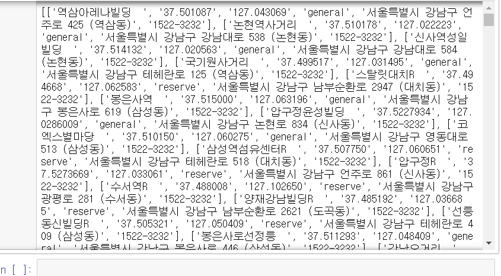
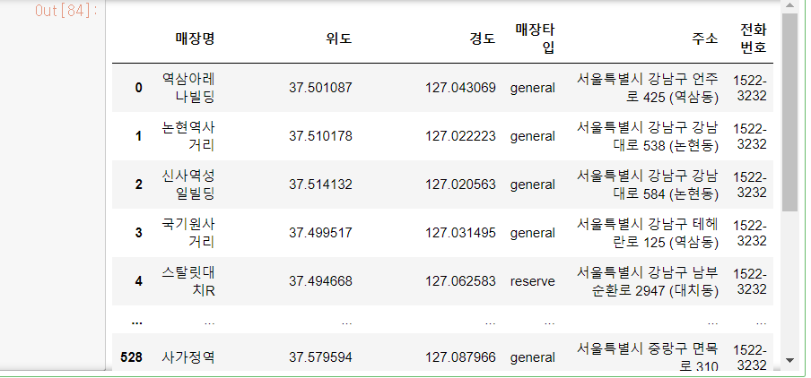

아나콘다 3> 쥬피터 노트북 아나콘다3

오른쪽 new버튼 > python 3 

shift+enter 


# 웹 크롤링 review

a 태그 : 클릭하면 이동하는 의미 


쥬피터에 selenium 설치


```
<p class="prod_name click_log_product_adReader_title_">
<a href="http://prod.danawa.com/info/?pcode=12583850&amp;keyword=%EB%AC%B4%EC%84%A0%EC%B2%AD%EC%86%8C%EA%B8%B0&amp;cate=103744" onmousedown="_trkEventLog('통합검색_광고상품_라이프로 RX10');" target="_blank">라이프로 RX10</a>
```

소스가 이렇게면


```
#제품명 출력
prod_items[0].select("p.prod_name > a")

prod_items[0].select("p.prod_name > a")[0].string
```


#스펙 출력

```
prod_items[0].select("div.spec_list")[0]

밖의 0 은 큰 대괄호 없애주기 용임

print(prod_items[0].select("div.spec_list")[0].text.strip())
```


-----

전체 풀이 (쥬피터)

```
prod_data = []
for prod_item in prod_items:
    try: 
        title = prod_item.select('p.prod_name > a')[0].text.strip()
    except:
        title = ''
    try: 
        spec_list = prod_item.select('div.spec_list')[0].text.strip()
    except:
        spec_list = ''
    try: 
        price = prod_item.select('li.rank_one > p.price_sect > a > strong')[0].text.strip().replace(",","")
    except:
        price = 0
    prod_data.append([title, spec_list, price])
    
print(len(prod_data))
print(prod_data)
```


# 스타벅스 웹크롤링 클릭포함


```
seoulBtn = "#container > div > form > fieldset > div > section > article.find_store_cont > article > article:nth-child(4) > div.loca_step1 > div.loca_step1_cont > ul > li:nth-child(1) > a" #copy selector 

browser.find_element_by_css_selector(seoulBtn).click() #클릭!


```

```
allBtn = "#mCSB_2_container > ul > li:nth-child(1) > a" #서울>전체 버튼
browser.find_element_by_css_selector(allBtn).click()
```


매장명 추출

```

html = browser.page_source
soup = BeautifulSoup(html,"html.parser")
sb_list= soup.select("li.quickResultLstCon")
print(sb_list[0].select("strong")[0].text)
```

strong 태그 : 시작 끝 없

string ,text 용도 같


```
sb_list= soup.select("li.quickResultLstCon")
sb_store =sb_list[0]
lat = sb_store['data-lat']
lng = sb_store['data-long']
print(lat)
print(lng)

print(sb_store.select("p.result_details")[0])
#addr=
#tel=

#print(str(sb_store.select("p.result_details")[0]).split("<br/>")[0]) #주소
print(str(sb_store.select("p.result_details")[0]).split("<br/>")[0].split(">")[1])#살짝의 꼼수로 주소에 > 하나밖에 없으니까 스플릿

print(str(sb_store.select("p.result_details")[0]).split("<br/>")[1].split("<")[0]) #전화번호 +꼼수


```


```
37.501087
127.043069
서울특별시 강남구 언주로 425 (역삼동)
1522-3232
```


서울 모든 매장 + 정보 전부다 출력


```
seoul_sb_list=[]
for item in sb_list:
    #print(item)
    #print("="*50)
    name = item.select("strong")[0].text
    lat = item['data-lat']
    lng = item['data-long']
    sb_type=item.select("i")[0]['class'][0][4:]#general
    addr = str(item.select("p.result_details")[0]).split("<br/>")[0].split(">")[1]
    tel = str(item.select("p.result_details")[0]).split("<br/>")[1].split("<")[0]
    
    seoul_sb_list.append([name,lat,lng,sb_type,addr,tel])


print(seoul_sb_list)
```




```
import pandas as pd

col =['매장명','위도','경도','매장타입','주소','전화번호']

sb_df = pd.DataFrame(seoul_sb_list, columns=col)
sb_df
sb_df.to_excel("스타벅스목록.xlsx", index=False)
```



# 인스타그램 웹크롤링

## 기초작업

```
from selenium import webdriver
driver = webdriver.Chrome("c:/scrap/chromedriver.exe")
import time
driver.get('https://www.instagram.com')
time.sleep(2) #2초동안 대기

```


## 로그인하기

```
email = "rla_rkdnjs@naver.com"
input_id=driver.find_elements_by_css_selector("#loginForm > div > div:nth-child(1) > div > label > input")[0]
input_id.clear()
input_id.send_keys(email) #입력! 신기

password="flqhs66!"
input_pw=driver.find_elements_by_css_selector("#loginForm > div > div:nth-child(2) > div > label > input")[0]
input_pw.clear()
input_pw.send_keys(password) 
input_pw.submit()
time.sleep(3)
```

리스트라 [0]만

elements : 리스트로 여러개 vs element  

*셀 추가 a키

```
def insta_searching(word):
    url="https://www.instagram.com/explore/tags/"+word
    return url
    
word='제주도맛집'
url = insta_searching(word)
driver.get(url)

def select_first(driver):
    first =driver.find_element_by_css_selector("div._9AhH0") #영역의미 elements는 여러개라 list로 나옴
    
    first.click()
    time.sleep(3)
select_first(driver)
import re
def getContent(driver):
    html = driver.page_source
    soup = BeautifulSoup(html,"html.parser")
    content = soup.select("div.C4VMK>span")[0].text
    tags = re.findall("#[^\s.]+ ",content)
    date = soup.select("time._1o9PC.Nzb55")[0]['datetime'][:10] #시간속성따로있음 
    #년월일만 뽑고싶을때:10
    data=[content,date,tags]
    return data
getContent(driver)
```


```
    print(re.findall("#[^\s.]+ ",content))
#공백,콤마 아닌거
```


def getContent(driver):
    html = driver.page_source
    soup = BeautifulSoup(html,"html.parser")
    content = soup.select("div.C4VMK>span")[0].text
    tags = re.findall("#[^\s.]+ ",content)
    date = soup.select("time._1o9PC.Nzb55")[0]['datetime'][:10] #시간속성따로있음 
    #년월일만 뽑고싶을때:10
    data=[content,date,tags]
    return data


