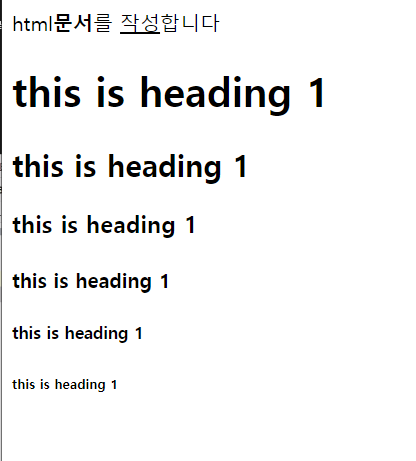
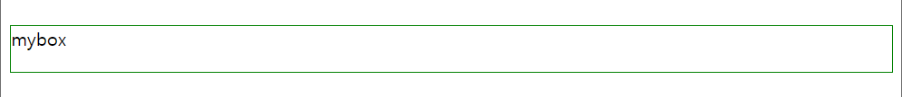
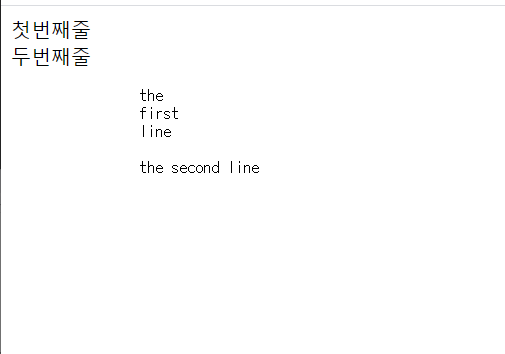
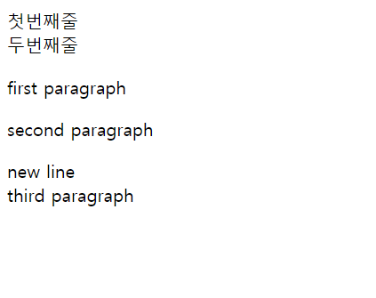
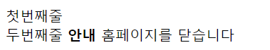
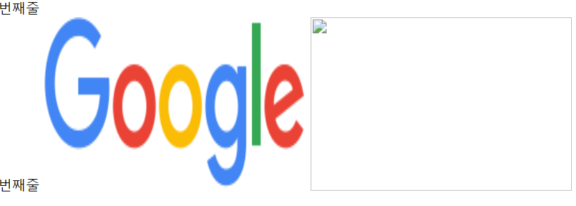

# HTML


```
<!DOCTYPE html>
<html lang="en">
<head>
    <meta charset="UTF-8">
    <title>Title</title>
</head>
<body>
html<strong>문서</strong>를 <u>작성</u>합니다
</body>
</html>
```

<strong> : 굵게

<u> : 밑줄


```
<h1>this is heading 1</h1>
<h2>this is heading 1</h2>
<h3>this is heading 1</h3>
<h4>this is heading 1</h4>
<h5>this is heading 1</h5>
<h6>this is heading 1</h6>
```



h6까지만 사용가능함 7,8...은 그냥 디폴트!

검색엔진이 검색할때 h태그가 중요한정보, strong은 안중요한 정보


```
<?xml version="1.0" encoding="UTF-8"?>
<note class="mycls">
   <to>Tom</to>  <!-- 태그로 묶인 값: Tom <=> to=Tom 요런느낌-->
   <from>Amy</from>
   <heading>Reminder</heading>
   <body>Don't forget me this weekend!</body>
</note>
```


html 주석은 `<!-- ` , `-->`   단축키: ctrl+shift+/ 범위 주석처리

 컨트롤 +/ : 줄단위로 주석처리


body 태그 안에 기술한 내용이 화면에 보여지게 되는 부분


html:비구조화된 문서, 태그 이름이 정해져 있음

xml: 구조화된 문서, 태그 이름을 사용자가 지정할 수 있음


웹통신과정

1. 사용자가 주소 입력 (www.naver.com)
2. www.naver.com - > 13.15.230.221 (DNS) 2진수로 표현하기 직전 10진수로 바꾼 주소로 변환  

3. 브라우저는 13.15.230.221에 웹페이지를 요청
4. 웹서버는 요청을 받고 실행함 ->  HTML, CSS, JS 문서 전송
5. 사용자 웹브라우저는 전달 받은 문서를 해석 -> 화면에 출력
6. 브라우저에는 네이버 홈페이지가 출력

프론트엔드(html, css ,js)로 만든 페이지  (서버가 필요없는 특징)


태그안에 태그 만들수있음 


```
<meta charset="UTF-8"> #한글 안깨지게
<aa>
   <bb>내용</aa>
</bb>
<aa>
   <bb>내용1</cc>
   <cc>내용2</bb>
</aa>
```

태그 닫는거 순서 틀린것 고쳐주기 -->

```
<meta charset="UTF-8">
<aa>
   <bb>내용</bb>
</aa>

<aa>
   <bb>내용1</bb>
   <cc>내용2</cc>
</aa>
```


* 슬래시 태그가 없는 태그

`<br>, , <meta>, <hr>, <input>, <link>`

근데 그냥 형식 맞춰줄라고` <br/>` 로 써준다.


## 알록달록

```
<html>
<head>
   <link type="text/css" href="my_style.css">
</head>
<body>
   <font color="red" face="Dotum">Hello</font>
   <font color="yellow">World</font>
</body>
</html>
```

글꼴 : face 


- 모든 태그에는 id, class 속성 부여 가능 => CSS, JS 에서 태그를 쉽게 다룰 수 있음

=> 하나의 id당 하나의 태그만 적용가능

=> 하나의 클래스를 여러 태그에 적용가능

```
<div id="my-box1"></div>
<div id="my-box2" class="boxes"></div>
<div id="my-box3" class="boxes"></div>
<div class="boxes"></div>
```


style 속성 : 태그의 스타일 지정. 출력되는 형식을 지정 




```
<div style="width:500px; height:300px"></div>
<div style="height:40px; border: 1px solid green">mybox</div>
```

너비, 높이

## br

`<br>`로 줄바꾸기

```
<meta charset="UTF-8">
첫번째줄<br>
두번째줄
```

## pre

`<pre>`



화면에 보이는 그대로 출력해줌. 띄어쓰기, tab 등 

## p

`<p>` 문단 지정


```
<html>
   <body>
      <p>first paragraph</p>
      <p>second paragraph</p>
      <p>
         new line<br>
         third paragraph
      </p>
   </body>
</html>
```

 

p태그 만나서 하나의 문단으로, 총 3개의 문단으로 구성된다.  

## b

`<b>` 태그 보다는 `<strong>`태그 사용 권장

css에서는 font-weight 값을 bold로 설정


```
<b>안내</b> 홈페이지를 닫습니다
```



## i

```
<i>이탤릭체</i> 입니다
```

기울이기


검색엔진 입장에서 strong은 무시 , h1은 제목인거 앎


a태그 : 하이퍼 링크를 설정하는 태그

속성: 

- href : 이동 할 링크

- target: 링크를 여는 방법 -> 새탭 , 현재 화면 

```
<a href="http://www.naver.com">네이버</a>

<a href="http://www.daum.net" target="_blank">다음</a>

<a href="http://www.google.com" target="_self">구글</a>

```

`target = "_blank"` : 새탭

`target="_self"` : 현재 화면 

## img



```


 
<!--파일이 없는경우 깨짐-->
```


