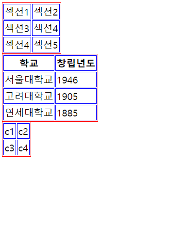
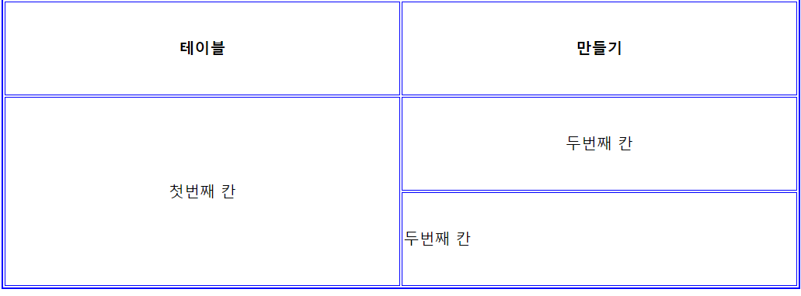
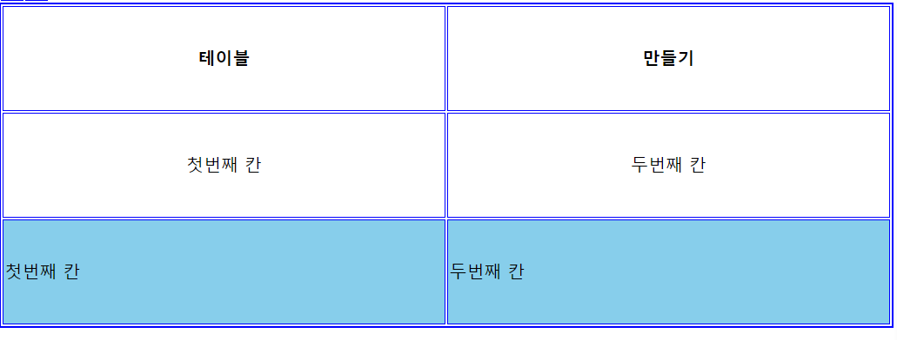
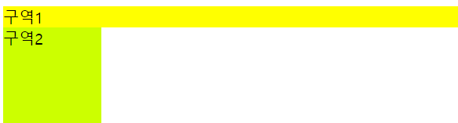
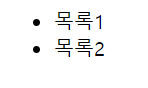
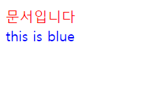
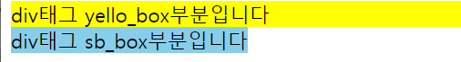
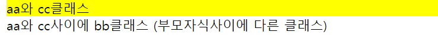

# 테이블 태그 

표

tr태그, td태그와 함께 사용한다

화면 구성할 때 테이블 태그보다 div태그(css) 많이 사용한다


```
<table>
	<thead>
		<tr>
			<th>학교</th>
			<th>창립년도</th>
		</tr>
	</thead>
	<tbody>
		<tr>
			<td>서울대학교</td>
			<td>1946</td>
		</tr>
		<tr>
			<td>고려대학교</td>
			<td>1905</td>
		</tr>
		<tr>
			<td>연세대학교</td>
			<td>1885</td>
		</tr>
	</tbody>
</table>
```

<thead> :표의 제목영역

<tbody> :  

tr로 행 구분 td 열


## style

```
<style>
    table{border:1px solid #444444}
</style>
```

아무데나 써도

표에 외곽테두리 쳐짐

#ff0000 색상값의 범위:0~F(16진수) 

000000 : 검정 FFFFFF:흰색

  R G B


```
<style>
    table{border:1px solid #ff0000}
    th,td{border:1px solid #0000ff}
</style>
```




```
table{border:1px solid #ff0000
border-collapse:collapse;  
}
```

border-collapse:collapse; 태두리 선의 간격을 없애준다.


스타일 안쓰고 표

```
<html>
<head>
<meta charset="EUC-KR">
<title>초간단 테이블</title>
</head>
<body>
    <table border="2" bordercolor="blue"> #외곽 테두리 두께,색상
    
   <th>테이블</th>
   <th>만들기</th>
   <tr><!-- 첫번째 줄 시작 -->
       <td>첫번째 칸</td>
       <td>두번째 칸</td>
   </tr><!-- 첫번째 줄 끝 -->
   <tr><!-- 두번째 줄 시작 -->
       <td>첫번째 칸</td>
       <td>두번째 칸</td>
   </tr><!-- 두번째 줄 끝 -->
    </table>
</body>
</html>
```


```
    <table border="2" bordercolor="blue" width="600" height="300">

```

표크키 픽셀단위로 크기 설정 

```
 width="100%"
```

```
<tr align="center"><!-- 첫번째 줄 시작 -->
    <td>첫번째 칸</td>
    <td>두번째 칸</td>
</tr><!-- 첫번째 줄 끝 -->
```

 align="center" 로 가운데 정렬 가능


```
<tr align="center"><!-- 첫번째 줄 시작 -->
    <td colspan="2">합쳐진 칸</td>
```

colspan 으로 줄 합치기

```
<tr align="center"><!-- 첫번째 줄 시작 -->
    <td rowspan="2">첫번째 칸</td>
    <td>두번째 칸</td>
</tr><!-- 첫번째 줄 끝 -->
<tr><!-- 두번째 줄 시작 -->
   
    <td>두번째 칸</td>
```

rowspan 으로 세로로 합치기




```
<tr bgcolor="skyblue"><!-- 두번째 줄 시작 -->
	    <td>첫번째 칸</td>
	    <td>두번째 칸</td>
	</tr><!-- 두번째 줄 끝 -->
```



bg color (back ground) 로 배경색 설정가능

td에 하면 한칸 색칠 됨!


## div

div 태그 : division 약자, 레이아웃 설계용, 자체적으로 기능은 없다

CSS와 연동하여 사용

```
<meta charset="UTF-8">

<div style="background-color:yellow">구역1</div>
<div style="width:100px; height:100px;background-color:#CF0">구역2</div>
```





```
<div style="background-color:yellow">구역1</div>
<div style="width:100px; height:100px;background-color:#CF0">구역2</div>
<div style="background-color:blue">구역3</div>
줄바뀜 볼 수 있음
```

## span

: 기능 없음 ,css와 연동하여 사용

div는 줄바꿈을 함, span은 줄바꿈을 하지 않음


```
<span style="background-color:yellow">구역1</span>
<span style="background-color:red">구역2</span>
<span style="background-color:blue">구역3</span>
<span style="background-color:yellow">구역4</span>
```


span 2번구역에 크기 줘도 안먹음 텍스트 영역만 설정되기 때문


# li

```
<ol>
	<li>목록1</li>
	<li>목록2</li>
</ol>
```

이런식으로 씀 실과 바늘 같은 존재


```
<ul>
   <li>목록1</li>
   <li>목록2</li>
</ul>
```

순서 없어짐



```
<ul>
   <li>목록1</li>
   <li>목록2</li>
    <ol>
   <li>목록2-1</li>
   <li>목록2-2</li>
</ol>
</ul>
```


# head 태그에 쓰는 내용

실행시 화면에 출력되지 않음, 숨어있는 태그

title, meta, link, style, script 태그 등이 위치

## meta

 : 페이지 정보(페이지에 대한 설명, 키워드, 제작자, 크롤링 정책) 제공


```
<html>
<head>
    <title>제목</title>
    <meta charset="utf-8">
    <meta name="keywords" content="노트북, 컴퓨터, 주변기기">
    <meta name="description" content="컴퓨터 판매 페이지입니다">
    <meta name="robots" content="all">
</head>
</html>
```


한국어 인코딩 방식 : euc-kr, utf-8

euc-kr : ascii(1byte)+한글만 확장 사용 => 2byte

utf-8 : 보편화된 인코딩 


# form 📌

클라이언트가 서버에 정보를 전달하고자 할때 form? 


<form>
	<p>
		<strong>아이디</strong>
		<input type="text" name="name" value="아이디 입력">
	</p>
	<p>
		<strong>비밀번호</strong>
		<input type="password" name="password" value="비밀번호 입력">
	</p>
	<p>
		<strong>성별</strong>
		<input type="radio" name="gender" value="M">남자
		<input type="radio" name="gender" value="F">여자
	</p>
	<p>
		<strong>응시분야</strong>
		<input type="checkbox" name="part" value="eng">영어
		<input type="checkbox" name="part" value="math">수학
	</p>
	<p>
		<input type="submit" value="제출">
	</p>
</form>
아

`input type ="password"` 내용을 숨겨준다

`radio` 는 여러개중에 1개만 선택가능

`checkbox` 2개 이상 선택가능


```
<select>
    <option value="ktx">ktx</option>
    <option value="새마을">새마을</option>
    <option value="무궁화">무궁화호</option>

</select>
```


# CSS

웹페이지에 출력할 내용과 스타일(표현방식)을 분리하기 위해 생겨남 

어떤 태그들에게 어떤 스타일 효과를 적용하는 언어. 선택자: 어떤 태그들에게 스타일을 적용할 것인지 정의하기 위한 문법

ex) 선택자 문법 예시

선택자{

속성1:값;

속성2:값;

...

}


* CSS 작성 3가지 방법

1) HTML문서의 style속성

2) <style>태그를 이용하여 html 문서에 css 작성


`#`은 아이디 `.` 클래스


```
<div style="color:red">문서입니다</div>

<!DOCTYPE html>
<html lang="en">
<head>
    <meta charset="UTF-8">
    <title>Title</title>
    
    <style type="text/css">
        .my-text{color:blue}
    </style>
<!--     my-text 클래스로 묶인 내용이 나오면 글자속성 파란색으로 스타일은 주석이 안되네-->

</head>
<body>
<div class="my-text"> this is blue</div>
</body>
</html>
```



css문서를 별도로 만들어 놓은 다음, html문서에 포함시키는 방법


## 선택자

css 선택자 종류(3가지) : 태그 선택자, id 선택자, class 선택자

1. 태그이름{속성1:값1 ; ... }

   ```
   <html>
   <head>
       <style>
       h5{color:#F00}
       h6{color:#00F;font-size:20px}
       </style>
   </head>
   
   <h4>h4태그</h4>
   <h5>h5태그</h5>
   <h6>h6태그</h6>
   </html>-->
   ```

2. 아이디 선택자 :` #아이디{속성1:값; ...}`

   ```
   <html>
   <head>
       <meta charset="EUC-KR">
       <style>
       #mybox{background-color:#09c; width:200px; height:50px;}
       </style>
   </head>
   <body>
       <div id="mybox">mybox클래스로 정의된 스타일</div>
   </body>
   </html>
   ```

3. 클래스 선택자 `.`

`.yourbox{이쁜거}`

```
<html>
<head>
    <meta charset="EUC-KR">
    <style>
    .yourbox{border:2px solid green
    </style>
</head>
<body>
    <div class="yourbox">클래스 스타일 적용</div>
</body>
</html>
```


부모자식 선택자

선택자1 선택자2{속성1:속성값; 속성2:속성값;}

부모태그 하위에 있는 자식 태그에 스타일을 적용

```
<html>
<head>
    <style>
        div.yello_box{background-color:yellow;}
        div.sb_box span{background-color:skyblue;}
    </style>
</head>
<body>
<div> div태그 부분입니다</div>
<div class="yello_box"> div태그 yello_box부분입니다</div>
<div class="sb_box">
    <span>
    div태그 sb_box부분입니다
    </span>
</div>
</body>
</html>
```




```
div#c_box span{text-align:center;padding:10px;color:green;}
```

padding 들여쓰기 color 는 글자색


꺽쇠의 유무 차이점 

```
<style>
.aa>.cc{background-color:yellow}
.xx.yy{background-color:skyblue}
</style>

<div class="aa">
    <div class="cc">
        aa와 cc클래스 #적용
    </div>
</div>


<div class="aa">
    <div class="bb">
        aa와 cc사이에 bb클래스 (부모자식사이에 다른 클래스)
    </div>
</div>
```




```
<style>
.aa>.cc{background-color:yellow}
.xx.yy{background-color:skyblue}
</style>

<div class="xx">
    <div class="yy">
        xx와 yy클래스 부모자식간 직접적 관계
    </div>
</div>


<div class=" xx">
    <div class="kk">
        <div class=" yy">
        xx와 yy사이에 kk클래스 (부모자식사이에 다른 클래스)
    </div></div>
</div>
```

오류남 ..


## 다중 조건 선택지 : AND, OR 

공백이 없으면 여러 선택자들을 동시에 만족하는(AND) 태그에 대해 스타일적용

ex)

태그이름#아이디{}

태그이름.클래스명{}


or조건 : **쉼표**로 여러 선택자 중 어느 하나 이상의 선택자 조건을 만족하는 경우 스타일적용

ex)

#아이디, .클래스명{}

태그이름, .클래스명{}


