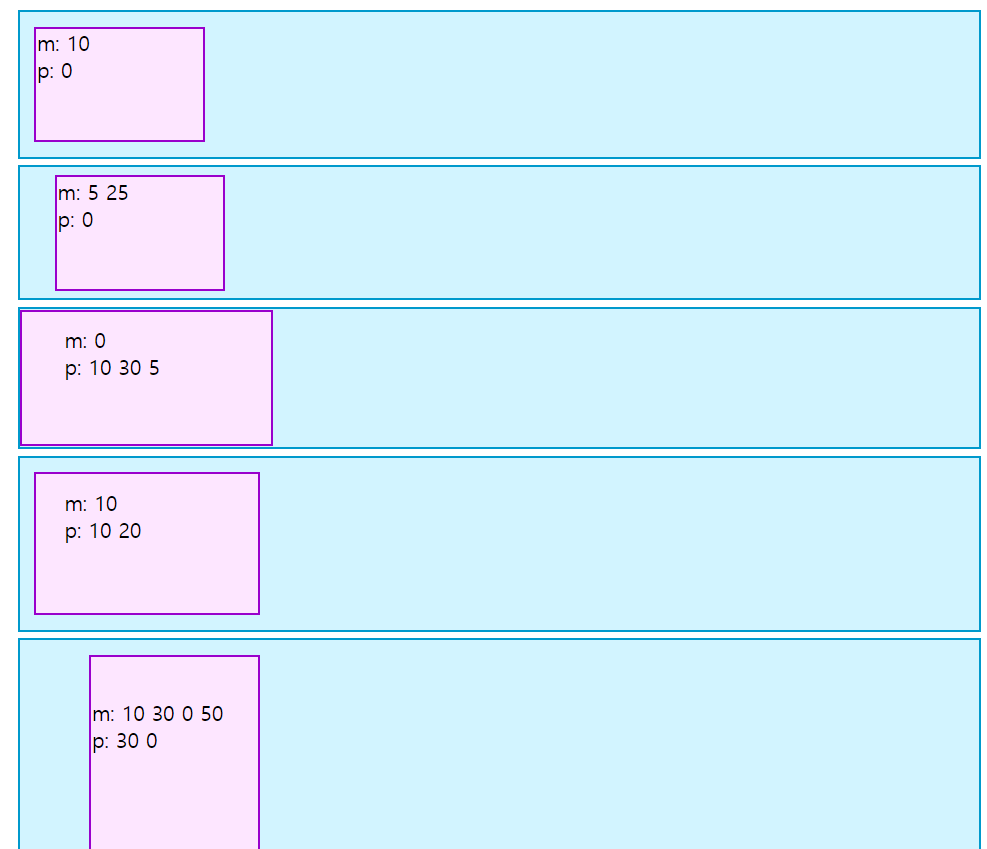
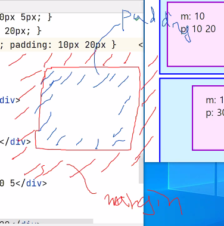
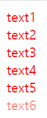
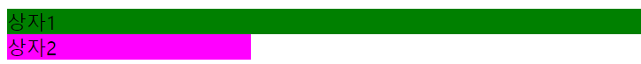
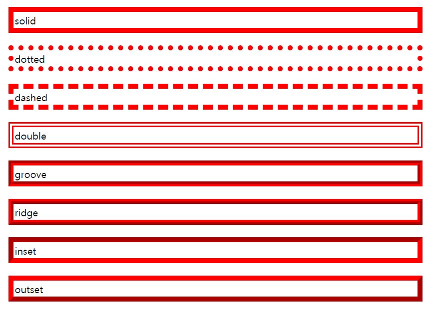

# review

횟수세기 라이브러리

from collections import Counter

words = [w.strip(", ")]

​	for w,c in Counter(words).most_common(10):

​	print(w,c)


# Hover

* 헤드안에 스타일 넣기!!

마우스가 위에 올라갔을때 (호버상태)의 이벤트 정의

```
<html>
<head>
    <meta charset="UTF-8">
    <style>
        .box{
        background-color:#09c;
        }
        .hover-box:hover {
        background-color:orange;
        }

    </style>
</head>
<body>
<div class="box hover-box">마우스를 올려주세요</div>
</body>
</html>
```

마우스가 올라가면 오렌지로 색 변함

```
.hover-box:hover {
background-color:orange;
}  #마우스 올려놨을때 변화 부분
```


# Focus

: 클릭시 변화

```
<html>
<head>
    <meta charset="UTF-8">
    <style>
        .box{
        background-color:#09c;
        }
        .hover-box:hover {
        background-color:orange;
        }
        .focus-input:focus{
        background-color:yellow;
        }
    </style>
</head>
<body>
<div class="box hover-box">마우스를 올려주세요</div>
<input type="text" value="click me" class="focus-input">
</body>
</html>
```

바디안에 인풋으로 해서 


# 마진/패딩

```
<html>
<head>
    <meta charset="UTF-8">
</head>

<body>
<div style="width:200px;height:100px;background-color:#dd44ff">
    200*100화면
</div>
<div style="width:50%;height:20%;background-color:orange">
    50%,20%화면
</div>

</body>

</html>
```

마진 : 바깥쪽 상화좌우 여백

margin:100 px 

margin:50 px 10px 상하 50px , 좌우 10px 의 여백

 margin: 10px 20px 30px 40px 위에서부터 시계방향으로 상 우 하 좌

패딩 : 안쪽 여백

```ㄱ

<html>
<head>
    <meta charset="UTF-8">
    <style>
	.box-container{
		background-color: #d2f4ff;
		border: 2px solid #09c;
		margin: 5px 15px; #바깥 큰박스 기준으로 그 위아래 5px 간격 넣어준다 15px는 좌우로
	}
	.box-container div{ #안에 들어가는 작은 박스
		width: 120px;
		height: 80px;
		background-color: #fde6ff; #옅은 보라색
		border: 2px solid #90C; 
		font-size: 15px;
	}
	#box1{ margin: 10px;  padding: 0; } #바깥쪽 10px씩 이게 왼쪽이 기준이 되는것 같다 
	#box2{ margin: 5px 25px; padding: 0; }
	#box3{ margin: 0;  padding: 10px 30px 5px; }
	#box4{ margin: 10px; padding: 10px 20px; }
	#box5{ margin: 10px 30px 0 50px; padding: 30px 0 }     #시계!
</style>
</head>
<body>
	<div class="box-container">
		<div id="box1">m: 10<br>p: 0</div>
	</div>
	<div class="box-container">
		<div id="box2">m: 5 25<br>p: 0</div>
	</div>
	<div class="box-container">
		<div id="box3">m: 0<br>p: 10 30 5</div>
	</div>
	<div class="box-container">
		<div id="box4">m: 10<br>p: 10 20</div>
	</div>
	<div class="box-container">
		<div id="box5">m: 10 30 0 50<br>p: 30 0</div>
	</div>
</body>
</html>
```






`margin-left:`, `margin-bottom`으로도 줄 수 있다


# 폰트

```
<html>
<head>
    <meta charset="UTF-8">
    <style>
        #text1{font-size:40px}
        #text2{font-size:30px}
        #text3{font-size:20px}
        .bold{font-weight:bold}
        .italic{font-style:italic}
        .jinji{font-family:"궁서"}
        #text4{font:italic bold 50px serif;}

    </style>
</head>
<body>
<div id="text1"> 40픽셀</div>
<div id="text2"> 30픽셀</div>
<div class="italic"> 이탤릭</div>
<div class="jinji">궁서</div>
<div id="text4">반갑습니다 nice to meet you</div>
```

`serif` 는 영어만 적용되는 폰트


# 색상

```
<html>
<head>
    <style>

    </style>
</head>
<body>
<div style="color:Red">text1</div>
<div style="color:#ff0000">text2</div>
<div style="color:#f00">text3</div>
<div style="color:rgb(255,0,0)">text4</div>
<div style="color:rgba(255,0,0)">text5</div>

</body>
</html>
```

전부 빨강

rgba에서 a는 알파, 알파는 불투명도(0~1) 속성

```
<div style="color:rgba(255,0,0,1)">text5</div>
<div style="color:rgba(255,0,0,0.5)">text6</div>
<div style="color:rgba(255,0,0,0)">text7</div>
```




# 정렬

```
<div id="align1">오른쪽</div>
<div id="align2">왼?</div>
<div id="align3">가운데?</div>
```


# 배경색

```
<html>
<head>
        <meta charset="UTF-8">
    <style>
        #box1-1{background-color:green;}
        #box1-2{background-color:ff00ff;width:200px}
    </style>
</head>
<body>
<div id="box1-1">상자1</div>
<div id="box1-2">상자2</div>
</body>
</html>
```




# 이미지

```
<html>
<head>
        <meta charset="UTF-8">
    <style>
        #box1-1{background-color:green;}
        #box1-2{background-color:ff00ff;width:200px}
        #box2-1{
        width:100px;
        height:100px;
        background-image:url("earth.jpg");
        }

        #box2-2{
        width:300px;
        height:200px;
        margin:50px;
        background-image:url("earth.jpg");
        }

    </style>
</head>
<body>
<div id="box1-1">상자1</div>
<div id="box1-2">상자2</div>
<div id="box2-1"></div>
<div id="box2-2"></div>
ㅎㅇ
</body>
</html>
```


repeat 사용

```
<html>
<head>
    <meta charset="UTF-8">
    <style>
        .abox{
        width.500px;
        height:300px;
        background-image:url("earth.jpg");
        margin-bottom:20px;
        }
        #box1{background-repeat:no-repeat}
        #box2{background-repeat:repeat}
        #box3{background-repeat:repeat-x}

    </style>
</head>
<body>
<div class="abox"></div>
<div class="abox" id="box1"></div>
<div class="abox" id="box2"></div>
<div class="abox" id="box3"></div>


</body>
</html>
```

`-x`,`-y` 옵션으로 반복 방향 설정 가능


클래스와 아이디

공통속성은 class로 설정

개별속성은 id로 설정


스타일 속

```
#box1{background-repeat:no-repeat;
background-position:center;
}
```

-> 지구가 네모 사이에 정렬됨

center, right 30px , 


```
<html>
<head>
        <meta charset="UTF-8">

    <style>
    .border-styles >p{
    margin:2px;
    padding:2px;
    border-color:#ff0000;
    border-width:2px;
    }
    </style>
</head>
<body>
<div class="border-styles">
    <p style ="border-style:solid">solid</p>
</div>
</body>
</html>
```

# 선스타일




```
<body>
<div class="border-styles">
    <p style ="border-style:solid">solid</p>
        <p style ="border-style:dotted">dotted</p>
        <p style ="border-style:dashed">dashed</p>
        <p style ="border-style:double">double</p>
        <p style ="border-style:groove">groove</p>
        <p style ="border-style:ridge">ridge</p>
        <p style ="border-style:inset">inset</p>
        <p style ="border-style:outset">outset</p>

</div>
</body>
```


id로 한방에 가능

```
<html>
<head>
    <style>
   #box{
   border:5px dotted green}
    </style>
</head>
<body>
<div id="box">text

</div>
</body>
</html>
```

# 지구가아파요

```
<html>
<head>
        <meta charset="UTF-8">

    <style>
    .float-container{
    width:300px;
    border:3px solid #090;
    }
    .float-container img{
    float:left;
    
    }
    </style>
</head>
<body>
<div class="float-container">
    
    지구가아파요! 지구가아파요! 지구가아파요! 지구가아파요! 지구가아파요! 지구가아파요! 지구가아파요! 지구가아파요!
     지구가아파요! 지구가아파요! 지구가아파요! 지구가아파요! 지구가아파요! 지구가아파요!
</div>
</body>
</html>
```

`  .float-container img {float:left;}` 옆으로 해주고싶을때

 margin으로 이미지 여백도 줄 수 있음

