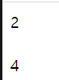
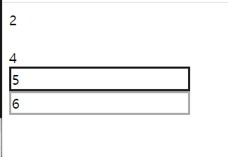
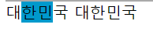
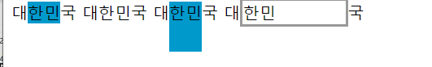
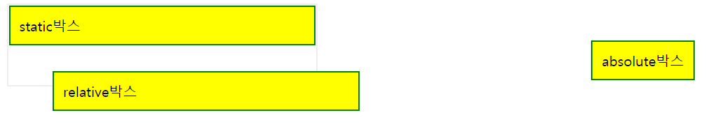

# display , visibility

```
<style>
    .disp-none{display:none}
    .invisible{visibility:hidden}

    </style>
</head>
<body>
<div class="disp-none">1</div>
<div>2</div>
<div class="invisible">3</div>
<div>4</div>

</body>
</html>
```



둘다 화면에 안나옴

그래도 invisible은 공백으로 빈자리가 보이고

display:none은 출력되야 할 빈공간도 없음

# block

```
<style>
    .block1{width:200px;border:3px solid #222}
    .block2{width:200px;border:3px solid #aaa}
    ...
<body>
	<div class="block1">5</div>
	<div class="block2">6</div>
```




# inline

줄바꿈을 하지 않음 : a, i, b, span태그

```
<style>
    .inline1{background:#09c;}
    .inline2{border:#px solid #999;}
    
<body>
대<span class="inline1">한민</span>국
대<span class="inline2">한민</span>국

```



너비나 높이를 설정할 수 없다 style에 height,width추가해도 무시된다.


```
.inline-block1{background:#09c;display:inline-block;height:50px;}
.inline-block2{border:3px solid #999; display:inline-block; width:100px}

<body>
대<span class="inline-block1">한민</span>국
대<span class="inline-block2">한민</span>국
```




```
<style>
 .box-container{
    width:350px; border:2px solid #eeeeee;
    }

    .box-container div{
   padding:10px;border:2px solid green; background-color:yellow;
    }
    #box1{position:static; top:100px;left:30px;}
    #box2{position:relative; top:30px;left:50px;}
    #box3{position:absolute; top:50px;right:30px;}
    
<body>
<div class="box-container">
    <div id="box1">static박스</div>
    <div id="box2">relative박스</div>
    <div id="box3">absolute박스</div>
    </div>
```



relative는 바로이전에 출력된것을 기준으로 상대적인 위치


# Javascript

동적인 페이지 (객체 기반 스크립트 언어)

생성된(from 클래스) 객체를 이용해 동적인 페이지를 기술하는 언어


클래스 ->객체속성(속성 초기화) ->객체 동작...

붕어빵기계 -> 붕어빵(크기,내용물) -> 굽기

자바스크립트 작성법

1) html 문서 내에 작성

2)별도로 파일(js)로 작성 -> html문서에 포함 

1)

```
<!DOCTYPE html>
<html lang="en">
<head>
    <meta charset="UTF-8">
    <title>Title</title>
<script type="text/javascript">
    document.write("hello");
</script>
</head>
<body>

</body>
</html>
```

** <script> **

2)

```
  <title>Title</title>
    test.js파일 불러오기
<script type="text/javascript" src="test.js">
```


```
<!DOCTYPE html>
<html lang="en">
<head>
    <meta charset="UTF-8">
    <title>Title</title>
    test.js파일 불러오기
<script type="text/javascript" src="test.js">

</script>
</head>
</html>
```


자바스크립트 자료유형 

Boolean : 참 또는 거짓 

String:문자열

Number:숫자형 

null:빈 값

NaN: Not a Number, 숫자 아님


```
<!DOCTYPE html>
<html lang="en">
<head>
    <meta charset="UTF-8">
    <title>Title</title>
    <script type="text/javascript">
    var a=10;
    var b='k';
    document.write(a);
    document.write(b);
    document.write(' ');

    var c=0.5;
    var d=-3.2;
    var e=0x1af; //16진수
    var f=010; //8진수
    document.write(e);
    document.write(f);
    document.write(' ');
    var k='5'
    //document.write(k+2); //문자+숫자 -> 문자+문자 -> 문자결합됨됨
    document.write(parseInt(k)+2);
  
```


parseInt() : 문자로된 숫자를 숫자로 변환해주는 함수 '5'->5

```
document.write(parseInt('hello')+2); //NaN
```

문자라서 잘못들어갔기때문에 NaN


```
//Math.sqrt(-1); //square root(제곱근) :9의 제곱근은 3
document.write(Math.sqrt(-1)); NaN
```

`Math.sqrt (양수)`

```
document.write(3/0); Infinity
```


## alert

```
<!DOCTYPE html>
<html lang="en">
<head>
    <meta charset="UTF-8">
    <title>Title</title>
</head>
<body>
    <script>
        alert('hello world')
    </script>
</body>
</html>
```

```
alert('hello world');
alert(1+2);
```

알람창 2개


```
<script>
document.write(Math.pow(3,2));
```

제곱함수

클래스대문자로 시작 -> 객체> 객체.함수()

Math클래스에 있는 pow함수를 호출하는데 3과 4를 전달해라


```
    <script>
    document.write(Math.pow(3,4)+'<br/>');
    document.write(Math.round(1.7)+'<br/>'); //반올림
    document.write(Math.ceil(1.2)+'<br/>'); //올림
    document.write(Math.floor(2.9)+'<br/>'); //내림
    document.write(Math.random()+'<br/>'); //0~1난수

```


```
document.write('스크립트'+'<br/>');
document.write("스크립트"+'<br/>');
```

상관없는데 따옴표 짝은 맞춰주기


```
document.write(typeof "1"+'<br/>'); //string
```

타입출력

1 -> number


```
document.write("철수's"+'<br/>'); //정상
//document.write('철수's'+'<br/>'); //비정상
document.write('철수\'s'+'<br/>'); //이렇게 '앞에 역슬래쉬 해주기

```


## 줄바꿈

```
alert("안녕\n하세요.\n자바스크립트"); //줄바꿈으로 인식함
document.write("안녕\n하세요.\n자바스크립트"+'<br/>');  //줄바꿈 안해줌
document.write("안녕<br/>하세요.<br/>자바<br/>스크립트");  //줄바꿈 한것!
```

줄바꿈을 문장의 끝으로 인식하므로 세미콜론을 생략해도 됨

//alert(a+1)


## length

```
alert("안녕".length) //문자열길이
```


## new Date()

```
document.write(new Date());
```

>  Thu Jan 21 2021 13:45:03 GMT+0900 (대한민국 표준시)

클래스 ---new--->객체 생성

동적문서이기때문에 실행할때마다 시간 바뀜


```
    alert(1==2); //false
    alert("1"==1); //내부적으로 (비교)연산을 하기 전에 자동형변환
    alert("1"===1) //형변환 수행 x false
```

```
document.write(true ==1); //true가 1이라 true
document.write(true == "1");  //문자형도 true
```

```
document.write(true ==0); //False
document.write(true == "0"); //False
```

1은 true , 1아니면 false


```
document.write("one"!="two"); //t !==도 같음
document.write("one"=="two"); //f
```


## if

if(조건){

수행할 문장;

}

```
if(2>1){
alert("2가 1보다 큽니다")};
```

```
if(true){
alert(1);
}
else{
alert(2);
}
```


```
if(false){
alert(1);
}
else if(true){
alert(3);
}
else if(true){
alert(4);
}
```

2번째꺼에서 끝나게됨


## 입력 prompt

```
id = prompt("아이디:");
document.write(id+'<br/');
```

