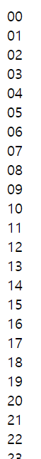

# While

```
while (조건){
반복할 문장;
}
```

무한루프는 조건에 True 

```
var i=0;
    while(i<10){
    document.write("무한코딩<br/>");
    i++;  #먹네
    }
```


# for

```
var i=0;
for(i=0;i<10;i++){
document.write("무한 코딩<br/>");
}
```

## 이중 for문

```
for(var i=0;i<10;i++){
    for(var j=0;j<10;j++){
    document.write(i+j+"<br/>");
    }
}
```

```
for(var i=0;i<10;i++){
    for(var j=0;j<10;j++){
    document.write(String(i)+j+"<br/>");
    }
}
```

string 엄청 유용해보임 

문자+숫자 = (숫자가 문자로 변함 자동 형변환) 

```
String(i)+String(j) 과 같음 헷갈릴 수 있으니까 이렇게 작성하기
```


## break , continue

```
var i=0;
for(i=0;i<10;i++){
    if (i==5){
    break;
    }

document.write(i+"무한 코딩<br/>");
}
```


```
var i=0;
for(i=0;i<10;i++){
    if (i==5){
    continue;
    }
document.write(i+"무한 코딩<br/>");
}
```

5건너뛰고 6부터 다시 출력

# function

```
function 함수이름(인수덜){
코드;
return 반환값
}
```

`return` 만 있으면 반환값은 없고 되돌아가는 것!

```
function 함수이름(인수덜){
코드1;
if(조건)return; 
코드2 // 실행x
}
함수호출
```


```
function f1(){
return "test";
return"guest"; //출력 안함 위에 리턴하면서 함수 끝났기 때문
}
function f2(){
return "test2";
}

alert(f1());
alert(f2());
```


```
function myf(a1,a2){
return a1+a2;
}
alert(myf(10,20));
```

중첩 가능  -> 가독성 떨어짐 막 mtf(a(b(c(d)))) 이렇게 호출


[참고]

```
var myf=function(a1,a2){
document.write(a1+a2);
}
myf(10,20)
```

람다함수 하듯이 한번에 


# 배열

크기와 타입이 동일한 기억장소를 여러 개 나열한 것, 값을 여러개 저장

```
var n =['kim','lee',100,'park'];
alert(n[0]);
```


```
function f(){
    return ['aaa','bbb'];
}
var m=f()
document.write(m[0]);
var myarr1=[];
var odd=[1,3,5,7];
var even=new Array(2,4,6,8);
var mixarr=['a',1,3,new Date(), "today"];
document.write(odd[2]);
```

자료형 섞어서?


## push

```
var arr=[1,2,3,4];
//alert(arr.length);
arr.push(5)
alert(arr);
```

push로 끝에 추가가능


```
var arr=[1,2,3,4];
//alert(arr.length);
arr.push(5)
alert(arr);
p=arr.pop();
document.write(p);
```

끝에서부터 빼는 pop도 사용가능하다

## unshift

```
var arr=[1,2,3,4];
arr.unshift(999); //맨 앞에 데이터 추가
alert(arr);
```


## shift

```
var arr=[1,2,3,4];
        arr.unshift(999); //맨 앞에 데이터 추가
        alert(arr);
        document.write(arr.shift()+"<br/>"); //맨 앞의 데이터 제거
        document.write(arr)
```


## 추출

```
var arr=[1,2,3,4];
document.write(arr.indexOf(3)); //3이라는 자료의 인덱스(0번부터)를 
```

index Of 임!


## 제거 splice

```
var fruits=['apple','banana','orange'];
var v=fruits.splice(1,2); //(시작인덱스,제거항목갯수)
document.write(v+"<br/>");
document.write(fruits+"<br/>");
```

banana,orange
apple


## sort , reverse

```
var fruits=['apple','banana','orange'];
fruits.sort(); //오름차순 정렬
document.write(fruits+"<br/>");
```


```
fruits.reverse(); //역순으로 출력 오름->역 으로 하면 내림차순 
```


# 객체

객체는 파이썬의 딕셔너리 {키:값, 키:값,...}와 비슷

1)

```
var hgd={};
hgd['name']='honggildong';
hgd['age']=28;
hgd['gender']='m';
document.write(hgd['name']);
```

출력 >> honggildong

2)

```
var hgd={
'name':'honggildong',
'age':28,
'gender':'m',
};
 document.write(hgd['name']);
```

콜론이랑 쉼표로 구분 하나의 문장이라 그럼 

출력 >> honggildong

속성 : name, age, gender, birth

 

데이터 접근시 . 사용

hgd.birth


3) new사용

`new 클래스명` 최상위 클래스가 Object() ?

상속: 부모클래스가 가지고 있는 동작,속성 등을 자식클래스에게 물려주는 것

오버라이딩(overriding, 재정의) : 부모가 물려준 동작을 자식이 변경하는 것

자식은 부모로부터 물려받은 동작외에 다른 동작을 추가할 수 있음 

===> 객체 지향 설계 => 객체 지향 프로그래밍


```
//
이순신=new 사람();
이순신.잠잔다() --> 이순신.코곤다() 오버라이딩!
```

 

```
var hgd=new Object();
hgd['name']='honggildong';
hgd['age']=28;
hgd['gender']='m';

for (k in hgd){
document.write(hgd[k]+"<br/>")
}
```

사람클래스(속성-성별,나이,이름,... ; 동작(함수,메서드) )


```
//객체의 속성과 메서드를 표현
var hgd={

//속성정의
'list':{    //리스트라는 키에 대해 밑에 3개가 값
'name':'honggildong',
'age':28,
'gender':'m'},

//메서드 정의 이름이 show 값은 function~ 내용
'show':function(){
for (var n in this.list){
    document.write(n+":"+this.list[n]+"<br/>");
}
}
};
hgd.show();
```