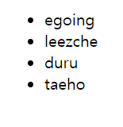

# 문자열 배열

```
<html>
    <head>
        <meta charset="utf-8">
        <title></title>
    </head>
    <body>
        <h1>Array</h1>
        <h2>Syntax</h2>
    <script>
        var coworkers =["egoing" , "leezche"];

    </script>
        
    <h2>get</h2>
        <script>
            document.write(coworkers[0]);
            document.write(coworkers[1]);
            document.write(coworkers.length);
        </script>

    </body>
</html>
```


```
   <script>
            var coworkers = ['egoing', 'leezche', 'duru', 'taeho'];
        </script>
<ul>
    <script>
                var i = 0;
                while(i < coworkers.length) {
                    document.write('<li>' + coworkers[i] + '</li>');
                    i = i + 1;
                }
            </script>

</ul>

    </body>
```

i 저런식으로 참조가능




```
  <script>
            var coworkers = ['egoing', 'leezche', 'duru', 'taeho'];
        </script>
<ul>
    <script>
                var i = 0;
                while(i < coworkers.length) {
                    document.write('<li>' + coworkers[i] + '</li>');
                    document.write('<li><a href="http://a.com/' + coworkers[i] + '">' + coworkers[i] + '</a></li>');

                    i = i + 1;
                }
            </script>

</ul>

    </body>
```

내용 + 링크 걸리게 반복문


```
 <script>
            var coworkers = ['네이버카페', '네이버지식인', '네이버쇼핑'];
            var addrs=['section.cafe.','kin.','shopping.']
        </script>
<ul>
    <script>
                var i = 0;
                while(i < coworkers.length) {
<!--                    //document.write('<li>' + coworkers[i] + '</li>');-->
                    document.write('<li><a href="http://' +addrs[i] +'naver.com/">'+coworkers[i]+ '</a></li>');

                    i = i + 1;
                }
            </script>

</ul>

    </body>
</html>
```


따옴표


# 펑션으로 색깔바꾸기

```
<html>
    <head>
        <title>WEB1 - JavaScript</title>
        <meta charset="utf-8">
        <script>
        function nightDayHandler(self) {
    //alert("호출됐니?")
            var target = document.querySelector('body');
            if(self.value === 'night') {
                target.style.backgroundColor = 'black';
                target.style.color = 'white';
                self.value = 'day';

                var alist = document.querySelectorAll('a');
                var i = 0;
                while(i < alist.length) {
                    alist[i].style.color = 'powderblue';
                    i = i + 1;
                }

            } else {
                target.style.backgroundColor = 'white';
                target.style.color = 'black';
                self.value = 'night';

                var alist = document.querySelectorAll('a');
                var i = 0;
                while(i < alist.length) {
                    alist[i].style.color = 'blue';
                    i = i + 1;
                }
            }

            }
        </script>
    </head>
<body>
        <h1><a href="index.html">WEB</a></h1>

        <input type="button" value="night" onclick="nightDayHandler(this);">

        <ol>
            <li><a href="1.html">HTML</a></li>
            <li><a href="2.html">CSS</a></li>
            <li><a href="3.html">JavaScript</a></li>
        </ol>
        <h2>JavaScript란 무엇인가?</h2>
        <p>JavaScript (/ˈdʒɑːvəˌskrɪpt/),[6] often abbreviated as JS, is a high-level, interpreted programming language. It is a language which is also characterized as dynamic, weakly typed, prototype-based and multi-paradigm. Alongside HTML and CSS, JavaScript is one of the three core technologies of the World Wide Web.[7] JavaScript enables interactive web pages and thus is an essential part of web applications. The vast majority of websites use it,[8] and all major web browsers have a dedicated JavaScript engine to execute it.</p>

        <input type="button" value="night" onclick="nightDayHandler(this);">
    </body>
</html>
```

 this로 주고 self로 받기

