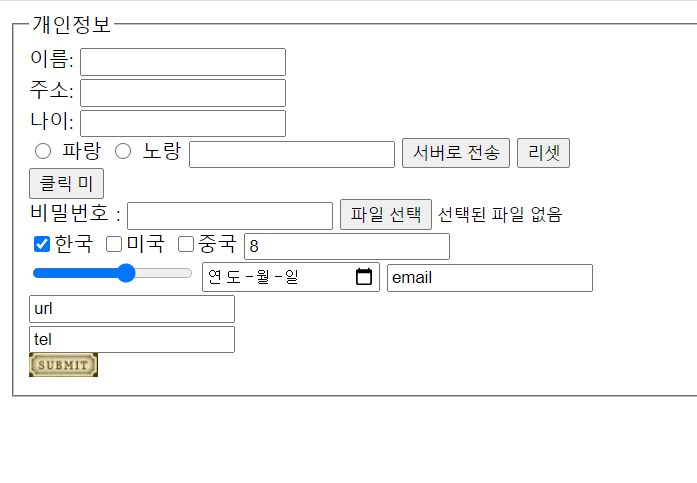

# form

바디안에 form태그 작성

```
<form action="실행app의 위치">
    아이디 
        비밀번호
        ...
    	회원가입버튼 클릭 -> 실행app의 위치(주소)
    
</form>
```


```ㅎ
<form action="실행app의 위치" method="get">
```

get방식: www.aaa.com?id-F3F2...&addr=%F3 ... 암호화X  => 중요하지 않은 데이터

post방식 : 포장해서 전송 


<fieldset> : form 안에서 그룹 구분

<legend> : 필드셋의 제목

<label>: 분류결과(데이터 모델->예측 결과(pass/fail))

```

<form action="http://www.abc.com/logrin/proc.jsp" method="get">
    <fieldset>
        <legend>개인정보</legend>
        <label>이름: <input type="text"></label><br>
        <label>주소: <input type="text"></label><br>
        
        <input type="radio" name="color-select" id="abc" value="blue">
        <label for="abc">파랑</label>

        <input type="radio" name="color-select" id="def" value="yellow">
        <label for="abc">노랑</label>
       
        <input type="submit">
    </fieldset>

</form>
```

 <!--radio: 여러개중 하나 선택,radio는 name을 같게줘야 한덩어리로 인식한다  -->

또 라벨이랑 id 같에 해줄것


```
<label>이름: <input type="text"></label><br>  묵시적 방법: 입력상자와 라벨연결
<label>주소: <input type="text"></label><br>

<label>나이: </label> 
<input type="text"/><br>  입력상자와 라벨을 연결하지 않음 
웹에서 나이 클릭했을때 커서 깜빡이지 않음
```


타입뒤는 입력컨트롤이 온다.

​        <input type="submit"> 폼안에 작성된 내용을 서버로 전송한다.

<input type="submit" value="서버로 전송">


```
<input type="text">
<!--radio 여러개중 하나 선택,radio는 name을 같게줘야 한덩어리로 인식한다  -->

<input type="submit" value="서버로 전송">
<input type="reset" value="리셋"><br>

<input type="button" value="클릭 미" onclick="처리함수"><br>
비밀번호 : <input type="password">
<input type="file" accept="image/jpeg"><br>
<input type="checkbox" name="nation" value="kor">한국
<input type="checkbox" name="nation" value="usa">미국
<input type="checkbox" name="nation" value="chn">중국
```

name이 같은것 끼리 묶인다

체크되있는 상태

```
<input type="checkbox" name="nation" value="kor" checked="checked">한국
```


```
<input type="number"><br>
<input type="range" min="5" max="10">
<input type="date">
<input type="email">  
<input type="url"><br>

```

이메일인지 아닌지 규칙이 약해서 잘안씀




```
<input type="text" size="10">

<input type="text" pattern="[A-Z]+" placeholder="영문 대문자만 입력"><br>
```

텍스트박스 조절 가능, placeholder는 텍스트 위에 흐릿하게 써주기 patter

```
<textarea row="10" cols="40"></textarea>
```

더 넓은 칸


```
<select>
    <option value="c">c언어</option>
    <option value="py">파이썬언어</option>
    <option value="js">자스언어</option>

</select>
```

스크롤 옵션 상자!

```
<select multiple size="3">
            <option value="c">c언어</option>
            <option value="py">파이썬언어</option>
            <option value="js">자스언어</option>
<option value="c">c언어</option>
            <option value="py">파이썬언어</option>
            <option value="js">자스언어</option>
        </select>
    </fieldset>
```

여러개중에서 3개만 보여지고 싶을때


---

```
<input type="button" value="전송하기">
<button type="button">전송하기</button>
<button type="submit">전송하기</button>
<button type="reset">전송하기</button>
```

서버로 폼 내용 전송시 버튼과 서브밋의 차이 
서브밋: 곧바로 서버에 폼 내용을 전송
버튼: 자바스크립트 함수 호출 -> 함수 내에서 유효성 검증-> 검증 수행후 전송


# 계산기

```
window.onload=function(){ 
```

함수이름이 onload 왼쪽껀 객체

이름이 on으로 시작되는 함수는 콜백함수 on상황(): 상황이 발생 되었을때 호출 되는 함수


```
<!DOCTYPE html>
<html lang="en">
<head>
    <meta charset="UTF-8">
    <title>내가 만든 계산기</title>
    <script>
    window.onload=function(){
    //alert("window객체의 onload 함수에 대해 정의. 콜백함수 : 함수 이름이 on으로 시작.\n on상황():상황이(발생) 되었을때 자동호출");

    //btnSend(계산)버튼을 클릭하면 chkData함수를 호출해라
    document.getElementById("btnSend").onclick=chkData;
    }

    function chkData(){
    //alert("데이터 검증 함수가 호출됨");
    //검증하는 코드 작성

        if(frm.num1.value===""){
        alert("숫자1에 값을 입력하시오");
        frm.num1.focus();
        return;
    }

    // 숫자, 음수 기호, 소수점만 입력 가능하도록 정규식 정의
    var regEx1=/^[-]?\d*\.?\d*$/;
if(!frm.num1.value.match(regEx1)){  //매치되지 않는다면
        alert("숫자만 입력하시오");
        frm.num1.value="";
        frm.num1.focus();
        return;
        }


            if(frm.num2.value===""){
        alert("숫자2에 값을 입력하시오");
        frm.num2.focus();
        return;
    }

        // 숫자, 음수 기호, 소수점만 입력 가능하도록 정규식 정의
    var regEx2=/^[-]?\d*\.?\d*$/;
if(!frm.num2.value.match(regEx2)){  //매치되지 않는다면
        alert("숫자만 입력하시오");
        frm.num2.value="";
        frm.num2.focus();
        return;
        }

        var su1=frm.num1.value;
        var su2=frm.num2.value;

        isOpChecked=false;

        for(var i=0;i<frm.op.length;i++){
            if(frm.op[i].checked){
            //alert(i+"번째 버튼이 선택되어 있음");
                oper=frm.op[i].id;
                alert(oper+" 연산자가 선택되어 있음");
                isOpChecked=true;
            }
        }
        if(!isOpChecked){
            alert("연산자를 선택해주세요");
            return;
            }
    }

    </script>

<!--    <script>
        function myfunc(){
        alert("호출됨");
        }
     window.onload=myfunc;
    </script>-->
</head>
<!--<body onload="myfunc();">-->
<body>
<form name="frm">
    숫자 1 : <input type="text" name="num1"><br>
    숫자 2 : <input type="text" name="num2"><br><br>

    연산 :
    <label for="add">+</label><input type="radio" name="op" id="add">
    <label for="sub">-</label><input type="radio" name="op" id="sub">
    <label for="mul">*</label><input type="radio" name="op" id="mul">
    <label for="div">/</label><input type="radio" name="op" id="div">
<br>
    결과 : <input type="text" id="res" readonly="readonly"><br>
    <input type="button" value="계산" id="btnSend">
    <input type="reset" value="지우개" id="btnClear">
</form>
</body>
</html>
```